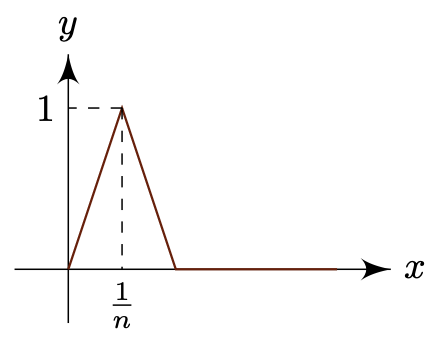

# Normed Spaces
{: .page-title}

In order to extend the analytical study about functions of single variable to multiple variables, we need to study the structure of vector spaces.
There is no harm to do so under a more abstract setting, which leads to the _normed spaces_.
More in-depth study of vector spaces itself can be found in [linear algebra](../linear-algebra/vector-spaces.md).

> *Definition.*{: .def}
> Let $V$ be a vector space over a field $\mathbf{F}$. The real valued function $\Vert \cdot \Vert: V \to \mathbf{R}$ on $V$ is called a **norm** on $V$ and $V$ is called a **normed vector space** if
>
> + $\Vert x \Vert \ge 0$ for all $x \in V$ with equality iff $x = 0$;
>
> + $\Vert x + y \Vert \le \Vert x \Vert + \Vert y \Vert$ for all $x, y \in V$;
>
> + $\Vert \lambda x \Vert = \vert \lambda \vert \Vert x \Vert$ for $\lambda \in \mathbf{F}$ and $x \in V$.

In a normed vector space, a metric $\rho$ may be defined by $\rho(x, y) = \Vert x - y \Vert$.
Similarily, two norms on the same space can be equivalent and the topological properties of the space do not depend on which norm we choose.

> *Definition.*{: .def}
> Let $V$ be a vector space. Two norms $\Vert \cdot \Vert$ and $\Vert \cdot \Vert'$ on $V$ are **Lipschitz equivalent** if there exists positive real constants $\lambda$ and $\mu$ such that
>
> $$
  \lambda \Vert x \Vert \le \Vert x \Vert' \le \mu \Vert x \Vert
  $$
>
> for all $x \in V$.

> *Definition.*{: .def}
> Let $(V, \Vert \cdot \Vert)$ be a normed space. A subset $E \subseteq V$ is **bounded** if there is some $r > 0$ such that
>
> $$
  E \subseteq B_r(0)
  $$

> *Definition.*{: .def}
> Let $(V, \Vert \cdot \Vert)$ be a normed space. A sequence $(x_n)$ in $V$ is **convergent** to $x \in V$, denoted by $x_n \to x$, if $\Vert x_n - x \Vert \to 0$, i.e.
>
> $$
  (\forall \varepsilon > 0)(\exists N)(\forall n > N)\; \Vert x_n - x \Vert < \varepsilon
  $$

> *Proposition.*{: .prop}
> Let $(V, \Vert \cdot \Vert)$ be a normed space. Then
>
> + $x_n \to x$ and $x_n \to y$ implies $x = y$;
>
> + $x_n \to x$ implies $\lambda x_n \to \lambda x$;
>
> + $x_n \to x$ and $y_n \to y$ implies $x_n + y_n \to x + y$.
>
> *Proof.*{: .prf}
>
> + $\Vert x - y \Vert \le \Vert x - x_n \Vert + \Vert x_n - y \Vert \to 0$ so $\Vert x - y \Vert = 0$ and $x = y$.
>
> + $\Vert \lambda x_n - \lambda x \Vert = \vert \lambda \vert \Vert x_n - x \Vert \to 0$.
>
> + $\Vert (x_n + y_n) - (x + y) \Vert \le \Vert x_n - x \Vert + \Vert y_n - y \Vert \to 0$.

Equivalent norms on the same space preserve boundedness and convergence.

> *Proposition.*{: .prop}
> If $\Vert \cdot \Vert$ and $\Vert \cdot \Vert'$ are Lipschitz equivalent norms on a vector space $V$, then
>
> + A subset $E \subseteq V$ is bounded with respect to $\Vert \cdot \Vert$ iff it is bounded with respect to $\Vert \cdot \Vert'$;
>
> + A sequence $(x_n)$ converges to $x$ with respect to $\Vert \cdot \Vert$ iff it converges to $x$ with respect to $\Vert \cdot \Vert'$.
>
> *Proof.*{: .prf}
>
> Both are direct from the definition of equivalence and the sandwich principle.

We can now explore some important examples.

## Finite-dimensional Spaces

All finite-dimensional vector spaces are isomorphic to $\mathbf{R}^n$ so we will focus on that. We start with something familiar.

> *Proposition.*{: .prop}
> The **Euclidean/usual norm** defined by
>
> $$
  \Vert x \Vert_2 = \sqrt{x_1^2 + ... + x_n^2}
  $$
>
> is a norm on $\mathbf{R}^n$.
>
> *Proof.*{: .prf}
>
> We will just prove the triangle inequality by the Cauchy-Schwarz inequality, i.e.
>
> $$
  \begin{align*}
  \Vert x + y \Vert^2 &= \sum_{i=1}^n (x_i + y_i)^2 \\
  &= \Vert x \Vert^2 + \Vert y \Vert^2 + 2 \sum_{i=1}^n x_i y_i \\
  &\le \Vert x \Vert^2 + \Vert y \Vert^2 + 2 \Vert x \Vert \Vert y \Vert \\
  &= \left( \Vert x \Vert + \Vert y \Vert \right)^2
  \end{align*}
  $$

We can also have the following norms on $\mathbf{R}^n$:

$$
\begin{align*}
\Vert x \Vert_1 &= \sum \vert x_i \vert \\
\Vert x \Vert_p &= \left( \sum \vert x_i \vert^p \right)^{1/p} \\
\Vert x \Vert_\infty &= \max\Set{\vert x_i \vert : 1 \le i \le n}
\end{align*}
$$

in which as $p \to \infty$, $\Vert x \Vert_p \to \Vert x \Vert_\infty$.

> *Proposition.*{: .prop}
> Convergence in $\mathbf{R}^n$ is equivalent to coordinate-wise convergence, i.e. $x_n \to x$ iff $(x_n)_i \to (x)_i$ for $1 \le i \le n$.
>
> *Proof.*{: .prf}
>
> ($\Rightarrow$) Let $\varepsilon > 0$. There exists $N$ such that for all $n > N$,
>
> $$
  \Vert x_n - x \Vert^2 = \sum_{i=1}^n ((x_n)_i - (x)_i)^2 < \varepsilon^2
  $$
>
> so each of the term $\vert (x_n)_i - (x)_i \vert < \varepsilon$.
>
> ($\Leftarrow$) Let $\varepsilon > 0$. There exists $N_i$ such that for all $n > N_i$, $\vert (x_n)_i - (x)_i \vert < \varepsilon / \sqrt{n}$.
> By having $N = \max \Set{N_i}$, we have for all $n > n$,
>
> $$
  \Vert x_n - x \Vert = \left( \sum_{i=1}^n ((x_n)_i - (x)_i)^2 \right)^{1/2} < \varepsilon
  $$

## Infinite-dimensional Spaces

We will extend the notions on $\mathbf{R}^n$ to infinite sequences with some care.
Let $\mathbf{R}^{\mathbf{N}}$ be the set of all infinite real sequences $(x_n)$ which is a vector space with termwise addition and scalar multiplication.
By considering subspaces of $\mathbf{R}^{\mathbf{N}}$ with some restrictions, we can define different norms accordingly.
The vector subspaces are

$$
\begin{align*}
\ell^1 &= \Set{(x_n) \in \mathbf{R}^{\mathbf{N}} : \sum \vert x_n \vert < \infty } \\
\ell^2 &= \Set{(x_n) \in \mathbf{R}^{\mathbf{N}} : \sum \vert x_n \vert^2 < \infty } \\
\ell^p &= \Set{(x_n) \in \mathbf{R}^{\mathbf{N}} : \sum \vert x_n \vert^p < \infty } \\
\ell^\infty &= \Set{(x_n) \in \mathbf{R}^{\mathbf{N}} : \sup \vert x_n \vert < \infty }
\end{align*}
$$

and the corresponding norms are

$$
\begin{align*}
\Vert (x_n) \Vert_1 &= \Vert (x_n) \Vert_{\ell^1} = \sum \vert x_n \vert \\
\Vert (x_n) \Vert_2 &= \Vert (x_n) \Vert_{\ell^2} = \left( \sum \vert x_n \vert^2 \right)^{1/2} \\
\Vert (x_n) \Vert_p &= \Vert (x_n) \Vert_{\ell^p} = \left( \sum \vert x_n \vert^p \right)^{1/p} \\
\Vert (x_n) \Vert_\infty &= \Vert (x_n) \Vert_{\ell^\infty} = \sup \vert x_n \vert
\end{align*}
$$

> *Proposition.*{: .prop}
> The $\Vert (x_n) \Vert_{\ell^2}$ satisfies the triangle inequality.
>
> *Proof.*{: .prf}
>
> Since we can write
>
> $$
  \Vert (x_n) \Vert_{\ell^2} = \lim_{n \to \infty} \Vert (x_1, ..., x_n) \Vert_2
  $$
>
> so the triangle inequality of Euclidean norm implies triangle inequality for $\ell^2$.

Unlike the norms defined for finite-dimensional spaces, the similar norms for infinite-dimensional spaces are not necessary equivalent.

> *Proposition.*{: .prop}
> For the space $\ell^2$, the norms $\Vert (x_n) \Vert_2$ and $\Vert (x_n) \Vert_\infty$ are not equivalent.
>
> *Proof.*{: .prf}
>
> Obviously, we have $\Vert (x_n) \Vert_\infty \le \Vert (x_n) \Vert_2$.
> However, there is no constant $mu$ such that $\Vert (x_n) \Vert_2 \le \mu \Vert (x_n) \Vert_\infty$.
> For example, the sequence with first $b^2 + 1$ terms $1$ and $0$ for the rest doesn't satisfy the inequality.

## Function Spaces

Consider the set of continuous real functions on $[a, b]$, denoted by $C[a, b]$, we can define the norms by

$$
\begin{align*}
\Vert f \Vert_{L^1} &= \Vert f \Vert_1 = \int_a^b \vert f \vert \,dx \\
\Vert f \Vert_{L^2} &= \Vert f \Vert_2 = \left( \int_a^b \vert f \vert^2 \,dx \right)^{1/2} \\
\Vert f \Vert_{L^p} &= \Vert f \Vert_p = \left( \int_a^b \vert f \vert^p \,dx \right)^{1/p} \\
\Vert f \Vert_{L^\infty} &= \Vert f \Vert_\infty = \sup \vert f \vert
\end{align*}
$$

The $L^\infty$ norm is also called the _uniform norm_ or _supremum norm_.

> *Proposition.*{: .prop}
> **[Cauchy-Schwarz inequality for integrals]**
> Suppose that $f, g \in C[a, b]$ with $f, g \ge 0$, then
>
> $$
  \int_a^b fg \,dx \le \left( \int_a^b f^2 \,dx \right)^{1/2} \left( \int_a^b g^2 \,dx \right)^{1/2}
  $$
>
> *Proof.*{: .prf}
>
> If $\int_a^b f^2 \,dx = 0$, then $f = 0$ since $f$ is continuous. The inequality is obviously true.
>
> Let $A^2 = \int_a^b f^2 \,dx \not= 0$ and $B^2 = \int_a^b g^2 \,dx$. For all $t$, we have
>
> $$
  \int_a^b (g - tf)^2 \,dx = B^2 - 2t \int_a^b fg \,dx + t^2 A^2 \ge 0
  $$
>
> and therefore
>
> $$
  \left( \int_a^b fg \,dx \right)^2 - A^2 B^2 \le 0
  $$

The Cauchy-Schwarz inequality again implies the triangle inequality and therefore the $L_2$ norm is actually a norm.

Similar to infinite-dimensional spaces, the norms are not necessary equivalent.

> *Proposition.*{: .prop}
> Let $V = C[0, 1]$. The norms $\Vert f \Vert_1$ and $\Vert f \Vert_\infty$ are not equivalent.
>
> *Proof.*{: .prf}
>
> Obviously, we have $\Vert f \Vert_1 \le (1 - 0) \Vert f \Vert_\infty$.
> Howver, there is no constant $\mu$ such that $\Vert f \Vert_\infty \le \mu \Vert f \Vert_1$ for all $f$.
> For example, consider the sequence of functions $f_n$ of the form
>
> 
>
> and we have $\Vert f_n \Vert_\infty = 1$ but $\Vert f_n \Vert_1 = 1/n \to 0$.

## Bolzano-Weierstrass Theorem

The Bolzano-Weierstrass Theorem can be generalized for finite-dimensional normed spaces.

> *Theorem.*{: .thm}
> **[Bolzano-Weierstrass Theorem in $\mathbf{R}^n$]**
> Suppose that $(x_n)$ is a bounded sequence of $\mathbb{R}^n$ (with respect to say the Euclidean norm). Then there is a subsequence $(x_{n_k})$ which converges.
>
> *Proof.*{: .prf}
>
> For $n = 1$, we have proved [before](../analysis-i/subsequences.md#bolzano-weierstrass-theorem) using bisection.
> Asumme it is true for $\mathbf{R}^{n-1}$. Let $(x\_k) = (((x\_k)\_1, ..., (x\_k)\_{n-1}, (x\_k)\_n))$ be a bounded sequence in $\mathbf{R}^n$.
> Let $(y\_k) = (((x\_k)\_1, ..., (x\_k)\_{n-1}))$ and we have
>
> $$
  \Vert y_k \Vert^2 + \vert (x_k)_n \vert^2 = \Vert x_k \Vert^2
  $$
>
> so both $(y_k)$ and $((x_k)_n)$ are bounded.
> By induction hypothesis, there is a subsequence $(y\_{n\_k})$ converges to $y$ and by Bolzano-Weierstrass theorem in $\mathbf{R}$ there is a further subsequence $((x\_{n_k'})\_n)$ of $((x\_{n_k})\_n)$ that converges to $x_n$.
> Therefore, $x\_{n_k'} \to (y, x_n)$.

The theorem however is generally not true for normed spaces. For example, consider $(\ell^\infty, \Vert \cdot \Vert_\infty)$.
The sequence $((x\_k)\_n) = ((\delta\_{nk}))$ converges component-wise to the zero element $0 = (0, ...)$ but the sequence itself doesn't converge to the zero element since $\Vert (x_n) - (0) \Vert_\infty = 1$.

## Inner Product Spaces

For $\mathbf{R}$ and $\mathbf{C}$, we can have more specialized normed vector spaces which is called _inner product spaces_.

> *Definition.*{: .def}
> Let $V$ be a complex normed vector space. Then $V$ is called a complex **inner product space** if for every ordered pair $(x, y)$ of elements in $V$,
> there is an associated complex number, i.e. the **inner product** $x \cdot y$, satisfying
>
> + $x \cdot y = \overline{y \cdot x}$ for all $x, y \in V$;
>
> + $(\lambda x + \mu y) \cdot z = \lambda (x \cdot z) + \mu (y \cdot z)$ for all $\lambda, \mu \in \mathbf{C}$ and $x, y, z \in V$;
>
> + $x \cdot x = \Vert x \Vert^2$ for all $x \in V$.

The inner product associated with a given norm is unique. More results regarding these specialized spaces can be found in [inner product spaces](../linear-algebra/inner-product-spaces.md).

## References

* [Dexter Chua _Part IB - Analysis II_, 2015 - Chapter 4](https://dec41.user.srcf.net/notes/IB_M/analysis_ii.pdf)
* J C Burkill _A Second Cource in Mathematical Analysis_, 1970 - Chapter 2.2
