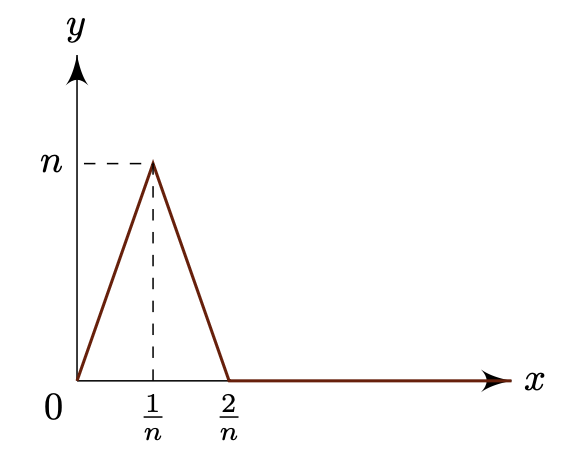

# Uniform Convergence
{: .page-title}

So far we studied convergence of sequence of real numbers and extended it to a more generic setting under metric spaces.
We will now consider a sequence of functions and study what convergence means.

> *Definition.*{: .def}
> Suppose that $f_n: X \to Y$ is a sequence of functions on a set $X$ to a metric space$(Y, \sigma)$.
> The sequence $(f_n)$ **converges pointwise** to a function $f: X \to Y$ if for each $x \in X$,
>
> $$
  \sigma(f_n(x), f(x)) \to 0 \qquad \text{as} \qquad n \to \infty
  $$
>
> Alternatively, the sequence is pointwise convergent if
>
> $$
  (\forall \varepsilon > 0)(\forall x \in X)(\exists N)(\forall n > N) \; \sigma(f_n(x), f(x)) < \varepsilon
  $$

This is a rather simple definition of convergence but there is a critical shortfall that properties of the functions $f_n$ isn't carried over to the limit function $f$.
For example, consider the sequence of functions $f_n(x) = x^n$ for $0 \le x \le 1$, we have

$$
f_n(x) \to f(x) = \begin{cases}
0 & 0 \le x < 1 \\
1 & x = 1
\end{cases}
$$

The functions $f_n$ are all continuous at $x = 1$ but not the limit function $f$ which is not desirable.
Therefore, we need a stronger notion of convergence in which we require all the points of $f_n$ to converge to $f$ at the same pace.

> *Definition.*{: .def}
> Suppose that $f_n: X \to Y$ is a sequence of functions on a set $X$ to a metric space$(Y, \sigma)$.
> The sequence $(f_n)$ **converges uniformly** to a function $f: X \to Y$ if
>
> $$
  \sup_{x \in X} \,\sigma(f_n(x), f(x)) \to 0 \qquad \text{as} \qquad n \to \infty
  $$
>
> Alternatively, the sequence is uniformly convergent if
>
> $$
  (\forall \varepsilon > 0)(\exists N)(\forall n > N) \; \sup_{x \in X} \sigma(f_n(x), f(x)) < \varepsilon
  $$

The difference is that for pointwise convergence, we can choose a different $N = N(\varepsilon, x)$ for each point but for uniform convergence, we need to choose $N = N(\varepsilon)$ independent of $x$, such that it works for all points.
It is obvious that uniform convergence implies pointwise convergence, but the converse is not true.
Considering the example above, $f_n(x) = x^n$ is pointwise convergent but not uniformly convergent since

$$
\sup_{0 \le x < 1} \vert f_n(x) - f(x) \vert = \lim_{x \to 1} \vert x^n - 0 \vert = 1
$$

In case of $X \subseteq \mathbf{R}$ and $Y = \mathbf{R}$, graphical representation of uniform convergence is that for $n > N(\varepsilon)$, $y = f_n(x)$ lies inside the strip between $y = f(x) \pm \varepsilon$.

> *Definition.*{: .def}
> A sequence $f_n: X \to Y$ of functions is **uniformly Cauchy** if
>
> $$
  (\forall \varepsilon > 0)(\exists N)(\forall m, n > N) \; \sup_{x \in X} \sigma(f_m(x), f_n(x)) < \varepsilon
  $$

> *Proposition.*{: .prop}
> **[General Principle of Uniform Convergence]**
> Let $(f_n)$ be a sequence of real or complex valued functions. Then $(f_n)$ converges uniformly iff $(f_n)$ is uniformly Cauchy.
>
> *Proof.*{: .prf}
>
> ($\Rightarrow$) Suppose that $f_n \to f$ uniformly. Given $\varepsilon > 0$, there exists $N$ such that for all $n > N$,
>
> $$
  \sup_{x \in X} \vert f_n(x) - f(x) \vert < {\varepsilon \over 2}
  $$
>
> Therefore, for $m, n > N$, by triangle inequality,
>
> $$
  \vert f_m(x) - f_n(x) \vert \le \vert f_m(x) - f(x) \vert + \vert f(x) - f_n(x) \vert < \varepsilon
  $$
>
> ($\Leftarrow$) Since the sequence of functions are uniformly Cauchy, for each $x \in X$, $(f_n(x))$ is a Cauchy sequence that converges to some real or complex value.
> The pointwise convergence implies that there is a function $f$ such that $f_n \to f$ and we need to show that it converges uniformly.
>
> Given $\varepsilon > 0$. There exists $N$ such that for all $m, n > N$, $\vert f_m(x) - f_n(x) \vert < \varepsilon / 2$. Therefore,
>
> $$
  \vert f(x) - f_n(x) \vert = \lim_{m \to \infty} \vert f_m(x) - f_n(x) \vert \le { \varepsilon \over 2 } < \varepsilon
  $$
>
> Since it is true for all $x \in X$,
>
> $$
  \sup_{x \in X} \vert f(x) - f_n(x) \vert < \varepsilon
  $$
>
> for $n \ge N$ and $f_n \to f$ uniformly.

## Continuity

The example of $f_n(x) = x^n$ shows that continuity is not preserved with pointwise convergence, but it is not the case for uniform convergence.

> *Proposition.*{: .prop}
> **[Uniform Convergence and Continuity]**
> Let $(X, \rho)$ and $(Y, \sigma)$ be metric spaces. Let the sequence of functions $f_n: X \to Y$ converge to $f$ uniformly on $X$.
> If $c$ is a point of $X$ at which each $f_n$ is continuous, then $f$ is continuous at $c$.
>
> *Proof.*{: .prf}
>
> We have $\delta > 0$ such that
>
> $$
  \sigma(f_n(x), f_n(c)) < {\varepsilon \over 3} \qquad \text{for} \qquad \rho(x, c) < \delta
  $$
>
> and $N$ such that
>
> $$
  \sigma(f_n(x), f(x)) < {\varepsilon \over 3} \qquad \text{for} \qquad n > N
  $$
>
> therefore
>
> $$
  \sigma(f(x), f(c)) \le \sigma(f(x), f_n(x)) + \sigma(f_n(x), f_n(c)) + \sigma(f_n(c), f(c)) < \varepsilon
  $$
>
> so $f$ is continuous at $c$.

Uniform convergence is a sufficient condition but not a necessary condition for the limit function to be continuous.
Consider the sequence of functions $f_n: [0, 1] \to \mathbf{R}$ formed by joining $(0, 0), (1/n, n), (2/n, 0), (1, 0)$, i.e.

We have $f_n(x) \to f(x) = 0$ as $n \to \infty$ in which $f_n$ and $f$ are continuous but the convergence is not uniform.

Also, the uniform convergence implies continuity means that we have

$$
\lim_{x \to c} \lim_{n \to \infty} f_n(x) = \lim_{x \to c} f(x) = f(c) = \lim_{n \to \infty} \lim_{x \to c} f_n(x)
$$

so it can be used to justify the inversion of the order of repeated limits.

## Integrability

Again, pointwise convergence is not enough to preverse integrability. Suppose that $(r_n)$ is a sequence consisting all the rational numbers in $[0, 1]$ and consider the sequence of $f_n$ on $[0, 1]$ defined by

$$
f_n(x) = \begin{cases}
1 & x = r_1, ..., r_n \\
0 & \text{otherwise}
\end{cases}
$$

then

$$
f_n(x) \to f(x) = \begin{cases}
1 & x \in \mathbb{Q} \\
0 & x \not\in \mathbb{Q}
\end{cases}
$$

In this case, we have all $f_n$ being Riemann integrable since there are only finite number of points mapped to $1$ but $f$ being not integrable.

We also have $g_n(x) = nxe^{-nx^2} \to g(x) = 0$ being an example that even the limit function is integrable but the sequence of integrals need to converge to it.

> *Proposition.*{: .prop}
> **[Uniform Convergence and Integrability]**
> Let $(f_n)$ be a sequence of real functions integrable over the finite interval $[a, b]$.
> If $f_n \to f$ uniformly on $[a, b]$, then $f$ is integrable over $[a, b]$ and
>
> $$
  \int_a^b f_n \to \int_a^b f
  $$
>
> *Proof.*{: .prf}
>
> Given $\varepsilon > 0$. There exists $N$ such that
>
> $$
  \sup_{a \le x \le b} \vert f_n(x) - f(x) \vert < \varepsilon \qquad \text{for} \qquad n \ge N
  $$
>
> For $a \le x \le b$, we have
>
> $$
  f_N(x) - \varepsilon < f(x) < f_N(x) + \varepsilon
  $$
>
> so for any dissection $D$ of $[a, b]$,
>
> $$
  s_D(f_N) - \varepsilon(b - a) \le s_D(f) \le S_D(f) \le S_D(f_N) + \varepsilon(b - a)
  $$
>
> Thus,
>
> $$
  S_D(f) - s_D(f) \le S_D(f_N) - s_D(f_N) + 2 \varepsilon (b - a)
  $$
>
> and $f_N$ is integrable so
>
> $$
  S_D(f) - s_D(f) \le \varepsilon (1 + 2 (b - a))
  $$
>
> and $f$ is integrable.
>
> Moreoever, for $n > N$,
>
> $$
  \left| \int_a^b f_n(x) - \int_a^b f(x) \right| = \int_a^b \vert f_n(x) - f(x) \vert \le \sup_{a \le x \le b} \vert f_n(x) - f(x) \vert (b - a) \to 0
  $$

Note that the proposition is only proved for finite interval, and is false for an infinite interval.

## Differentiability

The relationship between uniform convergence and Differentiability is more subtle that uniform limit of differentiable functions need not be differentiable.
Even if it were, the derivative is not necessary the same as the limit. For example, consider $f_n(x) = \vert x \vert^{1 + 1/n}$ where $f_n(x) \to f(x) = \vert x \vert$.
For $x = 0$, the derivative of $f_n(x)$ is

$$
f_n'(0) = \lim_{x \to 0} {f_n(x) - f_n(0) \over x} = \lim_{x \to 0} {\vert x \vert \over x} \vert x \vert^{1/n} = 0
$$

but $f(x)$ is not differentiable at $x = 0$. Therefore, we need a stronger condition.

> *Proposition.*{: .prop}
> Let $(f_n)$ be a sequence of real functions differentiable on a finite closed interval $[a, b]$.
> Suppose that $(f_n(x))$ converges for at least one $x \in [a, b]$ and that $(f_n')$ converges uniformly on $[a, b]$.
> Then $(f_n)$ converges uniformly on $[a, b]$ and the limit function $f$ is differentiable in $[a, b]$ with derivative $f' = \lim f_n'$.
>
> *Proof.*{: .prf}
>
> Given $\varepsilon > 0$. The sequence $(f_n')$ is uniformly Cauchy, i.e. there exists $N$ such that
>
> $$
  \sup_{a \le x \le b} \vert f_m'(x) - f_n'(x) \vert < \varepsilon \quad \text{for} \quad m, n > N
  $$
>
> For any $\xi_1, \xi_2 \in [a, b]$, by mean value theorem for $f_m - f_n$, we have for some $\xi$ between $\xi_1$ and $\xi_2$,
>
> $$
  (f_m(\xi_1) - f_n(\xi_1)) - (f_m(\xi_2) - f_n(\xi_2)) = (\xi_1 - \xi_2) (f_m'(\xi) - f_n'(\xi)) < \vert \xi_1 - \xi_2 \vert \varepsilon
  $$
>
> Let $x_0$ be the point such that $(f_n(x_0))$ converges, then there exists $N'$ such that
>
> $$
  \vert f_m(x_0) - f_n(x_0) \vert < \varepsilon \quad \text{for} \quad m, n > N'
  $$
>
> Let $\xi_1 = x$ be any point in $[a, b]$ and $\xi_2 = x_0$, combining the above we have for $m, n > \max(N, N')$,
>
> $$
  \sup \vert f_m(x) - f_n(x) \vert < \varepsilon + \vert x - x_0 \vert \varepsilon \le (1 + (b - a))\varepsilon
  $$
>
> so $(f_n)$ is uniformly Cauchy and converges uniformly.
>
> Let $\xi_1 = x$ be any interior point of $[a, b]$ and $\xi_2 = x + h$ where $h \not= 0$ and $x + h \in [a, b]$. Then we have
>
> $$
  \left\vert {f_m(x + h) - f_m(x) \over h} - {f_n(x + h) - f_n(x) \over h} \right\vert < \varepsilon \quad \text{for} \quad m, n > N
  $$
>
> Since we have already shown that $f_n \to f$, we have $f_m(x + h) - f_m(x) \to f(x + h) - f(x)$.
> On the other hand, $f_n$ is differentiable at $x$ so by definition there exists $\delta > 0$ such that
>
> $$
  \left\vert {f_n(x + h) - f_n(x) \over h} - f_n'(x) \right\vert < \varepsilon \quad \text{for} \quad 0 < \vert h \vert < \delta
  $$
>
> Let $\lim f_n'(x) = g(x)$. Combining all the above we have
>
> $$
  \begin{align*}
  &\left\vert {f(x + h) - f(x) \over h} - g(x) \right\vert \\
  &\qquad \le \left\vert {f(x + h) - f(x) \over h} - {f_n(x + h) - f_n(x) \over h} \right\vert
  + \left\vert {f_n(x + h) - f_n(x) \over h} - f_n'(x) \right\vert
  + \left\vert f_n'(x) - g(x) \right\vert < 3\varepsilon
  \end{align*}
  $$
>
> for $0 < \vert h \vert < \delta$ and $n > N$. Hence, $f'(x)$ exists and $f'(x) = \lim f_n'(x)$.

## References

* J C Burkill _A Second Cource in Mathematical Analysis_, 1970 - Chapter 5.1, 5.2, 5.3
