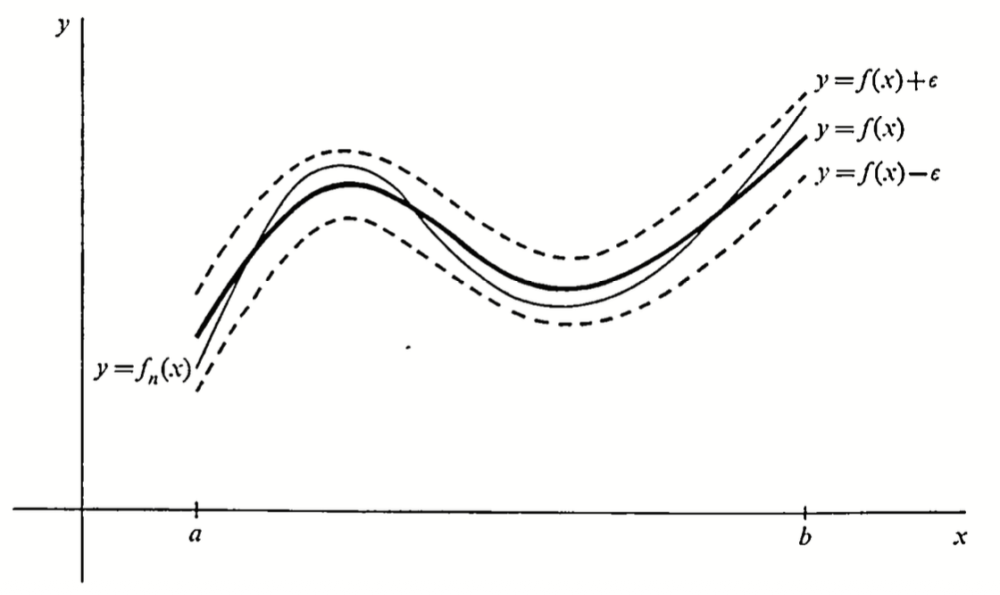

# Uniform Convergence
{: .page-title}

So far we studied convergence of sequence of real numbers and extended it to a more generic setting under metric spaces.
We will now consider a sequence of functions and study what convergence means.

> *Definition.*{: .def}
> Suppose that $f_n: X \to Y$ is a sequence of functions on a set $X$ to a metric space$(Y, \sigma)$.
> The sequence $(f_n)$ **converges pointwise** to a function $f: X \to Y$ if for each $x \in X$,
>
> $$
  \sigma(f_n(x), f(x)) \to 0 \qquad \text{as} \qquad n \to \infty
  $$
>
> Alternatively, the sequence is pointwise convergent if
>
> $$
  (\forall \varepsilon > 0)(\forall x \in X)(\exists N)(\forall n > N) \; \sigma(f_n(x), f(x)) < \varepsilon
  $$

This is a rather simple definition of convergence but there is a critical shortfall that properties of the functions $f_n$ isn't carried over to the limit function $f$.
For example, consider the sequence of functions $f_n(x) = x^n$ for $0 \le x \le 1$, we have

$$
f_n(x) \to f(x) = \begin{cases}
0 & 0 \le x < 1 \\
1 & x = 1
\end{cases}
$$

The functions $f_n$ are all continuous at $x = 1$ but not the limit function $f$ which is not desirable.
Therefore, we need a stronger notion of convergence in which we require all the points of $f_n$ to converge to $f$ at the same pace.

> *Definition.*{: .def}
> Suppose that $f_n: X \to Y$ is a sequence of functions on a set $X$ to a metric space$(Y, \sigma)$.
> The sequence $(f_n)$ **converges uniformly** to a function $f: X \to Y$ if
>
> $$
  \sup_{x \in X} \,\sigma(f_n(x), f(x)) \to 0 \qquad \text{as} \qquad n \to \infty
  $$
>
> Alternatively, the sequence is uniformly convergent if
>
> $$
  (\forall \varepsilon > 0)(\exists N)(\forall n > N) \; \sup_{x \in X} \sigma(f_n(x), f(x)) < \varepsilon
  $$

The difference is that for pointwise convergence, we can choose a different $N = N(\varepsilon, x)$ for each point but for uniform convergence, we need to choose $N = N(\varepsilon)$ independent of $x$, such that it works for all points.
It is obvious that uniform convergence implies pointwise convergence, but the converse is not true.
Considering the example above, $f_n(x) = x^n$ is pointwise convergent but not uniformly convergent since

$$
\sup_{0 \le x < 1} \vert f_n(x) - f(x) \vert = \lim_{x \to 1} \vert x^n - 0 \vert = 1
$$

In case of $X \subseteq \mathbf{R}$ and $Y = \mathbf{R}$, graphical representation of uniform convergence is that for $n > N(\varepsilon)$, $y = f_n(x)$ lies inside the strip between $y = f(x) \pm \varepsilon$.

{: .size-2x}

> *Definition.*{: .def}
> A sequence $f_n: X \to Y$ of functions is **uniformly Cauchy** if
>
> $$
  (\forall \varepsilon > 0)(\exists N)(\forall m, n > N) \; \sup_{x \in X} \sigma(f_m(x), f_n(x)) < \varepsilon
  $$

> *Proposition.*{: .prop}
> **[General Principle of Uniform Convergence]**
> Let $(f_n)$ be a sequence of real or complex valued functions. Then $(f_n)$ converges uniformly iff $(f_n)$ is uniformly Cauchy.
>
> *Proof.*{: .prf}
>
> ($\Rightarrow$) Suppose that $f_n \to f$ uniformly. Let $\varepsilon > 0$, there exists $N$ such that for all $n > N$,
>
> $$
  \sup_{x \in X} \vert f_n(x) - f(x) \vert < {\varepsilon \over 2}
  $$
>
> Therefore, for $m, n > N$, by triangle inequality,
>
> $$
  \vert f_m(x) - f_n(x) \vert \le \vert f_m(x) - f(x) \vert + \vert f(x) - f_n(x) \vert < \varepsilon
  $$
>
> ($\Leftarrow$) Since the sequence of functions are uniformly Cauchy, for each $x \in X$, $(f_n(x))$ is a Cauchy sequence that converges to some real or complex value.
> The pointwise convergence implies that there is a function $f$ such that $f_n \to f$ and we need to show that it converges uniformly.
>
> Let $\varepsilon > 0$. There exists $N$ such that for all $m, n > N$, $\vert f_m(x) - f_n(x) \vert < \varepsilon / 2$. Therefore,
>
> $$
  \vert f(x) - f_n(x) \vert = \lim_{m \to \infty} \vert f_m(x) - f_n(x) \vert \le { \varepsilon \over 2 } < \varepsilon
  $$
>
> Since it is true for all $x \in X$,
>
> $$
  \sup_{x \in X} \vert f(x) - f_n(x) \vert < \varepsilon
  $$
>
> for $n \ge N$ and $f_n \to f$ uniformly.

## References

* J C Burkill _A Second Cource in Mathematical Analysis_, 1970 - Chapter 5
