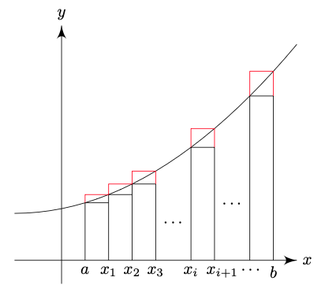

# Integral Calculus
{: .page-title}

The concept of a definite integral was developed to represent an area bounded by curved lines.
This geometrical equivalence is helpful to visualize the meaning of the analytical expressions occura in the defintion and manipulation of integrals.

> *Definition.*{: .def}
> A **dissection** of an interval $[a, b]$ is a finite set of numbers $a, x_1, x_2, ..., x_{n-1}, b$ such that
>
> $$
  a < x_1 < x_2 < \cdots < x_{n-1} < b
  $$
>
> To complete the scheme, we write $a = x_0$ and $b = x_n$. Each $x_r$ is a **point of division**.
>
> The dissection splits $[a, b]$ into $n$ **subintervals**, i.e. $I_1 = [x_0, x_1]$ and $I_r = (x_{r-1}, x_r]$.
>
> The length of the $r$th subinterval is $\delta_r = x_r - x_{r-1}$,
> and the greatest length $\delta^\ast = \max \delta_r$ is called the **norm** of the dissection.

> *Definition.*{: .def}
> The **upper sum** $U_D$ and **lower sum** $L_D$ are defined by
>
> $$
  \begin{align*}
  U_D(f) &= \sum_{r = 1}^n \delta_r \sup_{x \in I_r} f(x) \\
  L_D(f) &= \sum_{r = 1}^n \delta_r \inf_{x \in I_r} f(x)
  \end{align*}
  $$

The upper sum is the total area of the red rectangles and lower sum is that of black rectangles.

> *Definition.*{: .def}
> If every point of $D_1$ is a point of $D_2$, then $D_2$ is a **refinement** of $D_1$, i.e. $D_1 \le D_2$.

> *Proposition.*{: .prop}
> If $D_2$ refines $D_1$, then
>
> $$
  U_{D_2} \le U_{D_1} \quad \text{and} \quad L_{D_2} \ge L_{D_1}
  $$
>
> *Proof.*{: .prf}
>
> Suppose $D_2$ refines $D_1$ by introducing a new point of division $x_r'$ into $I_r$ which divides the interval into $I_{r'}$ and $I_{r'\'}$.
> Then we have $\sup_{x \in I_{r'}} f(x) \le \sup_{x \in I_r} f(x)$ and $\sup_{x \in I_{r'\'}} f(x) \le \sup_{x \in I_r} f(x)$ and
>
> $$
  \delta_{r'} \sup_{x \in I_{r'}} f(x) + \delta_{r''} \sup_{x \in I_{r''}} f(x) \le \delta_{r} \sup_{x \in I_{r}} f(x)
  $$
>
> Hence, $U_{D_2} \le U_{D_1}$. Similarily, $L_{D_2} \ge L_{D_1}$.

> *Definition.*{: .def}
> The **least common refinement** of $D_1$ and $D_2$ is the dissection made out of points of $D_1$ and $D_2$.

> *Proposition.*{: .prop}
> Let $D_1$ and $D_2$ be any two dissections of the same interval $[a, b]$. Then
>
> $$
  U_{D_1} \ge L_{D_2}
  $$
>
> *Proof.*{: .prf}
>
> Let $D_3$ be the least common refinement of $D_1$ and $D_2$.
> By the above,
>
> $$
  U_{D_1} \ge U_{D_3} \ge L_{D_3} \ge L_{D_2}
  $$

We can now define integral using the above machinary.

> *Definition.*{: .def}
> The **upper integral** is defined by
>
> $$
  \overline{\int_a^b} f = \inf_{D} U_D(f)
  $$
>
> The **lower integral** is defined by
>
> $$
  \underline{\int_a^b} f = \sup_{D} L_D(f)
  $$

> *Proposition.*{: .prop}
> The upper integral is greater than or equal to lower integral, i.e.
>
> $$
  \overline{\int_a^b} f \ge \underline{\int_a^b} f
  $$
>
> *Proof.*{: .prf}
>
> For any two dissections $D_1$ and $D_2$, $U_{D_1} \ge L_{D_2}$.
> Hence,
>
> $$
  \overline{\int_a^b} f = \inf_{D} U_D(f) \ge \sup_{D} L_D(f) = \underline{\int_a^b} f
  $$

> *Definition.*{: .def}
> Let $\xi_r \in I_r$ and
>
> $$
  \sigma = \sum_{r=1}^n \delta_r f(\xi_r)
  $$
>
> If $\sigma$ tends to a limit as $\delta^\ast \to 0$, then $f$ is said to be **integrable** in $(a, b)$ and the limit is written as
>
> $$
  \int_a^b f(x)\,dx
  $$

The limiting process is less trival for the above definition.
We suppose as $\delta^\ast \to 0$, the permitted dissections are progressively restricted.
We use $\sigma$ instead of $\sigma_D$ to mean that it is not a particular dissection that tends to a limit but all permitted dissections.
Due to the complexity, we will consider a simpler approach by considering the upper and lower integrals.

> *Proposition.*{: .prop}
> $f$ is integrable in $(a, b)$ iff $U_D - L_D \to 0$ as $\delta^\ast \to 0$.
>
> *Proof.*{: .prf}
>
> From the above definitions, we have $U_D \ge \sigma \ge L_D$.
> Also, let $J$ and $j$ be the upper and lower integrals respectively.
>
> ($\Leftarrow$) Given $\varepsilon > 0$, there is $\delta$ such that $U_D - L_D < \varepsilon$ for all dissection with $\delta^\ast < \delta$.
> Since $J \le U_D$ and $j \ge L_D$, we have $J - j \le U_D - L_D < \varepsilon$.
> However, $J$ and $j$ doesn't depend on $\varepsilon$, and therefore $J - j = 0$.
> Hence, both $U_D$ and $L_D$ tends to the same limit $J$ as $\delta^\ast \to 0$, so as $\sigma_D$.
>
> ($\Rightarrow$) Let $I$ be the value of the integral. Given $\varepsilon > 0$, there is $\delta$ such that if $D$ is any dissection with $\delta^\ast < \delta$, then
>
> $$
  I - \varepsilon < \sum_{r=1}^n \delta_r f(\xi_r) < I + \varepsilon
  $$
>
> for all $\xi_r \in I_r$. Consider the set of $\xi_r$'s with
>
> $$
  f(\xi_r) > \sup_{x \in I_r} f(x) - {\varepsilon \over n}
  $$
>
> we have
>
> $$
  U_D = \sum_{r=1}^n \delta_r \sup_{x \in I_r} f(x) < \sum_{i=1}^n \delta_r f(\xi_r) + \varepsilon < I + 2 \varepsilon
  $$
>
> Similarily, we can have another set of $\xi_r$'s to have $L_D > I - 2\varepsilon$.
> Hence, $U_D - L_D < 4 \varepsilon$ so $U_D - L_D \to 0$ as $\delta^\ast \to 0$.

## References

* J C Burkill _A First Cource in Mathematical Analysis_, 1978 - Chapter 7
