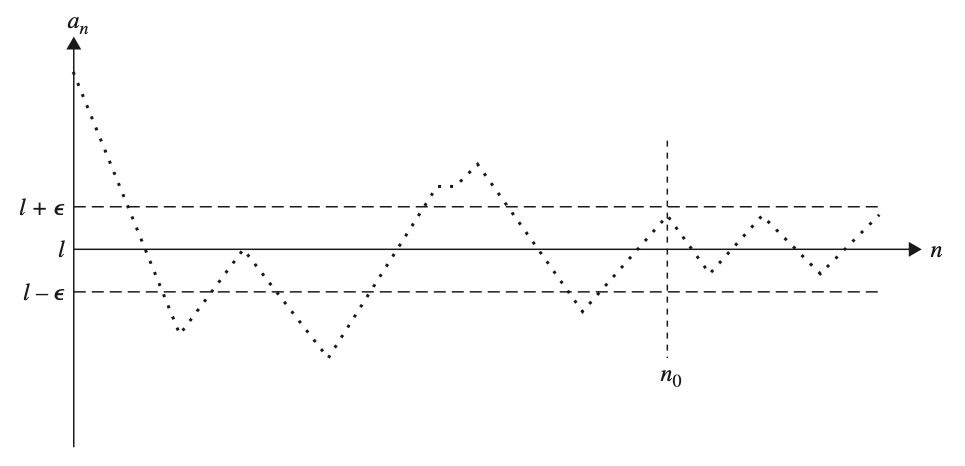
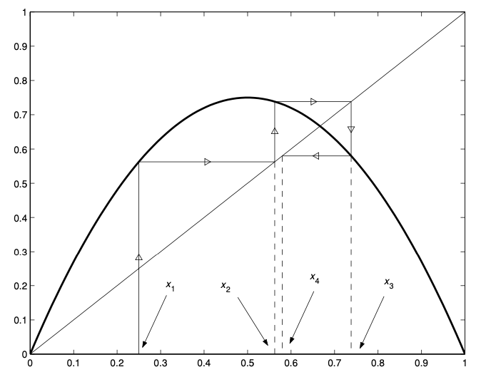

# Sequences
{: .page-title}

> *Definition.*{: .def}
> A **sequence** is a function $a: \mathbb{N} \to A$, denoted by $(a_n)$ or $(a_n)\_1^\infty$ or $(a_n)_{n=1}^\infty$.

We want to study what it means for a real sequence to converge.

> *Definition.*{: .def}
> Let $(a_n)$ be a sequence and $L \in \mathbb{R}$.
> Then $(a_n)$ **converges** to $L$ or $a_n \to L$ if
>
> $$
  (\forall \varepsilon > 0)(\exists N \in \mathbb{N})(\forall n \ge N)\;|a_n - L| < \varepsilon
  $$
>
> We then also write
>
> $$
  \lim_{n \to \infty} a_n = L
  $$
>
> The sequence is said to be **convergent**, otherwise it is **divergent**.

It is similar to the definition of limit of a function $f(x)$, therefore

$$
\lim_{x \to \infty} f(x) = L \text{ and } f(n) = a_n \implies \lim_{n \to \infty} a_n = L
$$

> *Proposition.*{: .prop}
> The limit is unique, i.e. if $a_n \to L_1$ and $a_n \to L_2$ then $L_1 = L_2$.
>
> *Proof.*{: .prf}
>
> Let $\varepsilon = \vert L_1 - L_2 \vert / 3$. There exists $N_1$ and $N_2$ such that
>
> $$
  (\forall n \ge N_1)\; |a_n - L_1| < \varepsilon \quad \text{and} \quad (\forall n \ge N_2)\; |a_n - L_2| < \varepsilon
  $$
>
> Hence, let $N = \max(N_1, N_2)$, we have
>
> $$
  (\forall n > N) |L_1 - L_2| \le |a_n - L_1| + |a_n - L_2| < 2\varepsilon = 2|L_1 - L_2|/3
  $$
>
> which is a contradiction except for $L_1 = L_2$.

> *Definition.*{: .def}
> $(a_n)$ is a **null sequence** if
>
> $$
  (\forall \varepsilon > 0)(\exists N \in \mathbb{N})(\forall n \ge N)\;|a_n| < \varepsilon
  $$

> *Lemma.*{: .lem}
> $a_n \to a$ iff $(a_n - a)$ is a null sequence.

## Bounded Sequences

> *Definition.*{: .def}
> A sequence is **bounded above** if
>
> $$
  (\exists M)(\forall n)\;a_n \le M
  $$

> *Definition.*{: .def}
> A sequence is **bounded below** if
>
> $$
  (\exists m)(\forall n)\;a_n \ge m
  $$

> *Definition.*{: .def}
> A sequence is **bounded** if it is bounded above and below, i.e.
>
> $$
  (\exists M)(\forall n)\; |a_n| \le M
  $$
>
> Otherwise it is **unbounded**.

> *Definition.*{: .def}
> A sequence is **eventually bounded** if
>
> $$
  (\exists M)(\exists N)(\forall n \ge N)\; |a_n| \le M
  $$

> *Lemma.*{: .lem}
> Every eventually bounded sequence is bounded.
>
> *Proof.*{: .prf}
>
> Obviously, the eventually bounded sequence is bounded by $\max(\vert a_1 \vert, ..., \vert a_{N-1} \vert, M)$.

It can be useful for proving sequence to be bounded by showing it is eventually bounded.

> *Lemma.*{: .lem}
> Every convergent sequence is bounded.
>
> *Proof.*{: .prf}
>
> Let $\varepsilon = 1$, there exists $N$ such that for all $n > N$, $\vert a_{n} - L \vert < 1$ and hence $(a_{n})$ is eventually bounded by $L + 1$.

## Divergent Sequences

There are two cases for a sequence to be divergent.

> *Definition.*{: .def}
> The sequence $a_n$ is said to diverge to $+\infty$ or tend to infinity if
>
> $$
  (\forall A \in \mathbb{R})(\exists N \in \mathbb{N})(\forall n > N)\; a_n > A
  $$

Similarily,

$$
a_n \to -\infty \implies (\forall A \in \mathbb{R})(\exists N \in \mathbb{N})(\forall n > N)\; a_n < A
$$

> *Definition.*{: .def}
> If the sequence $(a_n)$ does not tend to a limit or to $\pm \infty$, it is said to be **oscillating**.
> If $(a_n)$ oscillates and bounded, it oscillates finitely.
> If $(a_n)$ oscillates and is not bounded, it oscillates infinitely.

## Sums and Products

> *Lemma.*{: .lem}
> If $(a_n)$ and $(b_n)$ are null sequences, then $(a_n + b_n)$ is also a null sequence.
>
> *Proof.*{: .prf}
>
> For any $\varepsilon > 0$, there exists $N_1$ and $N_2$ such that
>
> $$
  (\forall n > N_1)\; |a_n| < \varepsilon / 2
  \quad \text{and} \quad
  (\forall n > N_2)\; |b_n| < \varepsilon / 2
  $$
>
> Let $N = \max(N_1, N_2)$, then by triangle inequality,
>
> $$
  (\forall n > N)\; |(a_n + b_n)| \le |a_n| + |b_n| < \varepsilon
  $$

> *Theorem.*{: .thm}
> **[Sum of Sequences]**
> If $a_n \to a$ and $b_n \to b$, then $a_n + b_n \to a + b$.
>
> *Proof.*{: .prf}
>
> $$
  (a_n + b_n) - (a + b) = (a_n - a) + (b_n - b)
  $$
>
> $(a_n - a)$ and $(b_n - b)$ are null sequences and hence $((a_n + b_n) - (a + b))$ is also a null sequence.

> *Lemma.*{: .lem}
> If $(a_n)$ is a null sequence and $(b_n)$ is a bounded sequence, then $(a_nb_n)$ is a null sequence.
>
> *Proof.*{: .prf}
>
> Let $(b_n)$ be bounded by $M$.
> For any $\varepsilon > 0$, there exists $N$ such that
>
> $$
  (\forall n > N)\; |a_n| < \varepsilon / M
  $$
>
> Therefore,
>
> $$
  (\forall n > N)\; |a_nb_n| = |a_n||b_n| < (\varepsilon / M)(M) = \varepsilon
  $$

> *Corollary.*{: .cor}
> If $(a_n)$ is a null sequence and $c$ is a constant, then $(ca_n)$ is a null sequence.

> *Theorem.*{: .thm}
> **[Product of Sequences]**
> If $a_n \to a$ and $b_n \to b$, then $a_nb_n \to ab$.
>
> *Proof.*{: .prf}
>
> $$
  a_nb_n - ab = (a_n - a)b_n + a(b_n - b)
  $$
>
> $(a_n - a)$ is a null sequence and $(b_n)$ is bounded, therefore $(a_n - a)b_n$ is a null sequence.
>
> $(b_n - b)$ is a null sequence and $a$ is a constant, therefore $a(b_n - b)$ is a null sequence.
>
> Hence, $(a_nb_n - ab)$ is also a null sequence.

> *Lemma.*{: .lem}
> If $a_n \to a$, where $a \not= 0$, then $1/a_n \to 1/a$.
>
> *Proof.*{: .prf}
>
> $$
  {1 \over a_n} - {1 \over a} = {a - a_n \over aa_n}
  $$
>
> We have to show that $1 / a_n$ is bounded, meaning we need to have $\vert a_n \vert$ be greater than something.
>
> Consider
>
> $$
  |a| = |a_n + (- a_n + a)| \le |a_n| + |a_n - a| \implies |a_n| \ge |a| - |a_n - a|
  $$
>
> Therefore, for $\varepsilon = \vert a \vert / 2$, there exists $N$ such that
>
> $$
  (\forall n > N)\;\vert a_n - a \vert \le {|a| \over 2}
  \implies
  |a_n| \ge |a| - |a_n - a| \ge {|a| \over 2}
  \implies
  {1 \over |a_n|} \le {2 \over |a|}
  $$
>
> so $1 / a_n$ is bounded.
>
> As $(a - a_n)$ is null sequence, $1/a$ is a constant and $(1 / a_n)$ is bounded, their product is a null sequence and hence $1 / a_n \to 1 / a$.

> *Theorem.*{: .thm}
> **[Quotient of Sequences]**
> If $a_n \to a$ and $b_n \to b$, where $b \not= 0$, then $a_n / b_n \to a / b$.
>
> *Proof.*{: .prf}
>
> $a_n \to a$ and $1/b_n \to 1/b$ so their product $a_n/b_n \to a/b$.

## Convergence Test

Working directly with an arbitrary $\varepsilon$ can be difficult.
Sometimes it can be easier to relate the sequence with other known converging sequences so to prove convergence and find the limit.

> *Proposition.*{: .prop}
> **[Sandwich Principle/Squeeze Theorem]**
> Suppose that $a_n \le b_n \le c_n$ for all $n$.
> If $a_n \to L$ and $c_n \to L$, then $b_n \to L$.
>
> *Proof.*{: .prf}
>
> Given $\varepsilon > 0$, there exists an $N$ such that $\vert a_n - L \vert < \varepsilon$ and $\vert a_n - L \vert < \varepsilon$ for $n \ge N$, therefore
>
> $$
  L - \varepsilon < a_n \le b_n \le c_n < L + \varepsilon
  $$

> *Corollary.*{: .cor}
> $(a_n)$ is a null sequence if $(\vert a_n \vert)$ is a null sequence.
>
> *Proof.*{: .prf}
>
> $$
  -|a_n| \le a_n \le |a_n| \quad \text{and} \quad |a_n| \to 0 \implies -|a_n| \to 0
  $$
>
> By Sandwich Principle, $a_n \to 0$.

It is useful for finding limits of alternating sequence, for example

$$
\lim_{n \to \infty} \left| {(-1)^n \over n} \right| = 0 \implies \lim_{n \to \infty} {(-1)^n \over n} = 0
$$

> *Proposition.*{: .prop}
> Suppose that $(\varepsilon_k)$ is a null sequence of positive numbers.
> Then a sequence $(a_n)$ converges to $L$ iff for each $k$ there exists $N_k$ such that $\vert a_n - L \vert < \varepsilon_k$ for $n > N_k$.
>
> *Proof.*{: .prf}
>
> ($\Rightarrow$) Certainly, given $\varepsilon = \varepsilon_k$, there exists $N = N_k$ such that $\vert a_n - L \vert < \varepsilon_k$ for $n > N_k$.
>
> ($\Leftarrow$) Given $\varepsilon > 0$, there exists a $k$ such that $0 < \varepsilon_k < \varepsilon$. For $n > N_k$, we have $\vert a_n - L \vert < \varepsilon_k < \varepsilon$.

It relates the sequence with a null sequence. We can prove convergence by showing for a term $\varepsilon_k$ in a shrinking distance, there is a point $N_k$ in the sequence such that the distance of points are within $\varepsilon_k$ from the limit.
Convenient choices are $\varepsilon_k = 1/k$ or $\varepsilon_k = 1/2^k$.

The following test involves some knowledge about [series](series.md).

> *Proposition.*{: .prop}
> **[Ratio Test]**
> If
>
> $$
  \lim_{n \to \infty} \left| { a_{n+1} \over a_n} \right| < 1
  $$
>
> then $(a_n)$ is a null sequence.
>
> *Proof.*{: .prf}
>
> By d'Alembert's ratio test, the series $\sum a_n$ converges.
> Hence, the underlying sequence $(a_n)$ must be a null sequence.

## Recurrence Relation

A sequence can be determined by a relation between successive members of it. For example, the famous Fibonacci sequence

$$
a_{n+2} = a_{n+1} + a_n
$$

Sometimes, it is possible to find an explicit formula (See [Difference Equations](../differential-equations/difference-equations.md)) but most of the time it is not possible.
We can still study its limit by the following technique.

> *Proposition.*{: .prop}
> If $a_n \to L$, then $a_{n+1} \to L$ and $a_{n+2} \to L$ and ...
>
> For example, if the sequence
>
> $$
  a_{n+1} = \sqrt{a_n + a}
  $$
>
> has a limit $L$, then $L = \sqrt{L + a}$.

In some cases, the cobweb diagram can be useful as well.

{: .size-2x}

## References

* J C Burkill _A First Cource in Mathematical Analysis_, 1978 - Chapter 2
* D. J. H. Garling _A Course in Mathematical Analysis Vol.1_, 2013 - Chapter 3
