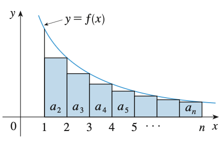

# Series
{: .page-title}

The convergence of a sequence allows us to consider infinite sums, or series.

> *Definition.*{: .def}
> A **series** is the infinite sum of a sequence $(a_k)$.
> Let $s_n$ denote its $n$th **partial sum**, i.e.
>
> $$
  s_n = \sum_{k=1}^n a_k = a_1 + a_2 + \cdots + a_n
  $$
>
> If $s_n \to s$, then we say the series converges to $s$, otherwise the series diverges.

> *Proposition.*{: .prop}
> If a series $\sum a_k$ converges, then $a_n \to 0$.
>
> *Proof.*{: .prf}
>
> Let $\sum a_k = s$. Then $s_n \to s$ and $s_{n-1} \to s$, so $a_n = s_n - s_{n-1} \to 0$.

It provides an easy check for divergence when we know the explicit formula of $a_k$.

> *Proposition.*{: .prop}
> **[Divergence Test]**
> If the underlying sequence is not a null sequence, i.e. $a_n \not \to 0$, then the series is divergent.

The converse of the statement is not true though, for example the harmonic series has the terms approaching $0$ but the sum is divergent.

> *Proposition.*{: .prop}
> **[Harmonic Series]**
> The sequence $(a_k = 1/k)$ converges to $0$ but the series
>
> $$
  \sum_{k=1}^\infty {1 \over k} = 1 + {1 \over 2} + {1 \over 3} + \cdots = \infty
  $$
>
> *Proof.*{: .prf}
>
> Consider the terms $a_{2^k + 1}$ to $a_{2^{k+1}}$, their sum is
>
> $$
  {1 \over 2^k + 1} + {1 \over 2^k + 2} + \cdots + {1 \over 2^{k+1}} \ge {2^k \over 2^{k+1}} = {1 \over 2}
  $$
>
> Therefore, the sum is
>
> $$
  1 + {1 \over 2} + {1 \over 3} + {1 \over 4} + \cdots = 1 + {1 \over 2} + \left({1 \over 3} + {1 \over 4}\right) + \cdots \ge 1 + {1 \over 2} + {1 \over 2} + \cdots = \infty
  $$

Here are some examples of convergent series.

> *Proposition.*{: .prop}
> **[Geometric Series]**
> If $\vert r \vert < 1$, then
>
> $$
  \sum_{k=0}^\infty r^k = {1 \over 1 - r}
  $$
>
> *Proof.*{: .prf}
>
> $(1 - r)s_n = 1 - r^{n+1}$. As $n \to \infty$, $r^{n+1} \to 0$, hence $s_n \to 1 / (1 - r)$.

> *Proposition.*{: .prop}
> Let
>
> $$
  a_k = {1 \over k(k+1)} = {1 \over k} - {1 \over k+1}
  $$
>
> Then
>
> $$
  s_n = \left(1 - {1 \over 2}\right) + \left({1 \over 2} - {1 \over 3}\right) + \cdots = 1 - {1 \over {n+1}}
  $$
>
> So, $s_n \to 1$ as $n \to \infty$.

> *Property.*{: .prop}
> As convergence of series is equivalent to convergence of its partial sum sequence, we have
>
> + when the sum exists, it is unique;
>
> + $\sum (a_k + b_k) = s + t$;
>
> + $\sum ca_k = cs$;
>
> + if $a_n \le b_n$ for all $n$, then $s \le t$.

Complex series converge iff the sum of real parts and the sum of imaginary parts both converge.

> *Proposition.*{: .prop}
> Suppose that $z_k = x_k + i y_k$ and $s = \sigma + i\tau$.
> Then $\sum z_k$ converges to $s$ if $\sum x_k$ converges to $\sigma$ and $\sum y_k$ converges to $\tau$.

> *Proposition.*{: .prop}
> **[General Principle of Convergence]**
> Suppose that $(z_k)$ is a sequence of complex numbers.
> Then $\sum z_k$ converges iff
>
> $$
  (\forall \varepsilon > 0)(\exists N \in \mathbb{N})(\forall m, n : m > n \ge N)\;|s_m - s_n| = \left|\sum_{k=n+1}^m z_k \right| < \varepsilon
  $$

## Series with Non-negative Terms

Series with terms being real and non-negative has some immediate consequence.

> *Proposition.*{: .prop}
> Suppose that $(a_k)$ is a sequence of non-negative real numbers, then $(s_n)$ is an increasing sequence.
> Either $(s_n)$ is bounded and $s_n \to \sup_n s_n$ or $s_n \to \infty$.

> *Proposition.*{: .prop}
> **[Comparison Test]**
> Suppose $0 \le b_k \le a_k$ for all $k \ge K$.
>
> + If $\sum a_k$ is convergent, then $\sum b_k$ is convergent and $\sum b_k \le \sum a_k$.
>
> + If $\sum b_k$ is divergent, then $\sum a_k$ is divergent.
>
> *Proof.*{: .prf}
>
> It is obvious by the Sandwich Principle on the partial sum sequences.

For example, $1 / k^2 \le 2 / k(k+1)$, so $\sum 1/k^2$ is convergent.
When $k \ge 3$, $\ln k / k > 1 / k$, so $\sum \ln k / k$ is divergent.

> *Corollary.*{: .cor}
> If $a_k / b_k \to c$ as $n \to \infty$, where $c > 0$,
> then the corresponding series are either both convergent or both divergent.

> *Corollary.*{: .cor}
> **[Compression Test]**
> If $(a_k)$ is a decreasing sequence of non-negative real numbers, then $\sum a_k$ converges iff $\sum 2^ka_{2^k}$ converges.
> Furthermore,
>
> $$
  {1 \over 2} \sum 2^k a_{2^k} \le \sum a_k \le \sum 2^k a_{2^k}
  $$
>
> *Proof.*{: .prf}
>
> It is the generalization of the proof of harmonic series divergence. By grouping the terms with brackets, we have
>
> $$
  2^{k-1}a_{2^k} \le a_{2^{k-1}+1} + \cdots + a_{2^k} \le 2^{k-1}a_{2^{k-1}}
  $$
>
> since $(a_k)$ is decreasing.

The comparison test can be turned into the following applicable forms.
The use of $\limsup$ means that the sequence only needs to fulfill the criteria eventually.
Finite number of terms violating that won't affect the convergence.

> *Corollary.*{: .cor}
> **[Cauchy's Test]**
> Suppose that $(a_k)$ is a bounded sequence of non-negative real numbers.
>
> + If $\limsup_{k \to \infty} a_k^{1/k} < 1$ then $\sum a_k$ converges.
>
> + If $\limsup_{k \to \infty} a_k^{1/k} > 1$ then $\sum a_k = \infty$.
>
> *Proof.*{: .prf}
>
> In the first case, choose $r$ such that $\limsup_{n \to \infty} a_k^{1/k} < r < 1$.
> Then there exists $K$ such that $a_k^{1/k} < r$ for all $k \ge K$.
> Hence, $0 \le a_k \le r^k$ for $k \ge K$ and $\sum a_k$ converges by comparison test.
>
> In the second case, for each $k$ there exists $h \ge k$ such that $a_h^{1/h} > 1$ so $a_h > 1$.
> Hence, $a_k$ is not a null sequence and $\sum a_k$ diverges to $\infty$.

> *Corollary.*{: .cor}
> **[D'Alembert's Ratio Test]**
> Suppose that $(a_k)$ is a sequence of positive real numbers.
>
> + If $\limsup_{k \to \infty} a_{k+1}/a_k < 1$ then $\sum a_k$ converges.
>
> + If $\liminf_{k \to \infty} a_{k+1}/a_k > 1$ then $\sum a_k = \infty$.
>
> *Proof.*{: .prf}
>
> In the first case, choose $r$ such that $\limsup_{n \to \infty} a_{k+1}/a_k < r < 1$.
> Then there exists $K$ such that $a_{k+1}/a_k < r$ for all $k \ge K$.
> Thus, if $k > K$ then
>
> $$
  a_k = \left( {a_k \over a_{k-1}} \right) \left( {a_{k-1} \over a_{k-2}} \right) \cdots \left( {a_{K+1} \over a_{K}} \right) a_K
  \le r^{k - K} a_K = (a_K / r^K) r^k = M r^k
  $$
>
> Hence, $0 \le a_k \le M r^k$ for $k \ge K$ and $\sum a_k$ converges by comparison test.
>
> In the second case, there exists $K$ such that $a_{k+1} > a_k$ for $k \ge K$.
> So $a_k \ge a_K$ for $k \ge K$ and $(a_k)$ is not a null sequence and $\sum a_k$ diverges to $\infty$.

In practice, we can check if $a_k^{1/k}$ or $a_{k+1}/a_k$ tends to a limit less than $1$. If so, $\sum a_k$ converges.
The test is inconclusive if they are equal to $1$.

## Absolute Convergence

We now consider series with both positive and negative terms, or even complex terms.

> *Definition.*{: .def}
> A series $\sum z_k$ is **absolutely convergent** if the series $\sum \vert z_k \vert$ is convergent.

Suppose $\sum a_k$ is a real series with both positive and negative terms, it is useful we first define

$$
a_k^+ = \begin{cases}
a_k & \text{for } a_k \ge 0 \\
0 & \text{for } a_k < 0
\end{cases}
\quad \text{and} \quad
a_k^- = \begin{cases}
0 & \text{for } a_k \ge 0 \\
-a_k & \text{for } a_k < 0
\end{cases}
$$

such that $(a_k^+)$ is the sequence of the positive terms and $(a_k^-)$ is the sequence of negated negative terms and $a_k = a_k^+ - a_k^-$.

> *Proposition.*{: .prop}
> If a series $\sum z_k$ is absolutely convergent then it converges, and $\vert \sum z_k \vert \le \sum \vert z_k \vert$.
>
> *Proof.*{: .prf}
>
> If $z_k = x_k + i y_k$, we have both $\vert x_k \vert \le \vert z_k \vert$ and $\vert y_k \vert \le \vert z_k \vert$.
> So $\sum \vert z_k \vert$ converges iff $\sum \vert x_k \vert$ and $\sum \vert y_k \vert$ do and it is enough to consider real series.
>
> Suppose $\sum \vert a_k \vert$ converges, we have $\sum a_k^+$ and $\sum a_k^-$ both converges, so $\sum a_k = \sum a_k^+ - \sum a_k^-$ also converges.
>
> Since the partial sums $\vert \sum^n a_k \vert \le \sum^n \vert a_k \vert$ for all $n$, the limits $\vert \sum^\infty z_k \vert \le \sum^\infty \vert z_k \vert$.

Absolutely convergent series are generally as well behaved as series with non-negative terms.
The comparison test, D'Alembert's test and Cauchy's test can be used to test for absolute convergence.

Series can still converge if it is not absolutely convergent, but the arguments are generally more delicate.

> *Definition.*{: .def}
> **[Conditional Convergence]**
> A series is **conditionally convergent** if it is convergent but not absolutely convergent.

For example, alternating harmonic series is conditionally convergent.

> *Proposition.*{: .prop}
> If a series $\sum a_k$ converges conditionally, then $\sum a_k^+ = +\infty$ and $\sum a_k^- = +\infty$.
>
> *Proof.*{: .prf}
>
> As $s_n = \sum a_k^+ - \sum a_k^-$, at least one of the sums must diverge.
> Suppose $\sum a_k^+$ diverges and $\sum a_k^- = s_-$.
> For any $M > 0$, there exists $N$ such that $\sum^n a_k^+ > M + s_-$ for $n > N$, we have
>
> $$
  s_n = \sum^n (a_k^+ - a_k^-) \ge \sum^n a_k^+ - s_- > M
  $$
>
> Therefore, $(s_n)$ diverges to $\infty$, which is a contradiction.
> A similar argument applies if $\sum a_n^+$ converges but $\sum a_n^-$ diverges.
> Hence, both of them has to diverge.

Thus conditional convergence depends on cancellation of positive and negative quantities.
We still have some tests for convergence in such cases.

> *Proposition.*{: .prop}
> **[Alternating Series Test]**
> Suppose that
>
> + $(a_k)$ is a decreasing null sequence of positive real numbers.
>
> Then $\sum (-1)^k a_k$ converges, say, to $s$.
> Further, the sequence $(s_{2n+1})$ increases to $s$ and $(s_{2n})$ decreases to $s$.
>
> *Proof.*{: .prf}
>
> $$
  \begin{align*}
  s_{2n+1} &= s_{2n-1} + (a_{2n} - a_{2n+1}) \ge s_{2n-1} \\
  s_{2n+2} &= s_{2n} - (a_{2n+1} - a_{2n+2}) \le s_{2n}
  \end{align*}
  $$
>
> and
>
> $$
  \begin{align*}
  s_{2n+1} &= s_{2n} - a_{2n+1} \le s_{2n} \le s_0 \\
  s_{2n+2} &= s_{2n+1} + a_{2n+2} \ge s_{2n+1} \ge s_1 \\
  \end{align*}
  $$
>
> so $(s_{2n+1})$ is an increasing sequence bounded above and $(s_{2n})$ is a decreasing sequence bounded below.
> Both of them converges, and to the same limit because $s_{2n} - s_{2n+1} = a_{2n+1} \to 0$, and $s_n$ converges to the common limit.

The alternating series test can be extended to other tests, which also apply to complex series.

> *Proposition.*{: .prop}
> **[Abel's Formula]**
> Let $s_n = \sum^n a_kz_k$ and $t_n = \sum^n z_k$ for $n \in \mathbb{N}$.
> Suppose $n > m$, by substituting $z_k = t_k - t_{k-1}$ and rearranging the terms, we have
>
> $$
  \begin{align*}
  s_n - s_m &= a_{m+1}z_{m+1} + a_{m+2}z_{m+2} + ... + a_{n}z_{n} \\
  &= a_{m+1}(t_{m+1} - t_{m}) + a_{m+2}(t_{m+2} - t_{m+1}) + ... + a_{n}(t_{n} - t_{n-1}) \\
  &= -a_{m+1}t_{m} + (a_{m+1} - a_{m+2})t_{m+1} + ... + (a_{n-1} - a_{n})t_{n-1} + a_{n}t_{n}
  \end{align*}
  $$
>
> This equation (and others of similar form) is known as **Abel's Formula**.

> *Proposition.*{: .prop}
> **[Hardy's Test]**
> Suppose that
>
> + $(a_k)$ is a null sequence of complex numbers for which $\sum \vert a_k - a_{k-1} \vert < \infty$;
>
> + $(z_k)$ is a sequence of complex numbers for which the sequence of partial sums $(\sum^n z_k)$ is bounded.
>
> Then $\sum a_k z_k$ converges.
>
> *Proof.*{: .prf}
>
> Let $s_n = \sum^n a_kz_k$ and $t_n = \sum^n z_k$.
>
> By the second condition, there exists $M$ such that $\vert t_n \vert \le M$ for all $n \in \mathbb{N}$.
>
> Suppose that $\varepsilon > 0$. By the first condition, there exists $N$ such that for $n \ge N$,
>
> $$
  \sum_{N+1}^\infty |a_k - a_{k-1}| < {\varepsilon \over 3(M + 1)}
  \quad \text{and} \quad
  |a_n| < {\varepsilon \over 3(M + 1)}
  $$
>
> Therefore, by the Abel's formula, for $n > m \ge N$,
>
> $$
  \begin{align*}
  |s_n - s_m| &\le |a_{m+1}||t_{m}| + \sum_{k=m+1}^{n-1} |a_{k} - a_{k+1}||t_{k}| + |a_{n}||t_{n}| \\
  &\le \left( |a_{m+1}| + \sum_{k=m+1}^{n-1} |a_{k} - a_{k+1}| + |a_n| \right) M < \varepsilon
  \end{align*}
  $$
>
> By the general principle of convergence, $\sum a_kz_k$ converges.

> *Proposition.*{: .prop}
> **[Dirichlet's Test]**
> Suppose that
>
> + $(a_k)$ is a decreasing null sequence of positive real numbers;
>
> + $(z_k)$ is a sequence of complex numbers for which the sequence of partial sums $(\sum^n z_k)$ is bounded.
>
> Then $\sum a_k z_k$ converges, say, to $s$.
>
> Further, if $s_m = \sum^m a_k z_k$, $t_n = \sum^n z_k$ and $M = \sup_n \vert t_n \vert$ then $\vert s - s_m \vert \le 2 a_{m+1} M$.
>
> *Proof.*{: .prf}
>
> According to the first condition, we have
>
> $$
  \sum |a_k - a_{k-1}| = \sum (a_{k-1} - a_{k}) = a_0
  $$
>
> so by Hardy's test, $\sum a_k z_k$ converges.
>
> Using Abel's formula and the fact that $(a_k)$ is always positive, we have
>
> $$
  \begin{align*}
  |s_n - s_m| &\le |a_{m+1}t_{m}| + |(a_{m+1} - a_{m+2})t_{m+1}| + ... + |(a_{n-1} - a_{n})t_{n-1}| + |a_{n}t_{n}| \\
  &\le (a_{m+1} + (a_{m+1} - a_{m+2}) + ... + (a_{n-1} - a_{n}) + a_{n}) M = 2a_{m+1}M
  \end{align*}
  $$
>
> Hence, $\vert s - s_m \vert = \lim_{n \to \infty} \vert s_n - s_m \vert \le 2a_{m+1}M$.

> *Proposition.*{: .prop}
> **[Abel's Test]**
> Suppose that
>
> + $(a_k)$ is a decreasing sequence of positive real numbers;
>
> + $\sum z_k$ converges.
>
> Then $\sum a_k z_k$ converges.
>
> *Proof.*{: .prf}
>
> The sequence $(a_k)$ converges as it is decreasing and bounded below by $0$.
> Let $a$ be its limit and $(a_k - a)$ is therefore a decreasing null sequence of positive real numbers.
>
> As $\sum z_k$ converges, $\sum z_k$ is bounded and by Dirichlet's test, $\sum (a_k - a)z_k$ converges.
> As $\sum a z_k$ converges, $\sum a_k z_k = \sum (a_k - a)z_k + \sum a z_k$ converges.

## Integral Test

> *Proposition.*{: .prop}
> **[Integral Test]**
> Suppose $f$ is a continuous and non-negative decreasing function on $[1, \infty)$ such that $f(n) = a_n$.
> $\sum a_n$ converges iff $\int_{1}^{\infty} f < \infty$.
>
> *Proof.*{: .prf}
>
> Since $f$ is decreasing, we have
>
> $$
  \int_n^{n+1} f \le f(n) \le \int_{n-1}^n f
  $$
>
> and therefore
>
> $$
  \int_1^{N+1} f \le \sum_{n=1}^N f(n) \le \int_{1}^N f + f(1)
  $$
>
> If the integral exists, $\sum f(n)$ is increasing and bounded above so it converges.
> If the integral is unbounded, $\sum f(n)$ is unbounded and does not converge.

To illustrate, consider the series

$$
\sum_{n=1}^{\infty} {1 \over n^2} = {1 \over 1^2} + {1 \over 2^2} + {1 \over 3^2} + ...
$$

Geometrically, we can form rectangles under the graph of $y = 1/x^2$, each with a unit width and height eqauls to the value of function.
The sum of the area of the rectangles equals to the sum of the series. Consider all the terms excluding the first one $1/1^2$,
it has to be less than the area under the function from $1$ to $\infty$. Hence,

$$
\sum_{n=1}^{\infty} {1 \over n^2} < {1 \over 1^2} + \int_{1}^{\infty} { 1 \over x^2} \mathrm{d}x = 1 + 1 = 2
$$

As the partial sum $\Set{s_n}$ is increasing and bounded above, the series is convergent.

On the other hand, we can also form rectangles with tops lie above the curve to show the series is divergent. Consider the series

$$
\sum_{n=1}^{\infty} {1 \over \sqrt{n}} = {1 \over \sqrt{1}} + {1 \over \sqrt{2}} + {1 \over \sqrt{3}} + ...
$$

We have

$$
\sum_{n=1}^{\infty} {1 \over \sqrt{n}} > \int_{1}^{\infty} {1 \over \sqrt{x}} \mathrm{d}x = \infty
$$

So, the series is divergent.

## Rearrangements

As series involve infinite sums, rearrangement of the terms might affect the results.

> *Definition.*{: .def}
> **[Unconditional Convergence]**
> A series $\sum z_k$ is **unconditionally convergent** if for any permutation $\sigma$ of $\mathbb{N}$, $\sum z_{\sigma(k)}$ converges to the same limit.

> *Proposition.*{: .prop}
> If a series $\sum z_k$ is absolutely convergent, then it is unconditionally convergent.
>
> *Proof.*{: .prf}
>
> It is enough to consider the case of real series just like before and we first consider the case of series with non-negative terms.
>
> For any $n \in mathbb{N}$ and $N = \sup\Set{\sigma(k) : 1 \le k \le n}$, which is the largest number among the $n$ elements of the permutation, we have
>
> $$
  \sum^n a_{\sigma{(k)}} \le \sum^N a_k \le s
  $$
>
> as $\sum^N a_k$ contains all the terms of $\sum^n a_{\sigma(k)}$.
> Thus, $\sum a_{\sigma(k)}$ converges to a limit $\le s$.
>
> Similarily, we have
>
> $$
  s = \sum a_k = \sum a_{\sigma^{-1} \sigma(k)} \le \sum a_{\sigma(k)}
  $$
>
> Thus, $s \le \sum a_{\sigma(k)} \le s$ and $\sum a_{\sigma(k)} = s$.
>
> In the general case, we have $a_{\sigma(k)} = a_{\sigma(k)}^+ - a_{\sigma(k)}^-$.
> As both of them contains only non-negative terms, we have
>
> $$
  \sum a_{\sigma(k)} = \sum a_{\sigma(k)}^+ - \sum a_{\sigma(k)}^- = \sum a_k^+ - \sum a_k^- = \sum a_k
  $$

> *Proposition.*{: .prop}
> Suppose that $\sum a_k$ is a conditionally convergent real series.
> For any $L \in \mathbb{R}$, there exists a rearrangement $\sum a_{\sigma(k)}$ which converges to $L$.

## References

* D. J. H. Garling _A Course in Mathematical Analysis Vol.1_, 2013 - Chapter 4
* James Stewart _Single Variable Calculus_, 2015 - Chapter 11
