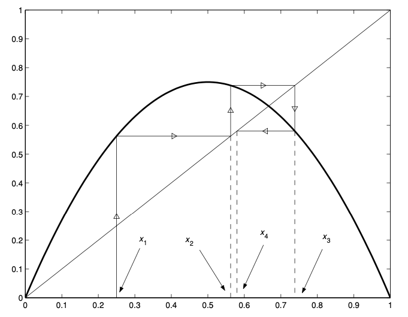

# Difference Equations
{: .page-title}

Difference equations can appear in numerical approximations and other problems that the independent variable only takes discrete values.

> *Definition.*{: .def}
> The **order** of a difference equation is the largest difference between any two of the indices of $x$.

## First Order + Homogeneous + Linear

> *Proposition.*{: .prop}
> For a first order linear difference equation
>
> $$
  x_{n+1} = kx_n
  $$
>
> the solution is
>
> $$
  x_n = k^n x_0
  $$

## Second Order + Homogeneous + Linear

The way of solving linear difference equations is analogous to that of differential equations.

> *Proposition.*{: .prop}
> Consider a difference equation of the form
>
> $$
  ax_{n+2} + bx_{n+1} + cx_n = 0
  $$
>
> Let $x_n = k^n$ be the solution. Then
>
> $$
  ak^{n+2} + bk^{n+1} + ck^n = 0
  $$
>
> and cancelling $k^n$ gives us the **auxiliary equation**
>
> $$
  ak^2 + bk + c = 0
  $$

> *Proposition.*{: .prop}
> If the auxiliary equation has two distinct real roots $k_1$ and $k_2$,
> then the general solution is
>
> $$
  x_n = Ak_1^n + Bk_2^n
  $$

> *Proposition.*{: .prop}
> If the auxiliary equation has one repeated root $k$,
> then the general solution is
>
> $$
  x_n = Ak^n + Bnk^n
  $$

> *Proposition.*{: .prop}
> If the auxiliary equation has two complex roots $k = a \pm bi = r e^{i\theta}$,
> then the general solution is
>
> $$
  x_n = r^n(A\cos n\theta + B\sin n\theta)
  $$
>
> *Proof.*{: .prf}
>
> The complex roots can be handled just like they are real, i.e.
>
> $$
  \begin{align*}
  x_n &= C(re^{i\theta})^n + C^\ast(re^{-i\theta})^n \\
  &= r^n[2\text{Re}(Ce^{in\theta})] \\
  &= r^n[2\text{Re}((\alpha + \beta i)(\cos n\theta + i \sin n\theta))] \\
  &= r^n[2(\alpha \cos n \theta - \beta \sin n \theta)] \\
  &= r^n(A \cos n \theta + B \sin n \theta)
  \end{align*}
  $$

## Second Order + Inhomogeneous + Linear

> *Proposition.*{: .prop}
> Consider a difference equation of the form
>
> $$
  L[n] = ax_{n+2} + bx_{n+1} + cx_n = f_n
  $$
>
> Let $x_h$ be general solution of $L[n] = 0$ and
> $x_p$ be a particular solution of $L[n] = f_n$.
> Then the general solution is
>
> $$
  x_n = x_h + x_p
  $$

Similarily, $x_p$ involves some educated guess. Common cases are

| $f_n$                            | $x_p$                             |
| $a_k n^k + a_{k-} b^{k-1} + ...$ | $b_k n^k + b_{k-1} n^{k-1} + ...$ |
| $\lambda^n$                      | $a \lambda^n$                     |

In case $x_p$ is one of the solution in $x_h$, we can multiply it by $n$ or $n^2$ to form a new solution.

## First Order + Nonlinear

Consider a general difference equation

$$
x_{n+1} = f(x_n)
$$

> *Definition.*{: .def}
> A **fixed point** is a point $x^\ast$ such that
>
> $$
  f(x^\ast) = x^\ast
  $$
>
> so that if $x_n = x^\ast$ then $x_{n+1} = x^\ast$.

> *Definition.*{: .def}
> A fixed point is **stable** if you stay close to it provided that you start sufficiently near, i.e.
> for any $\epsilon > 0$ there exists a $\delta > 0$ such that
>
> $$
  |x_0 - x^\ast| < \delta \quad \implies \quad |f^n(x_0) - x^\ast| < \epsilon \; \text{ for all } \; n = 0, 1, 2, ...
  $$

> *Definition.*{: .def}
> A fixed point is **attracting** if there exists a $\delta > 0$ such that
>
> $$
  |x_0 - x^\ast| < \delta \quad \implies \quad f^n(x_0) \to x^\ast \; \text{ as } \; n \to \infty
  $$

> *Definition.*{: .def}
> A fixed point is **unstable** if for all $\delta > 0$ there exists a $\epsilon > 0$ such that
>
> $$
  |x_0 - x^\ast| < \delta \quad \text{but} \quad |f^n(x_0) - x^\ast| > \epsilon \; \text{ for some } \; n > 0
  $$

> *Proposition.*{: .prop}
> Analytically, suppose that $x_n = x^\ast + \delta_n$ where $\delta_n$ is small, then by Taylor series expansion
>
> $$
  \begin{align*}
  x_{n+1} &= f(x^\ast + \delta_n) \\
  &\approx f(x^\ast) + f'(x^\ast)\delta_n \\
  &= x^\ast + f'(x^\ast)\delta_n
  \end{align*}
  $$
>
> We therefore have $\delta_{n+1} \approx f'(x^\ast)\delta_n$ and the solution is
>
> $$
  \delta_n = [f'(x^\ast)]^n \delta_0
  $$
>
> Hence, $x^\ast$ is stable and attracting if $\vert f'(x^\ast) \vert < 1$ and unstable if $\vert f'(x^\ast) \vert > 1$.

Graphically, we can produce a picture known as **cobweb diagram** by drawing $y = f(x)$ and the line $y = x$.
Given $x_n$, we can find $x_{n+1}$ by drawing a line up to $f(x_n)$ then over to $y = x$, and repatedly to find $x_{n+2}, ...$.

{: .size-2x}

## Reference

* James C. Robinson _An Introduction to Ordinary Differential Equations_, 2004 - Chapter 22, 23
