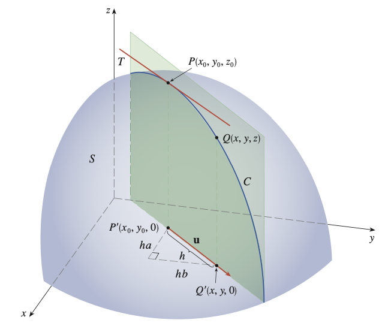
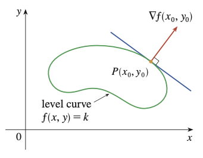
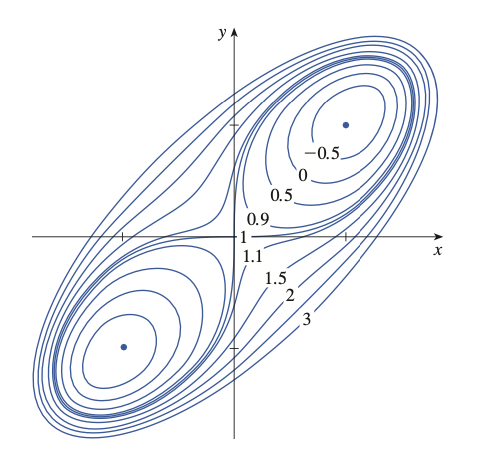

# Directional Derivatives
{: .page-title}

Directional derivatives are the generalization of partial derivatives for obtaining rate of change on an arbitrary direction.

> *Definition.*{: .def}
> The **directional derivative** of $f$ at $(x_0, y_0)$ in the direction of a unit vector $\mathbf{u} = (a, b)$ is
>
> $$
  D_\mathbf{u} f(x_0, y_0) = \lim_{h \to 0} {f(x_0 + ha, y_0 + hb) - f(x_0, y_0) \over h}
  $$
>
> if this limit exists.

If $\mathbf{u} = \mathbf{i} = (1, 0)$, then $D_\mathbf{i} f = f_x$.
If $\mathbf{u} = \mathbf{j} = (0, 1)$, then $D_\mathbf{j} f = f_y$.

> *Theorem.*{: .thm}
> If $f$ is a differentiable function of $x$ and $y$,
> then $f$ has a directional derivative in the direction of any unit vector $\mathbf{u} = (a, b)$ and
>
> $$
  D_\mathbf{u} f(x, y) = f_x(x, y)a + f_y(x, y)b
  $$
>
> Alternatively, if $\mathbf{u} = (\cos \theta, \sin \theta)$, then $D_\mathbf{u} f(x, y) = f_x(x, y)\cos\theta + f_y(x, y)\sin\theta$.
>
> *Proof.*{: .prf}
>
> If we define a function $g$ of the single variable $h$ by
>
> $$
  g(h) = f(x_0 + ha, y_0 + hb)
  $$
>
> then, by the definition of a derivative, we have
>
> $$
  \begin{align*}
  g'(0) &= \lim_{h \to 0} {g(h) - g(0) \over h} = \lim_{h \to 0} { f(x_0 + ha, y_0 + hb) - f(x_0, y_0) \over h} \\
  &= D_\mathbf{u} f(x_0, y_0)
  \end{align*}
  $$
>
> On the other hand, we can write $g(h) = f(x, y)$, where $x = x_0 + ha$, $y = y_0 + hb$, so
>
> $$
  g'(h) = {\partial f \over \partial x} {\mathrm{d} x \over \mathrm{d} h} + {\partial f \over \partial y} {\mathrm{d} y \over \mathrm{d} h} = f_x(x, y)a + f_y(x, y)b
  $$
>
> If we put $h = 0$, then $x = x_0$ and $y = y_0$ and
>
> $$
  g'(0) = f_x(x_0, y_0)a + f_y(x_0, y_0)b
  $$
>
> Hence,
>
> $$
  D_\mathbf{u} f(x_0, y_0) = f_x(x_0, y_0)a + f_y(x_0, y_0)b
  $$

## Gradient Vector

> *Definition.*{: .def}
> The **gradient** of $f$, denoted by $\nabla f$, is the vector function defined by
>
> $$
  \nabla f(x, y) = (f_x(x, y), f_y(x, y))
  $$

> *Corollary.*{: .cor}
> The directional derivative is the dot product of the gradient of $f$ and the unit vector, i.e.
>
> $$
  D_\mathbf{u} f(x, y) = \nabla f(x, y) \cdot \mathbf{u}
  $$

We can also have $\mathbf{x} = (x, y)$ and write

$$
D_\mathbf{u} f(\mathbf{x}) = \lim_{h \to 0} {f(\mathbf{x} + h\mathbf{u}) - f(\mathbf{x}) \over h} = \nabla f(\mathbf{x}) \cdot \mathbf{u}
$$

and generalize that for higher dimentions.

> *Theorem.*{: .thm}
> The maximum value of the directional derivative $D_\mathbf{u}f(\mathbf{x})$ is $\vert \nabla f(\mathbf{x}) \vert$
> and it occurs when $\mathbf{u}$ has the same direction as the gradient vector.
>
> *Proof.*{: .prf}
>
> $$
  D_\mathbf{u} f = \nabla f \cdot \mathbf{u} = \vert \nabla f \vert \cos \theta
  $$

> *Proposition.*{: .prop}
> Geometrically, suppose $S$ is a level curve with equation $f(x, y) = k$.
> Then $\nabla f(\mathbf{x})$ points in the direction of maximum rate of increase of $f$ at $\mathbf{x}$,
> i.e. perpendicular to the level curve or level surface of $f$ through $\mathbf{x}$.

## Stationary Points

One of the application of derivatives is finding maximum and minimum values. Similarily,

> *Theorem.*{: .thm}
> If $f$ has a local maximum/minimum at $(a, b)$, then $f_x(a, b) = 0$ and $f_y(a, b) = 0$.
>
> *Proof.*{: .prf}
>
> Let $g(x) = f(x, b)$. If $f$ has a local maximum/minimum at $(a, b)$, then $g$ as well at $a$, so $g'(a) = f_x(a, b) = 0$,
> and we can apply similar argument for $h(y) = f(a, y)$.

Similar to single-variable derivative, the converse is not necessary true.

> *Definition.*{: .def}
> A **critical/stationary point** is a point $(a, b)$ of $f$ such that $f_x(a, b) = 0$ and $f_y(a, b) = 0$.
> If the point is neither a local maximum/minimum, then it is called a **saddle point**.

> *Proposition.*{: .prop}
> **[Second Derivative Test]**
> Let
>
> $$
  D(a, b) = \begin{vmatrix} f_{xx} & f_{xy} \\ f_{yx} & f_{yy}\end{vmatrix}(a, b) = f_{xx}(a, b)f_{yy}(a, b) - [f_{xy}(a, b)]^2
  $$
>
> + If $D > 0$ and $f_{xx}(a, b) > 0$, then $f(a, b)$ is a local minimum.
>
> + If $D > 0$ and $f_{xx}(a, b) < 0$, then $f(a, b)$ is a local maximum.
>
> + If $D < 0$ then $f(a, b)$ is a saddle point.

Here is an example contour map of $f(x, y) = x^4 + y^4 - 4xy + 1$.
From that we can see $(1, 1)$ and $(-1, -1)$ are local maximum/minimum and $(0, 0)$ is a saddle point.

{: .size-2x}

## References

* James Stewart _Single Variable Calculus_, 2015 - Chapter 14
