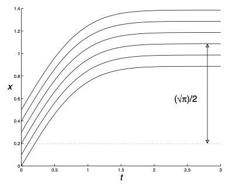
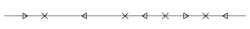
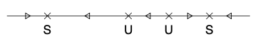
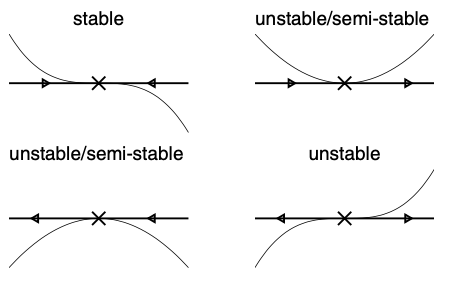

# First Order Ordinary Differential Equations
{: .page-title}

## Existence and Uniqueness

> *Definition.*{: .def}
> Given an open interval $I$ that contains $t_0$, a solution of the **initial value problem**
>
> $$
  {\mathrm{d}x \over \mathrm{d}t} = f(x, t) \quad \text{with} \quad x(t_0) = x_0
  $$
>
> on $I$ is a differentiable function $x(t)$ defined on $I$, with $x(t_0) = x_0$ and $x'(t) = f(x, t)$ for all $t \in I$.

The main point is that we allow a solution to be defined only for some interval instead of every value in $\mathbb{R}$.

> *Theorem.*{: .thm}
> If $f(x, t)$ and $\partial f / \partial x$ are continuous for $a < x < b$ and $c < t < d$,
> then for any $x_0 \in (a, b)$ and $t_0 \in (c, d)$ the initial value problem has a _unique_ solution on some open interval $I$ containing $t_0$.

The freedom to specify the interval on which the solution of an equation exists is necessary.

> *Example.*{: .eg}
> The initial value problem
>
> $$
  {\mathrm{d}x \over \mathrm{d}t} = x^2 \quad \text{with} \quad x(0) = x_0
  $$
>
> has the solution
>
> $$
  x(t) = {1 \over x_0^{-1} - t}
  $$
>
> The solution tends to zero as $t \to \infty$.
> When $x_0 > 0$, by the time $t = t_0^{-1}$, the solution "blows up" and become infinite.
> Therefore, we can define the solution only on the interval $(-\infty, x_0^{-1})$ and it is called the **maximal interval of existence**.

## Trivial Equations

> *Proposition.*{: .prop}
> Consider a differential equation of the form
>
> $$
  {\mathrm{d} y \over \mathrm{d} x} = f(x)
  $$
>
> By the Fundamental Theorem of Calculus, the general solution is anti-derivative $F$ of $f$, i.e.
>
> $$
  y(x) = F(x) + c
  $$
>
> where $c$ is determined by an initial condition.

Sometimes we might not be able to write down an explicit form for the solution,
but it can still be possible to describe qualitatively the behaviour of it.
For example, for the equation

$$
{\mathrm{d} x \over \mathrm{d} t} = e^{-t^2}
$$

the general solution is the _Gaussian Integral_

$$
x(t) = x_0 + \int_0^t e^{-\tilde{t}^2} \mathrm{d} \tilde{t}
$$

in which there is no explicit form for the anti-derivative of $e^{-t^2}$. However, we have

$$
\int_0^\infty e^{-t^2} \mathrm{d}t = {\sqrt{\pi} \over 2}
$$

So, we can say, since $x'(t) > 0$ for all $t$, $x(t)$ increases as $t$ increases and $x(t) \to x_0 + \sqrt{\pi}/2$.

## Autonomous Equations

> *Definition.*{: .def}
> A differential equation is **autonomous** if it doesn't explicitly depend on the independent variable, i.e.
>
> $$
  {\mathrm{d} x \over \mathrm{d} t} = f(x)
  $$

An explict solution might be able to be found by methods below such as by separating the variables,
but we can also try to understand the solutions "qualitatively".

> *Definition.*{: .def}
> The **phase diagram** is a diagram that shows the qualitative behaviour of an autonomous equation by identifying the **equilibria** and their stability.
> The points with rate of change equals zero, i.e. $f(x^\ast) = 0$, are the **equilibria**.
> In between there are arrows, in which up/right arrow represents the solution is increasing, i.e. $f(x) > 0$,
> and down/left arrow represents the solution is decreasing, i.e. $f(x) < 0$.
>
> For example,
>
> 

> *Definition.*{: .def}
> An equilibrium is **stable** if it is attacting nearby solutions.
> More precisely, given any $\epsilon > 0$, there exists a $\delta > 0$ such that
>
> $$
  |x_0 - x^\ast| < \delta \quad \implies \quad |x(t) - x^\ast| < \epsilon, \forall t \ge 0
  $$
>
> An equilibrium is **unstable** if it is not stable, i.e. it repels nearby solutions.
> It means there exists an $\epsilon > 0$ such that for any $\delta > 0$, $\vert x_0 - x^\ast \vert < \delta$ but $\vert x(t) - x^\ast \vert > \epsilon$ for some $t > 0$.
>
> For example, the equilibria above are labeled with the corresponding stability:
>
> 

> *Proposition.*{: .prop}
> The stability of equilibria is determined by the following conditions:
>
> 

> *Definition.*{: .def}
> The differential equation has a **bifurcation** near an equilibrium $x^\ast$ if a small change to $f$ will change the phase diagram drastically.
> Otherwise, it is **structurally stable**.

For example, for the top right case in the diagram above, increasing $f(x)$ by any constant $c > 0$ will make the equilibrium gone.

An example of its application can be found in [Practical Examples](practical-examples.md#population-model).

## Separable Equations

Given a first order differential equation of the form

$$
{\mathrm{d}y \over \mathrm{d}x} = f(x)g(y)
$$

and assume $g(y)$ is sufficiently smooth so that it has a unique solution for any specified initial condition.

Suppose $y(x)$ is a solution such that $g(y(x')) = 0$ for some $x'$.
Assume $y(x) = y(x')$ for all $x \in \mathbb{R}$, we have $g(y(x)) = g(y(x')) = 0$ for all $x \in \mathbb{R}$,
and substituding it back to the equation we have $y'(x) = 0$.
We can see that the constant function $y(x) = y(x')$ is the unique solution to the equation.

It implies that either $g(y(x)) = 0$ for every value of $x$ or $g(y(x)) \not = 0$ for every value of $x$.

In the case of $g(y(x)) \not = 0$ for all $x$, we can divide both sides of the equation by $g(y)$, i.e.

$$
{1 \over g(y)} {\mathrm{d}y \over \mathrm{d}x} = f(x)
$$

Let $H(y)$ be the anti-derivative of $1/g(y)$, i.e.

$$
H'(y) = {1 \over g(y)}
$$

By chain rule, we have

$$
{\mathrm{d} \over \mathrm{d}x} H(y) = H'(y) {\mathrm{d}y \over \mathrm{d}x} = {1 \over g(y)} {\mathrm{d}y \over \mathrm{d}x} = f(x)
$$

By integrating both sides we have

$$
H(y) = \int {1 \over g(y)} \, \mathrm{d}y = \int f(x) \, \mathrm{d}x
$$

which is like "multiplying" $\mathrm{d}x$ and then integrate both sides in the original equation.

Let $F(x)$ be the anti-derivative of $f(x)$, we have

$$
H(y(x)) = F(x) + c
$$

Subsituding the initial condition $(x_0, y_0)$ into the equation we have

$$
H(y_0) = F(x_0) + c \implies c = H(y_0) - F(x_0)
$$

and the solution is

$$
H(y) - H(y_0) = F(x) - F(x_0)
$$

By the fundamental theorem of calculus, we have

$$
\int_{y_0}^{y} {1 \over g(y)} \, \mathrm{d}y = \int_{x_0}^{x} f(x) \, \mathrm{d}x
$$

### Eliminating the absolute sign

This method frequently gives solution with absolute sign as we are integrating $1/g(y)$ on one side.
The absolute sign can most of the time eliminated by renaming the variables with a different condition.

For example, for equation

$$
y' = xy
$$

We will have

$$
\begin{align*}
ln|y| &= {x^2 \over 2} + c \\
|y| &= Ae^{x^2/2} \quad \text{where } A = e^c > 0 \\
y &= Be^{x^2/2} \quad \text{where } B \in \mathbb{R}
\end{align*}
$$

which is a general solution for the equation.

## Linear Equations

### By Integrating Factors

Consider the linear differential equation

$$
y' + p(x)y = q(x)
$$

Multiplying both sides by a factor of $I(x)$ and we have

$$
I(x)y' + I(x)p(x)y = I(x)q(x)
$$

Consider the derivative of $I(x)y$, by product rule,

$$
{\mathrm{d} \over \mathrm{d}x}I(x)y = I(x)y' + I'(x)y
$$

Thus, in order for the L.H.S. to be grouped together, we need to have

$$
I(x)p(x) = I'(x)
$$

which is a separable equation, i.e.

$$
\int {1 \over I} \mathrm{d}I = \int p(x) \mathrm{d}x
$$

and we have the integrating factor

$$
I(x) = e^{\int p(x) \mathrm{d}x}
$$

Back to the linear differential equation, the general solution is

$$
\begin{align*}
{\mathrm{d} \over \mathrm{d}x} I(x)y &= I(x)q(x) \\
I(x)y &= \int I(x)q(x) \mathrm{d}x \\
y &= {1 \over I(x)} \int I(x)q(x) \mathrm{d}x
\end{align*}
$$

## Exact Equations

For equations of the form

$$
f(x, y) + g(x, y){\mathrm{d}y \over \mathrm{d}x} = 0
$$

Consider an implicit relation between $x, y$ of the form $F(x, y) = c$, by chain rule,

$$
{\mathbf{d}F \over \mathrm{d}x} = {\partial F \over \partial x} {\mathrm{d}x \over \mathrm{d}x} + {\partial F \over \partial y} {\mathrm{d}y \over \mathrm{d}x} = 0
$$

Hence, comparing to the differential equation, we have

$$
{\partial F \over \partial x} = f(x, y) \quad \text{and} \quad {\partial F \over \partial y} = g(x, y)
$$

In order to check if there exists such $F(x, y) = c$, we can use the property that $F_{xy} = F_{yx}$, i.e.

$$
{\partial \over \partial y} f(x, y) = {\partial \over \partial x} g(x, y)
$$

If that is the case, we can then have

$$
F(x, y) = \int f(x, y) dx + C(y)
$$

and

$$
{\partial \over \partial y} F(x, y) = {\partial \over \partial y} \int f(x, y) dx + {\mathrm{d} C \over \mathrm{d} y} = g(x, y)
$$

and we should be able to resolve $F(x, y) = c$ as the solution.

### Integrating factors for exact equations

It is possible to turn one into an exact equation by multiplying certain factors. Consider the equation

$$
f(x, y) + g(x, y) {\mathrm{d}y \over \mathrm{d}x} = 0
$$

Multiplying both sides by $I(x, y)$ we have

$$
f(x, y)I(x, y) + g(x, y) I(x, y) {\mathrm{d}y \over \mathrm{d}x} = 0
$$

Thus, in order for the equation to have be exact, we have

$$
\begin{align*}
{\partial \over \partial y} f(x, y) I(x, y) &= {\partial \over \partial x} g(x, y) I(x, y) \\
I {\partial f \over \partial y} + f {\partial I \over \partial y} &= I {\partial g \over \partial x} + g {\partial I \over \partial x}  \\
\left( {\partial f \over \partial y} - {\partial g \over \partial x} \right) I &= g {\partial I \over \partial x} - f {\partial I \over \partial y}
\end{align*}
$$

which is a PDE which is no easier to solve.

However, if $I$ is a function consists only of $x$, then

$$
\left( {\partial f \over \partial y} - {\partial g \over \partial x} \right) I = g {\mathrm{d} I \over \mathrm{d} x}
$$

If

$$
{1 \over g} \left( {\partial f \over \partial y} - {\partial g \over \partial x} \right)
$$

depends only on $x$, it becomes a seprable equation and we can solve for $I(x)$.

## Bernoulli Equations

For equations of the form

$$
{\mathrm{d}y \over \mathrm{d} x} + p(x)y = q(x)y^n
$$

If $n = 0, 1$, it is a linear equation and can be solved by finding the integrating factors.

If $n \ge 2$, let $u = y^{1-n}$, $u' = (1 - n) y^{-n} y'$.
Hence, by multiplying $(1 - n) y^{-n}$ to the equation, we have

$$
\begin{align*}
(1 - n) y^{-n} y' + (1 - n) p(x) y^{1-n} &= (1 - n)q(x) \\
u' + (1 - n) p(x) u &= (1 - n)q(x)
\end{align*}
$$

which becomes a linear differential equation and can be solved by integrating factors.

## References

* James C. Robinson _An Introduction to Ordinary Differential Equations_, 2004 - Chapter 8, 9
* [https://youtu.be/u0vbm1T420g](https://youtu.be/u0vbm1T420g)
