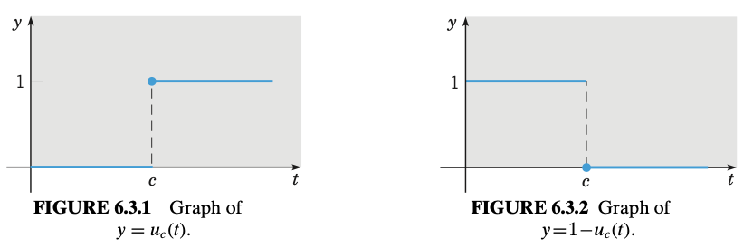
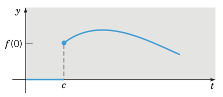
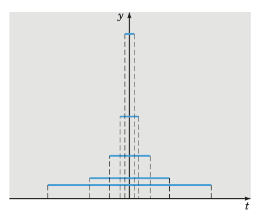

# Laplace Transform
{: .page-title}

> *Definition.*{: .def}
> An **integral transform** is a relation of the form
>
> $$
  F(s) = \int_\alpha^\beta K(s, t)f(t) \mathrm{d}t
  $$
>
> where $K(s, t)$ is a given function, called the **kernel** of the transformation,
> and the limits of integration $\alpha$ and $\beta$ are also given.

> *Definition.*{: .def}
> **[Laplace Transform]**
> Let $f(t)$ be given fo $t \ge 0$. Then the Laplace transform of $f$ is defined by
>
> $$
  \mathcal{L}\{f(t)\} = F(s) = \int_0^\infty e^{-st}f(t)\mathrm{d}t
  $$
>
> whenever this improper integral converges.

> *Theorem.*{: .thm}
> Suppose $f$ is piecewise continuous and $\vert f(t) \vert \le Ke^{at}$ when $t \ge M$.
> Then the Laplace transform $\mathcal{L}\\{f(t)\\}$ exists for $s > a$.

The Laplace transform of some important elementary functions are given in the following examples

> *Example.*{: .eg}
> Let $f(t) = 1$, $t \ge 0$. Then
>
> $$
  \mathcal{L}\{1\} = \int_0^\infty e^{-st} \mathrm{d}t = - \lim_{A \to \infty} \left[{e^{-st} \over s}\right]_0^A = {1 \over s}, \quad s > 0
  $$

> *Example.*{: .eg}
> Let $f(t) = e^{at}$, $t \ge 0$. Then
>
> $$
  \mathcal{L}\{e^{at}\} = \int_0^\infty e^{-(s - a)t} \mathrm{d}t = - \lim_{A \to \infty} \left[{e^{-(s - a)t} \over s - a}\right]_0^A = {1 \over s - a}, \quad s > a
  $$

> *Example.*{: .eg}
> Let $f(t) = \sin at$, $t \ge 0$. Then
>
> $$
  \mathcal{L}\{\sin at\} = {a \over a^2 + s^2}, \quad s > 0
  $$

> *Proposition.*{: .prop}
> The Laplace transform is a _linear operator_, i.e.
>
> $$
  \mathcal{L}\{\alpha f_1(t) + \beta f_2(t) \} = \alpha \mathcal{L}\{f_1(t)\} + \beta \mathcal{L}\{f_2(t)\}
  $$

> *Theorem.*{: .thm}
> Suppose that $f$ is continuous and $f'$ is piecewise continuous. Then
>
> $$
  \mathcal{L}\{f'(t)\} = s \mathcal{L}\{f(t)\} - f(0)
  $$
>
> *Proof.*{: .prf}
>
> Let $f'$ has $n$ points of discontinuity at $t_i$ and $t_0 = 0$ and $t_{n+1} = \infty$. By definition,
>
> $$
  \mathcal{L}\{f'(t)\} = \int_0^\infty e^{-st}f'(t)\mathrm{d}t = \sum_{i=0}^{n} \left[ e^{-st}f(t) \right]_{t_i}^{t_{i+1}} + s\int_0^\infty e^{-st}f(t)\mathrm{d}t
  $$
>
> As $f$ is continuous,
>
> $$
  \sum_{i=0}^{n} \left[ e^{-st}f(t) \right]_{t_i}^{t_{i+1}} = \left[ e^{-st}f(t) \right]_0^\infty = -f(0)
  $$
>
> Hence,
>
> $$
  \mathcal{L}\{f'(t)\} = s \mathcal{L}\{f(t)\} - f(0)
  $$

> *Corollary.*{: .cor}
> Suppose that $f'$ is continuous and $f''$ is piecewise continuous. Then
>
> $$
  \mathcal{L}\{f''(t)\} = s^2 \mathcal{L}\{f(t)\} - sf(0) - f'(0)
  $$
>
> In general,
>
> $$
  \mathcal{L}\{f^{(n)}(t)\} = s^n \mathcal{L}\{f(t)\} - s^{n-1}f(0) - \cdots - sf^{(n-2)}(0) - f^{(n-1)}(0)
  $$

The Laplace transform is useful for solving differential equations as it reduces the problem to an algebraic equation.

## Heaviside Functions

> *Definition.*{: .def}
> The **unit step function** or **Heaviside function**, denoted by $u_c$, is defined by
>
> $$
  u_c(t) = \begin{cases}
  0 & t < c, \\
  1 & t \ge c,
  \end{cases} \quad c \ge 0
  $$

> *Theorem.*{: .thm}
> If $F(s) = \mathcal{L}\\{f(t)\\}$ exists for $s > a \ge 0$ and if $c$ is a positive constant, then
>
> $$
  \mathcal{L}\{u_c(t)f(t - c)\} = e^{-cs}\mathcal{L}\{f(t)\} = e^{-cs}F(s), \quad s > a
  $$
>
> Conversely, if $f(t) = \mathcal{L}^{-1}\\{F(s)\\}$, then
>
> $$
  u_c(t)f(t - c) = \mathcal{L}^{-1}\{e^{-cs}F(s)\}
  $$
>
> *Proof.*{: .prf}
>
> $$
  \begin{align*}
  \mathcal{L}\{u_c(t)f(t - c)\} &= \int_0^\infty e^{-st}u_c(t)f(t - c) \mathrm{d}t \\
  &= \int_c^\infty e^{-st}f(t - c) \mathrm{d}t \\
  &= \int_0^\infty e^{-s(\tilde{t} + c)} f(\tilde{t}) \mathrm{d}\tilde{t} \\
  &= e^{-cs} \mathcal{L}\{f(t)\}
  \end{align*}
  $$

> *Corollary.*{: .cor}
> By taking $f(t) = 1$, we have
>
> $$
  \mathcal{L}(u_c(t)) = { e^{-cs} \over s}
  $$

A sketch of $y = u_c(t)f(t - c)$ is like this:

> *Theorem.*{: .thm}
> If $F(s) = \mathcal{L}\\{f(t)\\}$ exists for $s > a \ge 0$ and if $c$ is a constant, then
>
> $$
  \mathcal{L}\{e^{ct}f(t)\} = F(s - c), \quad s > a + c
  $$
>
> Conversely, if $f(t) = \mathcal{L}^{-1}\\{F(s)\\}$, then
>
> $$
  e^{ct}f(t) = \mathcal{L}^{-1}\{F(s - c)\}
  $$
>
> *Proof.*{: .prf}
>
> $$
  \begin{align*}
  \mathcal{L}\{e^{ct}f(t)\} &= \int_0^\infty e^{-(s-c)t}f(t) \mathrm{d}t \\
  &= \int_0^\infty e^{-\tilde{s}t}f(t) \mathrm{d}t \\
  &= F(\tilde{s}) = F(s - c)
  \end{align*}
  $$

## Impulse Functions

In some physical systems, we have to deal with phenomena of an impulsive nature, e.g. voltage or bouncing ball.

Consider the function

$$
d_\tau(t) = \begin{cases}
1/2\tau & -\tau < t < \tau \\
0 & t \le -\tau \text{ or } t \ge \tau \\
\end{cases}
$$

in which $\tau$ is a small positive constant.
To idealize the forcing function $d_\tau$, we make it acting in a shorter and shorter time interval, i.e.

$$
\lim_{\tau \to 0} d_\tau(t) = 0
$$

On the other hand, the total impulse by the forcing function is the integral

$$
I(\tau) = \int_{-\infty}^\infty d_\tau(t)\mathrm{d}t
$$

As long as $\tau \not = 0$, we have $I(\tau) = 1$. Therefore,

$$
\lim_{\tau \to 0} I(\tau) = 1
$$

> *Definition.*{: .def}
> A **unit impulse function** or **Dirac delta function**, denoted by $\delta(t)$, is defined by
>
> $$
  \delta(t) = 0, t \not= 0 \quad \text{and} \quad \int_{-\infty}^\infty \delta(t) \mathrm{d}t = 1
  $$

A unit impulse at $t = t_0$ is therefore given by

$$
\delta(t - t_0) = 0, t \not= t_0 \quad \text{and} \quad \int_{-\infty}^\infty \delta(t - t_0) \mathrm{d}t = 1
$$

> *Proposition.*{: .prop}
> The Laplace transform of $\delta(t - t_0)$ is
>
> $$
  \mathcal{L}\{\delta(t - t_0)\} = e^{-st_0}
  $$
>
> Hence, we have
>
> $$
  \mathcal{L}\{\delta(t)\} = \lim_{t_0 \to 0} e^{-st_0} = 1
  $$
>
> *Proof.*{: .prf}
>
> Consider the Laplace transform of $d_\tau(t - t_0)$, we have
>
> $$
  \begin{align*}
  \mathcal{L}\{d_\tau(t - t_0)\} &= \int_0^\infty e^{-st}d_\tau(t - t_0) \mathrm{d}t \\
  &= \int_{t_0 - \tau}^{t_0 + \tau} e^{-st}d_\tau(t - t_0) \mathrm{d}t \\
  &= {1 \over 2\tau} \int_{t_0 - \tau}^{t_0 + \tau} e^{-st} \mathrm{d}t \\
  &= -{1 \over 2s\tau} \left[ e^{-st} \right]_{t_0 - \tau}^{t_0 + \tau} \\
  &= {1 \over s\tau} \left( {e^{s\tau} - e^{-s\tau} \over 2} \right) e^{-st_0} \\
  &= {\sin s\tau \over s\tau} e^{-st_0}
  \end{align*}
  $$
>
> By definition of $\delta(t - t_0)$, we have
>
> $$
  \begin{align*}
  \mathcal{L}\{\delta(t - t_0)\} &= \lim_{\tau \to 0} \mathcal{L}\{d_\tau(t - t_0)\} \\
  &= \lim_{\tau \to 0} {\sin s\tau \over s\tau} e^{-st_0} \\
  &= e^{-st_0}
  \end{align*}
  $$

> *Proposition.*{: .prop}
> The integral of the product of delta function and any continuous function $f$ is
>
> $$
  \int_{-\infty}^\infty \delta(t - t_0)f(t)\mathrm{d}t = f(t_0)
  $$
>
> *Proof.*{: .prf}
>
> By the definition of delta function and mean value theorem for integrals, we have
>
> $$
  \begin{align*}
  \int_{-\infty}^\infty \delta(t - t_0)f(t)\mathrm{d}t
  &= \lim_{\tau \to 0} \int_{-\infty}^\infty d_\tau(t - t_0)f(t)\mathrm{d}t \\
  &= \lim_{\tau \to 0} {1 \over 2\tau} \int_{t_0 - \tau}^{t_0 + \tau} f(t)\mathrm{d}t \\
  &= \lim_{\tau \to 0} {1 \over 2\tau} 2\tau \cdot f(t^\ast) \\
  &= \lim_{\tau \to 0} f(t^\ast)
  \end{align*}
  $$
>
> As $t_0 - \tau < t^\ast < t_0 + \tau$ and $\tau \to 0$, $t^\ast \to t_0$.
> Hence,
>
> $$
  \int_{-\infty}^\infty \delta(t - t_0)f(t)\mathrm{d}t = f(t_0)
  $$

There is a subtle relationship between the Dirac delta function and Heaviside function.

> *Proposition.*{: .prop}
> The Heaviside function can be defined by
>
> $$
  u_0(x) = H(x) = \int_{-\infty}^x \delta(t) \mathrm{d}t
  $$
>
> Hence, by the F.T.C.,
>
> $$
  {\mathrm{d}H \over \mathrm{d}x} = \delta(x)
  $$

## References

* William E. Boyce _Elementary Differential Equations and Boundary Value Problems_, 2009 - Chapter 6
