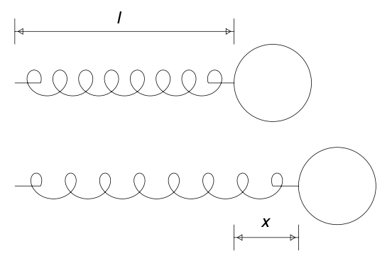
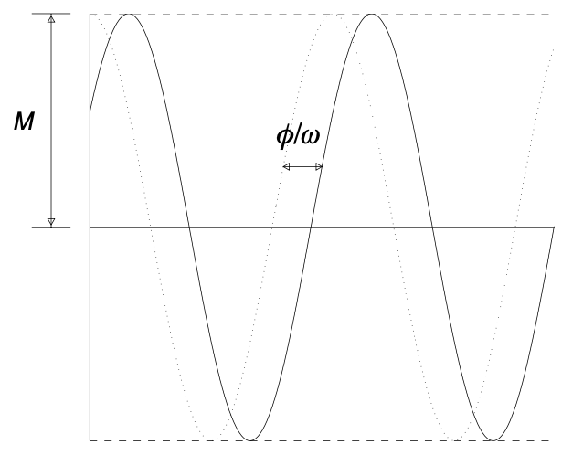
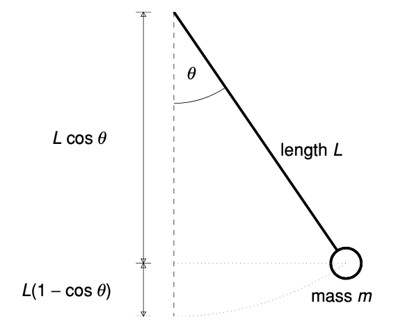

# Oscillations and Resonance
{: .page-title}

## Spring

The simplest system that give rise to oscillation is a mass on a spring.

> *Proposition.*{: .prop}
> **[Hooke's Law]**
> If a spring has natural length $l$, then the force exerted by the spring
> when it is extended an additional length $x$ is proportional to this extension $x$, i.e.
>
> $$
  mx'' = -kx
  $$
>
> where $k$ is the spring constant.

> *Proposition.*{: .prop}
> By dividing both side by $m$ and setting $\omega^2 = k/m$, we have
>
> $$
  x'' = -\omega^2 x
  $$
>
> The characteristic equation of the homogeneous linear differential equation is
>
> $$
  k^2 + \omega^2 = 0
  $$
>
> which has complex roots $k = \pm i\omega$.
>
> Hence, the general solution is of the form
>
> $$
  x(t) = A \cos \omega t + B \sin \omega t
  $$

> *Proposition.*{: .prop}
> The solution can be rewritten as one oscillation, i.e.
>
> $$
  x(t) = M \cos(\omega t - \phi)
  $$
>
> where $M = \sqrt{A^2 + B^2}$ and $\tan \phi = B/A$.
>
> *Proof.*{: .prf}
>
> Let $A = \cos \phi$ and $B = \sin \phi$ and use the double angle formula
>
> $$
  \cos\phi \cos\omega t + \sin\phi \sin\omega t = \cos(\omega t - \phi)
  $$

## Pendulum

The oscillation of a simple pendulum is also a good example of second order ODE.

> *Proposition.*{: .prop}
> Suppose the pendulum has length $L$ that the bob has mass $m$.
> Let $\theta$ be the angle that the pendulum makes with the downward vertical.
>
> The potential energy of the pendulum is $mg \times L(1 - \cos \theta)$.
> If the pivot is the origin, then the position of the centre of mass is $\mathbf{p} = (L\sin\theta, L\cos\theta)$
> and the velocity is $\mathbf{v} = \mathbf{p}' = (L\cos\theta \times \theta', -L\sin\theta \times \theta')$.
> Therefore, the kinetic energy is
>
> $$
  {1 \over 2}m|\mathbf{v}|^2 = {1 \over 2}mL^2(\cos^2\theta + \sin^2\theta)(\theta')^2 = {1 \over 2}mL^2(\theta')^2
  $$
>
> Since the total energy
>
> $$
  E = {1 \over 2}mL^2(\theta')^2 + mgL(1 - \cos\theta)
  $$
>
> is constant, if we differentiate both side by $\theta$, we have
>
> $$
  0 = mL^2\theta'\theta'' + mgL\sin\theta\theta'
  $$
>
> Hence, by dividing the equation by $\theta'$, we have the equation of motion
>
> $$
  m {\mathrm{d}^2 \theta \over \mathrm{d} t^2} = - {mg \over L} \sin \theta
  $$

> *Proposition.*{: .prop}
> When the oscillations are small, i.e. $\theta$ is small, we have $\sin \theta \approx \theta$.
> Therefore, let $\omega^2 = g/L$, we have
>
> $$
  {\mathrm{d}^2 \theta \over \mathrm{d} t^2} = - \omega^2 \theta
  $$
>
> Hence, similar to the spring, we have
>
> $$
  \theta(t) = M \cos(\omega t - \phi)
  $$

> *Proposition.*{: .prop}
> The period of oscillations is $2\pi/\omega = 2\pi\sqrt{L/g}$.

## References

* James C. Robinson _An Introduction to Ordinary Differential Equations_, 2004 - Chapter 13
