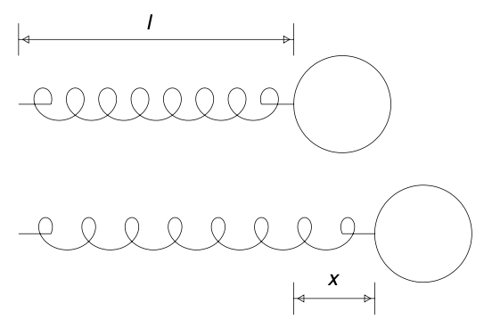
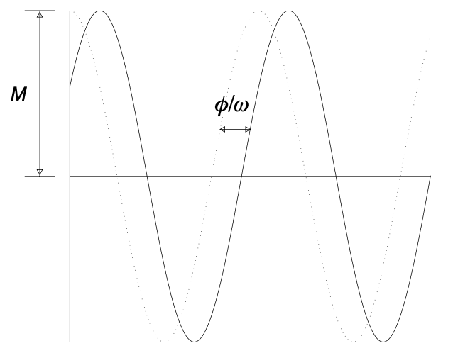
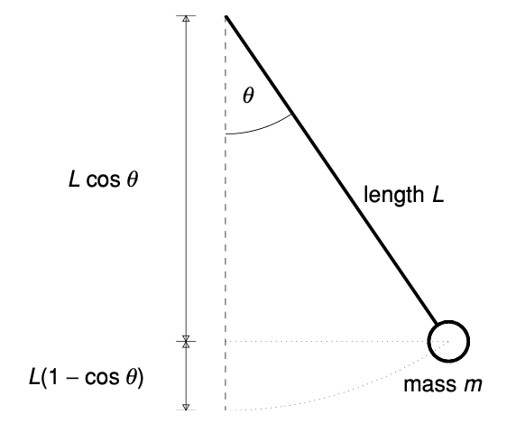
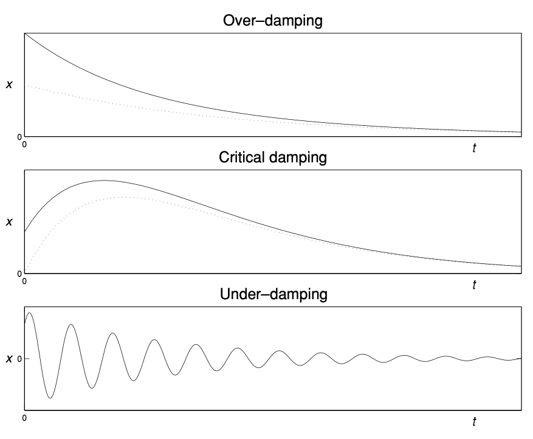
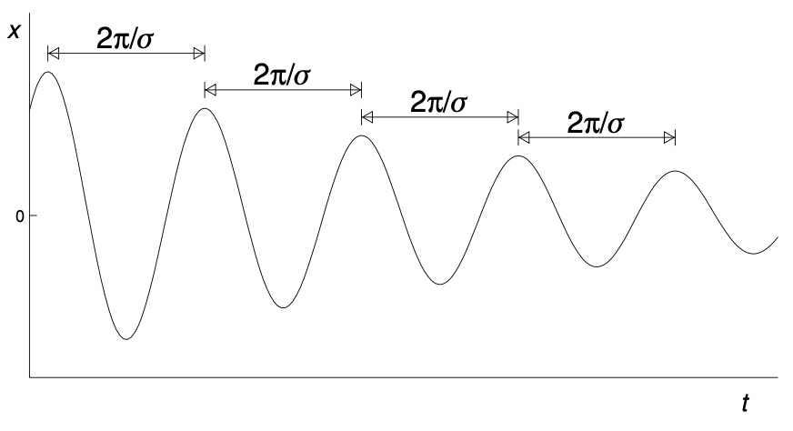
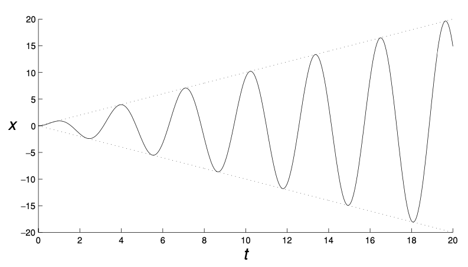
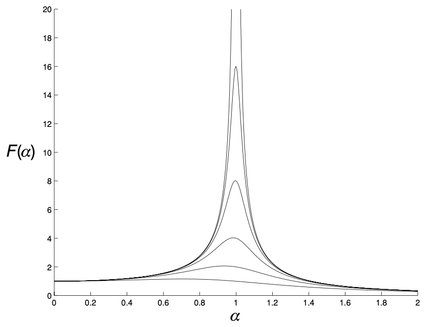

# Oscillations and Resonance
{: .page-title}

## Spring

The simplest system that give rise to oscillation is a mass on a spring.

> *Proposition.*{: .prop}
> **[Hooke's Law]**
> If a spring has natural length $l$, then the force exerted by the spring
> when it is extended an additional length $x$ is proportional to this extension $x$, i.e.
>
> $$
  mx'' = -kx
  $$
>
> where $k$ is the spring constant.

> *Proposition.*{: .prop}
> By dividing both side by $m$ and setting $\omega^2 = k/m$, we have
>
> $$
  x'' = -\omega^2 x
  $$
>
> The characteristic equation of the homogeneous linear differential equation is
>
> $$
  k^2 + \omega^2 = 0
  $$
>
> which has complex roots $k = \pm i\omega$.
>
> Hence, the general solution is of the form
>
> $$
  x(t) = A \cos \omega t + B \sin \omega t
  $$

> *Proposition.*{: .prop}
> The solution can be rewritten as one oscillation, i.e.
>
> $$
  x(t) = M \cos(\omega t - \phi)
  $$
>
> where $M = \sqrt{A^2 + B^2}$ and $\tan \phi = B/A$.
>
> *Proof.*{: .prf}
>
> Let $A = \cos \phi$ and $B = \sin \phi$ and use the double angle formula
>
> $$
  \cos\phi \cos\omega t + \sin\phi \sin\omega t = \cos(\omega t - \phi)
  $$

## Pendulum

The oscillation of a simple pendulum is also a good example of second order ODE.

> *Proposition.*{: .prop}
> Suppose the pendulum has length $L$ that the bob has mass $m$.
> Let $\theta$ be the angle that the pendulum makes with the downward vertical.
>
> The potential energy of the pendulum is $mg \times L(1 - \cos \theta)$.
> If the pivot is the origin, then the position of the centre of mass is $\mathbf{p} = (L\sin\theta, L\cos\theta)$
> and the velocity is $\mathbf{v} = \mathbf{p}' = (L\cos\theta \times \theta', -L\sin\theta \times \theta')$.
> Therefore, the kinetic energy is
>
> $$
  {1 \over 2}m|\mathbf{v}|^2 = {1 \over 2}mL^2(\cos^2\theta + \sin^2\theta)(\theta')^2 = {1 \over 2}mL^2(\theta')^2
  $$
>
> Since the total energy
>
> $$
  E = {1 \over 2}mL^2(\theta')^2 + mgL(1 - \cos\theta)
  $$
>
> is constant, if we differentiate both side by $\theta$, we have
>
> $$
  0 = mL^2\theta'\theta'' + mgL\sin\theta\theta'
  $$
>
> Hence, by dividing the equation by $\theta'$, we have the equation of motion
>
> $$
  m {\mathrm{d}^2 \theta \over \mathrm{d} t^2} = - {mg \over L} \sin \theta
  $$

> *Proposition.*{: .prop}
> When the oscillations are small, i.e. $\theta$ is small, we have $\sin \theta \approx \theta$.
> Therefore, let $\omega^2 = g/L$, we have
>
> $$
  {\mathrm{d}^2 \theta \over \mathrm{d} t^2} = - \omega^2 \theta
  $$
>
> Hence, similar to the spring, we have
>
> $$
  \theta(t) = M \cos(\omega t - \phi)
  $$

> *Proposition.*{: .prop}
> The period of oscillations is $2\pi/\omega = 2\pi\sqrt{L/g}$.

## Damping

Damping occurs when we take into account effects of friction or air resistance.

> *Proposition.*{: .prop}
> The damping exerts a force proportional to the velocity but in opposite direction, i.e.
>
> $$
  mx'' + \mu x' + kx = 0
  $$
>
> where $\mu > 0$. Dividing both side by $m$ and let $\lambda = \mu / m$, we have
>
> $$
  x'' + \lambda x' + \omega^2 x = 0
  $$
>
> The roots of the characteristic equation are
>
> $$
  k = {- \lambda \pm \sqrt{\lambda^2 - 4 \omega^2} \over 2}
  $$
>
> which gives rise to three possibilities depending on the nature of the roots.

{: .size-2x}

> *Definition.*{: .def}
> **[Over-damping]**
> When $\lambda > 4\omega^2$, there are two distinct real roots $-k_1$ and $-k_2$ and both are negative since $0 < \lambda^2 - 4 \omega^2 < \lambda^2$.
> The general solution is
>
> $$
  x(t) = Ae^{-k_1 t} + Be^{-k_2 t}
  $$
>
> and all solutions are expontentially decaying and approach zero as $t \to \infty$.
> There are no oscillations on its way to equilibrium.

> *Definition.*{: .def}
> **[Critical damping]**
> When $\lambda = 4\omega^2$, there is one repeated root $k = -\lambda / 2$.
> The general solution is
>
> $$
  x(t) = (A + Bt)e^{-\lambda t/2}
  $$
>
> Similarily, the system settles down to equilibrium without any oscillations.
> However, this is the critical case in that any further reduction in the damping allows for oscillations.

> *Definition.*{: .def}
> **[Under-damping]**
> When $\lambda < 4\omega^2$, there are two complex roots
>
> $$
  k = -{\lambda \over 2} \pm i \sigma
  $$
>
> where $\sigma = \sqrt{4\omega^2 - \lambda^2}/2$.
> The general solution is
>
> $$
  x(t) = e^{-\lambda t/2}(A \cos \sigma t + B \sin \sigma t)
  $$
>
> The system is always oscillating, but the amplitude of the oscillations decays to zero expontentially fast.

> *Proposition.*{: .prop}
> In case of under-damping, the period of oscillations remains constant though the amplitude decays.
>
> *Proof.*{: .prf}
>
> Rewrite the general solution as $x(t) = M e^{-\lambda t/2} \cos (\sigma t - \phi)$.
> Differentiate both side with respect to $t$, i.e.
>
> $$
  {\mathrm{d} x \over \mathrm{d} t} = -M {\lambda \over 2} e^{-\lambda t/2} \cos (\sigma t - \phi) - \sigma M e^{-\lambda t/2} \cos (\sigma t - \phi)
  $$
>
> The maxima and minima occur when $x' = 0$, i.e.
>
> $$
  \tan(\sigma t - \phi) = -{\lambda \over 2 \sigma} \quad \implies \quad \sigma t - \phi = \tan^{-1} \left( - {\lambda \over 2\sigma} \right) + n\pi
  $$
>
> Hence, the time between successive maxima is $2\pi / \sigma$, independent of the amplitude.

## Resonance

Resonance is the study of oscillating system with an external forcing that is also oscillating, i.e.

$$
x'' + \omega^2 x = a \cos \alpha t
$$

> *Proposition.*{: .prop}
> If the system is forced at a frequency that differs from its own natural frequency, i.e. $\alpha \not= \omega$,
> then there is no resonance and the general solution is
>
> $$
  x(t) = M \cos(\omega t - \phi) + {a \over \omega^2 - \alpha^2} \cos \alpha t
  $$
>
> Hence, the motion is a combination of two oscillations at two frequencies.
>
> *Proof.*{: .prf}
>
> It is a inhomogenerous differential equation.
> By trying $x_p(t) = C \cos \alpha t$, we get
>
> $$
  C = {a \over \omega^2 - \alpha^2}
  $$

From the solution, we can see that the amplitude of the second term increases when $\alpha$ gets closer to $\omega$. Therefore,

> *Proposition.*{: .prop}
> When $\alpha = \omega$, the amplitude of the resulting oscillations grows linearly.
> The general solution is
>
> $$
  x(t) = C \sin \omega t + D \cos \omega t + {a \over 2 \omega} t \sin \omega t
  $$
>
> *Proof.*{: .prf}
>
> As the forcing term is a solution solving the homonogenerous equation,
> we have to try $x_p(t) = C \omega \cos \omega t + D \omega \sin \omega t$ as the particular integral.
> Hence,
>
> $$
  x_p(t) = {a \over 2\omega}t\sin \omega t
  $$

The response by the system is unbounded and result with ideal resonance.

In the real world, there is almost invariably some damping in the system so ideal resonance is not possible.
However, there will still be frequency at which the amplitude of the resulting oscillations is significantly larger than the amplitude of the forcing.

> *Proposition.*{: .prop}
> Consider a oscillating system with damping and external forcing, i.e.
>
> $$
  x'' + \lambda x' + \omega^2 x = a \cos \alpha t
  $$
>
> where $\lambda$ is strictly positive and $\lambda^2 < 4 \omega^2$, so that the oscillating system is under-damping.
>
> The maximum response occurs at $\alpha^2 = \omega^2 - \lambda^2/2$ and the maximum value of amplitude is
>
> $$
  R_{\text{max}}(\lambda) = {2a \over \lambda \sqrt{4\omega^2 - \lambda^2}}
  $$
>
> *Proof.*{: .prf}
>
> Assume $x_p(t) = C \cos \alpha t + D \sin \alpha t$, we have
>
> $$
  x_p(t) = {a(\omega^2 - \alpha^2) \over (\omega^2 - \alpha^2)^2 + (\lambda\alpha)^2} \cos \alpha t + {a\lambda\alpha \over (\omega^2 - \alpha^2)^2 + (\lambda\alpha)^2} \sin \alpha t
  $$
>
> By combinating the two terms, the amplitude of the response is
>
> $$
  R(\alpha) = {a \over \sqrt{(\omega^2 - \alpha^2)^2 + (\lambda\alpha)^2}}
  $$
>
> The response is at maximum value when the denominator is at minimum, therefore
>
> $$
  {\mathrm{d} \over \mathrm{d} \alpha} [(\omega^2 - \alpha^2)^2 + (\lambda\alpha)^2] = -4\alpha(\omega^2 - \alpha^2)^2 + 2\lambda^2\alpha = 0
  $$
>
> which implies $\alpha^2 = \omega^2 - \lambda^2/2$. Thus, the smaller the damping $\lambda$, the maximum response will happen when $\alpha$ is close to $\omega$.
> The maximum value of the response, which increases as $\lambda$ decreases, is
>
> $$
  R_{\text{max}}(\lambda) = {2a \over \lambda \sqrt{4\omega^2 - \lambda^2}}
  $$

{: .size-2x}

## References

* James C. Robinson _An Introduction to Ordinary Differential Equations_, 2004 - Chapter 13, 15
