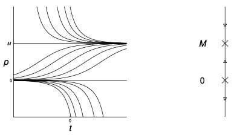

# Practical Examples
{: .page-title}

## Radioactive Decay

Let $N(t)$ denote the number of radioactive atoms in some material at time $t$. Then,

$$
{\mathrm{d}N \over \mathrm{d}t} = -kN
$$

is a good model to describe the number of radioactive atoms decays.
Solving the ODE we have

$$
\begin{align*}
\int {\mathrm{d}N \over N} &= \int -k \mathrm{d}t \\
\ln N &= -kt + C \\
N &= A e^{-kt}
\end{align*}
$$

Let $N_s$ be the number of isotopes at time $s$, then $A = N_s e^{ks}$. Hence,

> *Proposition.*{: .prop}
> Suppose the number of isotopes at time $s$ is $N_s$. Then, at time $t$, the number of isotopes is
>
> $$
  N(t) = N_s e^{-k(t - s)}
  $$

> *Proposition.*{: .prop}
> The **half life** of an atom, which is the time it takes for half of the radioactive isotopes to decay, is
>
> $$
  \begin{align*}
  {N_0 \over 2} &= N_0 e^{-kt_h} \\
  t_h &= {\ln 2 \over k}
  \end{align*}
  $$

Note that this time does not depend on the initial number of radioactive atoms.

## Carbon Dating

The essence of the method is that for living matter, the carbon-14 to carbon-12 ratio is constant.
But once dead, the carbon-14 atoms will begin to decay.
Since the half life of carbon 14 is 5700 years, we have $k = \ln 2 / 5700 \approx 1.216 \times 10^{-4}$.

> *Proposition.*{: .prop}
> Given a sample at $t_0$ contains only a fraction $p$ of the initial level of carbon 14 $N_s$ (not necessary to know $N_s$).
> Then the year $s$ from which the sample dates is given by
>
> $$
  \begin{align*}
  p N_s &= N_s e^{-k(t_0 - s)} \\
  s &= t_0 + {\ln p \over k}
  \end{align*}
  $$

> *Example.*{: .eg}
> Fibres from the Shroud of Turin were found to contain about 92% of the level in living matter in 1988.
> Therefore,
>
> $$
  s = 1988 + {\ln 0.92 \over 0.0001216} \approx 1302
  $$

## Population Model
{: #population-model}

> *Proposition.*{: .prop}
> Instead of pure expoential growth, we impose a maximum sustainable size of the population (e.g. becaue of limitation of resources).
> We can use the _logistic equation_ to model the population growth, i.e.
>
> $$
  {\mathrm{d}p \over \mathrm{d} t} = kp \left( 1 - {p \over M} \right)
  $$
>
> where $M > 0$ is the maximum sustainable population.

> *Example.*{: .eg}
> For the logistic equation, the equilibria are the solution of
>
> $$
  {\mathrm{d}p \over \mathrm{d} t} = kp \left( 1 - {p \over M} \right) = 0 \implies p = 0, M
  $$
>
> As $p = 0$ is unstable and $p = M$ is stable, we have the following plot of different solutions of the equation
>
> 

> *Example.*{: .eg}
> To find an explicit solution, by separating varaibles, we have
>
> $$
  \begin{align*}
  \int_{p_0}^{p} {M \over p(M - p)} \mathrm{d}p &= \int_{t_0}^t k \, \mathrm{d}t \\
  \int_{p_0}^{p} {1 \over p} + {1 \over (M - p)} \mathrm{d}p &= \int_{t_0}^t k \, \mathrm{d}t \\
  \ln p - \ln p_0 - \ln |M-p| + \ln |M - p_0| &= kt - kt_0 \\
  {p |M - p_0| \over p_0 |M-p|} &= e^{k(t - t_0)}
  \end{align*}
  $$
>
> As $\|M - p_0\|$ and $\|M - p\|$ always has the same sign base on the equation,
> we can remove the absolute sign and rearrange the terms, i.e.
>
> $$
  p(t) = M \left( {p_0e^{k(t - t_0)} \over M - p_0 + p_0e^{k(t - t_0)} } \right)
  $$
>
> From the solution, we can deduce that $p \to M$ as $t \to \infty$.

## Terminal Velocity

> *Proposition.*{: .prop}
> Suppose that a body of mass $m$ is falling under gravity $g$ and is subject to an air resistance proportional to the square of its velocity, i.e. $kv^2$.
> The equation for the downward velocity $v$ is
>
> $$
  m{\mathrm{d} v \over \mathrm{d} t} = mg - kv^2
  $$

> *Example.*{: .eg}
> By rewriting it as
>
> $$
  {\mathrm{d} v \over \mathrm{d} t} = g - {k \over m}v^2
  $$
>
> There is an equilibrium at $v = \sqrt{mg/k}$ and is stable.
> Hence, we can find the terminal velocity without solving the equation, which is
>
> $$
  v_{\text{terminal}} = \sqrt{mg \over k}
  $$

## Newton's Law of Cooling

> *Proposition.*{: .prop}
> The temperature $T(t)$ of an object in surroundings of temperature $A(t)$ can be modeled by
>
> $$
  {\mathrm{d} T \over \mathrm{d} t} = -k(T(t) - A(t))
  $$
>
> where $k > 0$ measures the rate that heat is absorted/emitted by the object.

In case of constant surrounding temperature $A$, we have

$$
{\mathrm{d} T \over \mathrm{d} t} + kT = kA
$$

The integrating factor is $e^{kt}$. Suppose we know the temperatures of the object at $t_1$ and $t_2$, integrating both side with that give us

$$
\begin{align*}
\int_{t_1}^{t_2} {\mathrm{d} \over \mathrm{d}t} \left( Te^{kt} \right) \mathrm{d}t &= \int_{t_1}^{t_2} kAe^{kt} \mathrm{d}t \\
T(t_2)e^{kt_2} - T(t_1)e^{kt_1} &= A(e^{kt_2} - e^{kt_1}) \\
T(t_2) - A &= (T(t_1) - A)e^{-k(t_2 - t_1)}
\end{align*}
$$

Hence, we can solve for $k$ and estimate the temperature at other time $t$.

In case of varying surrounding temperature, similarily, we have

$$
\begin{align*}
\int_{0}^{t} {\mathrm{d} \over \mathrm{d}t} \left( Te^{kt} \right) \mathrm{d}t &= \int_{0}^{t} kA(t)e^{kt} \mathrm{d}t \\
T(t)e^{kt} - T(0) &= k \int_{0}^{t} A(t)e^{kt} \mathrm{d}t \\
T(t) &= T(0)e^{-kt} + ke^{-kt} \int_{0}^{t} A(t)e^{kt} \mathrm{d}t \\
\end{align*}
$$

One way to model the varying temperature is as a regular oscillation about an average temperature $\mu$, i.e.

$$
A(t) = \mu + a \cos \omega t
$$

### Combining two oscillating terms

## Oscillation

## Resonance

## References

* James C. Robinson _An Introduction to Ordinary Differential Equations_, 2004 - Chapter 1, 8.5, 9.4, 13, 16
