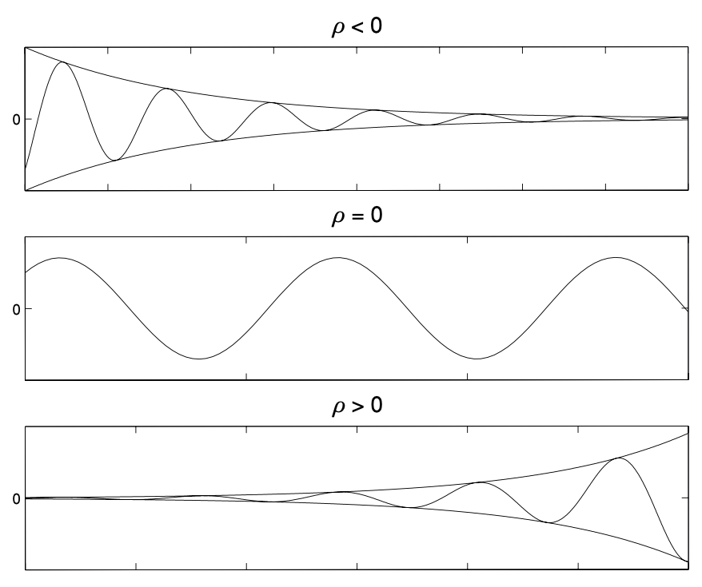

# Second Order Ordinary Differential Equations
{: .page-title}

## Existence and Uniqueness

> *Theorem.*{: .thm}
> Given a function $f(x_2, x_1, t)$.
> Suppose that $f$, $\partial f / \partial x_1$ and $\partial f / \partial x_2$ are continuous functions
> for $a_1 < x_1 < a_2$, $b_1 < x_2 < b_2$ and $t_1 < t < t_2$.
> Then for all initial conditions
>
> $$
  x(t_0) = x_0 \quad \text{and} \quad x'(t_0) = y_0
  $$
>
> with $a_1 < x_0 < x_2$, $b_1 < y_0 < b_2$ and $t_1 < t_0 < t_2$ there exists a unique solution of
>
> $$
  x'' = f(x', x, t)
  $$
>
> on some interval $I$ containing $t_0$, i.e. a continuous function with two continuous derivatives satisfying
> the the initial conditions and the differential equation on $I$.

## Linearity

> *Proposition.*{: .prop}
> The differential operator $L$ defined by
>
> $$
  L[x](t) = {\mathrm{d}^2x \over \mathrm{d}t^2}(t) + p(t) {\mathrm{d}x \over \mathrm{d}t}(t) + q(t)x(t)
  $$
>
> is linear.
>
> *Proof.*{: .prf}
>
> Consider a homogeneous second order linear differential equation
>
> $$
  {\mathrm{d}^2x \over \mathrm{d}t^2} + p(t) {\mathrm{d}x \over \mathrm{d}t} + q(t) x = 0
  $$
>
> which is equivalent to
>
> $$
  L[x] = 0
  $$
>
> Suppose $x_1$ and $x_2$ are two solutions to the equation, for all $\alpha, \beta \in \mathbb{R}$, we have
>
> $$
  \begin{align*}
  L[\alpha x_1 + \beta x_2]
  &= {\mathrm{d}^2 \over \mathrm{d}t^2}(\alpha x_1 + \beta x_2) + p(t) {\mathrm{d} \over \mathrm{d}t}(\alpha x_1 + \beta x_2) + q(t) (\alpha x_1 + \beta x_2) \\
  &= \alpha \left[ {\mathrm{d}^2 x_1 \over \mathrm{d}t^2} + p(t) {\mathrm{d} x_1 \over \mathrm{d}t} + q(t) x_1) \right]
     + \beta \left[ {\mathrm{d}^2 x_2 \over \mathrm{d}t^2} + p(t) {\mathrm{d} x_2 \over \mathrm{d}t} + q(t) x_2) \right] \\
  &= \alpha L[x_1] + \beta L[x_2] = 0
  \end{align*}
  $$
>
> so $\alpha x_1 + \beta x_2$ is also a solution.
> Hence, $L$ is linear.

## Linear Independence of Functions

> *Definition.*{: .def}
> The functions $x_1(t), ..., x_n(t)$ are **linearly independent** on an interval $I$ if
>
> $$
  a_1x_1(t) + \cdots + a_nx_n(t) = 0 \quad \implies \quad a_1 = \cdots = a_n = 0
  $$

> *Proposition.*{: .prop}
> Two linearly independent solutions are necessary and sufficient to obtain all possible solutions of homogeneous second order ODE.
>
> *Proof.*{: .prf}
>
> Given a homogeneous second order ODE.
> Suppose $x_1(t)$ is the solution satisfying
>
> $$
  x_1(t_0) = 1 \quad \text{and} \quad x_1'(t_0) = 0
  $$
>
> and $x_2(t)$ is the solution satisfying
>
> $$
  x_2(t_0) = 0 \quad \text{and} \quad x_1'(t_0) = 1
  $$
>
> By the existence and uniqueness theorem, both should exist but one cannot be a multiple of the other.
> Hence, at least two linearly independent solutions are necessary.
>
> Given two solutions that are linearly independent like above and for any given initial condition
>
> $$
  x(t_0) = x_0 \quad \text{and} \quad x'(t_0) = x_0'
  $$
>
> We have the following system of linear equations
>
> $$
  \begin{pmatrix}
  x_1(t_0) & x_2(t_0) \\
  x_1'(t_0) & x_2'(t_0) \\
  \end{pmatrix}
  \begin{pmatrix}
  \alpha \\
  \beta
  \end{pmatrix}
  =
  \begin{pmatrix}
  x_0 \\
  x_0'
  \end{pmatrix}
  $$
>
> As the two solutions are linearly independent, the system has a unique solution.
> Hence, two linearly independent solutions are sufficient to form any solution.

## The Wronskian

> *Definition.*{: .def}
> The **Wronskian** of two functions $x_1(t)$ and $x_2(t)$ is defined by
>
> $$
  W[x_1, x_2](t) = \begin{vmatrix} x_1(t) & x_2(t) \\ x_1'(t) & x_2'(t) \end{vmatrix} = x_1(t)x_2'(t) - x_2(t)x_1'(t)
  $$

> *Proposition.*{: .prop}
> The function $x_1$ and $x_2$ are linearly independent on an interval $I$ iff their Wronskian $W\[x_1, x_2\](t) \not \equiv 0$ on $I$.
> Hence, if $W\[x_1, x_2\](t) = 0$ for any $t \in I$, then $x_1$ and $x_2$ are linearly dependent.
>
> *Proof.*{: .prf}
>
> Given a homogeneous second order differential equation
>
> $$
  {\mathrm{d}x \over \mathrm{d}t^2} + p(t) {\mathrm{d}x \over \mathrm{d}t} + q(t)x = 0
  $$
>
> with two solutions $x_1$ and $x_2$. Then
>
> $$
  W(t) = x_1(t)x_2'(t) - x_2(t)x_1'(t) \quad \text{and} \quad W'(t) = x_1(t)x_2''(t) - x_1''(t)x_2(t)
  $$
>
> and we have
>
> $$
  \begin{align*}
  W'(t) + p(t)W(t) &= x_1(t) [x_2''(t) + p(t)x_2'(t)] - x_2(t) [x_1''(t) + p(t)x_1'(t)] \\
  &= x_1(t)[-q(t)x_2(t)] - x_2(t)[-q(t)x_1(t)] \\
  &= 0
  \end{align*}
  $$
>
> Therefore, we have the Wronskian satisfying the differential equation
>
> $$
  W'(t) = -p(t)W(t)
  $$
>
> If $W(t) = 0$, $W'(t) = 0$, then $W(t) \equiv 0$ for all $t \in I$.
>
> If $W(t) \not = 0$, $\vert W(t) \vert = e^{\int -p(t) \mathrm{d}t}$, then $W(t) \not = 0$ for all $t \in I$.

## Homogeneous + Linear + Constant Coefficient

> *Proposition.*{: .prop}
> Consider a differential equation of the form
>
> $$
  ax'' + bx' + c = 0
  $$
>
> Let $x(t) = e^{kt}$ be the solution. Then
>
> $$
  (ak^2 + bk + c) e^{kt} = 0
  $$
>
> Since $e^{kt}$ is non-zero, we can divide both side with that and end up with a quadratic equation
>
> $$
  ak^2 + bk + c = 0
  $$
>
> which is called the **auxiliary/characteristic equation**.

> *Proposition.*{: .prop}
> If the characteristic equation has two real roots $k_1$ and $k_2$, then the general solution is
>
> $$
  x(t) = Ae^{k_1 t} + Be^{k_2 t}
  $$

> *Proposition.*{: .prop}
> If the characteristic equation has one repeated root $k$, then the general solution is
>
> $$
  x(t) = (A + Bt)e^{kt}
  $$

> *Proposition.*{: .prop}
> If the characteristic equation has two complex roots $k = \rho \pm \omega i$, then the general solution is
>
> $$
  x(t) = e^{\rho t}(A \cos \omega t + B \sin \omega t)
  $$
>
> *Proof.*{: .prf}
>
> The complex roots can be handled just like they are real, i.e.
>
> $$
  x(t) = Ce^{(\rho + \omega i)t} + De^{(\rho - \omega i)t}
  $$
>
> We want to restrict the solutions to be real.
> As $e^{(\rho - \omega i)t}$ is the complex conjugate of $e^{(\rho + \omega i)t}$,
> by having $D$ being complex comjungate of $C$, we will restrict the right hand side to be real as well.
>
> Therefore, let $C = \alpha + \beta i$,
>
> $$
  \begin{align*}
  x(t) &= 2 \text{Re}[Ce^{(\rho + \omega i)t}] \\
  &= 2e^{\rho t} \text{Re}[(\alpha + \beta i)(\cos \omega t + i \sin \omega t)] \\
  &= 2e^{\rho t} (\alpha \cos \omega t - \beta \sin \omega t) \\
  &= e^{\rho t} (A \cos \omega t + B \sin \omega t)
  \end{align*}
  $$

We can further combine $A \cos \omega t + B \sin \omega t$ to one oscillating term $M \cos (\omega t - \theta)$,
the amplitude is controlled by the sign of $\rho$.
If $\rho < 0$, the solution decays to $0$.
If $\rho = 0$, we have pure oscillations.
If $\rho > 0$, the solution grows exponentially fast.

## Inhomogeneous + Linear + Constant Coefficients

> *Proposition.*{: .prop}
> Consider a differential equation of the form
>
> $$
  L[x] = ax'' + bx' + cx = f(t)
  $$
>
> Let $x_1$ and $x_2$ be two linearly independent solutions for the equation $L[x] = 0$
> and $x_p$ be a particular solution of $L[x] = f(t)$.
> Then the general solution for the differential equation is
>
> $$
  x(t) = Ax_1(t) + Bx_2(t) + x_p(t)
  $$

> *Definition.*{: .def}
> $x_h(t) = Ax_1(t) + Bx_2(t)$ is called the **complimentary function** and
> $x_p(t)$ is called the **particular integral**.

Finding $x_p$ involves some educated guess. Common choices are

| $f(t)$                                       | $x_p(t)$                            |
| $t^n$                                        | $c_nt^n + \cdots + c_0$             |
| $ce^{kt}$                                    | $Ce^{kt}$                           |
| $\alpha \sin \sigma t + \beta \cos \sigma t$ | $C \sin \sigma t + D \sin \sigma t$ |

In case $x_p(t)$ is one of the solution in $x_h(t)$, we can multiply it by $t$ or $t^2$ to form a new particular integral.

If $f(t) = \alpha f_1(t) + \beta f_2(t)$, then $x_p = \alpha x_{p1} + \beta x_{p2}$.

If $f(t) = f_1(t)f_2(t)$, then $x_p = x_{p1}x_{p2}$. For example, the particular integral for $f(t) = te^{-t}\cos 2t$ is

$$
x_p(t) = (At + B)e^{-t}\cos 2t + (Ct + D)e^{-t}\sin 2t
$$

## Reduction of Order

This is the technique for finding the second linearly independent solution in case we already know one.

> *Proposition.*{: .prop}
> For the case of having coefficients as functions of $t$, i.e.
>
> $$
  a(t){\mathrm{d}^2 x \over \mathrm{d}t^2} + b(t){\mathrm{d}x \over \mathrm{d}t} + c(t)x = 0
  $$
>
> If we happen to know one solution $u(t)$ of the equation, let $x(t) = u(t)y(t)$, we have
>
> $$
  x' = u'y + uy' \quad \text{and} \quad x'' = u''y + 2u'y' + uy''
  $$
>
> Substituding it back and grouping the terms containing $y$, we have
>
> $$
  \begin{align*}
  y[a(t)u'' + b(t)u' + c(t)u] + y'[2a(t)u' + b(t)u] + y''[a(t)u] &= 0 \\
  y'[2a(t)u' + b(t)u] + y''[a(t)u] &= 0
  \end{align*}
  $$
>
> Thus, by putting $z = y'$
>
> $$
  [a(t)u(t)]z' + [2a(t)u'(t) + b(t)u(t)]z = 0
  $$
>
> which is a first order differential equation that can be solved by the method of integrating factors.

## Variation of Parameters

This is the technique for finding the particular integral in case we already know two linear independent solutions of the homogeneous equation.

> *Proposition.*{: .prop}
> Consider a differential equation
>
> $$
  {\mathrm{d}^2 x \over \mathrm{d}t^2} + p(t){\mathrm{d}x \over \mathrm{d}t} + q(t)x = f(t)
  $$
>
> If we know two linearly independent solutions $x_1(t)$ and $x_2(t)$ for the homogeneous problem, let
>
> $$
  x_p(t) = u_1(t)x_1(t) + u_2(t)x_2(t)
  $$
>
> which is like by changing the constants $A$ and $B$ of the general solution to unknown functions $u_1(t)$ and $u_2(t)$. Then
>
> $$
  x_p'(t) = u_1'(t)x_1(t) + u_1(t)x_1'(t) + u_2'(t)x_2(t) + u_2(t)x_2'(t)
  $$
>
> In order to keep the second derivative manageable, we impose the condition that
>
> $$
  u_1'x_1 + u_2'x_2 = 0
  $$
>
> Thus,
>
> $$
  x_p''(t) = u_1(t)x_1''(t) + u_1'(t)x_1'(t) + u_2'(t)x_2'(t) + u_2(t)x_2''(t)
  $$
>
> Substituding them back to the original equation to get
>
> $$
  u_1[x_1'' + p(t)x_1' + q(t)x_1] + u_2[x_2'' + p(t)x_2' + q(t)x_2] + u_1'x_1' + u_2'x_2' = f(t)
  $$
>
> As $x_1$ and $x_2$ are the solutions of the homogeneous equation, we have
>
> $$
  u_1'x_1' + u_2'x_2' = 0
  $$
>
> Therefore, we have the following system of equations
>
> $$
  \begin{cases}
  u_1'x_1 + u_2'x_2 = 0 \\
  u_1'x_1' + u_2'x_2' = f(t)
  \end{cases}
  \implies
  \begin{pmatrix} x_1 & x_2 \\ x_1' & x_2' \end{pmatrix} \begin{pmatrix} u_1' \\ u_2' \end{pmatrix} = \begin{pmatrix} 0 \\ f(t) \end{pmatrix}
  $$
>
> The array on the L.H.S is the Wronskian of $x_1$ and $x_2$ and is non-zero for linearly independent solutions.
>
> Hence,
>
> $$
  \begin{pmatrix} u_1' \\ u_2' \end{pmatrix} = {1 \over W(t)} \begin{pmatrix} x_2' & -x_2 \\ -x_1' & x_1 \end{pmatrix} \begin{pmatrix} 0 \\ f(t) \end{pmatrix}
  $$
>
> and the required particular integral is
>
> $$
  x_p(t) = -x_1(t) \int {x_2(t)f(t) \over W(t)} \mathrm{d}t + x_2(t) \int {x_1(t)f(t) \over W(t)} \mathrm{d}t
  $$

## Cauchy-Euler Equations

> *Definition.*{: .def}
> The **Cauchy-Euler equations** are homogeneous second order differential equations of the form
>
> $$
  ax^2 {\mathrm{d}^2 y \over \mathrm{d}x^2} + bx {\mathrm{d} y \over \mathrm{d}x} + cy = 0
  $$

> *Proposition.*{: .prop}
> Let $y(x) = x^k$ be the solution. Then
>
> $$
  ak(k-1)x^k + bkx^k + cx^k = 0
  $$
>
> Cancelling the $x^k$ factor and we obtain the **indicial equation**
>
> $$
  ak(k-1) + bk + c = 0
  $$

> *Proposition.*{: .prop}
> If the indicial equation has two real roots $k_1$ and $k_2$, then the general solution is
>
> $$
  y(x) = Ax^{k_1} + Bx^{k_2}
  $$

> *Proposition.*{: .prop}
> If the indicial equation has one repeated root $k$, then the general solution is
>
> $$
  y(x) = Ax^{k} + Bx^{k}\ln x
  $$
>
> *Proof.*{: .prf}
>
> The other solution can be derived by reduction of order.

> *Proposition.*{: .prop}
> If the indicial equation has one complex roots $k = \rho \pm \omega i$, then the general solution is
>
> $$
  y(x) = x^{\rho}[A\cos(\omega\ln x) + B\sin(\omega\ln x)]
  $$
>
> *Proof.*{: .prf}
>
> Similar to having real roots, the general solution is
>
> $$
  y(x) = Cx^{\rho + \omega i} + Dx^{\rho - \omega i}
  $$
>
> Since
>
> $$
  x^{\rho \pm \omega i} = x^{\rho} e^{\pm \omega i \ln x} = x^\rho [\cos(\omega \ln x) \pm \sin(\omega \ln x)]
  $$
>
> As we want to make our solution real, we need to have $D = C^\ast$, i.e.
>
> $$
  \begin{align*}
  y(x) &= 2\text{Re}[Cx^{\rho + \omega i}] \\
  &= 2\text{Re}[(\alpha + \beta i)x^\rho [\cos(\omega \ln x) + \sin(\omega \ln x)]] \\
  &= 2x^\rho[\alpha \cos(\omega \ln x) - \beta \sin(\omega \ln x)]
  \end{align*}
  $$
>
> By rewriting the constants, we have $y(x) = x^{\rho}[A\cos(\omega\ln x) + B\sin(\omega\ln x)]$.

## References

* James C. Robinson _An Introduction to Ordinary Differential Equations_, 2004 - Chapter 11, 12, 14, 17, 18
