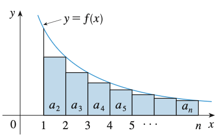
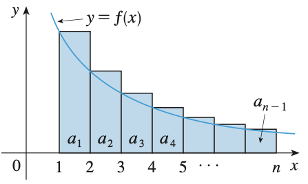

# Sequences and Series

## Limit of Sequences

A sequence $\Set{a_n}$ has a limit $L$ and we write

$$
\lim_{n \to \infty} a_n = L
$$

if for every $\varepsilon > 0$ there is a corresponding integer $N$ such that

$$
\forall n > N, \quad |a_n - L| < \varepsilon
$$

It is similar to the definition of limit of a function $f(x)$, therefore

$$
\lim_{x \to \infty} f(x) = L \text{ and } f(n) = a_n \implies \lim_{n \to \infty} a_n = L
$$

The sequence is convergent if the limit exists, otherwise it is divergent.

For sequence diverges to $\infty$, it means for all positive number $M$, there is an integer $N$ such that

$$
\forall n > N, \quad a_n > M
$$

### Properties

For alternating sequence, it might be useful for the fact that

$$
\lim_{n \to \infty} |a_n| = 0 \implies \lim_{n \to \infty} a_n = 0
$$

_Proof_. As

$$
-|a_n| \le a_n \le |a_n| \quad \text{and} \quad \lim_{n \to \infty} |a_n| = \lim_{n \to \infty} -|a_n| = 0
$$

By Squeeze Theorem, $\lim_{n \to \infty} a_n = 0$

For example,

$$
\lim_{n \to \infty} {(-1)^n \over n} = \lim_{n \to \infty} \left| {(-1)^n \over n} \right| = 0
$$

Also, if $\lim_{n \to \infty} a_n = L$ and function $f$ is continuous at $L$, then

$$
\lim_{n \to \infty} f(a_n) = f(L)
$$

_Proof_. As $f$ is continuous at $L$, i.e.

$$
\lim_{x \to L} f(x) = f(L)
$$

Given an $\varepsilon$, there exists $\delta$ such that

$$
0 < |x - L| < \delta \implies |f(x) - f(L)| < \varepsilon
$$

Since $\lim_{n \to \infty} a_n = L$, there exists $N$ such that

$$
n > N \implies |a_n - L| < \delta
$$

Combining the statements, given any $\varepsilon > 0$, we can find $N$ such that whenever $n > N$,

$$
|a_n - L| < \delta
$$

which implies

$$
|f(a_n) - f(L)| < \varepsilon
$$

Hence,

$$
\lim_{n \to infty} f(a_n) = f(L)
$$

### Monotonic and Bounded Sequences

If $a_n < a_{n+1}$ for all $n \ge 1$, $\Set{a_n}$ is called increasing.
If $a_n > a_{n+1}$ for all $n \ge 1$, $\Set{a_n}$ is called decreasing.
A sequence is monotonic if it is either increasing or decreasing.

If $a_n \le M$ for all $n \ge 1$, $\Set{a_n}$ is bounded above.
If $m \le a_n$ for all $n \ge 1$, $\Set{a_n}$ is bounded below.
A sequence is bounded if it is bounded above and below.

Every monotonic, bounded sequence is convergent.

_Proof_. If $\Set{a_n}$ is bounded above, there exists a least upper bound $L$.
Given $\varepsilon > 0$, $L - \varepsilon$ is not an upper bound, hence for some integer $N$

$$
L - \varepsilon < a_N \le L
$$

As $a_n$ is increasing, $a_n ge a_N$ for all $n > N$. Thus,

$$
L - \varepsilon < a_n \le L
$$

Hence,

$$
\lim_{n \to \infty} a_n = L
$$

## Series

A series is the infinite sum of a sequence $a_n$. Let $s_n$ denote its $n$th partial sum

$$
s_n = a_1 + a_2 + ... + a_n
$$

$\Set{s_n}$ is a sequence and $s$ is the sum of the series if the series is convergent and $\lim_{n \to \infty} s_n = s$.

If the series is convergent, it implies the underlying sequence $\Set{a_n}$ has limit $\lim_{n \to \infty} a_n = 0$ as

$$
\lim_{n \to \infty} a_n = \lim_{n \to \infty} (s_n - s_{n-1}) = s - s = 0
$$

The converse is not true though for example the harmonic series has the terms approaching $0$ but the sum is divergent.

## Divergence Test

The counterpositive of the above statement is test for divergence, i.e. if $\lim_{n \to \infty} a_n \not = 0$, $\Set{s_n}$ is divergent.

### Integral Test

Consider the series

$$
\sum_{n=1}^{\infty} {1 \over n^2} = {1 \over 1^2} + {1 \over 2^2} + {1 \over 3^2} + ...
$$

Geometrically, we can form rectangles under the graph of $y = 1/x^2$, each with a unit width and height eqauls to the value of function.
The sum of the area of the rectangles equals to the sum of the series. Consider all the terms excluding the first one $1/1^2$,
it has to be less than the area under the function from $1$ to $\infty$. Hence,

$$
\sum_{n=1}^{\infty} {1 \over n^2} < {1 \over 1^2} + \int_{1}^{\infty} { 1 \over x^2} \mathrm{d}x = 1 + 1 = 2
$$

As the partial sum $\Set{s_n}$ is increasing and bounded above, the series is convengent.

On the other hand, we can also form rectangles with tops lie above the curve to show the series is divergent. Consider the series

$$
\sum_{n=1}^{\infty} {1 \over \sqrt{n}} = {1 \over \sqrt{1}} + {1 \over \sqrt{2}} + {1 \over \sqrt{3}} + ...
$$

We have

$$
\sum_{n=1}^{\infty} {1 \over \sqrt{n}} > \int_{1}^{\infty} {1 \over \sqrt{x}} \mathrm{d}x = \infty
$$

So, the series is divergent.

Therefore, we can conclude that with $f$ being a continuous, positive, decreasing function on $[1, \infty)$ and $f(n) = a_n$,
if $\int_{1}^{\infty} f(x) \mathrm{d}x$ is convengent/divergent, so as $\sum_{n=1}^{\infty} a_n$.

We can also use the integral to estimate the sum, let $R_n$ be the remainder of the partial sum $s_n$, i.e.

$$
R_n = s - s_n = a_{n+1} + a_{n+2} + ...
$$

By forming rectangles with top above and below the curve, we have

$$
\int_{n+1}^{\infty} f(x) \mathrm{d}x \le R_n \le \int_{n}^{\infty} f(x) \mathrm{d}x
$$

Adding $s_n$ to the inequalities, we can find an upper bound and a lower bound for $s$.

$$
s_n + \int_{n+1}^{\infty} f(x) \mathrm{d}x \le s \le s_n + \int_{n}^{\infty} f(x) \mathrm{d}x
$$

### Comparison Test

For series $\sum a_n$ and $\sum b_n$ with positive terms,
if $a_n le b_n$ for all $n > N$ and $\sum b_n$ is convergent, $\sum a_n$ is convergent,
if $a_n ge b_n$ for all $n > N$ and $\sum b_n$ is divergent, $\sum a_n$ is divergent.

For example, ${ln k \over k } > {1 \over k}$ for $k \ge 3$ and $\sum {1 \over k}$ is divergent, hence $\sum {\ln k \over k}$ is divergent.

We can also check the limit

$$
\lim_{n \to \infty} {a_n \over b_n}
$$

If the limit exists and equals to a finite number $c > 0$, then either both series are convergent or divergent.

If we have $\sum a_n$ converges because of the comparison test with $\sum b_n$, consider the remainder of the two series

$$
R_n = s - s_n = a_{n+1} + a_{n+2} + ...
$$

and

$$
T_n = t - t_n = b_{n+1} + b_{n+2} + ...
$$

We have

$$
R_n \le T_n
$$

and we can find the upper bound of $R_n$ by estimating/finding $T_n$.

## Alternating Series

If the alternating series

$$
\sum_{n=1}^{\infty} (-1)^{n-1} a_n = a_1 - a_2 + a_3 - a_4 + ...
$$

with $a_n > 0$ satisfies

$$
a_{n+1} < a_n \quad \text{and} \quad \lim_{n \to \infty} a_n = 0
$$

then the series is convergent.

The remainder of the $n$th partial sum estimation is

$$
|R_n| \le a_{n+1}
$$

## Absolute Convergence

A series $\sum a_n$ is called absolutely convergent if the series of absolute values $\sum \| a_n \|$ is convergent.

A convergent series is not necessary absolutely convergent, for that we called the series conditionally convergent.
For example, alternating harmonic series is conditionally convergent.

However, if a series is absolutely convergent, then it is convergent.

_Proof_. Consider

$$
0 \le a_n + |a_n| \le 2|a_n|
$$

By comparison test, we have $\sum a_n + \|a_n\|$ convergent.

Also, we can write

$$
\sum a_n = \sum (a_n + |a_n|) - \sum |a_n|
$$

which is the difference of two convergent series and therefore the series itself is convergent.

## Ratio/Root Test

To check for absolute convergence, we can use the ratio/root test.

For ratio test, given a series $\sum a_n$. Suppose

$$
\lim_{n \to \infty} \left| {a_{n+1} \over a_n} \right| = L
$$

If $L < 1$, then the series is absolutely convergent. If $L > 1$, then the series is divergent. If $L = 1$, the test is inconclusive.

When $n$ appears in the power, the root test will be useful.
Similarily, given a series $\sum a_n$. Suppose

$$
\lim_{n \to \infty} \sqrt[n]{\left| a_n \right|} = L
$$

If $L < 1$, then the series is absolutely convergent. If $L > 1$, then the series is divergent. If $L = 1$, the test is inconclusive.

## Rearrangements

As series involve infinite sums, rearrangement of the terms might affect the results.
By Riemann, if $\sum a_n$ is conditionally convergent, then there is a rearrangement that has a sum equals to any real number.
However, if $\sum a_n$ is absolutely convergent, then rearrangement will not check the sum.

## References

* James Stewart _Single Variable Calculus_, 2015 - Chapter 11
