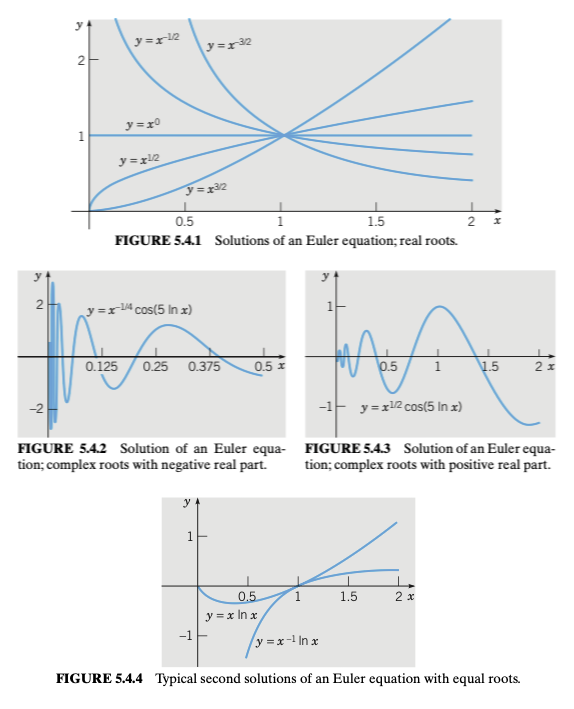

# Series Solutions
{: .page-title}

Even though we can solve differential equations by methods mentioned previously, it is still useful to find solution in terms of power series for computational purpose.

> *Definition.*{: .def}
> A function $f$ is **analytic** at a point $x = x_0$ if it has a Taylor series expansion about $x = x_0$, i.e.
>
> $$
  f(x) = \sum_{n=0}^\infty {f^{(n)}(x_0) \over n!} (x - x_0)^n
  $$
>
> with a raidus of convergence $\rho > 0$.

> *Definition.*{: .def}
> An **orderinary point** $x_0$ of a differential equation
>
> $$
  P(x) y'' + Q(x) y' + R(x) y = 0
  $$
>
> is a point such that $p = Q/P$ and $q = R/P$ are analytic at $x_0$.

> *Definition.*{: .def}
> A **singular point** of a differential equation is a point that is not ordinary, i.e.
> $P(x_0) = 0$ and at least one of $Q$ and $R$ is not zero at $x_0$.

## Ordinary Points

> *Theorem.*{: .thm}
> If $x_0$ is an ordinary point of the differential equation
>
> $$
  P(x) y'' + Q(x) y' + R(x) y = 0
  $$
>
> then the general solution is of the form
>
> $$
  y = \sum_{n=0}^\infty a_n (x - x_0)^n = a_0 y_1(x) + a_1 y_2(x)
  $$
>
> where $a_0$ and $a_1$ are arbitrary and
>
> + $y_1$ and $y_2$ are two power series solutions that are analytic at $x_0$,
>
> + $y_1$ and $y_2$ form a fundamental set of solutions,
>
> + the radius of convergence for each of the series solutions is at least as large as
>   the minimum of the radii of convergence of the series for $p = Q/P$ and $q = R/P$.

> *Example.*{: .eg}
> For the differential equation
>
> $$
  y'' + y = 0
  $$
>
> Consider a power series about $x_0 = 0$ that converges in some interval $\vert x \vert < \rho$, we have
>
> $$
  y = \sum_{n=0}^\infty a_n x^n
  \quad \text{and} \quad
  y' = \sum_{n=1}^\infty n a_n x^{n-1}
  \quad \text{and} \quad
  y'' = \sum_{n=2}^\infty n(n-1) a_n x^{n-2}
  $$
>
> Then
>
> $$
  \begin{align*}
  \sum_{n=2}^\infty n(n-1) a_n x^{n-2} + \sum_{n=0}^\infty a_n x^n &= 0 \\
  \sum_{n=0}^\infty (n+2)(n+1) a_{n+2} x^n + \sum_{n=0}^\infty a_n x^n &= 0 \\
  \end{align*}
  $$
>
> For this equation to be satisfied for all $x$, we need to have
>
> $$
  (n+2)(n+1) a_{n+2} + a_n = 0
  $$
>
> For the even-numbered coefficients
>
> $$
  a_2 = - {a_0 \over 2!}
  \quad \text{and} \quad
  a_4 = - {a_2 \over 3 \cdot 4} = {a_0 \over 4!}
  \quad \text{and} \quad
  a_{2k} = {(-1)^k \over (2k)!} a_0
  $$
>
> For the odd-numbered coefficients
>
> $$
  a_3 = - {a_1 \over 3!}
  \quad \text{and} \quad
  a_5 = - {a_3 \over 4 \cdot 5} = {a_1 \over 5!}
  \quad \text{and} \quad
  a_{2k+1} = {(-1)^k \over (2k + 1)!} a_1
  $$
>
> Hence,
>
> $$
  y = a_0 \sum_{n=0}^\infty {(-1)^n \over (2n)!} x^{2n} + a_1 \sum_{n=0}^\infty {(-1)^n \over (2n + 1)!} x^{2n + 1}
  $$
>
> Be noted that the series solutions provide only a local approximation about $x = 0$ if they are truncated.

Base on the above theorem, as $P(x) = 1, Q(x) = 0, R(x) = 1$ and $x_0 = 0$ is an ordinary point, we can conclude that

+ the solutions converge for all $x$,

+ the two solutions are linearly independent and form a fundamental set of solutions.

We can confirm their convergence by ratio test and found that they really converge for all $x$.
On the other hand, let

$$
C(x) = \sum_{n=0}^\infty {(-1)^n \over (2n)!} x^{2n}
\quad \text{and} \quad
S(x) = \sum_{n=0}^\infty {(-1)^n \over (2n + 1)!} x^{2n + 1}
$$

We found that

$$
C'(x) = -S(x) \quad \text{and} \quad S'(x) = C(x)
$$

Their Wronskian at $x = 0$ is

$$
W[C, S](0) = \begin{vmatrix} C(0) & S(0) \\ -S(0) & C(0) \end{vmatrix} = \begin{vmatrix} 1 & 0 \\ 0 & 1 \end{vmatrix} = 1
$$

and therefore the two solutions are indeed linearly independent.

According to the list of [Power Series](power-series.md#important-series),
the two series solutions are indeed $\sin x$ and $\cos x$, which matches the solutions we found by other techniques.
The function $\sin x$ can in fact be defined as the unique solution of the IVP $y'' + y = 0, y(0) = 0, y'(0) = 1$.
Similarily, the function $\cos x$ can be defined as the unique solution of the IVP $y'' + y = 0, y(0) = 1, y'(0) = 0$

For ratio test to work, we have to find an explicit formula for the coefficients, and sometimes it will be hard or even not feasible.
The theorem provides a good way to find a lower bound of radius of convergence without even solving the equation.

> *Example.*{: .eg}
> For the Legendre equation
>
> $$
  (1 - x^2)y'' - 2xy' + \alpha(\alpha + 1)y = 0
  $$
>
> As $P(x) = 1 - x^2$, $Q(x) = -2x$ and $R(x) = \alpha(\alpha + 1)$ are polynomials,
> the distance of $x = 0$ from zeros of $P(x)$ is the radius of convergence,
> i.e. $P(x) = 0 \implies x = \pm 1$ so $\rho = 1$ or $\vert x \vert < 1$ for series solutions about $x = 0$.

## Cauchy-Euler Equations

> *Definition.*{: .def}
> The **Cauchy-Euler equations** or **equidimensional equations** are the differential equations of the form
>
> $$
  L[y] = x^2 y'' + ax y' + by = 0
  $$
>
> where $a, b$ are real constants.

> *Proposition.*{: .prop}
> Assume a solution is of the form $y(x) = x^r$ for $x > 0$. Then
>
> $$
  L[x^r] = x^r[r(r-1) + ar + b] = 0
  $$
>
> Cancelling the $x^r$ factor and we obtain the **indicial equation**
>
> $$
  F(r) = ar(r-1) + br + c = 0
  $$
>
> and the roots are
>
> $$
  r_1, r_2 = {-(a - 1) \pm \sqrt{(a - 1)^2 - 4b} \over 2}
  $$

> *Proposition.*{: .prop}
> If the indicial equation has two real roots $r_1$ and $r_2$, then the general solution is
>
> $$
  y(x) = Ax^{r_1} + Bx^{r_2}
  $$

> *Proposition.*{: .prop}
> If the indicial equation has one repeated root $r$, then the general solution is
>
> $$
  y(x) = Ax^{r} + Bx^{r}\ln x = (A + B\ln x)x^r
  $$
>
> *Proof.*{: .prf}
>
> The other solution can be derived by reduction of order.
>
> Alternatively, note that $F(r) = (r - r_1)^2$ which implies $F'(r_1) = 0$ as well.
>
> By differentiating the differential equation with respect to $r$, we have
>
> $$
  {\partial \over \partial r} L[x^r] = {\partial \over \partial r} x^r F(r)
  $$
>
> and therefore
>
> $$
  L[x^r \ln x] = (r - r_1)^2 x^r \ln x + 2(r - r_1) x^r
  $$
>
> in which the R.H.S. is zero for $r = r_1$.
> Hence, $x^{r_1} \ln x$ is the second solution.

> *Proposition.*{: .prop}
> If the indicial equation has one complex roots $k = \rho \pm \omega i$, then the general solution is
>
> $$
  y(x) = x^{\rho}[A\cos(\omega\ln x) + B\sin(\omega\ln x)]
  $$
>
> *Proof.*{: .prf}
>
> Similar to having real roots, the general solution is
>
> $$
  y(x) = Cx^{\rho + \omega i} + Dx^{\rho - \omega i}
  $$
>
> Since
>
> $$
  x^{\rho \pm \omega i} = x^{\rho} e^{\pm \omega i \ln x} = x^\rho [\cos(\omega \ln x) \pm \sin(\omega \ln x)]
  $$
>
> As we want to make our solution real, we need to have $D = C^\ast$, i.e.
>
> $$
  \begin{align*}
  y(x) &= 2\text{Re}[Cx^{\rho + \omega i}] \\
  &= 2\text{Re}[(\alpha + \beta i)x^\rho [\cos(\omega \ln x) + \sin(\omega \ln x)]] \\
  &= 2x^\rho[\alpha \cos(\omega \ln x) - \beta \sin(\omega \ln x)]
  \end{align*}
  $$
>
> By rewriting the constants, we have $y(x) = x^{\rho}[A\cos(\omega\ln x) + B\sin(\omega\ln x)]$.

{: .size-2x}

> *Proposition.*{: .prop}
> For the case that $x < 0$, let $x = -\xi$ and $y = u(\xi)$, then
>
> $$
  {\mathrm{d}y \over \mathrm{d}x} = {\mathrm{d}u \over \mathrm{d}\xi} {\mathrm{d}\xi \over \mathrm{d}x} = - {\mathrm{d}u \over \mathrm{d}\xi}
  \quad \text{and} \quad
  {\mathrm{d}^2 y \over \mathrm{d}x^2} = {\mathrm{d} \over \mathrm{d}\xi} \left(-{\mathrm{d}u \over \mathrm{d}\xi}\right) {\mathrm{d} \xi \over \mathrm{d}x} = {\mathrm{d}^2u \over \mathrm{d}\xi^2}
  $$
>
> Thus, the Euler equation becomes
>
> $$
  \xi^2 u'' + a\xi u' + bu = 0
  $$
>
> which is exactly the same except for the variable names.
> Therefore,
>
> $$
  u(\xi) = \begin{cases}
  A\xi^{r_1} + B\xi^{r_2} \\
  (A + B \ln \xi) \xi^{r} \\
  \xi^\lambda (A \cos (\mu \ln \xi) + B \sin (\mu \ln \xi))
  \end{cases}
  $$
>
> To obtain the solutions in $x$, we just need to Substitude $\xi = -x$.
> Hence, combining the solutions for $x > 0$ and $x < 0$, we have
>
> $$
  y(x) = \begin{cases}
  A|x|^{r_1} + B|x|^{r_2} \\
  (A + B \ln |x|) |x|^{r} \\
  |x|^\lambda (A \cos (\mu \ln |x|) + B \sin (\mu \ln |x|))
  \end{cases}
  $$

## Singular Points

Although the singular points of a differential equation are usually few in number,
most of the time they determine the principal features of the solution to a much larger extent which we have to study more carefully.

> *Definition.*{: .def}
> A **regular singular point** of a differential equation is a point $x_0$ such that
>
> $$
  \lim_{x \to x_0} (x - x_0) {Q(x) \over P(x)}
  \quad \text{and} \quad
  \lim_{x \to x_0} (x - x_0)^2 {R(x) \over P(x)}
  $$
>
> are finite and both
>
> $$
  (x - x_0) {Q(x) \over P(x)}
  \quad \text{and} \quad
  (x - x_0)^2 {R(x) \over P(x)}
  $$
>
> are analytic at $x = x_0$.

> *Proposition.*{: .prop}
> Consider a differential equation of the form
>
> $$
  L[y] = P(x)y'' + Q(x)y' + R(x)y = 0
  $$
>
> Assume $x = 0$ is a regular singular point, i.e.
>
> $$
  xp(x) = x{Q(x) \over P(x)} = \sum_{n=0}^\infty p_n x^n
  \quad \text{and} \quad
  x^2q(x) = x^2{R(x) \over P(x)} = \sum_{n=0}^\infty q_n x^n
  $$
>
> and
>
> $$
  \lim_{x \to 0} xp(x) = p_0
  \quad \text{and} \quad
  \lim_{x \to 0} x^2q(x) = q_0
  $$
>
> By multiplying both sides of the equation by $x^2$, we have
>
> $$
  L[y] = x^2y'' + xp(x)y' + x^2q(x)y = 0
  $$
>
> By taking the limit $x \to 0$, we get the corresponding Euler equation
>
> $$
  x^2y'' + p_0xy' + q_0y = 0
  $$
>
> Assume there is a solution of the form
>
> $$
  y = \phi(r, x) = x^r \sum_{n=0}^\infty a_n x^n = \sum_{n=0}^\infty a_n x^{r+n}
  $$
>
> It follows that
>
> $$
  y' = \sum_{n=0}^\infty (r+n) a_n x^{r+n-1}
  \quad \text{and} \quad
  y'' = \sum_{n=0}^\infty (r+n)(r+n-1) a_n x^{r+n-2}
  $$
>
> Note that the dummy variable starts from $0$ here.
> Substituting all of them back to the differential equation and collecting the terms by the powers of $x$, we have
>
> $$
  \begin{align*}
  a_0 F(r) x^r
  &+ [a_1 F(r+1) + a_0(p_1 r + q_1)]x^{r+1} \\
  &+ [a_2 F(r+2) + a_0(p_2 r + q_2) + a_1(p_1(r+1) + q_1)]x^{r+2} \\
  &+ [a_3 F(r+3) + a_0(p_3 r + q_3) + a_1(p_2(r+1) + q_2) + a_2(p_1(r+2) + q_1)]x^{r+3} \\
  &+ \cdots = 0
  \end{align*}
  $$
>
> or in compact form
>
> $$
  L[\phi](r, x) = a_0 F(r) x^r + \sum_{n=1}^\infty \left\{ F(r+n)a_n + \sum_{k=0}^{n-1} a_k [(r+k)p_{n-k} + q_{n-k}] \right\} x^{r+n} = 0
  $$
>
> where
>
> $$
  F(r) = r(r-1) + p_0r + q_0
  $$
>
> For the above to be a solution, the coefficient of each power of $x$ must be zero.
>
> For the $x^{r}$ term, as $a_0 \not= 0$, $F(r) = 0$, which is the **indicial equation** and is exactly the same as that of the Euler equation.
>
> For the $x^{r+n}$ terms, we have the **recurrence relation**
>
> $$
  F(r + n)a_n + \sum_{k=0}^{n-1} a_k [(r+k)p_{n-k} + q_{n-k}] = 0
  $$
>
> which depends on $r$ and $a_0, a_1, ..., a_{n-1}$.

> *Definition.*{: .def}
> The **indicial equation** of the differential equation is the quadratic equation
>
> $$
  r(r - 1) + p_0r + q_0 = 0
  $$
>
> where
>
> $$
  p_0 = \lim_{x \to 0} xp(x)
  \quad \text{and} \quad
  q_0 = \lim_{x \to 0} x^2q(x)
  $$
>
> which determines the qualitative behaviour of the solutions.

> *Definition.*{: .def}
> The roots of the indicial equation are called the **exponents at the singularity**.

> *Proposition.*{: .prop}
> For two distinct roots $r_1$ and $r_2$ with $r_1 \ge r_2$ and $r_1 - r_2$ is not a positive integer,
> then the two solutions are
>
> $$
  y_1(x) = x^{r_1} \left[ 1 + \sum_{n=1}^\infty a_n(r_1) x^n \right]
  \quad \text{and} \quad
  y_2(x) = x^{r_2} \left[ 1 + \sum_{n=1}^\infty a_n(r_2) x^n \right]
  $$
>
> where $a_n(r)$ is determined by the recurrence relation.
> The radii of convergence for the series are at least equal to the distance from the origin to the nearest zero of $P$ other than $x = 0$.

> *Proposition.*{: .prop}
> For two distinct real roots $r_1$ and $r_2$ with $r_1 \ge r_2$ but $r_1 = r_2 + n$ for some positive integer $n$,
> we can only obtain one solution
>
> $$
  y_1(x) = x^{r_1} \left[ 1 + \sum_{n=1}^\infty a_n(r_1) x^n \right]
  $$
>
> because $F(r_2 + n)$ will be zero at some point and break the recurrence relation.
>
> The second solution will be of the form
>
> $$
  y_2(x) = ay_1(x) \ln x + x^{r_2} \left[ 1 + \sum_{n=1}^\infty b_n(r_2) x^n \right]
  $$
>
> where the $b_n(r_2)$ and $a$ can be determined by substituting it back to the equation.

> *Proposition.*{: .prop}
> For repeated roots $r_1 = r_2$, the second solution will be of the form
>
> $$
  y_2(x) = y_1(x) \ln x + x^{r_1} \left[ 1 + \sum_{n=1}^\infty b_n(r_1) x^n \right]
  $$
>
> where the $b_n(r_1)$ can be determined by substituting it back to the equation.

## References

* William E. Boyce _Elementary Differential Equations and Boundary Value Problems_, 2009 - Chapter 5
