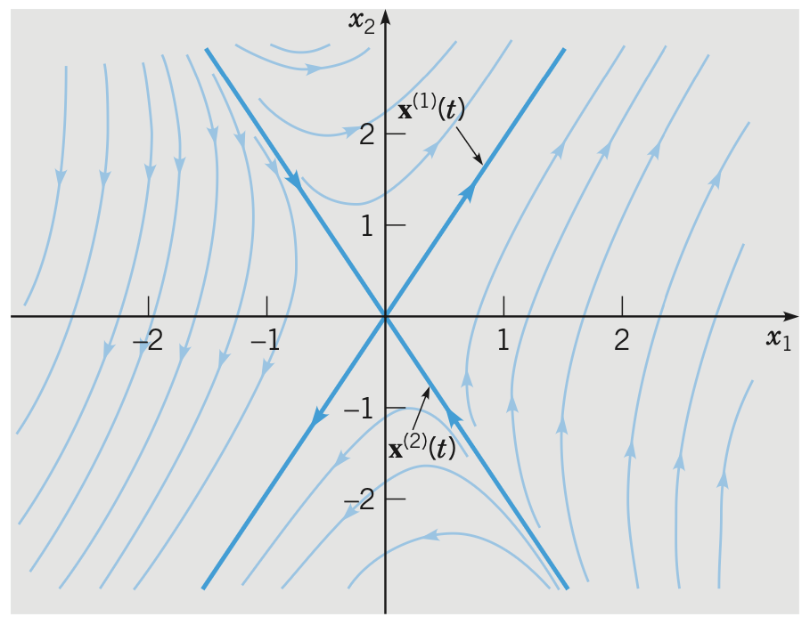
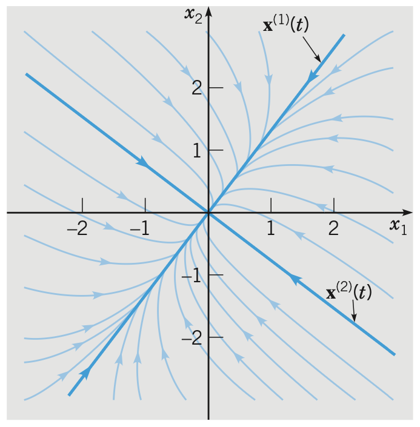
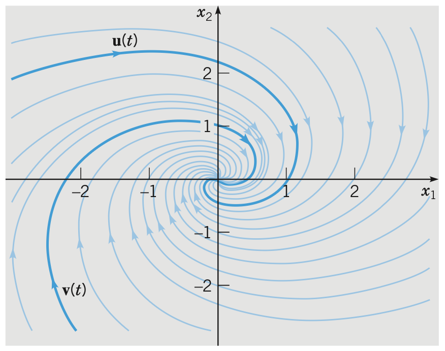
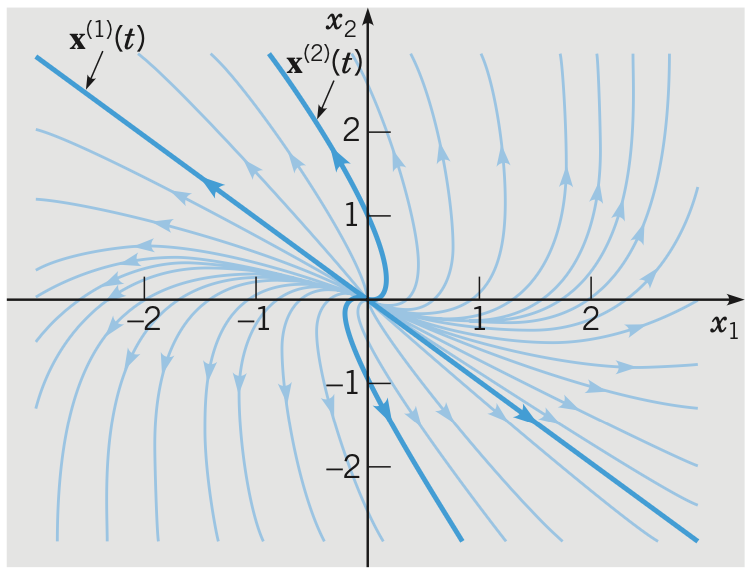
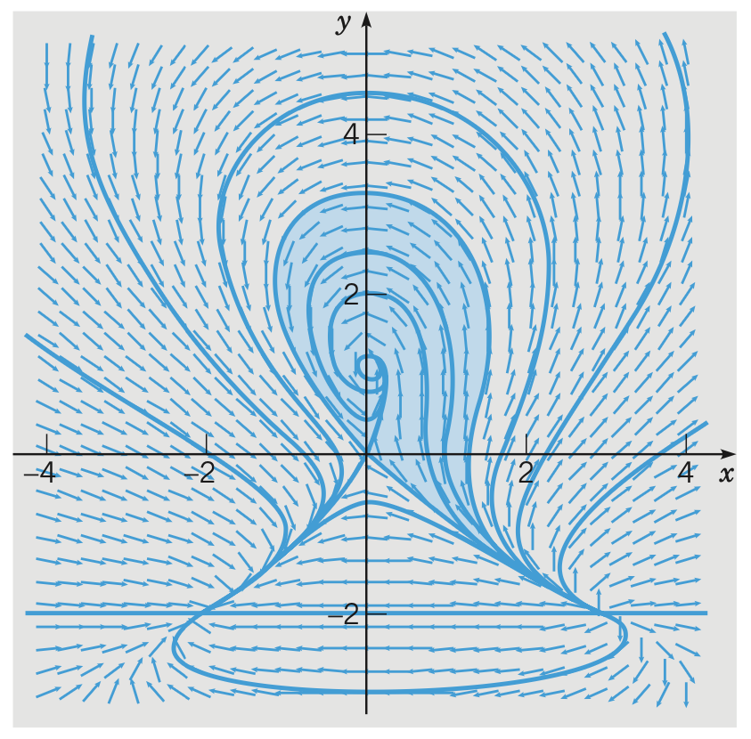

# Systems of First Order Differential Equations
{: .page-title}

The reason to focus on first order differential equations is that
any arbitrary $n$th order equation $y^{(n)} = F(t, y, y', ..., y^{(n-1)})$ can be transformed into a system of $n$ first order equations.
Let $x_1 = y$, $x_2 = y'$, ..., $x_n = y^{(n-1)}$ then we have

$$
\begin{align*}
x_1' &= x_2 \\
x_2' &= x_3 \\
&\quad \vdots \\
x_n' &= F(t, x_1, x_2, ..., x_{n-1})
\end{align*}
$$

which is a system of $n$ first order differential equations.

> *Definition.*{: .def}
> A general system of first order linear equation is of the form
>
> $$
  \begin{align*}
  x_1' &= p_{11}(t)x_1 + \cdots + p_{1n}(t)x_n + g_1(t) \\
  &\quad \vdots \\
  x_n' &= p_{n1}(t)x_1 + \cdots + p_{nn}(t)x_n + g_n(t)
  \end{align*}
  $$
>
> If $g_1(t), ..., g_n(t)$ are zero then the system is **homogeneous**.

It is more precise to write the systems in matrix notation, i.e.

$$
\mathbf{x}' = \mathbf{P}(t) \mathbf{x} + \mathbf{g}(t)
$$

> *Theorem.*{: .thm}
> For the homogeneous equation
>
> $$
  \mathbf{x}' = \mathbf{P}(t) \mathbf{x}
  $$
>
> The set of vector functions $\mathbf{x_1}(t), ..., \mathbf{x_n}(t)$ which are linearly independent solutions is called a **fundamental set of solutions** of the system.
> The general solution is the linear combination
>
> $$
  \boldsymbol{\phi}(t) = c_1\mathbf{x_1}(t) + \cdots + c_n\mathbf{x_n}(t)
  $$
>
> *Proof.*{: .prf}
>
> Let $\boldsymbol{\xi} = \boldsymbol{\phi}(t_0)$ for some $t_0$ in the interval of the solutions.
> If there exists unique solution $c_1, ..., c_n$ for the system of algebraic equation
>
> $$
  c_1\mathbf{x_1}(t_0) + \cdots + c_n\mathbf{x_n}(t_0) = \boldsymbol{\xi}
  $$
>
> then every solution can be expressed as a linear combination.
>
> Let $\mathbf{X}(t) = \begin{pmatrix} \mathbf{x_1}(t) & \cdots & \mathbf{x_n}(t) \end{pmatrix}$.
> The system is equivalent to
>
> $$
  \mathbf{X}(t_0) \mathbf{c} = \boldsymbol{\xi}
  $$
>
> where $\vert \mathbf{X}(t_0) \vert = W\[\mathbf{x_1}, ..., \mathbf{x_n}\](t_0) \not= 0$ as the vector functions are linearly independent.
>
> Hence, there is a unique solution $\mathbf{c} = \mathbf{X}^{-1}(t_0) \boldsymbol{\xi}$.

> *Proposition.*{: .prop}
> The Wronskian $W\[\mathbf{x_1}, ..., \mathbf{x_n}\]$ of the solutions either is identically zero or else never vanishes.
>
> *Proof.*{: .prf}
>
> The Wronskian satisfies the differential equation
>
> $$
  {\mathrm{d} W \over \mathrm{d}t} = (p_{11} + ... + p_{nn}) W
  $$
>
> Hence,
>
> $$
  W(t) = c \exp \left\{ \int [p_{11}(t) + ... + p_{nn}(t)] \mathrm{d}t \right\}
  $$
>
> which is known as **Abel's formula** and $W(t) \equiv 0$ or $W(t) \not = 0$ for all $t$ in the interval of solutions.

The above is an extension of the theories we estabished for ordinary differential equations.
There is also a similar existence and uniqueness theorem which is omitted here.

## Linear + Homogeneous + Constant Coefficients

> *Proposition.*{: .prop}
> Consider a system of first order differential equations
>
> $$
  \mathbf{x}' = \mathbf{A} \mathbf{x}
  $$
>
> where $\mathbf{A}$ is a constant $n \times n$ matrix.
> Assume the solutions is of the form
>
> $$
  \mathbf{x} = \mathbf{v} e^{\lambda t} \quad \text{and} \quad \mathbf{x}' = \lambda\mathbf{v} e^{\lambda t}
  $$
>
> Then substituting them back we have $\lambda \mathbf{v} e^{\lambda t} = \mathbf{A} \mathbf{v} e^{\lambda t}$, and
>
> $$
  (\mathbf{A} - \lambda \mathbf{I})\mathbf{v} = \mathbf{0}
  $$
>
> Therefore, $\lambda$ and $\mathbf{v}$ are the eigenvalues and eigenvectors of $\mathbf{A}$.
>
> Hence, if we have the $n$ eigenvalues (counted with multiplicity) and $n$ linearly independent eigenvectors,
> then the general solution is
>
> $$
  \mathbf{x}(t) = c_1 \mathbf{v}_1 e^{\lambda_1t} + ... + c_n \mathbf{v}_n e^{\lambda_n t}
  $$

> *Proposition.*{: .prop}
> For a constant $2 \times 2$ matrix with two distinct real eigenvalues $\lambda_1$ and $\lambda_2$ and corresponding eigenvectors $\mathbf{v}_1$ and $\mathbf{v}_2$,
> the general solution is
>
> $$
  \mathbf{x}(t) = A \mathbf{v}_1 e^{\lambda_1t} + B \mathbf{v}_2 e^{\lambda_2t}
  $$

> *Proposition.*{: .prop}
> For a constant real $2 \times 2$ matrix with two complex eigenvalues $\lambda = \rho \pm i\omega$ and corresponding eigenvectors $\mathbf{v} = \mathbf{u_1} \pm i \mathbf{u_2}$,
> the general solution is
>
> $$
  \begin{align*}
  \mathbf{x}(t)
  &= e^{\rho t} [(A \cos \omega t + B \sin \omega t) \mathbf{u_1} + (B \cos \omega t - A \sin \omega t) \mathbf{u_2}] \\
  &= A e^{\rho t} (\mathbf{u_1}\cos \omega t - \mathbf{u_2} \sin \omega t) + B e^{\rho t} (\mathbf{u_1} \sin \omega t + \mathbf{u_2} \cos \omega t)
  \end{align*}
  $$
>
> *Proof.*{: .prf}
>
> For a real matrix, the complex eigenvalues are always conjugate to each other, so as the corresponding eigenvectors because
> if $\lambda = \rho + i \omega$ and $\mathbf{v}$ are the eigenvalue and eigenvector of $\mathbf{A}$, then
>
> $$
  [(\mathbf{A} - \lambda \mathbf{I})\mathbf{v}]^\ast = (\mathbf{A} - \lambda^\ast \mathbf{I})\mathbf{v}^\ast = 0
  $$
>
> so $\lambda^\ast$ and $\mathbf{v}^\ast$ are also eigenvalue and eigenvector of $\mathbf{A}$.
>
> Substitude them into the general solution gives us
>
> $$
  \mathbf{x}(t) = c_1 \mathbf{v} e^{(\rho + i\omega)t} + c_2 \mathbf{v}^\ast e^{(\rho - i\omega)t}
  = e^{\rho t} (c_1 \mathbf{v} e^{i\omega t} + c_2 \mathbf{v}^\ast e^{-i\omega t})
  $$
>
> We can ensure real solutions by having $c_1 = a + ib$ and $c_2 = c_1^\ast = a - ib$ and it becomes
>
> $$
  \begin{align*}
  \mathbf{x}(t) &= 2e^{\rho t} \text{Re}\left[(a + ib)(\mathbf{u_1} + i\mathbf{u_2})(\cos \omega t + i\sin\omega t) \right] \\
  &= 2e^{\rho t} \left[ (a \cos \omega t - b \sin \omega t)\mathbf{u_1} - (b \cos \omega t + a \sin \omega t)\mathbf{u_2} \right]
  \end{align*}
  $$
>
> Hence, let $A = 2a$ and $B = -2b$, by rearranging the terms, we have
>
> $$
  \mathbf{x}(t) = A e^{\rho t} (\mathbf{u_1}\cos \omega t - \mathbf{u_2} \sin \omega t) + B e^{\rho t} (\mathbf{u_1} \sin \omega t + \mathbf{u_2} \cos \omega t)
  $$

> *Proposition.*{: .prop}
> For one repeated eigenvalue, it is possible that there are two linearly independent eigenvectors associated to it.
> If that is the case, the general solution is the same as having two distinct real eigenvalues.
>
> However, if there is only one eigenvector $\mathbf{v}$, we have to find the **generalized eigenvector** by assuming the second solution having the form
>
> $$
  \mathbf{x}_2(t) = \mathbf{u}_1 te^{\lambda t} + \mathbf{u_2} e^{\lambda t}
  \quad \text{and} \quad
  \mathbf{x}_2'(t) = \lambda \mathbf{u}_1 te^{\lambda t} + \mathbf{u_1} e^{\lambda t} + \lambda \mathbf{u_2} e^{\lambda t}
  $$
>
> Substituting it back and we have
>
> $$
  \begin{align*}
  \lambda \mathbf{u}_1 te^{\lambda t} + \mathbf{u_1} e^{\lambda t} + \lambda \mathbf{u_2} e^{\lambda t} &= \mathbf{A}(\mathbf{u}_1 te^{\lambda t} + \mathbf{u_2} e^{\lambda t}) \\
  (\mathbf{A} - \lambda \mathbf{I})\mathbf{u}_1 te^{\lambda t} + [(\mathbf{A} - \lambda \mathbf{I})\mathbf{u}_2 - \mathbf{u_1}]e^{\lambda t} &= 0
  \end{align*}
  $$
>
> Therefore, for the equationi to be true for all $t$, we need to have
>
> $$
  \begin{align*}
  (\mathbf{A} - \lambda \mathbf{I})\mathbf{u}_1 &= \mathbf{0} \\
  (\mathbf{A} - \lambda \mathbf{I})\mathbf{u}_2 &= \mathbf{u_1}
  \end{align*}
  $$
>
> and can conclude that $\mathbf{u_1} = \mathbf{v}$ and try to solve $\mathbf{u_2}$ by elimiation.
>
> Hence, the general solution is
>
> $$
  \mathbf{x}(t) = A \mathbf{v} e^{\lambda t} + B (\mathbf{v} te^{\lambda t} + \mathbf{u_2} e^{\lambda t})
  $$

## Linear + Inhomogeneous + Constant Coefficients

> *Proposition.*{: .prop}
> **[Diagonalization]**
> For systems of the form
>
> $$
  \mathbf{x}' = \mathbf{A}\mathbf{x} + \mathbf{g}(t)
  $$
>
> where $\mathbf{A}$ is an $n \times n$ diagonalizable constant matrix.
>
> Let $\mathbf{T} = \begin{pmatrix} \mathbf{v}_1 & \mathbf{v}_2 & \cdots & \mathbf{v}_n \end{pmatrix}$
> with $\Set{\mathbf{v}_i}$ being $n$ linearly independent eigenvectors and define
>
> $$
  \mathbf{x} = \mathbf{T}\mathbf{y}
  $$
>
> Then, substituting for $\mathbf{y}$, we obtain
>
> $$
  \begin{align*}
  \mathbf{T}\mathbf{y}' &= \mathbf{A}\mathbf{T}\mathbf{y} + \mathbf{g}(t) \\
  \mathbf{y}' &= \mathbf{T}^{-1}\mathbf{A}\mathbf{T}\mathbf{y} + \mathbf{T}^{-1}\mathbf{g}(t) = \mathbf{D}\mathbf{y} + \mathbf{T}^{-1}\mathbf{g}(t)
  \end{align*}
  $$
>
> where $\mathbf{D}$ is diagonal matrix whose diagonal entries are the eigenvalues of $\mathbf{A}$.
>
> Thus, the equations can be solved separately as each of them is of the form
>
> $$
  y_j'(t) = r_j y_j(t) + h_j(t), \quad j = 1, ..., n
  $$
>
> where $h_j(t)$ is a certain linear combination of $g_1(t), ..., g_n(t)$.
>
> Hence, the final solution can be obtained by multiplying $\mathbf{T}$ to the solutions.

> *Proposition.*{: .prop}
> **[Undetermined Coefficients]**
> Similar to the same method for solving second order differential equations,
> base on the form of $\mathbf{g}(t)$, we can assume the particular solution ot be a specific form
> and try to determine the coefficients by substitution.
>
> For example, if $\mathbf{g}(t) = \mathbf{u}_1 e^{\alpha t} + \mathbf{u}_2 t$, we can try
>
> $$
  \mathbf{x_p}(t) = \mathbf{a}e^{\alpha t} + \mathbf{b}t + \mathbf{c}
  $$
>
> and solve for coefficient vectors $\mathbf{a}, \mathbf{b}$ and $\mathbf{c}$.

## Stability and Instability

The concept of stability is important for understanding the qualitative behaviour os solutions without even solving it.
Consider a simple autonomous system of the form $\mathbf{x}' = \mathbf{f}(\mathbf{x})$.

> *Definition.*{: .def}
> The points where $\mathbf{f}(\mathbf{x}) = \mathbf{0}$ are called **critical points**, which implies $\mathbf{x}' = \mathbf{0}$.
> Therefore, the critical points correspond to constant/equilibrium solutions of the system.

> *Definition.*{: .def}
> A critical point is **stable** if all solutions that start "sufficiently close" to the point stay "close" to it.
> Otherwise, it is **unstable**.

> *Definition.*{: .def}
> A critical point is **asymtotically stable** if it is stable and attracting, i.e. "close" enough solutions will approach the point eventually.

## Qualitative Analysis

> *Definition.*{: .def}
> A **phase portrait** is a plot that shows a representative sample of trajectories for a given system.

The folowing are different phase portraits for different eigenvalues of a typical $2 \times 2$ system $\mathbf{x}' = \mathbf{Ax}$.

> *Proposition.*{: .prop}
> If the eigenvalues are distinct real and opposite signs, the phase portrait will be like
>
> 
>
> The origin is called a **saddle point** and is unstable.

> *Proposition.*{: .prop}
> If the eigenvalues are distinct real and both negative, the phase portrait will be like
>
> 
>
> The origin is called a **node** and is stable.
>
> If the eigenvalues are both positive then the trajectories will be of outward direction and the origin is unstable.

> *Proposition.*{: .prop}
> If the eigenvalues are complex with negative real parts, the phase portrait will be like
>
> 
>
> The origin is called a **sprial point** and is asymtotically stable.
>
> If the eigenvalues have positive real parts, then the trajectories will be of outward direction and the origin is unstable.
>
> If the eigenvalues have zero real parts, the trajectories will be of outward direction and the origin is called a **centre** and is stable but not asymtotically stable.
>
> The trajectories can be clockwise or counterclockwise depending on the coefficient matrix.

> *Proposition.*{: .prop}
> If the system has a repeated positive eigenvalue and only one linearly independent eigenvector, the phase portrait will be like
>
> 
>
> The origin is called an **improper node** and is asymtotically unstable.
>
> If the eigenvalue is negative then the trajectories will be of inward direction and the origin is asymtotically stable.

## Nonlinear + Autonomous

> *Definition.*{: .def}
> A system is **autonomous** if the derivatives depend only on dependent variables, i.e.
>
> $$
  \begin{cases}
  \mathbf{d} x / \mathbf{d} t = F(x, y) \\
  \mathbf{d} y / \mathbf{d} t = G(x, y) \\
  \end{cases}
  $$

Solving nonlinear autonomous system can be hard but we can carry out similar qualitative analysis to understand the behaviours.
The nonlinear systems are more complicated than the linear ones for the reason that there can be multiple critical points which competing for influence on the trajectories.

> *Definition.*{: .def}
> The **basin of attraction** is the set of points $P$ such that trajectories passing through $P$ will ultimately approach the critical point.

> *Definition.*{: .def}
> A **separatrix** is a trajectory that bounds a basin of attraction.

{: .size-2x}

> *Proposition.*{: .prop}
> For a general nonlinear autonomous system
>
> $$
  x' = F(x, y) \quad \text{and} \quad y' = G(x, y)
  $$
>
> with critical point $\mathbf{x}_0 = (x_0, y_0)$.
> The **locally linear system** that approximates the system is of the form
>
> $$
  \begin{pmatrix} \xi' \\ \eta' \end{pmatrix} = \begin{pmatrix} F_x & F_y \\ G_x & G_y \end{pmatrix} \begin{pmatrix} \xi \\ \eta \end{pmatrix}
  $$
>
> where the coefficient matrix is called the **Jacobian matrix**.
>
> *Proof.*{: .prf}
>
> By Taylor expansions, we have
>
> $$
  \begin{align*}
  F(x, y) &= F(x_0, y_0) + F_x(x_0, y_0)(x - x_0) + F_y(x_0, y_0)(y - y_0) + R_F(x, y) \\
  G(x, y) &= G(x_0, y_0) + G_x(x_0, y_0)(x - x_0) + G_y(x_0, y_0)(y - y_0) + R_G(x, y)
  \end{align*}
  $$
>
> where
>
> $$
  \lim_{(x, y) \to (x_0, y_0)} {R_F(x, y) \over [(x - x_0)^2 + (y - y_0)^2]^{1/2}} = 0
  $$
>
> and similarily for $R_G(x, y)$.
>
> Hence, let $\xi = x - x_0$ and $\eta = y - y_0$,
>
> $$
  \begin{pmatrix} \xi' \\ \eta' \end{pmatrix} = \begin{pmatrix} F_x(x_0, y_0) & F_y(x_0, y_0) \\ G_x(x_0, y_0) & G_y(x_0, y_0) \end{pmatrix} \begin{pmatrix} \xi \\ \eta \end{pmatrix}
  $$
>
> is a linear approximation of the system around the critical point.

> *Proposition.*{: .prop}
> The type and stability of the critical point in the locally linear system is the same as a typical linear system, except for the case that the eigenvalues are purely imaginary.

## References

* William E. Boyce _Elementary Differential Equations and Boundary Value Problems_, 2009 - Chapter 7, 9
