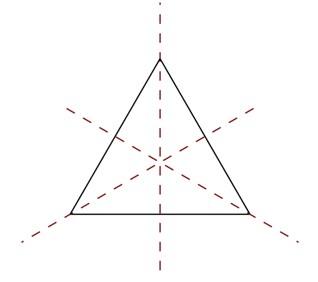

# Groups
{: .page-title}

A group is the set of symmetries of something,
and symmetry of something is just a way of mapping something to itself preserving all the structures.

For example, consider the symmetries of an equilateral triangle.

If we limit ourselves to preserve everything, we would only be allowed to do nothing.
When studying the symmetries of the equilateral triangle, we only care about how the resultant objects look,
but don't care about where the individual vertices went.
Hence, we have six symmetries: three rotations (by $0^\circ, 120^\circ, 240^\circ$) and three reflections along the above axes.
These six form the underlying set of the group of symmetries.
With that, we can then define the operation being the combination of two symmetries to give a new symmetry,
naturally meaning to do one after another, e.g. combining two $120^\circ$ rotation to get a $240^\circ$ rotation.

First of all, the new symmetry we got after combining any two symmetries must be the same as one of the symmetry in the set.
We say the group is "closed" with respect to the operation.

Secondly, we must have a "do nothing" symmetry, which when combined with another symmetry, the other symmetry is unchanged.
It is called the identity element, normally named as $1, 0$ or $e$.

Thirdly, given a symmetry, we should have the reverse symmetry, which when combined the two together,
we will end up "doing nothing", i.e. getting the identity element.
It is called the inverse and normally named as $a^{-1}$.

Finally, let $\ast$ denote the group operation, given three symmetries, we can combine them, one after another, i.e. $$x \ast y \ast z$$.
There are two ways to combine them, which are $(x \ast y) \ast z$ or $x \ast (y \ast z)$.
However, intuitively they should yield the same result as we are always applying $x$ after $y$ after $z$,
we have the associative rule $(x \ast y) \ast z = x \ast (y \ast z)$.

With the above, we can define the axioms of a group.

## Group Axioms

> *Definition.*{: .def}
> A (binary) operation is a way of combining two elements to get a new element.
> Formally, it is a map $\ast: S \times S \to S$.

> *Definition.*{: .def}
> A group is a set $G$ with a binary operation $\ast$ satifying the following axioms:
>
> 0\. **[Closure]** For all $a, b \in G$, we have
>
> $$
  a \ast b \in G
  $$
>
> 1\. **[Identity]** There is a unique $e \in G$ such that for all $a \in G$, we have
>
> $$
  a \ast e = e \ast a = a
  $$
>
> 2\. **[Inverse]** For all $a \in G$, there is some $a^{-1} \in G$ such that
>
> $$
  a^{-1} \ast a = a \ast a^{-1} = e
  $$
>
> 3\. **[Associativity]** For all $a, b, c \in G$, we have
>
> $$
  (a \ast b) \ast c = a \ast (b \ast c)
  $$

Technically, the closure axiom is always true by the definition of binary operation $\ast$ so sometimes we will just omit it.
However, in practice it is something we might have to check to make sure it is true.

The identity axiom can be replaced with a weaker statement that there exists $e \in G$ such that $a \ast e = e \ast a = a$ for all $a \in G$ and from that we will see $e$ is necessarily unique.
Hence, in the proof of a group, we only need to show the existence of such $e$ without the need to show such $e$ is unique.

For the inverse axiom to be unambigious, we have to state the uniqueness of $e$ in the identity axiom.
On the other hand, the notation $a^{-1}$ can only be unambigious if the inverse of $a$ is unique.

To conclude, we dervied the abstract notion of a group from its concrete notion by taking the combination of symmetries as the binary operation.
Conversely, by Cayley's Theorem, we can show that these are the only axioms we need for a concrete group.
Also, with this abstract definition, we can already study lots of properties about groups.

## Properties of Groups

With the above axioms, we can prove some of the properties about groups.

> *Lemma.*{: .lem}
> The identity $e$ of a group is unique.
>
> *Proof.*{: .prf}
>
> Suppose $e$ and $e'$ are both identities, we have
>
> $$
  e = e \ast (e') = (e) \ast e' = e'
  $$
>
> (the one with bracket is treated as the identity)

> *Lemma.*{: .lem}
> The inverse $a^{-1}$ of $a$ in a group is unique.
>
> *Proof.*{: .prf}
>
> Suppose $b$ and $b'$ are both inverses of $a$, we have
>
> $$
  b = b \ast e = b \ast (a \ast b') = (b \ast a) \ast b' = e \ast b' = b'
  $$

> *Lemma.*{: .lem}
> The inverse of inverse $a^{-1}$ is $a$ itself, i.e.
>
> $$
  (a^{-1})^{-1} = a
  $$
>
> *Proof.*{: .prf}
>
> Given $a^{-1}$ being the inverse of $a$, we have
>
> $$
  a \ast a^{-1} = e = a^{-1} \ast a
  $$
>
> So $a$ is the element that matches the definition of inverse of $a^{-1}$.
> By uniqueness of inverse, $(a^{-1})^{-1} = a$.

> *Lemma.*{: .lem}
> The inverse of $a \ast b$ is given by
>
> $$
  (a \ast b)^{-1} = b^{-1} \ast a^{-1}
  $$
>
> *Proof.*{: .prf}
>
> $$
  (a \ast b) \ast (b^{-1} \ast a^{-1}) = a \ast ((b \ast b^{-1}) \ast a^{-1}) = a \ast (e \ast a^{-1}) = a \ast a^{-1} = e
  $$
>
> $$
  (b^{-1} \ast a^{-1}) \ast (a \ast b) = b^{-1} \ast ((a^{-1} \ast a) \ast b) = b^{-1} \ast (e \ast b) = b^{-1} \ast b = e
  $$
>
> By uniqueness of inverse, $(a \ast b)^{-1} = b^{-1} \ast a^{-1}$.

> *Theorem.*{: .thm}
> For $a, b, c \in G$,
>
> $$
  a \ast c = b \ast c \implies a = b
  $$
>
> *Proof.*{: .prf}
>
> $$
  \begin{align*}
  a \ast c &= b \ast c \\
  (a \ast c) \ast c^{-1} &= (b \ast c) \ast c^{-1} \\
  a &= b
  \end{align*}
  $$
>
> Similarily, $c \ast a = c \ast b \implies a = b$.

> *Corollary.*{: .cor}
> The equation $a \ast x = b$ has a unique solution, namely $a^{-1} \ast b$.
> Similarily, for $x \ast a = b$, the unique solution is $b \ast a^{-1}$.
>
> *Proof.*{: .prf}
>
> Suppose $x_1$ and $x_2$ are the solutions, we have $a \ast x_1 = b = a \ast x_2$,
> by cancellation law, we have $x_1 = x_2$ and hence the solution is unique.

> *Corollary.*{: .cor}
> The only solution of $x^2 = x$ is $x = e$.
>
> *Proof.*{: .prf}
>
> $$
  x^2 = x \ast x = x \ast e = x
  $$
>
> By cancellation law, $x = e$ is the only solution.

## Commutative/Abelian Group

> *Definition.*{: .def}
> A _commutative/abelian group_ is a group with
>
> 4\. **[Commutativity]** For all $a, b \in G$, we have
>
> $$
  a \ast b = b \ast a
  $$

## Finite Group

> *Definition.*{: .def}
> The **order** of a group $G$, denoted by $\vert G \vert$, is the number of elements in $G$.

A group $G$ is _finite_ if there are finite number of elements.

## Order of Element

> *Definition.*{: .def}
> The **order** of an element $a \in G$, denoted by $\text{ord}(a)$, is the smallest positive integer $n$ such that $a^n = e$.
> If no such $n$ exists, then $a$ is of infinite order.

Later on, by [Lagrange Theorem](subgroups-cosets-lagrange-theorem.md#lagranges-theorem), we will see that $\text{ord}(a) \mid \|G\|$.

## Examples

* $(\mathbb{Z}, +)$
* $(\mathbb{Z}/n\mathbb{Z}, +)$
* $(\mathbb{Q}^\ast = \mathbb{Q} \backslash \\{0\\}, \times)$
* Regular $n$-gon, which is isophomorphic to dihedral group $D_{2n}$
* $2 \times 2$ invertible matrices with matrix multiplication, i.e. $\text{GL}_2(\mathbb{R})$

## References

* Alan F. Beardon _Algebra and Geometry_, 2005 - Chapter 1.2
* [Dexter Chua _Part IA - Groups_, 2014 - Chapter 0](https://dec41.user.srcf.net/notes/IA\_M/groups.pdf)
* [Julia Goedecke _Part IA - Groups_, 2017 - Chapter 1](https://www.julia-goedecke.de/pdf/GroupsNotes.pdf)
