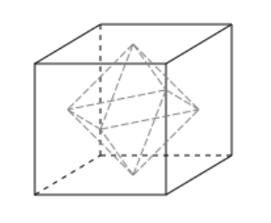

# Polyhedral Groups
{: .page-title}

The polyhedral groups are the symmetrices of the five platonic solids.

| Solid        | Polygon  | Faces | Vertices | Edges |
| Tetrahedron  | Triangle | 4     | 4        | 6     |
| Cube         | Square   | 6     | 8        | 12    |
| Octahedron   | Triangle | 8     | 6        | 12    |
| Dodecahedron | Pentagon | 12    | 20       | 30    |
| Icosahedron  | Triangle | 20    | 12       | 30    |

## Cube

> *Proposition.*{: .prop}
> Let $G^{+}$ be the group of all rotations of a cube, acting on the vertices. Then
>
> $$
  |G^{+}| = 24
  $$
>
> *Proof.*{: .prf}
>
> Choose a vertex as $1$. As the action is transitive, $\|\text{orb}(1)\| = 8$.
> The rotations that fixes $1$ are those in the axis through $1$ and the diagonally opposite vertex,
> so there are three of them and $\|\text{Stab}(1)\| = 3$.
>
> Hence,
>
> $$
  |G^{+}| = |\text{orb}(1)| \cdot |\text{Stab}(1)| = 8 \cdot 3 = 24
  $$

> *Proposition.*{: .prop}
> $G^{+} \cong S\_4$.
>
> *Proof.*{: .prf}
>
> Consider $G^{+}$ acting on the four diagonal of the cube, which gives a homomorphism $\varphi: G^{+} \to S\_4$.
> The rotation around axis through the top and bottom face gives $(1\;2\;3\;4) \in \text{im}\,\varphi$.
> The rotation around axis thorugh the mid point of edge containing $1$ and $2$ gives $(1\;2) \in \text{im}\,\varphi$.
> As $\Set{(1\;2), (1\;2\;3\;4)}$ generates $S\_4$, $\text{im}\,\varphi = S\_4$, i.e. $\varphi$ is surjective.
> But $\|G^{+}\| = \|S\_4\| = 24$, $\varphi$ is an isomorphism.

> *Proposition.*{: .prop}
> The group $G$ of all symmetries of the cube is isomorphic to $S\_4 \times C\_2$.
>
> *Proof.*{: .prf}
>
> Let $G$ acts on the vertices of the cube. Similarily, $\|\text{orb}(1)\| = 8$.
> The stablizer of $1$ is the identity, two rotations in axis through $1$ and three reflections through $1$ and edge coming out of $1$,
> so $\|\text{Stab}(1)\| = 6$. Thus, $\|G\| = 48$.
>
> The "reflection in midpoint" $\tau$ is the symmetry that commutes with all other symmetries.
> Also, $G^{+} \cap \tau = \Set{e}$. So
>
> $$
  \varphi: G^{+} \times \langle \tau \rangle \to G, (g, h) \mapsto gh
  $$
>
> is an injective homomorphism.
> It is also surjective as $\|G\| = \|S\_4 \times C\_2\|$.
> Hence, $G \cong S\_4 \times C\_2$.

## Octahedron

> *Proposition.*{: .prop}
> The group $G$ of all symmetries of the octahedron is isomorphic to $S\_4 \times C\_2$.
>
> *Proof.*{: .prf}
>
> Put each vertex of the octahedron on the centre of a face of the cube, and vice versa,
> the group of symmetries is isomorphic to that of cube.
>
> 

## Tetrahedron

> *Proposition.*{: .prop}
> Let $G^{+}$ be the group of all rotations of a tetrahedron, acting on the vertices. Then
>
> $$
  |G^{+}| = 12
  $$
>
> *Proof.*{: .prf}
>
> Choose a vertex as $1$. As the action is transitive, $\|\text{orb}(1)\| = 4$.
> The rotations that fixes $1$ is those in the axis through $1$ and the centre of opposite face,
> so there are three of them and $\|\text{Stab}(1)\| = 3$.
>
> Hence,
>
> $$
  |G^{+}| = |\text{orb}(1)| \cdot |\text{Stab}(1)| = 4 \cdot 3 = 12
  $$

> *Proposition.*{: .prop}
> $G^{+} \cong A\_4$.
>
> *Proof.*{: .prf}
>
> We have
>
> $$
  \begin{align*}
  (2\;3\;4), (2\;4\;3) &\in \text{Stab}(1) \\
  (1\;3\;4), (1\;4\;3) &\in \text{Stab}(2) \\
  (1\;2\;4), (1\;4\;2) &\in \text{Stab}(3) \\
  (1\;2\;3), (1\;3\;2) &\in \text{Stab}(4) \\
  \end{align*}
  $$
>
> Also, the rotations in axes through midpoints of opposite edges give $(1\;2)(3\;4), (1\;4)(2\;3), (1\;3)(2\;4)$.
> Hence, $G^{+} \cong A\_4$.

> *Proposition.*{: .prop}
> The group $G$ of all symmetries of the tetrahedron is isomorphic to $S\_4$.
>
> *Proof.*{: .prf}
>
> Let $G$ acts on the vertices of the tetrahedron, a homomorphism $\phi: G \to S\_4$.
> If all four vertices are fixed, the whole tetrahedron is fixed, so $\ker \phi = \Set{e}$ and $\phi$ is injective.
>
> The reflection throught $1$ and $2$ swaps $3$ and $4$, so
>
> $$
  \text{Stab}(1) = \langle (2\;3\;4), (3\;4) \rangle \cong D_6
  $$
>
> Therefore, $\|G\| = 4 \cdot 6 = 24$ and $\phi$ is surjective.
> Hence, $\phi$ is an isomorphism and $G \cong S\_4$.

## References

* [Julia Goedecke _Part IA - Groups_, 2017 - Chapter 8](https://www.julia-goedecke.de/pdf/GroupsNotes.pdf)
