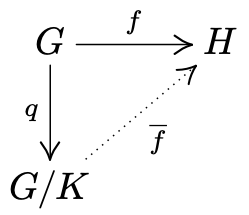

# Quotient Groups
{: .page-title}

The theory about quotient groups is one of the most important idea about groups.

## Normal Subgroups

> *Definition.*{: .def}
> A subgroup $K$ of $G$ is a **normal** subgroup if for all $a \in G$ and for all $k \in K$, we have $aka^{-1} \in K$.
> It is denoted by $K \trianglelefteq G$.

> *Lemma.*{: .lem}
> $K \trianglelefteq G \iff \forall a \in G, aK = Ka$.
>
> *Proof.*{: .prf}
>
> ($\Leftarrow$) If the left cosets of $K$ are equal to its right cosets,
> for all $a \in G$ and some $k, k' \in K$, we have
>
> $$
  \begin{align*}
  ak &= k'a \\
  aka^{-1} &= k'
  \end{align*}
  $$
>
> so $aka^{-1} \in K$ and $K \trianglelefteq G$.
>
> ($\Rightarrow$) If $K \trianglelefteq G$, for all $a \in G$ and $k \in K$, $aka^{-1} \in K$,
> we have $aka^{-1} = k'$ for some $k' \in K$ so $ak = k'a$ and $aK \subseteq Ka$.
> Also, we have $a^{-1}k(a^{-1})^{-1} = a^{-1}ka = k'$ for some $k' \in K$, so $ka = ak'$ and $Ka \subseteq aK$.
> Hence, $aK = Ka$.

> *Lemma.*{: .lem}
> $K \trianglelefteq G \iff \forall a \in G, aKa^{-1} = K$.
>
> *Proof.*{: .prf}
>
> ($\Leftarrow$) If for all $a \in G$, $aKa^{-1} = K$,
> then for all $k \in K$, $aka^{-1} = k'$ for some $k' \in K$. By definition, $K \trianglelefteq G$.
>
> ($\Rightarrow$) If $K \trianglelefteq G$, for all $a \in G$ and $k \in K$, $aka^{-1} \in K$,
> we have $aka^{-1} \in K$ so $aKa^{-1} \subseteq K$.
> Also, we have $a^{-1}ka \in K$, so $a(a^{-1}ka)a^{-1} = k \in aKa^{-1}$ and $K \subseteq aKa^{-1}$.
> Hence, $aKa^{-1} = K$.

> *Theorem.*{: .thm}
> Any subgroup of index $2$ is normal.
>
> *Proof.*{: .prf}
>
> If $K \le G$ is of index $2$, the only possible cosets are $K$ and $G \setminus K$ because $eK$/$Ke$ is one of the cosets and cosets are disjoint.
> As $eK = Ke$, the other right coset is also $G \setminus K$. So the left cosets and right cosets of $K$ are the same and $K \trianglelefteq G$.

> *Theorem.*{: .thm}
> Any subgroup of an abelian group is normal.
>
> *Proof.*{: .prf}
>
> For a subgroup $K \le G$, for all $a \in G$ and $k \in K$, $aka^{-1} = aa^{-1}k = k \in K$.
> Also, as $K$ is abelian, obviously $aK = Ka$ for all $a \in G$.

> *Definition.*{: .def}
> A group $G$ is **simple** if it has no non-trivial proper normal subgroups (i.e. only $\set{e}$ and G).

## Quotients

The left cosets of normal subgroups form a group in a natural way.

> *Definition.*{: .def}
> If $A$ and $B$ are subsets of $G$, the product $AB$ is the set of all products $ab$ where $a \in A$ and $b \in B$.

> *Lemma.*{: .lem}
> The product of two left cosets of a normal subgroup is again a left coset, i.e.
>
> $$
  (aK)(bK) = abK
  $$
>
> *Proof.*{: .prf}
>
> Each element of $(aK)(bK)$ has the form $akbk'$ for some $k, k' \in K$. Rewrite this as
>
> $$
  ab(b^{-1}kb)k'
  $$
>
> As $K$ is a normal subgroup, by definition, $b^{-1}kb = k'' \in K$. Hence,
>
> $$
  akbk' = ab(b^{-1}kb)k' = ab(k''k')
  $$
>
> and therefore $(aK)(bK) \subseteq abK$.
>
> Conversely, for any $abk \in abK$, $abk = (ae)(bk) \in (aK)(bK)$. Hence, $abK \subseteq (aK)(bK)$.

> *Theorem.*{: .thm}
> If $K$ is a normal subgroup of $G$, the set of all left cosets of $K$ in $G$ forms a group under multiplication.
>
> *Proof.*{: .prf}
>
> The above lemma shows that the multiplication of left cosets is closed.
> $(eK)(aK) = aK$ is the identity element.
> $(a^{-1}K)(aK) = eK$ so $a^{-1}K$ is the inverse of $aK$.
> Associativity is inherited from associativity in $G$.
> Hence, it is a group.

> *Definition.*{: .def}
> The **quotient group** (of factor group) of $G$ by $K$ is the group of left cosets of $K$ under multiplication, denoted by $G/K$.

## Isomorphism Theorem

The isomorphism theorem is about the relationship between normal subgroups, quotients and homomorphisms.

> *Theorem.*{: .thm}
> Every normal subgroup is the kernel of some homomorphisms, specifically,
> given $K \trianglelefteq G$, the map $q: G \to G/K$ sending $a$ to $aK$ is a surjective group homomorphism, called the **quotient map**.
>
> *Proof.*{: .prf}
>
> By definition,
>
> $$
  q(ab) = abK = (aK)(bK) = q(a)q(b)
  $$
>
> so $q$ is a homomorphism. $G/K$ is the group of all left cosets of $K$ so clearly $q$ is surjective.

> *Theorem.*{: .thm}
> Every kernel of homomorphisms is a normal subgroup.
>
> *Proof.*{: .prf}
>
> Let $f: G \to H$ be a homomorphism, $K = \ker f$ are the elements $k \in G$ such that $f(k) = e_H$.
> Therefore, for all $a \in G$, $f(aka^{-1}) = f(a)f(k)f(a^{-1}) = f(a)f(a)^{-1} = e_H$, so $aka^{-1} \in K$ and $\ker f \trianglelefteq G$.

We have already shown that [the image of a homomorphism is a subgroup](homomorphisms.md#image-is-subgroup). Furthermore,

> *Theorem.*{: .thm}
> The image of a homomorphism $f: G \to H$ is isomorphic to the quotient group $G/K$, where $K = \ker f$, i.e. $\text{im}\,f \cong G/K$.
>
> *Proof.*{: .prf}
>
> 
>
> Define $\bar{f}: G/K \to H$ by $\bar{f}(aK) = f(a)$ (so that $\bar{f}q = f$).
>
> If $aK = bK$, we have $b^{-1}a \in K$, so $f(b^{-1}a) = f(b)^{-1}f(a) = e$ and $f(a) = f(b)$.
> Therefore, $aK = bK \implies \bar{f}(aK) = \bar{f}(bK)$ so $\bar{f}$ is well-defined.
>
> If $\bar{f}(aK) = \bar{f}(bK)$, we have $f(a) = f(b) \implies f(b^{-1}a) = e$ and $b^{-1}a \in K$.
> Therefore, $aK = bK$ and $\bar{f}$ is injective.
>
> By definition, $\bar{f}$ is clearly surjective onto $\text{im}\,f$.
>
> So, $\bar{f}$ is an isomorphism and $G/K \cong \text{im}\,f$ ($\le H$).

In particular,
if $f: G \to H$ is injective, then $\ker f = \set{e}$ ([injectivity via kernel](homomorphisms.md#injectivity-via-kernel)),
so $G/K \cong G$ and $G$ is isomorphic to a subgroup of $H$, denoted by $G \lesssim H$.
If $f: G \to H$ is surjective, then $\text{im} f = H$,
so $G/K \cong H$.

## References

* [Julia Goedecke _Part IA - Groups_, 2017 - Chapter 5](https://www.julia-goedecke.de/pdf/GroupsNotes.pdf)
