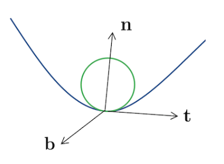

# Curves and Surfaces
{: .page-title}

## Curves

> *Definition.*{: .def}
> A **parameterised curve** $C$ is a map of the form $\mathbf{r}: \mathbb{R} \to \mathbb{R}^3$.

We can also represent a surface by $y = f(x)$ and $z = g(x)$ or $F(x, y z) = 0$ and $G(x, y, z) = 0$ in which the curve is the intersection of two planes.
We can convert them into parametric form by for example, having

$$
\mathbf{r}(u) = u \mathbf{i} + f(u) \mathbf{j} + g(u) \mathbf{k}
$$

> *Definition.*{: .def}
> A curve is said to be **smooth** if its derivative exists everywhere.

> *Definition.*{: .def}
> A parameterisation is **regular** if $\mathbf{\dot{r}}(u) \not= 0$ for any $u$.

The choice of parameterisation is not unique, e.g. both $\mathbf{f}(u) = (\cos u, \sin u, u)$ and $\mathbf{g}(u) = (\cos \lambda u, \sin \lambda u, \lambda u)$
represents the same helix. Some of the properties depend on the parameterisation but some are not, in which will be our primary interest.

> *Definition.*{: .def}
> The **arc length** is the distance between two points along a curve, which is a scalar quantity.

> *Proposition.*{: .prop}
> The arc length $s$ between $u_1$ to $u_2$ along a curve $\mathbf{r}(u)$ is given by
>
> $$
  s = \int_{u_1}^{u_2} \sqrt{ {d\mathbf{r} \over du} \cdot {d\mathbf{r} \over du} } \,du
  $$
>
> *Proof.*{: .prf}
>
> Consider an infinitesimal vector displacement
>
> $$
  d\mathbf{r} = dx^i e_i
  $$
>
> along the curve. The square of the infinitesimal distance moved is then given by
>
> $$
  (ds)^2 = dx^idx^i = d\mathbf{r} \cdot d\mathbf{r}
  $$
>
> and therefore
>
> $$
  \left( ds \over du \right)^2 = {d\mathbf{r} \over du} \cdot {d\mathbf{r} \over du}
  $$
>
> Hence, the arc length between point $A$ and point $B$ is
>
> $$
  s = \int_{u_1}^{u_2} \sqrt{ {d\mathbf{r} \over du} \cdot {d\mathbf{r} \over du} } \,du
  $$

From the above, we can see that

$$
{ds \over du} = \pm \left| {d\mathbf{r} \over du} \right|
$$

The $\pm$ sign depends on which direction we chose as the "positive" direction of $s$ from a reference point.
If $u$ traces the curve in the "positive" direction of $s$ then $ds/du = \vert d\mathbf{r}/du \vert$.

> *Proposition.*{: .prop}
> The arc length $s$ is independent of the choice of parameterisation.
>
> *Proof.*{: .prf}
>
> Let $\mathbf{r}(\tau(u))$ be a different parameterisation with $d\tau/du > 0$. By chain rule,
>
> $$
  {d\mathbf{r} \over du} = {d\mathbf{r} \over d\tau} {d\tau \over dt}
  $$
>
> Hence,
>
> $$
  s = \int_{u_1}^{u_2} \sqrt{ {d\mathbf{r} \over du} \cdot {d\mathbf{r} \over du} } \,du
  = \int_{u_1}^{u_2} \sqrt{ {d\mathbf{r} \over d\tau} \cdot {d\mathbf{r} \over d\tau} } { d\tau \over du} \,du
  = \int_{\tau(u_1)}^{\tau(u_2)} \sqrt{ {d\mathbf{r} \over d\tau} \cdot {d\mathbf{r} \over d\tau} } \,d\tau
  $$

It means that arc length itself is a natural parameterisation of the curve.
We can set a certain point on the curve as reference point, i.e. $s = 0$, choose the "positive" direction, and every point on the curve will be associated with a unique value of $s$.

> *Proposition.*{: .prop}
> A curve parameterised by its arc length always has unit tangent vector, i.e. $\vert d\mathbf{r}/ds \vert = 1$, and is denoted by $\mathbf{t}$.
>
> *Proof.*{: .prf}
>
> From the above, we have $(ds/du)^2 = (d\mathbf{r}/du) \cdot (d\mathbf{r}/du)$. Hence,
>
> $$
  {d\mathbf{r} \over du} = {d\mathbf{r} \over ds} {d\mathbf{s} \over du}
  \implies {d\mathbf{r} \over ds} = {1 \over ds/du}{d\mathbf{r} \over du} = {1 \over |d\mathbf{r} / du|}{d\mathbf{r} \over du}
  $$

> *Definition.*{: .def}
> The **curvature** $\kappa$ is the magnitude of the rate of change of $\mathbf{t}$ with respect to $s$, i.e.
>
> $$
  \kappa(s) = \left| {d\mathbf{t} \over ds } \right| = \left| {d^2\mathbf{x} \over ds^2 } \right|
  $$

> *Definition.*{: .def}
> The **principal normal** is the unit vector $\mathbf{n}$ defined by
>
> $$
  \mathbf{n} = {1 \over \kappa} {d\mathbf{t} \over ds}
  $$

> *Proposition.*{: .prop}
> The principal normal is orthogonal to the tangent vector.
>
> *Proof.*{: .prf}
>
> Since $\mathbf{t} \cdot \mathbf{t} = \vert \mathbf{t} \vert^2 = 1$ which is independent of $s$, we have
>
> $$
  {d \over ds} (\mathbf{t} \cdot \mathbf{t}) = 2\mathbf{t} \cdot {d\mathbf{t} \over ds} = 0
  $$
>
> Therefore, $d\mathbf{t}/ds$ is orthogonal to $\mathbf{t}$ and so as $\mathbf{n}$.

The principal normal indicates the direction of the curve's turn so it always points towards the "inside" or the concave side of the curve.

> *Definition.*{: .def}
> The **binormal** is the unit vector defined by $\mathbf{b} = \mathbf{t} \times \mathbf{n}$.

> *Definition.*{: .def}
> The **osculating plane** is the plane containing $\mathbf{t}$ and $\mathbf{n}$ with normal $\mathbf{b}$.
> The **osculating circle** is a circle in the plane touching the cursve at $s$ with curvature matches $\kappa(s)$.

Note that the three vectors $\mathbf{t}$, $\mathbf{n}$ and $\mathbf{b}$ define an orthonormal basis for $\mathbb{R}^3$ at each point $s$ along the curve, which twists and turns along the curve.

> *Proposition.*{: .prop}
> $d\mathbf{b}/ds$ is orthogonal to both $\mathbf{b}$ and $\mathbf{t}$ and therefore parallel to $\mathbf{n}$.
>
> *Proof.*{: .prf}
>
> Since $\vert \mathbf{b} \vert = 1$ for all $s$, we have $\mathbf{b} \cdot d\mathbf{b}/ds = 0$.
>
> Since $\mathbf{t} \cdot \mathbf{b} = 0$, differentiating it and we have
>
> $$
  0 = \kappa \mathbf{n} \cdot \mathbf{b} + \mathbf{t} \cdot {d \mathbf{b} \over ds}
  $$
>
> and $\mathbf{n} \cdot \mathbf{b} = 0$ so $\mathbf{t} \cdot d\mathbf{b}/ds = 0$

> *Definition.*{: .def}
> The **torsion** is the measure of how the binormal changes, defined by
>
> $$
  {d\mathbf{b} \over ds} = -\tau \mathbf{n}
  $$

> *Proposition.*{: .prop}
> **[Frenet-Serret Equations]**
>
> $$
  {d\mathbf{t} \over ds} = \kappa \mathbf{n}
  \qquad
  {d\mathbf{b} \over ds} = -\tau \mathbf{n}
  \qquad
  {d\mathbf{n} \over ds} = \tau \mathbf{b} - \kappa \mathbf{t}
  $$
>
> *Proof.*{: .prf}
>
> Since $\mathbf{b} \times \mathbf{t} = \mathbf{n}$, differentiating it and we have
>
> $$
  {d\mathbf{n} \over ds}
  = {d\mathbf{b} \over ds} \times \mathbf{t} + \mathbf{b} \times {d\mathbf{t} \over ds}
  = -\tau (\mathbf{n} \times \mathbf{t}) + \kappa (\mathbf{b} \times \mathbf{n})
  = \tau \mathbf{b} - \kappa \mathbf{t}
  $$

## Surfaces

> *Definition.*{: .def}
> A **parameterised surface** $S$ is a map of the form $\mathbf{r}: \mathbb{R}^2 \to \mathbb{R}^3$.

We can also represent a surface by $z = f(x, y)$ or $F(x, y, z) = 0$ and convert them to parametric form by for example, having

$$
\mathbf{r}(u, v) = u \mathbf{i} + v \mathbf{j} + f(u, v) \mathbf{k}
$$

> *Definition.*{: .def}
> The two curves $u = $ constant and $v = $ constant passing through $P$ on $S$ are called **coordinate curves**.

> *Definition.*{: .def}
> A **normal vector** $\mathbf{n}$ of $P$ on $S$ is the vector which points perpendicularly away from the surface.
> For the parameterised surface $\mathbf{r}(u, v) \in \mathbb{R}^3$, the normal direction is
>
> $$
  \mathbf{n} = {\partial \mathbf{r} \over \partial u} \times {\partial \mathbf{r} \over \partial v}
  $$
>
> It is the normal vector of the **tangent plane**.

The sign of the normal vector determines what we mean by "outside" and "inside" the surface, and

> *Definition.*{: .def}
> A surface is **orientable** if there is a consistent choice of unit normal which varies smoothly over the surface.

> *Proposition.*{: .prop}
> An infinitesimal vector displacement $d\mathbf{r}$ in the position of $P$ is given by
>
> $$
  d\mathbf{r} = {\partial \mathbf{r} \over \partial u} du + {\partial \mathbf{r} \over \partial v} dv
  $$

> *Proposition.*{: .prop}
> The area of the infinitesimal parallelogram whose sides are the coordinate curves is
>
> $$
  dS = \left| {\partial \mathbf{r} \over \partial u} du \times {\partial \mathbf{r} \over \partial v} dv \right|
  = \left| {\partial \mathbf{r} \over \partial u} \times {\partial \mathbf{r} \over \partial v} \right| \,du \,dv
  = |\mathbf{n}| \,du \,dv
  $$

> *Definition.*{: .def}
> A parameterisation is **regular** if $\mathbf{n} \not= 0$ anywhere on the surface.

> *Definition.*{: .def}
> A surface $S$ can have a **boundary** which is a piecewise smooth closed curve, denoted by $\partial S$.

For example, a sphere truncated by the $z = 0$ plane has boundary $x^2 + y^2 = R^2$ in the $z = 0$ plane.

> *Proposition.*{: .prop}
> The boundary of a boundary has no boundary, i.e. $\partial^2 = 0$.

> *Definition.*{: .def}
> A surface is **bounded** if it can be contained within some solid sphere of fixed radius, otherwise it is **unbounded**.

> *Definition.*{: .def}
> A bounded surface with no boundary is **closed**.

## References

* David Tong _Vector Calculus Lecture Notes_, 2024 - Chapter 1.1, 2.2
* K.F. Riley _Mathematical Methods for Physicists and Engineers_, 1998 - Chapter 10.3, 10.5
