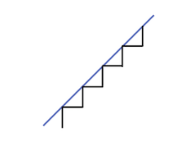
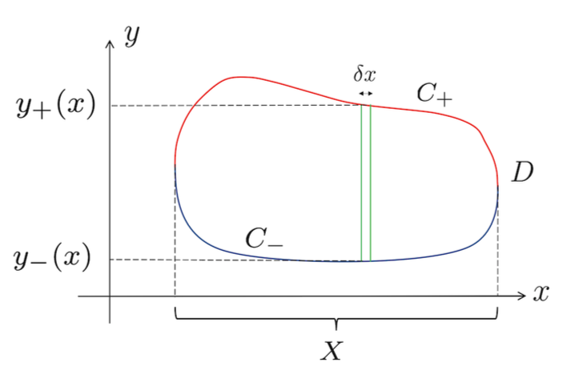

# Divergence Theorem
{: .page-title}

The fundamental theorem of calculus states that integration is the inverse of differentiation.
The result can be generalized to vector differential operators which also gives some intuition of their meaning.
We start with the divergence theorem.

The divergence theorem relates the total flux of a vector field out of a closed surface $S$
to the integral of the divergence of the vector field over the enclosed volume $V$, in the form of

$$
\int_V \nabla \cdot \mathbf{F} \,dV = \int_S \mathbf{F} \cdot d\mathbf{S}
$$

To get some intuition geometrically, we take the volume $V$ and divide it up into a bunch of small cubes.
A given cube $V_\mathbf{x}$ has one corner sitting at $\mathbf{x}$ and sides of lenght $\delta x$, $\delta y$ and $\delta z$.

The flux of $\mathbf{F}$ through the two colored sides is given by

$$
[F_x(x + \delta x, y, z) - F_x(x, y, z)] \delta y \delta z \approx { \partial F_x \over \partial x} \delta x \delta y \delta z
$$

with a minus sign on the second term becaue the the outward normal is pointing at the opposite direction.
Summing over six sides, the total flux is then

$$
\int_{V_\mathbf{x}} \mathbf{F} \cdot d\mathbf{S}
= \left( {\partial F_x \over \partial x} + {\partial F_y \over \partial y} + {\partial F_z \over \partial z} \right) \delta x \delta y \delta z
= \nabla \cdot \mathbf{F} \,\delta x \,\delta y \,\delta z
$$

While summing the above expression over these small cubes of the volume $V$, for the R.H.S. we get a volume integral.
For the L.H.S., since the adjacent cubes share the same side, they cancel out and what left is the boundary surface $\partial V = S$.

Hence, we can claim that

$$
\int_S \mathbf{F} \cdot d\mathbf{S} = \int_V \nabla \cdot \mathbf{F} \,dV
$$

However, this argument has an issue that the small cubes might not be able to approximate the smooth boundary
similar to the fact that we can't approximate a tilted line by our horizontal and vertical line segments.

To give a rigorous proof of the theorem, we first consider the $\mathbb{R}^2$ case which is interesting enough by itself.

> *Theorem.*{: .thm}
> **[2D Divergence Theorem]**
> Suppose that $\mathbf{F}: \mathbb{R}^2 \to \mathbb{R}^2$ is a vector field. Then
>
> $$
  \int_D \nabla \cdot \mathbf{F} \,dA = \int_C \mathbf{F} \cdot \mathbf{n} \,ds
  $$
>
> where $D$ is a region in $\mathbb{R}^2$, bounded by the closed curve $\mathbf{C}$ and $\mathbf{n}$ is the outward normal to $\mathbf{C}$.
>
> *Proof.*{: .prf}
>
> For simplicity, assume that $\mathbf{F}$ is uni-directional, e.g. $\mathbf{F} = F(x, y) \mathbf{j}$.
> The same argument applies to $\mathbf{F}$ pointing solely in the $x$-direction and a general $\mathbf{F}$ is a linear sum of the two.
>
> We then have
>
> $$
  \begin{align*}
  \int_D \nabla \cdot \mathbf{F} \,dA
  &= \int_X dx \int_{y_-(x)}^{y_+(x)} dy \, {\partial F \over \partial y} \\
  &= \int_X dx \left( F(x, y_+(x)) - F(x, y_-(x)) \right)
  \end{align*}
  $$
>
> where $y_+(x)$ are values on the upper curve $C_+$ and $y_-(x)$ are that of lower curve $C_-$.
>
> 
>
> While transversing the upper curve $C_+$, we have
>
> $$
  \delta x = \cos \theta \,\delta s = \mathbf{j} \cdot \mathbf{n} \,\delta s
  $$
>
> For the lower curve $C_-$, the normal points to the opposite direction so $\mathbf{j} \cdot \mathbf{n}$ is negative,
> but $\delta x$ and $\delta s$ are both positive therefore
>
> $$
  \delta x = - \mathbf{j} \cdot \mathbf{n} \,\delta s
  $$
>
> Hence,
>
> $$
  \begin{align*}
  \int_D \nabla \cdot \mathbf{F} \,dA
  &= \int_X ds \left( \mathbf{n} \cdot \mathbf{F}(x, y_+(x)) + \mathbf{n} \cdot \mathbf{F}(x, y_-(x)) \right) \\
  &= \int_{C_+} \mathbf{F} \cdot \mathbf{n} \,ds + \int_{C_-} \mathbf{F} \cdot \mathbf{n} \,ds \\
  &= \int_{C} \mathbf{F} \cdot \mathbf{n} \,ds
  \end{align*}
  $$
>
> In case of the vertical line cutting the boundary $C$ more than twice somewhere,
> we can decompose the curve into multiple pieces and apply the same strategy.

> *Theorem.*{: .thm}
> **[Divergence/Gauss' Theorem]**
> For a smooth vector field $\mathbf{F}(\mathbf{x})$ over $\mathbb{R}^3$,
>
> $$
  \int_V \nabla \cdot \mathbf{F} \,dV = \int_S \mathbf{F} \cdot d\mathbf{S}
  $$
>
> where $V$ is a bounded region whose boundary $\partial V = S$ is a piecewise smooth closed surface.
>
> *Proof.*{: .prf}
>
> Similarily, consider a vector field with only $z$ component, i.e. $\mathbf{F} = F(x, y, z) \mathbf{k}$.
> We have
>
> $$
  \begin{align*}
  \int_V \nabla \cdot \mathbf{F} \,dV
  &= \int_S dS \int_{z_-(x, y)}^{z_+(x, y)} dz {\partial F \over \partial z} \\
  &= \int_S dS \left( F(x, y, z_+(x, y)) - F(x, y, z_-(x, y)) \right)
  \end{align*}
  $$
>
> where $S_+: (x, y, z_+(x, y)$ and $S_-: (x, y, z_-(x, y))$ are the upper and lower surfaces bounding the volume $V$.
>
> Since for surface $S: (x, y, z(x, y))$,
>
> $$
  \mathbf{n} = \left| {\partial \mathbf{x} \over \partial x} \times {\partial \mathbf{x} \over \partial y} \right|
  = |(1, 0, z_x) \times (0, 1, z_y)|
  = (-z_x, -z_y, 1)
  $$
>
> For the upper surface $S_+$, we have
>
> $$
  \mathbf{F} \cdot d\mathbf{S} = F \,dS \,(\mathbf{k} \cdot \mathbf{n}) = F \,dS
  $$
>
> and for lower surface $S_-$, since the normal is pointing to the opposite direction,
>
> $$
  \mathbf{F} \cdot d\mathbf{S} = - F \,dS
  $$
>
> Hence,
>
> $$
  \int_V \nabla \cdot \mathbf{F} \,dV
  = \int_{S_+} \mathbf{F} \cdot d\mathbf{S} + \int_{S_-} \mathbf{F} \cdot d\mathbf{S}  \\
  = \int_S \mathbf{F} \cdot d\mathbf{S}
  $$

With the same technique, we can generalize divergence theorem for vector field in $\mathbb{R}^n$.

## For Scalar Field

> *Corollary.*{: .cor}
> **[Divergence Theorem for Scalar Fields]**
> Suppose that $\phi$ is a scalar field and $S = \partial V$, then
>
> $$
  \int_V \nabla \phi \,dV = \int_S \phi \,d\mathbf{S}
  $$
>
> *Proof.*{: .prf}
>
> Let $\mathbf{F} = \phi \mathbf{a}$ where $\mathbf{a}$ is a constant vector, we have
>
> $$
  \int_V \nabla \cdot (\phi \mathbf{a}) \,dV = \int_S \phi \mathbf{a} \cdot d\mathbf{S}
  \quad\implies\quad
  \mathbf{a} \cdot \left( \int_V \nabla \phi \,dV - \int_S \phi \,d\mathbf{S} \right) = 0
  $$

## For Curl

> *Corollary.*{: .cor}
> Suppose that $\mathbf{F}$ is a vector field and $S = \partial V$, then
>
> $$
  \int_V \nabla \times \mathbf{F} \,dV = \int_S d\mathbf{S} \times \mathbf{F}
  $$
>
> *Proof.*{: .prf}
>
> Consider the vector field $\mathbf{a} \times \mathbf{F}$ where $\mathbf{a}$ is a constant vector, we have
> $\nabla \cdot (\mathbf{a} \times \mathbf{F}) = -\mathbf{a} \cdot (\nabla \times \mathbf{F})$.
>
> Hence,
>
> $$
  \begin{align*}
  \int_V \nabla \cdot (\mathbf{a} \times \mathbf{F}) \,dV &= \int_S (\mathbf{a} \times \mathbf{F}) \cdot d\mathbf{S} \\
  - \mathbf{a} \cdot \int_V \nabla \times \mathbf{F} \,dV &= \mathbf{a} \cdot \int_S \mathbf{F} \times d\mathbf{S} \\
  \int_V \nabla \times \mathbf{F} \,dV &= \int_S d\mathbf{S} \times \mathbf{F}
  \end{align*}
  $$

## Integral Form of Differential Operators

The divergence theorem provides a way to define divergence geometrically.
Consider the integration of $\nabla \cdot \mathbf{F}$ over some region of volume $V$ centered at $\mathbf{x}$.
If the region is small enough, $\nabla \cdot \mathbf{F}$ is roughly constant and so

$$
\int_V \nabla \cdot \mathbf{F} \,dV \approx V \nabla \cdot \mathbf{F}(\mathbf{x})
$$

By divergence theorem, we can conclude the following.

> *Definition.*{: .def}
> The divergence of a vector field $\mathbf{F}$ can be defined by
>
> $$
  \nabla \cdot \mathbf{F} = \lim_{V \to 0} {1 \over V} \int_S \mathbf{F} \cdot d\mathbf{S}
  $$
>
> which is coordinate independent.

Therefore, divergence of a vector field is the net flow into or out of a region.
If $\nabla \cdot \mathbf{F} > 0$ at some point $\mathbf{x}$, then there is a net flow out of that point.
If $\nabla \cdot \mathbf{F} < 0$ at some point $\mathbf{x}$, then there is a net flow inwards.

Similarily, we have the following integral form for $\nabla \phi$ and $\nabla \times \mathbf{F}$.

> *Definition.*{: .def}
> The gradient of a scalar field $\phi$ can be defined by
>
> $$
  \nabla \phi = \lim_{V \to 0} {1 \over V} \int_S \phi \,d\mathbf{S}
  $$

> *Definition.*{: .def}
> The gradient of a scalar field $\phi$ can be defined by
>
> $$
  \nabla \times \mathbf{F} = \lim_{V \to 0} {1 \over V} \int_S d\mathbf{S} \times \mathbf{F}
  $$

## References

* Stephen J. Cowley _Vector Calculus Lectures Notes_, 2000 - Chapter 6.1
* David Tong _Vector Calculus Lecture Notes_, 2024 - Chapter 4.1, 4.2
* K.F. Riley _Mathematical Methods for Physicists and Engineers_, 1998 - Chapter 11.7, 11.8
