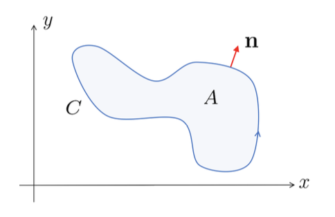
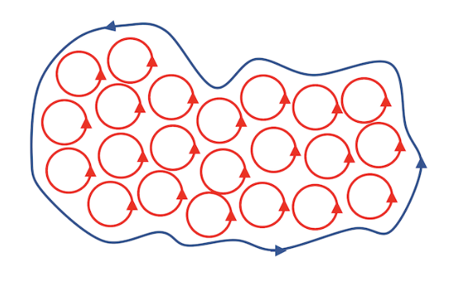

# Green's and Stokes' Theorems
{: .page-title}

We continue our discussion of theorems that reduce higher order integral to a lower order one just like the divergence theorem.
Two of the important ones are _Green's Theorem_ and _Stokes' Theorem_.

## Green's Theorem

Green's Theorem is equivalent to the 2D Divergence Theorem which focuses more on actual evaluation of the integral.

> *Theorem.*{: .thm}
> **[Green's Theorem]**
> Let $P(x, y)$ and $Q(x, y)$ be smooth functions on $\mathbb{R}^2$. Then
>
> $$
  \int_A \left( {\partial Q \over \partial x} - {\partial P \over \partial y} \right) \,dA = \oint_C P \,dx + Q \,dy
  $$
>
> where $A$ is a bounded region in the plane and $C = \partial A$ is a piecewise smooth,
> non-intersecting closed curve which is traversed anti-clockwise.
>
> *Proof.*{: .prf}
>
> Let $\mathbf{F} = (Q, -P)$ be a vector field in $\mathbb{R}^2$. We then have
>
> $$
  \int_A \nabla \cdot \mathbf{F} \,dA = \int_A \left( {\partial Q \over \partial x} - {\partial P \over \partial y} \right) \,dA
  $$
>
> Let $\mathbf{x}(s) = (x(s), y(s))$ be the parameterisation of $C$. Then the normal vector
>
> $$
  \mathbf{n} = (y'(s), -x'(s))
  $$
>
> which points outward provided that the arc length $s$ increases in the anti-clockwise direction.
>
> 
>
> We then have
>
> $$
  \mathbf{F} \cdot \mathbf{n} = Q {dy \over ds} + P {dx \over ds}
  $$
>
> and so the integral is
>
> $$
  \int_C \mathbf{F} \cdot \mathbf{n} \,ds = \int_C P \,dx + Q \,dy
  $$
>
> By divergence theorem, the L.H.S of the two equations are equal and so as the R.H.S.

## Stokes' Theorem

Stokes' Theorem is an extension of Green's Theorem, where the surface is no longer restricted to lie in a plane.

> *Theorem.*{: .thm}
> **[Stokes' Theorem]**
> Let $S$ be a smooth surface in $\mathbb{R}^3$ parameterised by $\mathbf{r}$ with a piecewise smooth curve $C = \partial S$ as boundary.
> For any smooth vector field $\mathbf{F}$, we have
>
> $$
  \int_S \nabla \times \mathbf{F} \cdot d\mathbf{S} = \oint_C \mathbf{F} \cdot d\mathbf{r}
  $$
>
> *Proof.*{: .prf}
>
> For a surface $S$ parameterised by $\mathbf{r}(u, v)$, we have
>
> $$
  d\mathbf{S} = \left( { \partial \mathbf{r} \over \partial u } \times { \partial \mathbf{r} \over \partial v } \right) \,du \,dv
  $$
>
> Therefore, for a vector field $\mathbf{F}$, we have
>
> $$
  \begin{align*}
  \nabla \times \mathbf{F} \cdot d\mathbf{S}
  &= \left( \varepsilon_{ijk} {\partial F_k \over \partial x_j} \right) \left( \varepsilon_{ipq} {\partial x_p \over \partial u} {\partial x_q \over \partial v} \right) \,du \,dv \\
  &= (\delta_{jp}\delta_{kq} - \delta_{jq}\delta_{kp}) {\partial F_k \over \partial x_j} {\partial x_p \over \partial u} {\partial x_q \over \partial v} \,du \,dv \\
  &= \left({\partial F_k \over \partial x_j} {\partial x_j \over \partial u} {\partial x_k \over \partial v} - {\partial F_k \over \partial x_j} {\partial x_k \over \partial u} {\partial x_j \over \partial v} \right) \,du \,dv \\
  &= \left({\partial F_k \over \partial u} {\partial x_k \over \partial v} - {\partial F_k \over \partial v} {\partial x_k \over \partial u} \right) \,du \,dv \\
  &= \left[{\partial \over \partial u} \left( F_k {\partial x_k \over \partial v} \right) - {\partial \over \partial v} \left( F_k {\partial x_k \over \partial u} \right) \right] \,du \,dv
  \end{align*}
  $$
>
> Hence,
>
> $$
  \begin{align*}
  \int_S \nabla \times \mathbf{F} \cdot d\mathbf{S}
  &= \iint_A \left[{\partial \over \partial u} \left( F_k {\partial x_k \over \partial v} \right) - {\partial \over \partial v} \left( F_k {\partial x_k \over \partial u} \right) \right] \,du \,dv \\
  &= \int_C F_k {\partial x_k \over \partial u} \,du + F_k {\partial x_k \over \partial v} \,dv \\
  &= \oint_C F_k \,dx_k = \oint_C \mathbf{F} \cdot d\mathbf{r}
  \end{align*}
  $$
>
> where the second last line follows from Green's Theorem with $P = F_k \partial_u x_k$ and $Q = F_k \partial_v x_k$.

The orientations of $\mathbf{S}$ and $\mathbf{C}$ should be compatible.
If the surface has normals pointing upward, then the orientation of $C$ is anti-clockwise,
i.e. $\mathbf{t} \times \mathbf{n}$ points out of $S$.

Stokes' Theorem thus states that the flux of $\nabla \times \mathbf{F}$ across an open surface $S$
is equal to the circulation of $\mathbf{F}$ round the bounding curve $C$.

Stokes' Theorem also gives us another intuition for the meaning of curl.
By integrating $\nabla \times \mathbf{F}$ over a small enough surface such that $\nabla \times \mathbf{F}$ is approximately constant, we have

$$
\int_S \nabla \times \mathbf{F} \cdot d\mathbf{S} \approx A \mathbf{n} \cdot (\nabla \times \mathbf{F})
$$

where $A$ is the area and $\mathbf{n}$ is the normal. By limiting the area $A$ to zero, we can conclude the following.

> *Corollary.*{: .cor}
> The curl of a vector field $\mathbf{F}$ can be defined by
>
> $$
  \mathbf{n} \cdot (\nabla \times \mathbf{F}) = \lim_{A \to 0} {1 \over A} \int_C \mathbf{F} \cdot d\mathbf{x}
  $$
>
> which is coordinate independent.

Geometrically, it means the value of $\nabla \times \mathbf{F}$ in the direction of $\mathbf{n}$ is the local circulation of $\mathbf{F}$ in the plane normal to $\mathbf{n}$.
When we integrate this circulation over some surface $S$, most of it cancels out and the only thing that's left is the circulation around the edge.

> *Corollary.*{: .cor}
> A vector field is conservative iff the field is irrotational, i.e.
>
> $$
  \mathbf{F} = \nabla \phi \iff \nabla \times \mathbf{F} = 0
  $$
>
> *Proof.*{: .prf}
>
> ($\Rightarrow$) As shown [before](differential-operators.md#curl-of-gradient), the curl of the gradient field is always zero, i.e. $\nabla \times (\nabla \phi) = 0$
>
> ($\Leftarrow$) Suppose that $\nabla \times \mathbf{F} = 0$. By Stokes' Theorem, we have
>
> $$
  \int_S \nabla \times \mathbf{F} \cdot d\mathbf{S} = \oint_C \mathbf{F} \cdot d\mathbf{x} = 0
  $$
>
> which is the definition of conservativity.

> *Corollary.*{: .cor}
> For a smooth scalar field $\phi$, we have
>
> $$
  \int_S \nabla \phi \times d\mathbf{S} = - \oint_C \phi \,d\mathbf{x}
  $$
>
> *Proof.*{: .prf}
>
> Let $\mathbf{a}$ be an arbitrary vector and $\mathbf{F} = \mathbf{a} \phi$, then
>
> $$
  \int_S \nabla \times (\mathbf{a} \phi) \cdot d\mathbf{S}
  = \oint_C \phi \mathbf{a} \cdot d\mathbf{x}
  = \mathbf{a} \cdot \oint_C \phi d\mathbf{x}
  $$
>
> But
>
> $$
  \begin{align*}
  \nabla \times (\mathbf{a} \phi) \cdot d\mathbf{S}
  &= \left( \varepsilon_{ijk} { \partial a_k \phi \over \partial x_j } \right) n_i \,dS \\
  &= a_k \left( \varepsilon_{kij} \,n_i { \partial \phi \over \partial x_j } \right) \,dS \\
  &= \mathbf{a} \cdot (\mathbf{n} \times \nabla \phi) \,dS \\
  &= - \mathbf{a} \cdot (\nabla \phi \times \mathbf{n}) \,dS
  \end{align*}
  $$
>
> and hence
>
> $$
  - \mathbf{a} \cdot \int_S \nabla \phi \times d\mathbf{S} = \mathbf{a} \cdot \oint_C \phi \,d\mathbf{x} \\
  $$
>
> and $\mathbf{a}$ is arbitrary so
>
> $$
  \int_S \nabla \phi \times d\mathbf{S} = - \oint_C \phi \,d\mathbf{x}
  $$

## References

* Stephen J. Cowley _Vector Calculus Lectures Notes_, 2000 - Chapter 6.2, 6.3
* David Tong _Vector Calculus Lecture Notes_, 2024 - Chapter 4.3, 4.4
* K.F. Riley _Mathematical Methods for Physicists and Engineers_, 1998 - Chapter 11.9
