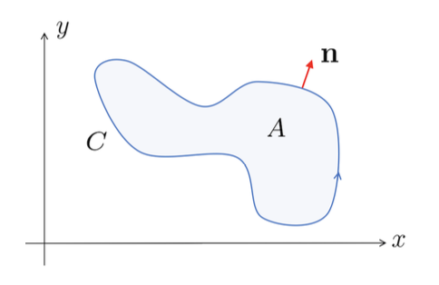

# Green's and Stokes' Theorems
{: .page-title}

We continue our discussion of theorems that reduce higher order integral to a lower order one just like the divergence theorem.
Two of the important ones are _Green's Theorem_ and _Stokes' Theorem_.

## Green's Theorem

Green's Theorem is equivalent to the 2D divergence theorem.

> *Theorem.*{: .thm}
> Let $P(x, y)$ and $Q(x, y)$ be smooth functions on $\mathbb{R}^2$. Then
>
> $$
  \int_A \left( {\partial Q \over \partial x} - {\partial P \over \partial y} \right) \,dA = \oint_C P \,dx + Q \,dy
  $$
>
> where $A$ is a bounded region in the plane and $C = \partial A$ is a piecewise smooth,
> non-intersecting closed curve which is traversed anti-clockwise.
>
> *Proof.*{: .prf}
>
> Let $\mathbf{F} = (Q, -P)$ be a vector field in $\mathbb{R}^2$. We then have
>
> $$
  \int_A \nabla \cdot \mathbf{F} \,dA = \int_A \left( {\partial Q \over \partial x} - {\partial P \over \partial y} \right) \,dA
  $$
>
> Let $\mathbf{x}(s) = (x(s), y(s))$ be the parameterisation of $C$. Then the normal vector
>
> $$
  \mathbf{n} = (y'(s), -x'(s))
  $$
>
> which points outward provided that the arc length $s$ increases in the anti-clockwise direction.
>
> 
>
> We then have
>
> $$
  \mathbf{F} \cdot \mathbf{n} = Q {dy \over ds} + P {dx \over ds}
  $$
>
> and so the integral is
>
> $$
  \int_C \mathbf{F} \cdot \mathbf{n} \,ds = \int_C P \,dx + Q \,dy
  $$
>
> By divergence theorem, the L.H.S of the two equations are equal and so as the R.H.S.

## Stokes' Theorem

## References

* Stephen J. Cowley _Vector Calculus Lectures Notes_, 2000 - Chapter 6.2, 6.3
* David Tong _Vector Calculus Lecture Notes_, 2024 - Chapter 4.3, 4.4
* K.F. Riley _Mathematical Methods for Physicists and Engineers_, 1998 - Chapter 11.9
