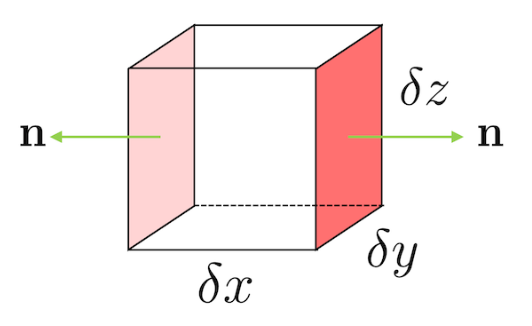
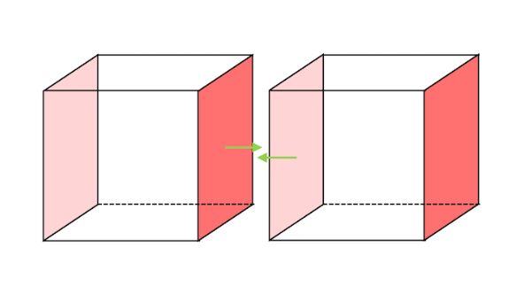
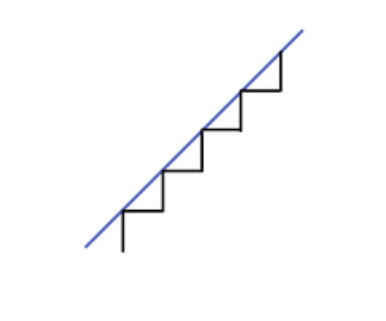
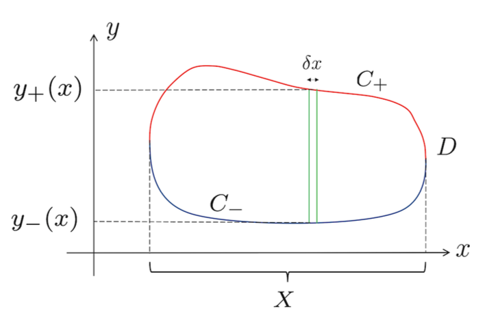

# Integral Theorems
{: .page-title}

The fundamental theorem of calculus states that integration is the inverse of differentiation.
The result can be generalized to vector differential operators which also gives some intuition of their meaning.

## Divergence Theorem

The divergence theorem relates the total flux of a vector field out of a closed surface $S$
to the integral of the divergence of the vector field over the enclosed volume $V$, in the form of

$$
\int_V \nabla \cdot \mathbf{F} \,dV = \int_S \mathbf{F} \cdot d\mathbf{S}
$$

To get some intuition geometrically, we take the volume $V$ and divide it up into a bunch of small cubes.
A given cube $V_\mathbf{x}$ has one corner sitting at $\mathbf{x}$ and sides of lenght $\delta x$, $\delta y$ and $\delta z$.

The flux of $\mathbf{F}$ through the two colored sides is given by

$$
[F_x(x + \delta x, y, z) - F_x(x, y, z)] \delta y \delta z \approx { \partial F_x \over \partial x} \delta x \delta y \delta z
$$

with a minus sign on the second term becaue the the outward normal is pointing at the opposite direction.
Summing over six sides, the total flux is then

$$
\int_{V_\mathbf{x}} \mathbf{F} \cdot d\mathbf{S}
= \left( {\partial F_x \over \partial x} + {\partial F_y \over \partial y} + {\partial F_z \over \partial z} \right) \delta x \delta y \delta z
= \nabla \cdot \mathbf{F} \,\delta x \,\delta y \,\delta z
$$

While summing the above expression over these small cubes of the volume $V$, for the R.H.S. we get a volume integral.
For the L.H.S., since the adjacent cubes share the same side, they cancel out and what left is the boundary surface $\partial V = S$.

Hence, we can claim that

$$
\int_S \mathbf{F} \cdot d\mathbf{S} = \int_V \nabla \cdot \mathbf{F} \,dV
$$

However, this argument has an issue that the small cubes might not be able to approximate the smooth boundary
similar to the fact that we can't approximate a tilted line by our horizontal and vertical line segments.

To give a rigorous proof of the theorem, we first consider the $\mathbf{R}^2$ case which is interesting enough by itself.

> *Theorem.*{: .thm}
> **[2D Divergence Theorem]**
> Suppose that $\mathbf{F}: \mathbb{R}^2 \to \mathbf{R}^2$ is a vector field. Then
>
> $$
  \int_D \nabla \cdot \mathbf{F} \,dA = \int_C \mathbf{F} \cdot \mathbf{n} \,ds
  $$
>
> where $D$ is a region in $\mathbf{R}^2$, bounded by the closed curve $\mathbf{C}$ and $\mathbf{n}$ is the outward normal to $\mathbf{C}$.
>
> *Proof.*{: .prf}
>
> For simplicity, assume that $\mathbf{F}$ is uni-directional, e.g. $\mathbf{F} = F(x, y) \mathbf{j}$.
> The same argument applies to $\mathbf{F}$ pointing solely in the $x$-direction and a general $\mathbf{F}$ is a linear sum of the two.
>
> We then have
>
> $$
  \begin{align*}
  \int_D \nabla \cdot \mathbf{F} \,dA
  &= \int_X dx \int_{y_-(x)}^{y_+(x)} dy \, {\partial F \over \partial y} \\
  &= \int_X dx \left( F(x, y_+(x)) - F(x, y_-(x)) \right)
  \end{align*}
  $$
>
> where $y_+(x)$ are values on the upper curve $C_+$ and $y_-(x)$ are that of lower curve $C_-$.
>
> 
>
> While transversing the upper curve $C_+$, we have
>
> $$
  \delta x = \cos \theta \,\delta s = \mathbf{j} \cdot \mathbf{n} \,\delta s
  $$
>
> For the lower curve $C_-$, the normal points to the opposite direction so $\mathbf{j} \cdot \mathbf{n}$ is negative,
> but $\delta x$ and $\delta s$ are both positive therefore
>
> $$
  \delta x = - \mathbf{j} \cdot \mathbf{n} \,\delta s
  $$
>
> Hence,
>
> $$
  \begin{align*}
  \int_D \nabla \cdot \mathbf{F} \,dA
  &= \int_X ds \left( \mathbf{n} \cdot \mathbf{F}(x, y_+(x)) + \mathbf{n} \cdot \mathbf{F}(x, y_-(x)) \right) \\
  &= \int_{C_+} \mathbf{F} \cdot \mathbf{n} \,ds + \int_{C_-} \mathbf{F} \cdot \mathbf{n} \,ds \\
  &= \int_{C} \mathbf{F} \cdot \mathbf{n} \,ds
  \end{align*}
  $$
>
> In case of the vertical line cutting the boundary $C$ more than twice somewhere,
> we can decompose the curve into multiple pieces and apply the same strategy.

> *Theorem.*{: .thm}
> **[Divergence/Gauss' Theorem]**
> For a smooth vector field $\mathbf{F}(\mathbf{x})$ over $\mathbb{R}^3$,
>
> $$
  \int_V \nabla \cdot \mathbf{F} \,dV = \int_S \mathbf{F} \cdot d\mathbf{S}
  $$
>
> where $V$ is a bounded region whose boundary $\partial V = S$ is a piecewise smooth closed surface.
>
> *Proof.*{: .prf}
>
> Similarily, consider a vector field with only $z$ component, i.e. $\mathbf{F} = F(x, y, z) \mathbf{k}$.
> We have
>
> $$
  \begin{align*}
  \int_V \nabla \cdot \mathbf{F} \,dV
  &= \int_S dS \int_{z_-(x, y)}^{z_+(x, y)} dz {\partial F \over \partial z} \\
  &= \int_S dS \left( F(x, y, z_+(x, y)) - F(x, y, z_-(x, y)) \right)
  \end{align*}
  $$
>
> where $S_+: (x, y, z_+(x, y)$ and $S_-: (x, y, z_-(x, y))$ are the upper and lower surfaces bounding the volume $V$.
>
> Since for surface $S: (x, y, z(x, y))$,
>
> $$
  \mathbf{n} = \left| {\partial \mathbf{x} \over \partial x} \times {\partial \mathbf{x} \over \partial y} \right|
  = |(1, 0, z_x) \times (0, 1, z_y)|
  = (-z_x, -z_y, 1)
  $$
>
> For the upper surface $S_+$, we have
>
> $$
  \mathbf{F} \cdot d\mathbf{S} = F \,dS \,(\mathbf{k} \cdot \mathbf{n}) = F \,dS
  $$
>
> and for lower surface $S_-$, since the normal is pointing to the opposite direction,
>
> $$
  \mathbf{F} \cdot d\mathbf{S} = - F \,dS
  $$
>
> Hence,
>
> $$
  \int_V \nabla \cdot \mathbf{F} \,dV
  = \int_{S_+} \mathbf{F} \cdot d\mathbf{S} + \int_{S_-} \mathbf{F} \cdot d\mathbf{S}  \\
  = \int_S \mathbf{F} \cdot d\mathbf{S}
  $$

With the same technique, we can generalize divergence theorem for vector field in $\mathbb{R}^n$.

## Green's Theorem

## Stokes' Theorem

## Integral Form of Differential Operators

The divergence theorem provides a way to define divergence geometrically.
Consider the integration of $\nabla \cdot \mathbf{F}$ over some region of volume $V$ centered at $\mathbf{x}$.
If the region is small enough, $\nabla \cdot \mathbf{F}$ is roughly constant and so

$$
\int_V \nabla \cdot \mathbf{F} \,dV \approx V \nabla \cdot \mathbf{F}(\mathbf{x})
$$

By divergence theorem, we can conclude the following.

> *Definition.*{: .def}
> The divergence of a vector field $\mathbf{F}$ can be defined by
>
> $$
  \nabla \cdot \mathbf{F} = \lim_{V \to 0} {1 \over V} \int_S \mathbf{F} \cdot d\mathbf{S}
  $$
>
> which is coordinate independent.

Therefore, divergence of a vector field is the net flow into or out of a region.
If $\nabla \cdot \mathbf{F} > 0$ at some point $\mathbf{x}$, then there is a net flow out of that point.
If $\nabla \cdot \mathbf{F} < 0$ at some point $\mathbf{x}$, then there is a net flow inwards.

## References

* Stephen J. Cowley _Vector Calculus Lectures Notes_, 2000 - Chapter 6
* David Tong _Vector Calculus Lecture Notes_, 2024 - Chapter 4
* K.F. Riley _Mathematical Methods for Physicists and Engineers_, 1998 - Chapter 11
