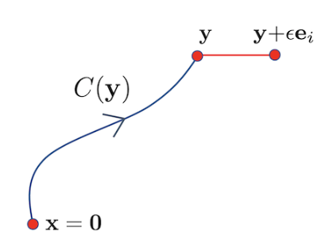

# Line Integrals
{: .page-title}

> *Definition.*{: .def}
> Line integrals is the integration of some quantity related to a scalar/vector field
> between two given points, $A$ and $B$, in space along a prescribed curve $C$ that joins them.
> In general, they will be of the forms
>
> $$
  \int_C \phi \,d\mathbf{x} \qquad \int_C \mathbf{F} \cdot d\mathbf{x} \qquad \int_C \mathbf{F} \times d\mathbf{x}
  $$
>
> where $\phi$ is a scalar field and $\mathbf{F}$ is a vector field.

The formal definition is similar to that of ordinary integrals with the use of dissection and summing over the intervals.

> *Definition.*{: .def}
> If $C$ is closed, the line integral will be written as
>
> $$
  \oint_C \mathbf{F} \cdot d\mathbf{x}
  $$

For a close curve we have to specify the direction around the loop in which the integral is taken.
By convention, it is usually taken to be such that the region $R$ is on the left, i.e. anticlockwise if viewed from above.

> *Proposition.*{: .prop}
> In case of orthonormal basis, since $d\mathbf{x} = dx^i \mathbf{e}_i$, we have
>
> $$
  \int_C \phi \,d\mathbf{x} = \left( \int_C \phi \, dx^i \right) \mathbf{e}_i
  $$
>
> Suppose that the vector field $\mathbf{F} = F^i \mathbf{e}_i$. Then
>
> $$
  \int_C \mathbf{F} \cdot d\mathbf{x} = \int_C F_i \, dx_i
  $$
>
> and similarily procedure can be followed for the integral involving cross product.

> *Proposition.*{: .prop}
> Similar to ordinary integrals,
>
> $$
  \int_A^B \mathbf{F} \cdot d\mathbf{x} = -\int_B^A \mathbf{F} \cdot d\mathbf{x}
  $$
>
> and
>
> $$
  \int_A^B \mathbf{F} \cdot d\mathbf{x} = \int_A^P \mathbf{F} \cdot d\mathbf{x} + \int_P^B \mathbf{F} \cdot d\mathbf{x}
  $$

In some cases we would like the line integral to give the same answer for any choice of parameterisation of the curve,
which naturally leads us to integrate the field with respect to arc length and can be evaluated with the substitution

$$
ds = \sqrt{ {d\mathbf{x} \over dt } \cdot {d\mathbf{x} \over dt } } \,dt
$$

## Conservative Fields

In general, the value of a line integral between two points $A$ and $B$ depends on the path $C$ taken.
However, there exists a class of vector fields for which the line integral is independent of the path taken.
Such vector fields are called conservative.

> *Definition.*{: .def}
> A vector field $\mathbf{F}$ is **conservative** if there exists scalar field $\phi$ such that
>
> $$
  \mathbf{F} = \nabla \phi
  $$

> *Definition.*{: .def}
> The scalar field $\phi$ is called the **scalar potential function** of the conservative vector field $\mathbf{F}$,
> and is unique up to an arbitrary additive constant.

> *Proposition.*{: .prop}
> The line integral is independent of the path taken, i.e. the integral around any closed loop is zero, iff $\mathbf{F}$ is conservative.
>
> *Proof.*{: .prf}
>
> ($\Leftarrow$) Suppose that $\mathbf{F} = \nabla \phi$.
> For any curve $C$ with parameterisation $\mathbf{x}(t)$, when we integrate $\mathbf{F}$ from $\mathbf{a}$ to $\mathbf{b}$, we have
>
> $$
  \begin{align*}
  \int_C \mathbf{F} \cdot d\mathbf{x} = \int_C \nabla \phi \cdot d\mathbf{x}
  &= \int_{t_a}^{t_b} { \partial \phi \over \partial x^i } { d x^i \over dt} \,dt \\
  &= \int_{t_a}^{t_b} { d \over dt } \phi(\mathbf{x}(t)) \,dt \\
  &= \Bigl[ \phi(\mathbf{x}(t)) \Bigr]_{t_a}^{t_b} \\
  &= \phi(\mathbf{b}) - \phi(\mathbf{a})
  \end{align*}
  $$
>
> ($\Rightarrow$) Given the vector field $\mathbf{F}$ whose integral vanishes when taken around any closed curve.
> Choose a value of $\phi$ at the origin, e.g. $\phi(\mathbf{0}) = 0$.
> Then define
>
> $$
  \phi(\mathbf{y}) = \int_{C(\mathbf{y})} \mathbf{F} \cdot d\mathbf{x}
  $$
>
> where $C(\mathbf{y})$ is the curve from origin to the point $\mathbf{y}$.
> It doesn't matter which curve we take since the integral will always give the same answer by assumption.
> Consider the partial derivative of $\phi$, by definition,
>
> $$
  \begin{align*}
  {\partial \phi \over \partial x_i} &= \lim_{h \to 0} {1 \over h} \left[ \int_{C(\mathbf{y} + h\mathbf{e_i})} \mathbf{F} \cdot d\mathbf{x} - \int_{C(\mathbf{y})} \mathbf{F} \cdot d\mathbf{x} \right] \\
  &= \lim_{h \to 0} {F_i h \over h} = F_i
  \end{align*}
  $$
>
> 
>
> Hence, $\nabla \phi = \mathbf{F}$.

This result is closely related to the fundamental theorem of calculus: the line integral of a conservative vector field is the analog of the integral of a total derivative and so is given by the end points.

## References

* David Tong _Vector Calculus Lecture Notes_, 2024 - Chapter 1.2, 1.3
* K.F. Riley _Mathematical Methods for Physicists and Engineers_, 1998 - Chapter 11.1
