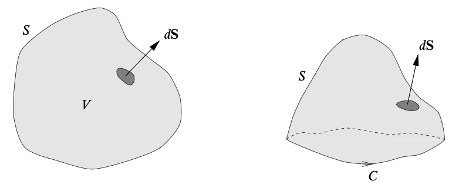
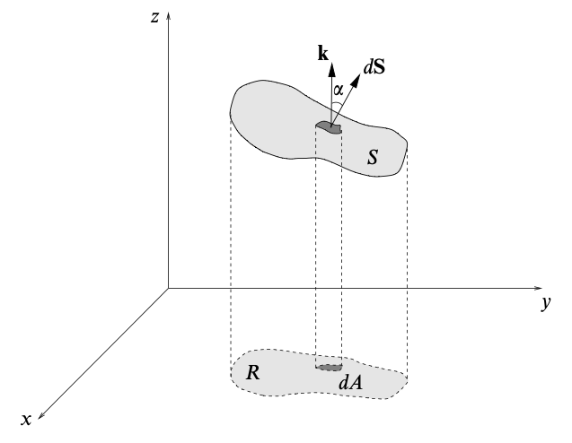

# Line and Surface Integrals
{: .page-title}

It is often to consider the integration of scalar or vector fields along lines, over surfaces and throughout volumes.

## Line Integrals

> *Definition.*{: .def}
> Line integral is the integration of some quantity related to a scalar/vector field
> between two given points, $A$ and $B$, in space along a prescribed curve $C$ that joins them.
> In general, they will be of the forms
>
> $$
  \int_C \phi \,d\mathbf{r} \qquad \int_C \mathbf{F} \cdot d\mathbf{r} \qquad \int_C \mathbf{F} \times d\mathbf{r}
  $$
>
> where $\phi$ is a scalar field and $\mathbf{F}$ is a vector field.
> The integrals themselves are respectively vector, scalar and vector in nature.

The formal definition is similar to that of ordinary integrals with the use of dissection and summing over the intervals.

> *Definition.*{: .def}
> If $C$ is closed, the line integral will be written as
>
> $$
  \oint_C \mathbf{F} \cdot d\mathbf{r}
  $$

For a close curve we have to specify the direction around the loop in which the integral is taken.
By convention, it is usually taken to be such that the region $R$ is on the left, i.e. anticlockwise if viewed from above.

> *Proposition.*{: .prop}
> In case of orthonormal basis, since $d\mathbf{r} = dx^i \mathbf{e}_i$, we have
>
> $$
  \int_C \phi(\mathbf{r}) \,d\mathbf{r} = \left( \int_C \phi(\mathbf{r}) \, dx^i \right) \mathbf{e}_i
  $$
>
> Suppose that the vector field $\mathbf{F} = F^i \mathbf{e}_i$. Then
>
> $$
  \int_C \mathbf{F}(\mathbf{r}) \cdot d\mathbf{r} = \int_C F_i(\mathbf{r}) \, dx_i
  $$
>
> and similarily procedure can be followed for the integral involving cross product.

> *Proposition.*{: .prop}
> Similar to ordinary integrals,
>
> $$
  \int_A^B \mathbf{F} \cdot d\mathbf{r} = -\int_B^A \mathbf{F} \cdot d\mathbf{r}
  $$
>
> and
>
> $$
  \int_A^B \mathbf{F} \cdot d\mathbf{r} = \int_A^P \mathbf{F} \cdot d\mathbf{r} + \int_P^B \mathbf{F} \cdot d\mathbf{r}
  $$

In some cases we would like the line integral to give the same answer for any choice of parameterisation of the curve,
which naturally leads us to integrate the field with respect to arc length and can be evaluated with the substitution

$$
ds = \sqrt{ {d\mathbf{r} \over du } \cdot {d\mathbf{r} \over du } } \,du
$$

## Conservative Fields

In general, the value of a line integral between two points $A$ and $B$ depends on the path $C$ taken.
However, there exists a class of vector fields for which the line integral is independent of the path taken.
Such vector fields are called conservative.

> *Definition.*{: .def}
> A vector field $\mathbf{F}$ is **conservative** if there exists scalar field $\phi$ such that
>
> $$
  \mathbf{F} = \nabla \phi
  $$

> *Definition.*{: .def}
> The scalar field $\phi$ is called the **scalar potential function** of the conservative vector field $\mathbf{F}$,
> and is unique up to an arbitrary additive constant.

> *Proposition.*{: .prop}
> The line integral is independent of the path taken, i.e. the integral around any closed loop is zero, iff $\mathbf{F}$ is conservative.
>
> *Proof.*{: .prf}
>
> ($\Leftarrow$) Suppose that $\mathbf{F} = \nabla \phi$.
> For any curve $C$ with parameterisation $\mathbf{r}(u)$, when we integrate $\mathbf{F}$ from $\mathbf{a}$ to $\mathbf{b}$, we have
>
> $$
  \begin{align*}
  \int_C \mathbf{F} \cdot d\mathbf{r} = \int_C \nabla \phi \cdot d\mathbf{r}
  &= \int_{u_a}^{u_b} { \partial \phi \over \partial x^i } { d x^i \over du} \,du \\
  &= \int_{u_a}^{u_b} { d \over du } \phi(\mathbf{r}(u)) \,du \\
  &= \Bigl[ \phi(\mathbf{r}(u)) \Bigr]_{u_a}^{u_b} \\
  &= \phi(\mathbf{b}) - \phi(\mathbf{a})
  \end{align*}
  $$
>
> ($\Rightarrow$) Given the line integral from $A$ to $B$ is independent of the path taken, its value must be a function only of the positions, i.e.
>
> $$
  \int_A^B \mathbf{F} \cdot d\mathbf{r} = \phi(B) - \phi(A)
  $$
>
> If $A$ and $B$ are separated by an infinitesimal displacement $d\mathbf{r}$ then
>
> $$
  \mathbf{F} \cdot d\mathbf{r} = d\phi
  $$
>
> Since $d\phi = \nabla \phi \cdot d\mathbf{r}$, $(\mathbf{F} - \nabla \phi) \cdot d\mathbf{r} = 0$ and hence $\mathbf{F} = \nabla \phi$.

This result is closely related to the fundamental theorem of calculus: the line integral of a conservative vector field is the analog of the integral of a total derivative and so is given by the end points.

> *Proposition.*{: .prop}
> If $\mathbf{F}$ is a conservative field, then for any two components $F_i$ and $F_j$, we have $\partial_j F_i = \partial_i F_j$.

Alternatively, we can use differential to phrase the idea of a conservative vector field.

> *Definition.*{: .def}
> The **differential** of a function $\phi(\mathbf{r})$ on $\mathbb{R}^n$ is defined to be
>
> $$
  d\phi = { \partial \phi \over \partial x^i } dx^i = \nabla \phi \cdot d\mathbf{r}
  $$

> *Definition.*{: .def}
> A differential is **exact** if it can be written as $\mathbf{F} \cdot d\mathbf{r} = d \phi$ for some scalar function $\phi$.

> *Corollary.*{: .cor}
> A differential is **exact** iff the vector field is conservative.

## Surface Integrals

> *Definition.*{: .def}
> Surface integral is the integration of some quantity related to a scalar/vector field over a surface.
> In general, they will be of the forms
>
> $$
  \int_S \phi \,dS \qquad \int_S \phi \,d\mathbf{S} \qquad \int_S \mathbf{F} \cdot d\mathbf{S} \qquad \int_S \mathbf{F} \times d\mathbf{S}
  $$
>
> where $\phi$ is a scalar field and $\mathbf{F}$ is a vector field.
> The integrals themselves are respectively scalar, vector, scalar and vector in nature.

> *Definition.*{: .def}
> If $S$ is closed, the surface integral will be written as
>
> $$
  \oint_S \mathbf{F} \cdot d\mathbf{S}
  $$

> *Definition.*{: .def}
> The vector differential $d\mathbf{S}$ represents a vector area element of the surface $S$ and can also be written as
>
> $$
  d\mathbf{S} = \mathbf{n} \,dS
  $$
>
> in which $\mathbf{n}$ is the _unit normal_.
> For closed surface, the direction of $\mathbf{n}$ should be pointing outwards.
> For open surface, it is given by the right-hand sense with respect to the direction in which the perimeter is traversed.

{: .size-2x}

> *Definition.*{: .def}
> Suppose that $\phi$ is a scalar field and $S$ is a surface parameterised by $\mathbf{r}(u, v)$.
> Then the surface integral is given by
>
> $$
  \int_S \phi(\mathbf{r}) \,dS = \iint_R du\,dv \left| {\partial \mathbf{r} \over \partial u} \times {\partial \mathbf{r} \over \partial v} \right| \phi(\mathbf{r})
  $$

> *Definition.*{: .def}
> Suppose that $\mathbf{F}$ is a vector field and $S$ is a surface parameterised by $\mathbf{r}(u, v)$.
> Then the scalar surface integral is given by
>
> $$
  \int_S \mathbf{F}(\mathbf{r}) \cdot d\mathbf{S} = \int_S \mathbf{F}(\mathbf{r}) \cdot \mathbf{n} \,dS
  = \iint_R du\,dv \left( {\partial \mathbf{r} \over \partial u} \times {\partial \mathbf{r} \over \partial v} \right) \cdot \mathbf{F}(\mathbf{r})
  $$
>
> This is called the **flux** of $\mathbf{F}$ through $S$.

The physical importance of the flux can be seen by thinking about a fluid.
Let $\mathbf{F}(\mathbf{x})$ be the velocity field of a fluid.
In a small time $\Delta t$, the amount of fluid flowing through a small surface element $\Delta S$ is given by

$$
\text{Flow} = \mathbf{F} \Delta t \cdot \mathbf{n} \Delta S
$$

Integrating over the whole surface, we have

$$
\text{Flux} = {\text{Flow} \over \text{Time}} = \int_S \mathbf{F} \cdot d\mathbf{S}
$$

which is the amount of fluid crossing $S$ per unit time, i.e. the rate of fluid flow.

> *Proposition.*{: .prop}
> Surface integral is independent of the choice of parameterisation of the surface.

Sometimes, it is not possible to represent the surface in a simple way in any particular coordinate system (i.e. cannot be parameterised).
In such cases, we have to consider the projections of the surface onto the Cartesian coordinate planes.

> *Proposition.*{: .prop}
> Suppose that $S$ is a surface given by the equation $f(x, y, z) = 0$, then
>
> $$
  dS = {|\nabla f| \over \partial f / \partial z} dA
  $$
>
> *Proof.*{: .prf}
>
> 
>
> The unit normal at any point of the surface is given by $\mathbf{n} = \nabla f / \vert \nabla f \vert$.
>
> Hence,
>
> $$
  dS = {dA \over |\cos \alpha|} = {dA \over |\mathbf{n} \cdot \mathbf{k}|} = { |\nabla f| \,dA \over \nabla f \cdot \mathbf{k} } = {|\nabla f| \over \partial f / \partial z} dA
  $$

> *Definition.*{: .def}
> The **vector area** of a surface $S$ is defined as
>
> $$
  \mathbf{S} = \int_S d\mathbf{S}
  $$

## Volume Integrals

> *Definition.*{: .def}
> Volume integral is the integration of some quantity related to a scalar/vector field throughout a volume.
> In general, they will be of the forms
>
> $$
  \int_V \phi \,dV \qquad \int_V \mathbf{F} \,dV
  $$
>
> where $\phi$ is a scalar field and $\mathbf{F}$ is a vector field.
> The integrals themselves are respectively scalar and vector in nature.

For example, $\int_V \rho(\mathbf{r}) \,dV$ is the total mass of a fluid contained in a volume $V$ and $\int_V \rho(\mathbf{r}) \mathbf{v}(\mathbf{r}) \,dV$ is the total linear momentum of that.

## References

* David Tong _Vector Calculus Lecture Notes_, 2024 - Chapter 1.2, 1.3, 2.2
* K.F. Riley _Mathematical Methods for Physicists and Engineers_, 1998 - Chapter 11.1, 11.4, 11.5, 11.6
