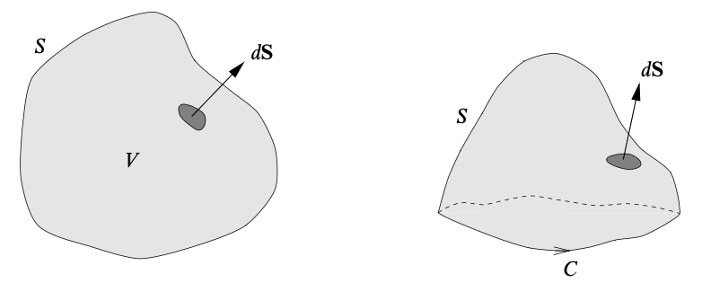
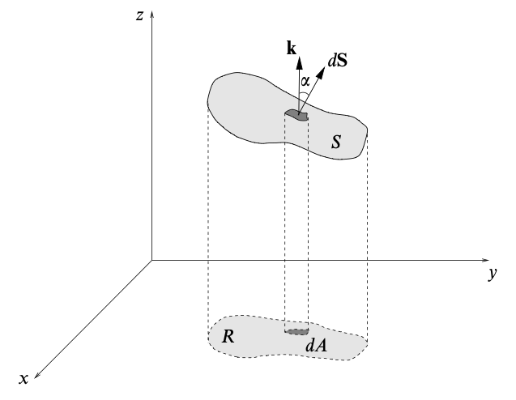

# Line and Surface Integrals
{: .page-title}

It is often to consider the integration of scalar or vector fields along lines, over surfaces and throughout volumes.

## Line Integrals

> *Definition.*{: .def}
> Line integral is the integration of some quantity related to a scalar/vector field
> between two given points, $A$ and $B$, in space along a prescribed curve $C$ that joins them.
> In general, they will be of the forms
>
> $$
  \int_C \phi \,ds \qquad \int_C \mathbf{F} \cdot d\mathbf{s}
  $$
>
> where $\phi$ is a scalar field and $\mathbf{F}$ is a vector field.
> Both of the integrals are scalar in nature.

The formal definition is similar to that of ordinary integrals with the use of dissection and summing over the intervals.

> *Definition.*{: .def}
> If $C$ is closed, the line integral will be written as
>
> $$
  \oint_C \phi \,ds \qquad \oint_C \mathbf{F} \cdot d\mathbf{s}
  $$

For a close curve we have to specify the direction around the loop in which the integral is taken.
By convention, it is usually taken to be such that the region $R$ is on the left, i.e. anticlockwise if viewed from above.

> *Definition.*{: .def}
> The line integral of a scalar field $\phi(\mathbf{x}): \mathbb{R}^3 \to \mathbb{R}$ along the curve $C: \mathbf{r}(s)$ is defined to be
>
> $$
  \int_C \phi(\mathbf{x}) \,ds = \int_{s_a}^{s_b} \phi(\mathbf{r}(s)) \,ds
  $$

The line integral is, by convention, defined so that $\int_C ds$ gives the length of the curve in which is positive.

> *Proposition.*{: .prop}
> Suppose that the curve is parameterised by variable $u$ other than the arc length,
> by the rules governing the change of variable of Riemann integral,
>
> $$
  \int_C \phi(\mathbf{x}) \,ds = \int_{s_a}^{s_b} \phi(\mathbf{r}(s)) \,ds = \int_{u_a}^{u_b} \phi(\mathbf{r}(u)) |\dot{\mathbf{r}}(u)| \,du
  $$

> *Definition.*{: .def}
> The scalar line integral of a vector field $\mathbf{F}(\mathbf{x}): \mathbb{R}^3 \to \mathbb{R}^3$ along the curve $C: \mathbf{r}(u)$ is defined to be
>
> $$
  \int_C \mathbf{F} \cdot d\mathbf{s} = \int_C \mathbf{F} \cdot d\mathbf{r} = \int_{u_a}^{u_b} \mathbf{F}(\mathbf{r}(u)) \cdot {d \mathbf{r} \over du} \,du
  $$

The vector differential $d\mathbf{s}$ is just an alternative notation of $d\mathbf{r}$.
It is a more generic and can be used to cater other coordinate systems.

> *Proposition.*{: .prop}
> In Cartesian coordiante, since $d\mathbf{r} = d\mathbf{x} = (dx, dy, dz)$, we have
>
> $$
  \int_C \mathbf{F} \cdot d\mathbf{x} = \int_C F_1 \,dx + F_2 \,dy + F_3 \,dz
  $$

> *Proposition.*{: .prop}
> Similar to ordinary integrals,
>
> $$
  \int_{-C} \phi \,ds = -\int_C \phi \,ds
  \qquad
  \int_C \phi \,ds = \int_{C_1} \phi \,ds + \int_{C_2} \phi \,ds
  $$
>
> and
>
> $$
  \int_{-C} \mathbf{F} \cdot d\mathbf{s} = -\int_C \mathbf{F} \cdot d\mathbf{s}
  \qquad
  \int_C \mathbf{F} \cdot d\mathbf{s} = \int_{C_1} \mathbf{F} \cdot d\mathbf{s} + \int_{C_2} \mathbf{F} \cdot d\mathbf{s}
  $$

> *Definition.*{: .def}
> We can also define the vector line integral by evaluating component by component, i.e.
>
> $$
  \int_C \phi \,d\mathbf{r} = \sum_{j=1}^3 \mathbf{e}_j \int \phi \,dx_j
  $$
>
> and
>
> $$
  \int_C \mathbf{F} \,ds = \sum_{j=1}^3 \mathbf{e}_j \int_{s_a}^{s_b} F_j(\mathbf{r}(s)) \,ds
  $$
>
> or cross product, i.e.
>
> $$
  \int_C \mathbf{F} \times d\mathbf{s}
  $$

## Conservative Fields

In general, the value of a line integral between two points $A$ and $B$ depends on the path $C$ taken.
However, there exists a class of vector fields for which the line integral is independent of the path taken.
Such vector fields are called conservative.

> *Definition.*{: .def}
> A vector field $\mathbf{F}$ is **conservative** if there exists scalar field $\phi$ such that
>
> $$
  \mathbf{F} = \nabla \phi
  $$

> *Definition.*{: .def}
> The scalar field $\phi$ is called the **scalar potential function** of the conservative vector field $\mathbf{F}$,
> and is unique up to an arbitrary additive constant.

> *Proposition.*{: .prop}
> The line integral is independent of the path taken, i.e. the integral around any closed loop is zero, iff $\mathbf{F}$ is conservative.
>
> *Proof.*{: .prf}
>
> ($\Leftarrow$) Suppose that $\mathbf{F} = \nabla \phi$.
> For any curve $C$ with parameterisation $\mathbf{r}(u)$, when we integrate $\mathbf{F}$ from $\mathbf{a}$ to $\mathbf{b}$, we have
>
> $$
  \begin{align*}
  \int_C \mathbf{F} \cdot d\mathbf{r} = \int_C \nabla \phi \cdot d\mathbf{r}
  &= \int_{u_a}^{u_b} { \partial \phi \over \partial x^i } { d x^i \over du} \,du \\
  &= \int_{u_a}^{u_b} { d \over du } \phi(\mathbf{r}(u)) \,du \\
  &= \Bigl[ \phi(\mathbf{r}(u)) \Bigr]_{u_a}^{u_b} \\
  &= \phi(\mathbf{b}) - \phi(\mathbf{a})
  \end{align*}
  $$
>
> ($\Rightarrow$) Given the line integral from $A$ to $B$ is independent of the path taken, its value must be a function only of the positions, i.e.
>
> $$
  \int_A^B \mathbf{F} \cdot d\mathbf{r} = \phi(B) - \phi(A)
  $$
>
> If $A$ and $B$ are separated by an infinitesimal displacement $d\mathbf{r}$ then
>
> $$
  \mathbf{F} \cdot d\mathbf{r} = d\phi
  $$
>
> Since $d\phi = \nabla \phi \cdot d\mathbf{r}$, $(\mathbf{F} - \nabla \phi) \cdot d\mathbf{r} = 0$ and hence $\mathbf{F} = \nabla \phi$.

This result is closely related to the fundamental theorem of calculus: the line integral of a conservative vector field is the analog of the integral of a total derivative and so is given by the end points.

> *Proposition.*{: .prop}
> If $\mathbf{F}$ is a conservative field, then for any two components $F_i$ and $F_j$, we have $\partial_j F_i = \partial_i F_j$.

Alternatively, we can use differential to phrase the idea of a conservative vector field.

> *Definition.*{: .def}
> The **differential** of a function $\phi(\mathbf{r})$ on $\mathbb{R}^n$ is defined to be
>
> $$
  d\phi = { \partial \phi \over \partial x^i } dx^i = \nabla \phi \cdot d\mathbf{r}
  $$

> *Definition.*{: .def}
> A differential is **exact** if it can be written as $\mathbf{F} \cdot d\mathbf{r} = d \phi$ for some scalar function $\phi$.

> *Corollary.*{: .cor}
> A differential is **exact** iff the vector field is conservative.

## Surface Integrals

> *Definition.*{: .def}
> Surface integral is the integration of some quantity related to a scalar/vector field over a surface.
> The common scalar surface integrals are of the forms
>
> $$
  \int_S \phi \,dS \qquad \int_S \mathbf{F} \cdot d\mathbf{S}
  $$
>
> and vector surface integrals are of the forms
>
> $$
  \int_S \phi \,d\mathbf{S} \qquad \int_S \mathbf{F} \,dS \qquad \int_S \mathbf{F} \times d\mathbf{S}
  $$
>
> where $\phi$ is a scalar field and $\mathbf{F}$ is a vector field and
> $dS$ and $d\mathbf{S}$ are the infinitesimal scalar and vector areas respectively.

> *Definition.*{: .def}
> If $S$ is closed, the surface integral will be written as, for example,
>
> $$
  \oint_S \mathbf{F} \cdot d\mathbf{S}
  $$

> *Definition.*{: .def}
> For closed surface, the vector differential $d\mathbf{S}$  of the surface $S$ has direction pointing outwards.
> For open surface, it is given by the right-hand sense with respect to the direction in which the perimeter is traversed.

{: .size-2x}

> *Definition.*{: .def}
> Suppose that $\phi$ is a scalar field and $S$ is a surface parameterised by $\mathbf{r}(u, v)$.
> Then the surface integral is given by
>
> $$
  \int_S \phi(\mathbf{r}) \,dS = \iint_R du\,dv \left| {\partial \mathbf{r} \over \partial u} \times {\partial \mathbf{r} \over \partial v} \right| \phi(\mathbf{r})
  $$

> *Definition.*{: .def}
> Suppose that $\mathbf{F}$ is a vector field and $S$ is a surface parameterised by $\mathbf{r}(u, v)$.
> Then the scalar surface integral is given by
>
> $$
  \int_S \mathbf{F}(\mathbf{r}) \cdot d\mathbf{S} = \int_S \mathbf{F}(\mathbf{r}) \cdot \mathbf{n} \,dS
  = \iint_R du\,dv \left( {\partial \mathbf{r} \over \partial u} \times {\partial \mathbf{r} \over \partial v} \right) \cdot \mathbf{F}(\mathbf{r})
  $$
>
> This is called the **flux** of $\mathbf{F}$ through $S$.

The physical importance of the flux can be seen by thinking about a fluid.
Let $\mathbf{F}(\mathbf{x})$ be the velocity field of a fluid.
In a small time $\Delta t$, the amount of fluid flowing through a small surface element $\Delta S$ is given by

$$
\text{Flow} = \mathbf{F} \Delta t \cdot \mathbf{n} \Delta S
$$

Integrating over the whole surface, we have

$$
\text{Flux} = {\text{Flow} \over \text{Time}} = \int_S \mathbf{F} \cdot d\mathbf{S}
$$

which is the amount of fluid crossing $S$ per unit time, i.e. the rate of fluid flow.

> *Proposition.*{: .prop}
> Surface integral is independent of the choice of parameterisation of the surface.

Sometimes, it is not possible to represent the surface in a simple way in any particular coordinate system (i.e. cannot be parameterised).
In such cases, we have to consider the projections of the surface onto the Cartesian coordinate planes.

> *Proposition.*{: .prop}
> Suppose that $S$ is a surface given by the equation $f(x, y, z) = 0$, then
>
> $$
  dS = {|\nabla f| \over \partial f / \partial z} dA
  $$
>
> *Proof.*{: .prf}
>
> 
>
> The unit normal at any point of the surface is given by $\mathbf{n} = \nabla f / \vert \nabla f \vert$.
>
> Hence,
>
> $$
  dS = {dA \over |\cos \alpha|} = {dA \over |\mathbf{n} \cdot \mathbf{k}|} = { |\nabla f| \,dA \over \nabla f \cdot \mathbf{k} } = {|\nabla f| \over \partial f / \partial z} dA
  $$

> *Definition.*{: .def}
> The **vector area** of a surface $S$ is defined as
>
> $$
  \mathbf{S} = \int_S d\mathbf{S}
  $$

## Volume Integrals

> *Definition.*{: .def}
> Volume integral is the integration of some quantity related to a scalar/vector field throughout a volume.
> In general, they will be of the forms
>
> $$
  \int_V \phi \,dV \qquad \int_V \mathbf{F} \,dV
  $$
>
> where $\phi$ is a scalar field and $\mathbf{F}$ is a vector field.
> The integrals themselves are respectively scalar and vector in nature.

For example, $\int_V \rho(\mathbf{r}) \,dV$ is the total mass of a fluid contained in a volume $V$ and $\int_V \rho(\mathbf{r}) \mathbf{v}(\mathbf{r}) \,dV$ is the total linear momentum of that.

## References

* David Tong _Vector Calculus Lecture Notes_, 2024 - Chapter 1.2, 1.3, 2.2
* K.F. Riley _Mathematical Methods for Physicists and Engineers_, 1998 - Chapter 11.1, 11.4, 11.5, 11.6
