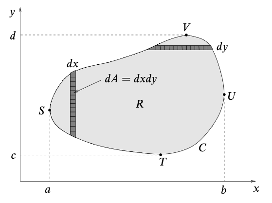
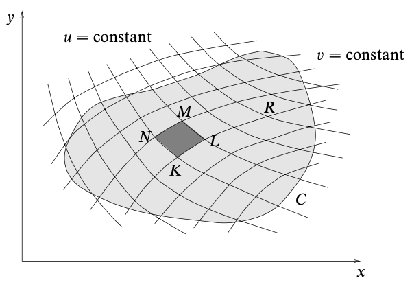
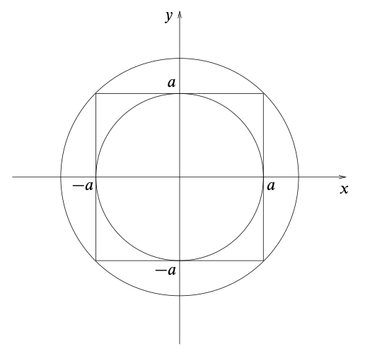
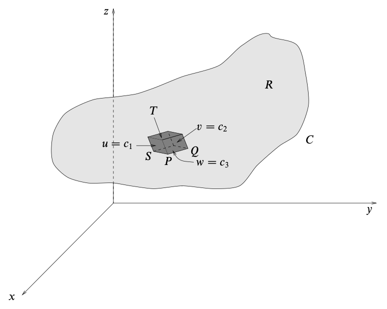

# Multiple Integrals
{: .page-title}

Just as we may consider derivatives with respect to multiple variables, we can do the same for integrals.

> *Definition.*{: .def}
> Suppose that $f(x, y)$ is a function and $R$ is a closed two-dimensional region.
> Divide the region $R$ into $n$ subregions $\Delta R_p$ of area $\Delta A_p$ and let $(x_p, y_p)$ be any point in subregion $\Delta R_p$.
> If the sum
>
> $$
  S = \sum_{p=1}^n f(x_p, y_p) \Delta A_p
  $$
>
> tends to a unique limit $I$ as $n \to \infty$, then this is called the **double integral** of $f$ over the region $R$ and is denoted by
>
> $$
  I = \int_R f(x, y) dA \cong \iint_R f(x, y) \,dx \,dy
  $$

> *Definition.*{: .def}
> Suppose that $f(x, y, z)$ is a function and $R$ is a closed three-dimensional region.
> Divide the region $R$ into $n$ subregions $\Delta R_p$ of volume $\Delta V_p$ and let $(x_p, y_p, z_p)$ be any point in subregion $\Delta R_p$.
> If the sum
>
> $$
  S = \sum_{p=1}^n f(x_p, y_p, z_p) \Delta V_p
  $$
>
> tends to a unique limit $I$ as $n \to \infty$, then this is called the **triple integral** of $f$ over the region $R$ and is denoted by
>
> $$
  I = \int_R f(x, y) dV \cong \iiint_R f(x, y, z) \,dx \,dy \,dz
  $$

These ideas can be extended to define multiple integrals of higher dimensionality.

## Change of Variables

> *Definition.*{: .def}
> The **Jacobian** of $(x, y)$ with respect to $(u, v)$ is the determinant of Jacobian matrix, i.e.
>
> $$
  J(u, v) = { \partial (x, y) \over \partial (u, v) } = \begin{vmatrix}
  \dfrac{\partial x}{\partial u} & \dfrac{\partial x}{\partial v} \\
  \dfrac{\partial y}{\partial u} & \dfrac{\partial y}{\partial v}
  \end{vmatrix}
  $$

> *Proposition.*{: .prop}
> Consider a change of variables $(x, y) \to (u, v)$.
> Then
>
> $$
  \iint_R dx\,dy \,f(x, y) = \iint_{R'} du\,dv \, \left|{ \partial (x, y) \over \partial (u, v) }\right| \,f(x(u, v), y(u, v))
  $$
>
> *Proof.*{: .prf}
>
> 
>
> The new subregion $KLMN$ is approximately a parallelogram.
>
> Since $v$ is constant along the line $KL$, we have
>
> $$
  \vec{KL} = \left({\partial x \over \partial u} du \right)\mathbf{i} + \left({\partial y \over \partial u} du \right) \mathbf{j}
  $$
>
> Similarily, since $u$ is constant along the line $KN$, we have
>
> $$
  \vec{KN} = \left({\partial x \over \partial v} dv \right)\mathbf{i} + \left({\partial y \over \partial v} dv \right) \mathbf{j}
  $$
>
> Thus, the area of the subregion is given by
>
> $$
  \begin{align*}
  dA_{uv} = |\vec{KL} \times \vec{KN}| &= \left| {\partial x \over \partial u} du {\partial y \over \partial v} dv - {\partial x \over \partial v} dv {\partial y \over \partial u} du \right| \\
  &= \left| {\partial x \over \partial u} {\partial y \over \partial v} - {\partial x \over \partial v} {\partial y \over \partial u} \right| \,du\,dv \\
  &= \left| { \partial (x, y) \over \partial (u, v) } \right| \,du\,dv
  \end{align*}
  $$
>
> Therefore, when transforming the coordinates from $x, y$ to $u, v$, we can substitute $dx\,dy$ by the above, together with a different integrand and limits.

> *Example.*{: .eg}
> **[Gaussian Integral]** Let
>
> $$
  I = \int_{-\infty}^{\infty} e^{-x^2} \,dx
  $$
>
> We have
>
> $$
  \begin{align*}
  I^2 &= \left( \int_{-\infty}^{\infty} e^{-x^2} \,dx \right) \left( \int_{-\infty}^{\infty} e^{-y^2} \,dx \right) \\
  &= \int_{-\infty}^{\infty} dx \int_{-\infty}^{\infty} dy \, e^{-(x^2 + y^2)} \\
  &= \iint_R e^{-(x^2 + y^2)} \,dx\,dy
  \end{align*}
  $$
>
> where the region $R$ is the whole $xy$-plane. By transforming to polar coordinates,
>
> $$
  I^2 = \iint_{R'} e^{-r^2} r \,dr \,d\theta
  = \int_0^{2\pi} d\theta \int_0^{\infty} dr \,re^{-r^2}
  = 2\pi \Bigl[ -{1 \over 2}e^{-r^2}\Bigr]_0^{\infty} = \pi
  $$
>
> More rigorously, consider the integral
>
> $$
  I(a) = \int_{-a}^a e^{-x^2} \,dx
  $$
>
> and similarily, we have
>
> $$
  I^2(a) = \iint_R e^{-(x^2 + y^2)} \,dx\,dy
  $$
>
> where the region $R$ is the square of side $2a$ centred on the origin.
> The value of integral is therefore bounded by inner circle with radius $a$ and outer circle with radius $\sqrt{2}a$.
>
> 
>
> By transforming to polar coordinates, we have
>
> $$
  \pi \left( 1 - e^{-a^2} \right) < I^2(a) < \pi \left( 1 - e^{-2a^2} \right)
  $$
>
> and hence $I^2(a) \to \pi$ as $a \to \infty$ so
>
> $$
  \int_{-\infty}^{\infty} e^{-x^2} \,dx = \sqrt{\pi}
  $$

> *Definition.*{: .def}
> The **Jacobian** of $(x, y, z)$ with respect to $(u, v, w)$ is the determinant of the Jacobian matrix, i.e.
>
> $$
  J(u, v, w) = { \partial (x, y, z) \over \partial (u, v, w) } = \begin{vmatrix}
  \dfrac{\partial x}{\partial u} & \dfrac{\partial x}{\partial v} & \dfrac{\partial x}{\partial w} \\
  \dfrac{\partial y}{\partial u} & \dfrac{\partial y}{\partial v} & \dfrac{\partial y}{\partial w} \\
  \dfrac{\partial z}{\partial u} & \dfrac{\partial z}{\partial v} & \dfrac{\partial z}{\partial w} \\
  \end{vmatrix}
  $$

> *Proposition.*{: .prop}
> Consider a change of variables $(x, y, z) \to (u, v, w)$.
> Then
>
> $$
  \iiint_R dx\,dy\,dz \,f(x, y, z) = \iiint_{R'} du\,dv\,dw \, \left|{ \partial (x, y, z) \over \partial (u, v, w) }\right| \,f(x(u, v, w), y(u, v, w), z(u, v, w))
  $$
>
> *Proof.*{: .prf}
>
> 
>
> Similar to the argument presented in double integral, the new subregion is approximately a parallelepiped.
> The volume of that is given by the [scalar triple product](../vectors-and-matrices/vectors.md#scalar-triple-product), i.e.
>
> $$
  dV_{uvw} = \left| { \partial (x, y, z) \over \partial (u, v, w) } \right| \,du\,dv\,dw
  $$

## References

* David Tong _Vector Calculus Lecture Notes_, 2024 - Chapter 2.1
* K.F. Riley _Mathematical Methods for Physicists and Engineers_, 1998 - Chapter 6
