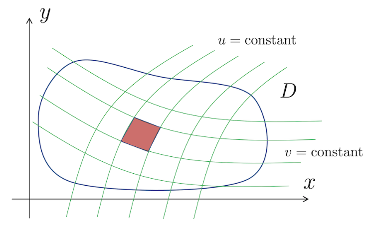

# Multiple Integrals
{: .page-title}

Just as we may consider derivatives with respect to multiple variables, we can do the same for integrals.

> *Definition.*{: .def}
> Suppose that $f(x, y)$ is a function and $R$ is a closed two-dimensional region.
> Divide the region $R$ into $n$ subregions $\Delta R_p$ of area $\Delta A_p$ and let $(x_p, y_p)$ be any point in subregion $\Delta R_p$.
> If the sum
>
> $$
  S = \sum_{p=1}^n f(x_p, y_p) \Delta A_p
  $$
>
> tends to a unique limit $I$ as $n \to \infty$, then this is called the **double integral** of $f$ over the region $R$ and is denoted by
>
> $$
  I = \int_R f(x, y) dA \cong \iint_R f(x, y) \,dx \,dy
  $$

> *Definition.*{: .def}
> Suppose that $f(x, y, z)$ is a function and $R$ is a closed three-dimensional region.
> Divide the region $R$ into $n$ subregions $\Delta R_p$ of volume $\Delta V_p$ and let $(x_p, y_p, z_p)$ be any point in subregion $\Delta R_p$.
> If the sum
>
> $$
  S = \sum_{p=1}^n f(x_p, y_p, z_p) \Delta V_p
  $$
>
> tends to a unique limit $I$ as $n \to \infty$, then this is called the **triple integral** of $f$ over the region $R$ and is denoted by
>
> $$
  I = \int_R f(x, y) dV \cong \iiint_R f(x, y, z) \,dx \,dy \,dz
  $$

These ideas can be extended to define multiple integrals of higher dimensionality.

## Change of Variables

> *Definition.*{: .def}
> The **Jacobian** $J(u, v)$ is defined by the matrix
>
> $$
  J(u, v) = { \partial (x, y) \over \partial (u, v) } = \begin{vmatrix}
  \partial x / \partial u & \partial x / \partial v \\
  \partial y / \partial u & \partial y / \partial v
  \end{vmatrix}
  $$

> *Proposition.*{: .prop}
> If the region $R$ in the $(x, y)$ plane is mapped into a different region $R'$ in the $(u, v)$ plane.
> Then
>
> $$
  \int_D dx\,dy \,f(x, y) = \int_{D'} du\,dv \,|J(u, v)| f(x(u, v), y(u, v))
  $$
>
> *Proof.*{: .prf}
>
> 
>
> The area of a subregion (in red) is approximately a parallelogram.
> When $u$ and $v$ are varied slightly, then the change in the original $x$ and $y$ is
>
> $$
  \Delta x = {\partial x \over \partial u} \Delta u + {\partial x \over \partial v} \Delta v + \cdots
  \quad \text{and} \quad
  \Delta y = {\partial y \over \partial u} \Delta u + {\partial y \over \partial v} \Delta v + \cdots
  $$
>
> where the $\cdots$ are terms of $O(\Delta u^2)$, $O(\Delta v^2)$ and $O(\Delta u \Delta v)$.
> This means
>
> $$
  \begin{pmatrix} \Delta x \\ \Delta y \end{pmatrix} =
  \begin{pmatrix}
  \partial x / \partial u & \partial x / \partial v \\
  \partial y / \partial u & \partial y / \partial v
  \end{pmatrix}
  \begin{pmatrix} \Delta u \\ \Delta v \end{pmatrix}
  $$
>
> and therefore the area of the parallelogram is
>
> $$
  \Delta A = |J(u, v)| \Delta u \Delta v
  $$

## References

* David Tong _Vector Calculus Lecture Notes_, 2024 - Chapter 2.1
* K.F. Riley _Mathematical Methods for Physicists and Engineers_, 1998 - Chapter 6
