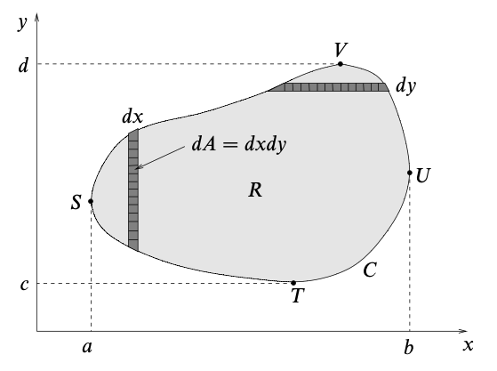
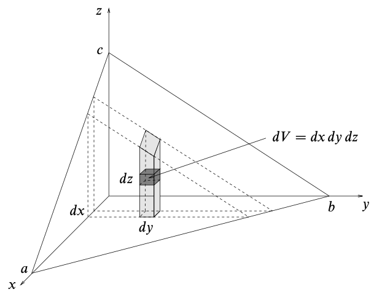
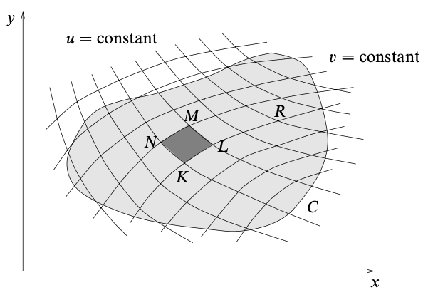

# Multiple Integrals
{: .page-title}

Just as we may consider derivatives with respect to multiple variables, we can do the same for integrals.

> *Definition.*{: .def}
> Suppose that $f(x, y)$ is a function and $R$ is a closed two-dimensional region.
> Divide the region $R$ into $n$ subregions $\Delta R_p$ of area $\Delta A_p$ and let $(x_p, y_p)$ be any point in subregion $\Delta R_p$.
> If the sum
>
> $$
  S = \sum_{p=1}^n f(x_p, y_p) \Delta A_p
  $$
>
> tends to a unique limit $I$ as $n \to \infty$, then this is called the **double integral** of $f$ over the region $R$ and is denoted by
>
> $$
  I = \int_R f(x, y) dA \cong \iint_R f(x, y) \,dx \,dy
  $$

> *Definition.*{: .def}
> Suppose that $f(x, y, z)$ is a function and $R$ is a closed three-dimensional region.
> Divide the region $R$ into $n$ subregions $\Delta R_p$ of volume $\Delta V_p$ and let $(x_p, y_p, z_p)$ be any point in subregion $\Delta R_p$.
> If the sum
>
> $$
  S = \sum_{p=1}^n f(x_p, y_p, z_p) \Delta V_p
  $$
>
> tends to a unique limit $I$ as $n \to \infty$, then this is called the **triple integral** of $f$ over the region $R$ and is denoted by
>
> $$
  I = \int_R f(x, y) dV \cong \iiint_R f(x, y, z) \,dx \,dy \,dz
  $$

These ideas can be extended to define multiple integrals of higher dimensionality.

## Change of Variables

> *Definition.*{: .def}
> The **Jacobian** $J(u, v)$ is defined by the matrix
>
> $$
  J = { \partial (x, y) \over \partial (u, v) } = \begin{vmatrix}
  \partial x / \partial u & \partial x / \partial v \\
  \partial y / \partial u & \partial y / \partial v
  \end{vmatrix}
  $$

> *Proposition.*{: .prop}
> If the region $R$ in the $(x, y)$ plane is mapped into a different region $R'$ in the $(u, v)$ plane.
> Then
>
> $$
  \int_R dx\,dy \,f(x, y) = \int_{R'} du\,dv \, \left|{ \partial (x, y) \over \partial (u, v) }\right| \,f(x(u, v), y(u, v))
  $$
>
> *Proof.*{: .prf}
>
> 
>
> The area of the subregion $KLMN$ is approximately a parallelogram.
>
> Since $v$ is constant along the line $KL$, we have
>
> $$
  \vec{KL} = \left({\partial x \over \partial u} du \right)\mathbf{i} + \left({\partial y \over \partial u} du \right) \mathbf{j}
  $$
>
> Similarily, since $u$ is constant along the line $KN$, we have
>
> $$
  \vec{KN} = \left({\partial x \over \partial v} dv \right)\mathbf{i} + \left({\partial y \over \partial v} dv \right) \mathbf{j}
  $$
>
> Thus, the area of the subregion is given by
>
> $$
  \begin{align*}
  dA_{uv} = |\vec{KL} \times \vec{KN}| &= \left| {\partial x \over \partial u} du {\partial y \over \partial v} dv - {\partial x \over \partial v} dv {\partial y \over \partial u} du \right| \\
  &= \left| {\partial x \over \partial u} {\partial y \over \partial v} - {\partial x \over \partial v} {\partial y \over \partial u} \right| \,du\,dv \\
  &= \left| { \partial (x, y) \over \partial (u, v) } \right| \,du\,dv
  \end{align*}
  $$
>
> Therefore, when transforming the coordinates from $x, y$ to $u, v$, we can substitute $dx\,dy$ by the above, together with a different integrand and limits.

## References

* David Tong _Vector Calculus Lecture Notes_, 2024 - Chapter 2.1
* K.F. Riley _Mathematical Methods for Physicists and Engineers_, 1998 - Chapter 6
