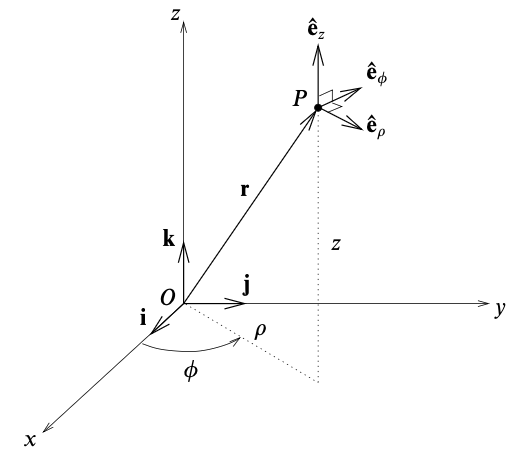

# Polar Coordinate Systems
{: .page-title}

Many physical systems possess spherical symmetry or axial symmetry in which it is more natural to use a different choice of coordinates.
Two most common non-Cartesian coordinate systems are spherical and cylindrical polars.

## Plane Polar Coordinates

> *Definition.*{: .def}
> The position of a point P having Cartesian coordinates $(x, y)$ can be expressed as
>
> $$
  x = \rho \cos \phi, \qquad y = \rho \sin \phi
  $$
>
> where $(\rho, \phi$ is its **plane polar coordinates**,
> with $\rho \ge 0$, $0 \le \phi < 2\pi$.

## Cylindrical Polar Coordinates

> *Definition.*{: .def}
> The position of a point P having Cartesian coordinates $(x, y, z)$ can be expressed as
>
> $$
  x = \rho \cos \phi, \qquad y = \rho \sin \phi, \qquad z = z
  $$
>
> where $(\rho, \phi, z)$ is its **cylindrical polar coordinates**,
> with $\rho \ge 0$, $0 \le \phi < 2\pi$ and $z \in \mathbb{R}$.

{: .size-2x}

> *Proposition.*{: .prop}
> The unit vectors of cylindrical polars are
>
> $$
  \begin{align*}
  \mathbf{e}_\rho &= \cos \phi \mathbf{i} + \sin \phi \mathbf{j} \\
  \mathbf{e}_\phi &= -\sin \phi \mathbf{i} + \cos \phi \mathbf{j} \\
  \mathbf{e}_z &= \mathbf{k}
  \end{align*}
  $$
>
> and they form an orthonormal basis.
>
> *Proof.*{: .prf}
>
> The position vector of a point $P$ can be written as $\mathbf{r} = \rho \cos \phi \mathbf{i} + \rho \sin \phi \mathbf{j} + z \mathbf{k}$.
> Thus,
>
> $$
  \begin{align*}
  {\partial \mathbf{r} \over \partial \rho} &= \cos \phi \mathbf{i} + \sin \phi \mathbf{j} \\
  {\partial \mathbf{r} \over \partial \phi} &= - \rho \sin \phi \mathbf{i} + \rho \cos \phi \mathbf{j} \\
  {\partial \mathbf{r} \over \partial z} &= \mathbf{k}
  \end{align*}
  $$
>
> and the unit vectors can be obtained by dividing each of the above vector by its modulus.

> *Proposition.*{: .prop}
> An infinitesimal vector displacement $d\mathbf{r}$ in the position of $P$ is given by
>
> $$
  \begin{align*}
  d\mathbf{r} &= {\partial \mathbf{r} \over \partial \rho} d\rho + {\partial \mathbf{r} \over \partial \phi} d\phi + {\partial \mathbf{r} \over \partial z} dz \\
  &= d\rho \,\mathbf{e}_\rho + \rho \,d\phi \,\mathbf{e}_\phi + dz \,\mathbf{e}_z
  \end{align*}
  $$
>
> and its magitude $ds$ is
>
> $$
  (ds)^2 = d\mathbf{r} \cdot d\mathbf{r} = (d\rho)^2 + \rho^2 (d\phi)^2 + (dz)^2
  $$

> *Proposition.*{: .prop}
> The volume of the infinitesimal parallelepiped is
>
> $$
  dV = \rho \,d\rho \,d\phi \,dz
  $$
>
> *Proof.*{: .prf}
>
> The Jacobian with respect to $(\rho, \phi, z)$ is
>
> $$
  \begin{vmatrix}
  \cos \phi & -\rho \sin \phi & 0 \\
  \sin \phi & \rho \cos \phi & 0 \\
  0 & 0 & 1 \\
  \end{vmatrix} = \rho
  $$

## Spherical Polar Coordinates

> *Definition.*{: .def}
> The position of a point P having Cartesian coordinates $(x, y, z)$ can be expressed as
>
> $$
  x = r \sin \theta \cos \phi, \qquad y = r \sin \theta \sin \phi, \qquad z = r \cos \theta
  $$
>
> where $(r, \theta, \phi)$ is its **spherical polar coordinates**,
> with $r \ge 0$, $0 \le \theta \le \pi$ and $0 \le \phi < 2\pi$.

{: .size-2x}

> *Proposition.*{: .prop}
> The unit vectors of spherical polars are
>
> $$
  \begin{align*}
  \mathbf{e}_r &= \sin \theta \cos \phi \mathbf{i} + \sin \theta \sin \phi \mathbf{j} + \cos \theta \mathbf{k} \\
  \mathbf{e}_\theta &= \cos \theta \cos \phi \mathbf{i} + \cos \theta \sin \phi \mathbf{j} - \sin \theta \mathbf{k} \\
  \mathbf{e}_\phi &= - \sin \phi \mathbf{i} + \cos \phi \mathbf{j}
  \end{align*}
  $$
>
> and they form an orthonormal basis.
>
> *Proof.*{: .prf}
>
> The position vector of a point $P$ can be written as $\mathbf{r} = r \sin \theta \cos \phi \mathbf{i} + r \sin \theta \sin \phi \mathbf{j} + r \cos \theta \mathbf{k}$.
> Thus,
>
> $$
  \begin{align*}
  {\partial \mathbf{r} \over \partial r} &= \sin \theta \cos \phi \mathbf{i} + \sin \theta \sin \phi \mathbf{j} + \cos \theta \mathbf{k} \\
  {\partial \mathbf{r} \over \partial \theta} &= r \cos \theta \cos \phi \mathbf{i} + r \cos \theta \sin \phi \mathbf{j} - r \sin \theta \mathbf{k} \\
  {\partial \mathbf{r} \over \partial \phi} &= - r \sin \theta \sin \phi \mathbf{i} + r \sin \theta \cos \phi \mathbf{j}
  \end{align*}
  $$
>
> and the unit vectors can be obtained by dividing each of the above vector by its modulus.

> *Proposition.*{: .prop}
> An infinitesimal vector displacement $d\mathbf{r}$ in the position of $P$ is given by
>
> $$
  \begin{align*}
  d\mathbf{r} &= {\partial \mathbf{r} \over \partial r} dr + {\partial \mathbf{r} \over \partial \theta} d\theta + {\partial \mathbf{r} \over \partial \phi} d\phi \\
  &= dr \,\mathbf{e}_r + r \,d\theta \,\mathbf{e}_\theta + r \sin \theta \,d\phi \,\mathbf{e}_\phi
  \end{align*}
  $$
>
> and its magitude $ds$ is
>
> $$
  (ds)^2 = d\mathbf{r} \cdot d\mathbf{r} = (dr)^2 + r^2 (d\theta)^2 + r^2 \sin^2 \theta (d\phi)^2
  $$

> *Proposition.*{: .prop}
> The volume of the infinitesimal parallelepiped is
>
> $$
  dV = r^2 \sin \theta \,dr \,d\theta \,d\phi
  $$
>
> *Proof.*{: .prf}
>
> The Jacobian with respect to $(r, \theta, \phi)$ is
>
> $$
  \begin{vmatrix}
  \sin \theta \cos \phi & \sin \theta \sin \phi & \cos \theta \\
  r \cos \theta \cos \phi & r \cos \theta \sin \phi & - r \sin \theta \\
  - r \sin \theta \sin \phi & r \sin \theta \cos \phi & 0
  \end{vmatrix} = r^2 \sin \theta
  $$

## References

* David Tong _Vector Calculus Lecture Notes_, 2024 - Chapter 2.1.4
* K.F. Riley _Mathematical Methods for Physicists and Engineers_, 1998 - Chapter 6.4, 10.9
