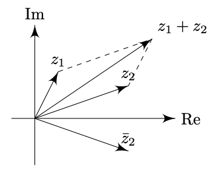
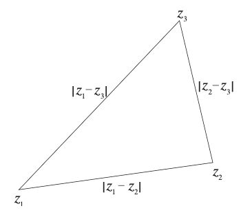
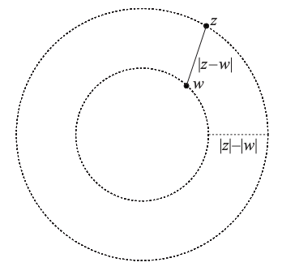
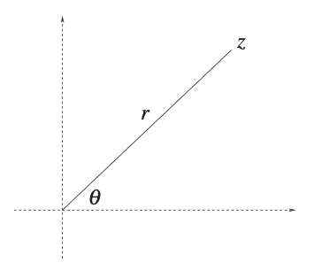
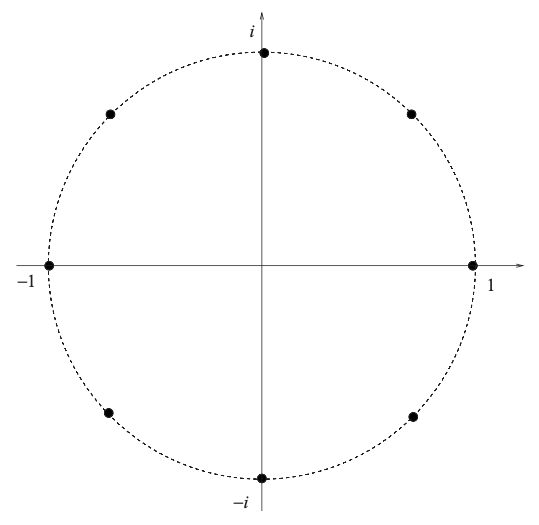

# Complex Numbers
{: .page-title}

> *Definition.*{: .def}
> A **complex number** is a number $z \in \mathbb{C}$ of the form $z = a + bi$ where $a, b \in \mathbb{R}$ and $i^2 = -1$.
> We called $a = \text{Re}(z)$ the real part and $b = \text{Im}(z)$ the imaginary part.

> *Theorem.*{: .thm}
> The representation of a complex number $z$ in terms of its real and imaginary parts is unique.
>
> *Proof.*{: .prf}
>
> Let $a, b, c, d \in \mathbb{R}$ such that
>
> $$
  \begin{align*}
  a + bi &= c + di \\
  (a-c)^2 &= -(d-b)^2
  \end{align*}
  $$
>
> As both $(a - c)^2 \ge 0$ and $(d - b)^2 \ge 0$, the equation is only possible with $a - c = 0$ and $b - d = 0$.
>
> Hence, the representation is unique and if $z_1 = z_2$, then $\text{Re}(z_1) = \text{Re}(z_2)$ and $\text{Im}(z_1) = \text{Im}(z_2)$.

> *Definition.*{: .def}
> Let $z_1 = a + bi$ and $z_2 = c + di$, in order to follow the arithmetic rules for reals, together with the rule $i^2 = 1$, we have
>
> + Addition/Subtraction
>
>   $$
    z_1 \pm z_2 = (a + c) \pm (b + d)i
    $$
>
> + Multiplication
>
>   $$
    z_1z_2 = (ac - bd) + (ad + bc)i
    $$
>
> + Inverse
>
>   $$
    z^{-1} = {1 \over z} = {a \over a^2 + b^2} + {-b \over a^2 + b^2}i
    $$
>
> + Division
>
>   $$
    z_1/z_2 = z_1z_2^{-1}
    $$

## Complex Conjugate

> *Definition.*{: .def}
> The **complex conjugate** $z^\ast$ (or $\bar{z}$) of $z = a + bi$ is $z^{\ast} = a - bi$.

> *Lemma.*{: .lem}
> $(z^\ast)^\ast = z$.

> *Lemma.*{: .lem}
> Conjugation is _distributive_ over addition, subtraction, multiplication and inverse, i.e.
>
> + $(z_1 \pm z_2)^\ast = z_1^\ast \pm z_2^\ast$
>
> + $(z_1z_2)^\ast = z_1^\ast z_2^\ast$
>
> + $(z^{-1})^\ast = (z^\ast)^{-1}$
>
> Hence, we also have $(z^n)^\ast = (z^\ast)^n$.

The complex conjugate can be useful for converting complex fraction to a complex number:

$$
{z_1 \over z_2} = \left({z_1 \over z_2}\right) \left({z_2^\ast \over z_2^\ast}\right) = {ac + bd \over c^2 + d^2} + {bc - ad \over c^2 + d^2}i
$$

> *Definition.*{: .def}
> Given a complex-valued function $f$, the complex conjugate function $f^\ast$ is defined by
>
> $$
  f^\ast(z^\ast) = [f(z)]^\ast \implies f^\ast(z) = [f(z^\ast)]^\ast
  $$

For example, let $f(z) = pz^2 + qz + r$, we have

$$
f^\ast(z^\ast) = (pz^2 + qz + r)^\ast = p^\ast(z^\ast)^2 + q^\ast z^\ast + r^\ast \implies f^\ast(z) = p^\ast z^2 + q^\ast z + r^\ast
$$

## Modulus

> *Definition.*{: .def}
> The **modulus** $\vert z \vert$ of $z$ is defined by
>
> $$
  |z| = \sqrt{a^2 + b^2}
  $$

> *Lemma.*{: .lem}
> $\vert z^\ast \vert = \vert z \vert$.

> *Lemma.*{: .lem}
> $zz^\ast = \vert z \vert^2$.

> *Lemma.*{: .lem}
> $z^{-1} = z^\ast / \vert z \vert^2$.

> *Theorem.*{: .thm}
> $\vert z_1z_2 \vert = \vert z_1 \vert \vert z_2 \vert$.
>
> *Proof.*{: .prf}
>
> $$
  \begin{align*}
  \vert (a + bi)(c + di) \vert^2 &= \vert (ac - bd) + (ad + bc)i \vert^2 \\
  &= (ac - bd)^2 + (ad + bc)^2 \\
  &= (ac)^2 + (bd)^2 - 2abcd + (ad)^2 + (bc)^2 + 2abcd \\
  &= a^2(c^2 + d^2) + b^2(c^2 + d^2) \\
  &= (a^2 + b^2) + (c^2 + d^2) \\
  &= \vert a + bi \vert^2 \vert c + di \vert^2
  \end{align*}
  $$

## Argument

> *Definition.*{: .def}
> The **argument** $\arg(z)$ of $z$ is defined by
>
> $$
  \arg(z) = \tan^{-1}\left({b \over a}\right)
  $$
>
> which has a period of $2\pi$.

> *Theorem.*{: .thm}
> For any $z_1, z_2 \in \mathbb{C}$, with a period of $2\pi$,
>
> + $\arg(z_1z_2) = \arg(z_1) + \arg(z_2)$
>
> + $\arg(z^{-1}) = \arg(z^\ast) = - \arg(z)$
>
> *Proof.*{: .prf}
>
> Let $z_1 = a + bi$ and $z_2 = c + di$, we have
>
> $$
  \begin{align*}
  \tan(\arg(z_1) + \arg(z_2)) &= {\tan \arg(z_1) + \tan \arg(z_2) \over 1 - \tan \arg(z_1) \tan \arg(z_2)} \\
  &= {b/a + d/c \over 1 - bd / ac} \\
  &= {ad + bc \over ac - bd} \\
  &= \tan \arg(z_1z_2)
  \end{align*}
  $$
>
> Hence, $\arg(z_1z_2) = \arg(z_1) + \arg(z_2)$.
>
> By definition, $\arg(z_1^\ast) = \arg(z_1^{-1}) = -b/a = - \arg(z_1)$ as $\tan^{-1} x = - \tan^{-1} x$.

## Argand Diagram

> *Definition.*{: .def}
> An **Argand diagram** is a diagram in which a complex number $z = x + yi$ is represented by a vector $\mathbf{p} = \begin{pmatrix} x \\\ y \end{pmatrix}$ on Cartesian plane.
> The $xy$ plane is referred as **complex plane** with real axis and imaginary axis.

The Argand diagram allows us to interpret complex numbers geometrically, i.e.

+ The _modulus_ of $z$ corresponds to the magnitude of the vector.

+ The _complex conjugate_ $z^\ast$ is the mirror image of $z$ reflected in the real axis.

+ _Addition_ obeys the _Parallelogram Law of Addition_ like [vector addition](vectors.md#vector-addition).

## Inequalities

By geometry, we observed the following inequalities about modulus:

> *Lemma.*{: .lem}
> $\vert \text{Re}(z) \vert \le \vert z \vert$ and $\vert \text{Im}(z) \vert \le \vert z \vert$.

> *Theorem.*{: .thm}
> **[Triangle Inequality]**
> If $z_1, z_2 \in \mathbb{C}$, then
>
> $$
  \vert z_1 + z_2 \vert \le \vert z_1 \vert + \vert z_2 \vert
  $$
>
> *Proof.*{: .prf}
>
> Self-evident by geometry or algebraically
>
> $$
  \begin{align*}
  1 &= \text{Re} \left( {z_1 + z_2 \over z_1 + z_2} \right) \\
  &= \text{Re} \left( {z_1 \over z_1 + z_2} \right) + \text{Re} \left( {z_2 \over z_1 + z_2} \right) \\
  &\le \left\vert {z_1 \over z_1 + z_2} \right\vert + \left\vert {z_2 \over z_1 + z_2} \right\vert
  \end{align*}
  $$

> *Corollary.*{: .cor}
> $\vert z_1 + z_2 + ... + z_n \vert \le \vert z_1 \vert + \vert z_2 \vert + ... + \vert z_n \vert$.

> *Lemma.*{: .lem}
> $\vert z_1 - z_2 \vert$ is the _distance_ between the two points represented by $z_1, z_2 \in \mathbb{C}$.
>
> *Proof.*{: .prf}
>
> By Pythagoras' theorem.

> *Corollary.*{: .cor}
> $|z_1 - z_3| \le |z_1 - z_2| + |z_2 + z_3|$.
>
> *Proof.*{: .prf}
>
> Self-evident by geometry or by substituding $z_1' = z_1 - z_2$ and $z_2' = z_2 - z_3$ into the triangle inequality.

> *Corollary.*{: .cor}
> $\vert z_1 - z_2 \vert \ge \vert \vert z_1 \vert - \vert z_2 \vert \vert$.
>
> *Proof.*{: .prf}
>
> Let $z_1 = z_1' + z_2'$ and $z_2 = z_2'$, so $z_1' = z_1 - z_2$ and $z_2' = z_2$.
> Thus, we have
>
> $$
  \vert z_1 \vert \le \vert z_1 - z_2 \vert + \vert z_2 \vert
  $$
>
> which implies
>
> $$
  \vert z_1 - z_2 \vert \ge \vert z_1 \vert - \vert z_2 \vert
  $$
>
> Interchanging $z_1$ and $z_2$ we also have
>
> $$
  \vert z_2 - z_1 \vert = \vert z_1 - z_2 \vert \ge \vert z_2 \vert - \vert z_1 \vert
  $$
>
> Hence, combining both cases, we have $\vert z_1 - z_2 \vert \ge \vert \vert z_1 \vert - \vert z_2 \vert \vert$.

> *Corollary.*{: .cor}
> $\vert z_1 + z_2 \vert \ge \vert \vert z_1 \vert - \vert z_2 \vert \vert$, which gives a _lower bound_ of $\vert z_1 + z_2 \vert$.
>
> *Proof.*{: .prf}
>
> $$
  \vert z_1 \vert = \vert (z_1 + z_2) - z_2 \vert \le \vert z_1 + z_2 \vert + \vert -z_2 \vert = \vert z_1 + z_2 \vert + \vert z_2 \vert
  $$
>
> which implies
>
> $$
  \vert z_1 + z_2 \vert \ge \vert z_1 \vert - \vert z_2 \vert
  $$
>
> Interchanging $z_1$ and $z_2$ we also have
>
> $$
  \vert z_2 + z_1 \vert = \vert z_1 + z_2 \vert \ge \vert z_2 \vert - \vert z_1 \vert
  $$
>
> Hence, combining both cases, we have $\vert z_1 + z_2 \vert \ge \vert \vert z_1 \vert - \vert z_2 \vert \vert$.

## Polar Representation

The use of polar coordinates to represent position in Argand diagram is really helpful to understand some of the properties.

> *Definition.*{: .def}
> Let $x = r\cos\theta$ and $y = r\sin\theta$, the **modolus/argument form** of a complex number $z$ is
>
> $$
  z = r(\cos\theta + i\sin\theta)
  $$
>
> where $r = \vert z \vert$ is the modulus and $\theta = \arg(z)$ is the argument.

The pair $(r, \theta)$ specifies $z$ uniquely, but $z$ does not specify $(r, \theta)$ uniquely since $\arg(z)$ has a period of $2\pi$.
Hence, we need to define the principal value of $\theta$ such that $-\pi < \theta \le \pi$.

> *Theorem.*{: .thm}
> The principal value of $\theta \in (-\pi, \pi]$ is given by
>
> $$
  \theta = 2\tan^{-1} \left( {y \over x + |z|} \right)
  $$
>
> *Proof.*{: .prf}
>
> $\tan^{-1}$ is single valued on the interval $(-{\pi \over 2}, {\pi \over 2})$. By the half-angle identity,
>
> $$
  \tan {\theta \over 2} = {\sin \theta \over 1 + \cos \theta} = {y/r \over 1 + x/r} = {y \over x + r}
  $$
>
> Hence, when $\theta \in (-\pi, \pi]$,
>
> $$
  \theta = 2\tan^{-1} \left( {y \over x + |z|} \right)
  $$

The modulus/argument form is helpful to understand the geometric meaning of multiplication.

> *Theorem.*{: .thm}
> Multiplication of $z_1$ by $z_2$ scales $z_1$ by $\vert z_2 \vert$ and rotates $z_1$ by $\arg(z_2)$.
>
> *Proof.*{: .prf}
>
> Let $z_1 = r_1(\cos \theta_1 + i \sin \theta_1)$ and $z_2 = r_2(\cos \theta_2 + i \sin \theta_2)$, then
>
> $$
  \begin{align*}
  z_1z_2 &= r_1r_2((\cos \theta_1 \cos \theta_2 - \sin \theta_1 \sin \theta_2) + i (\sin \theta_1 \cos \theta_2 + \sin \theta_2 \cos \theta_1)) \\
  &= r_1r_2(\cos (\theta_1 + \theta_2) + i \sin (\theta_1 + \theta_2))
  \end{align*}
  $$
>
> Hence, we have $\vert z_1z_2 \vert = \vert z_1 \vert \vert z_2 \vert$ and $\arg(z_1z_2) = \arg(z_1) + \arg(z_2)$ like we proved algebraically before.

## Exponential Form

Consider the [Taylor's expansion](./exponential-cosine-sine-functions.md) of $\exp(x)$, $\sin(x)$ and $\cos(x)$, we have

$$
e^{i\theta} = \cos \theta + i \sin \theta
$$

> *Theorem.*{: .thm}
> For any $z \in \mathbb{C}$, we have
>
> $$
  z = r(\cos\theta + i\sin\theta) = re^{i\theta}
  $$

The geometric meaning of multiplication can easily be derived from the exponential form:

$$
z_1z_2 = (r_1e^{i\theta_1})(r_2e^{i\theta_2}) = r_1r_2e^{i(\theta_1 + \theta_2)}
$$

> *Corollary.*{: .cor}
> $z^\ast = r(\cos\theta - i\sin\theta) = re^{-i\theta}$.

> *Corollary.*{: .cor}
> For $w \in \mathbb{C}$,
>
> $$
  \cos w = {1 \over 2} \left( e^{iw} + e^{-iw}\right)
  \quad\quad
  \sin w = {1 \over 2i} \left( e^{iw} - e^{-iw}\right)
  $$

## Roots of Unity

> *Theorem.*{: .thm}
> Let $n$ be a positive integer.
> The **n-th roots of unity** are the distinct complex numbers
>
> $$
  1, \omega, \omega^2, ..., \omega^{n-1}
  $$
>
> where $\omega = e^{2\pi i/n}$, which are the $n$ distinct solutions of $z^n = 1$.
>
> *Proof.*{: .prf}
>
> Firstly, we have $\omega^n = e^{2\pi i} = 1$.
>
> Let $k \in \set{0, 1, 2, ..., n-1\}$,
>
> $$
  (\omega^k)^n = (\omega^n)^k = 1
  $$
>
> Therefore, $1, \omega, \omega^2, ..., \omega^{n-1}$ are solutions of $z^n = 1$.
> They are obviously distinct because $\arg(\omega^k) = 2\pi k/n$.
>
> Conversely, suppose $z = re^{i\theta}$ is a solution of $z^n = 1$, we have $z^n = r^ne^{in\theta} = 1$.
> Therefore, $r^n = 1$ and $n\theta = 2k\pi$ with $k \in \mathbb{Z}$.
> Hence, we have $r = 1$ and by limiting $0 \le \theta < 2\pi$, $\theta = 2k\pi/n$ with $k = 0, 1, 2, ..., n-1$.

The result can be generalized to equation $z^n = w$ with $w \not= 0$.
Let $w = re^{i\theta}$ and $z_0 = r^{1/n}e^{i\theta/n}$, then $z_0^n = w$.
Therefore, $(z/z_0)^n = 1$.
Hence, $z_0, z_0\omega, z_0\omega^2, ..., z_0\omega^{n-1}$ are the $n$ distinct solutions.

Furthermore, following from the sum of geometric series and $\omega^n = 1$,

$$
1 + \omega + \omega^2 + ... + \omega^{n-1} = {1 - \omega^n \over 1 - \omega} = 0
$$

Geometrically, the n-th roots of unity are the vertices of a regular n-gon on the complex plane, which are evenly spaced around a circle.

## Logarithms and Powers

> *Definition.*{: .def}
> For $z \in \mathbb{C}$, $\log(z)$ is defined as "the" solution $w$ of $e^w = z$.
> Hence, by definition, we have
>
> $$
  \exp(\log(z)) = z
  $$
>
> and given $w = \log(z)$,
>
> $$
  \begin{align*}
  \log(\exp(w)) &= \log(\exp(\log(z))) \\
                &= \log(z) \\
                &= w
  \end{align*}
  $$

> *Theorem.*{: .thm}
> $\log(z) = \log(\|z\|) + i\arg(z)$.
>
> *Proof.*{: .prf}
>
> Let $z = re^{i\theta}$ and $w = \log(z) = x + yi$. From the definition, we have
>
> $$
  z = \exp(w) = e^{x + yi} = (e^x)(e^{iy}) = re^{i\theta}
  $$
>
> Hence,
>
> $$
  \begin{align*}
  x &= \log(r) = \log(|z|) \\
  y &= \theta + 2k\pi = \arg(z)
  \end{align*}
  $$
>
> which is multi-valued as $\arg(z)$ is multi-valued function.

> *Definition.*{: .def}
> The principal value of $\log(z)$ is $-\pi < \arg(z) = \text{Im}(\log(z)) \le \pi$.

Although $\log(-1)$ has no solution in real, under complex logarithms, we have

$$
\log(-1) = \log(1) + i\pi
$$

> *Corollary.*{: .cor}
> Similar to real logarithm, $\log(z_1z_2) = \log(z_1) + \log(z_2)$
>
> *Proof.*{: .prf}
>
> $$
  \begin{align*}
  \log(z_1z_2) &= \log(\vert z_1 \vert \vert z_2 \vert) + i \arg(z_1z_2) \\
  &= \log(\vert z_1 \vert) + i\arg(z_1) + \log(\vert z_2 \vert) + i \arg(z_2) \\
  &= \log(z_1) + \log(z_2)
  \end{align*}
  $$

Base on the definition of complex logarithm, we can now define the complex power of a complex number.

> *Definition.*{: .def}
> For $z \not = 0$ and $z, w \in \mathbb{C}$, $z$ to the _complex power_ of $w$ is
>
> $$
  z^w = e^{w \log z}
  $$
>
> Since $\log(z)$ is multi-valued, $z^w$ is only defined to an arbitrary multiple of $e^{2k\pi i w}$.

## De Moivre's Theorem

> *Theorem.*{: .thm}
> **[De Moivre's Theorem]**
> For $\theta \in \mathbb{R}$ and $n \in \mathbb{Z}$,
>
> $$
  \cos n\theta + i\sin n\theta = (\cos \theta + i\sin \theta)^n
  $$
>
> *Proof.*{: .prf}
>
> As $\cos \theta + i\sin \theta = e^{i\theta}$, we have
>
> $$
  \begin{align*}
  \cos n\theta + i \sin n\theta &= e^{i(n\theta)} \\
                                &= (e^{i\theta})^n \\
                                &= (\cos \theta + i \sin \theta)^n
  \end{align*}
  $$

The theorem can be extended to $\theta, n \in \mathbb{C}$ with $\cos n \theta + i \sin n \theta$ equals to one of the values of $(\cos \theta + i\sin \theta)^n$.

## Complex Plane Geometry

### Lines

> *Theorem.*{: .thm}
> For $z_0, w \in \mathbb{C}$ with $w \not = 0$ and varying $\lambda \in \mathbb{R}$, the equation
>
> $$
  z = z_0 + \lambda w
  $$
>
> represents points on a straight line passing through $z_0$ and parallel to $w$, which is similar to point-slope form.

> *Corollary.*{: .cor}
> An alternative representation of a line passing through $z_0$ and parallel to $w$ in complex plane is
>
> $$
  zw^\ast -z^\ast w = z_0w^\ast - z_0^\ast w
  $$
>
> *Proof.*{: .prf}
>
> As $\lambda \in \mathbb{R}$, $\lambda = \lambda^\ast$, we have
>
> $$
  {z - z_0 \over w} = {z^\ast - z_0^\ast \over w^\ast}
  $$
>
> The equation can be derived from reordering of the terms.

Hence,

> *Theorem.*{: .thm}
> The general representation of a line is
>
> $$
  a^\ast z + az^\ast + b = 0
  $$
>
> Let $u, v \in \mathbb{C}$ be two points, then
>
> $$
  a = v -u \quad \text{and} \quad b = \|u\|^2 + \|v\|^2 \in \mathbb{R}
  $$
>
> *Proof.*{: .prf}
>
> Given $u, v \in \mathbb{C}$, the points that are equidistant from them, i.e.
>
> $$
  |z - u|^2 = |z - v|^2
  $$
>
> form a straight line.
>
> As $\|z - u\|^2 = (z - u)(z^\ast - u^\ast)$ and $\|z - v\|^2 = (z - v)(z^\ast - v^\ast)$, we have
>
> $$
  (v^\ast - u^\ast)z + (v - u)z^\ast + |u|^2 + |v|^2 = 0
  $$

Practically, it will be more useful to represent the straight line passing through two points $u$ and $v$ as parametric form

$$
z - u = \lambda(v - u) \quad \text{or} \quad z = (1 - \lambda)u + \lambda v
$$

Details about different forms can be found [here](https://www.landonlehman.com/post/lines-in-the-complex-plane/) and [here](https://proofwiki.org/wiki/Equation\_for\_Line\_through\_Two\_Points\_in\_Complex\_Plane).

### Circles

> *Theorem.*{: .thm}
> The points on a circle in the complex plane with centre $w$ and radius $r$ is given by the equation
>
> $$
  |z - w| = r
  $$
>
> Since $r^2 = \|z - w\|^2 = (z - w)(z^\ast - w^\ast)$, the general form of a circle is
>
> $$
  zz^\ast - (zw^\ast + z^\ast w) + |w|^2 = r^2
  $$

## References

* [Stephen J. Cowley _Algebra and Geometry Lectures Notes_, 2006 - Chapter 1](https://www.damtp.cam.ac.uk/user/sjc1/teaching/AandG/notes.pdf)
* Alan F. Beardon _Algebra and Geometry_, 2005 - Chapter 3
* [https://www.landonlehman.com/post/lines-in-the-complex-plane/](https://www.landonlehman.com/post/lines-in-the-complex-plane/)
* [https://proofwiki.org/wiki/Equation\_for\_Line\_through\_Two\_Points\_in\_Complex\_Plane](https://proofwiki.org/wiki/Equation\_for\_Line\_through\_Two\_Points\_in\_Complex\_Plane)
