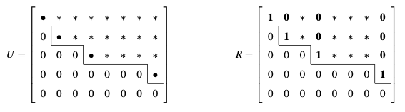

# Gaussian Elimination
{: .page-title}

Gaussian elimination is a decent algorithm for computing different quantities of matrices.
It is base on the following trivial fact about linear equations:

> *Proposition.*{: .prop}
> The solutions to the system of equations remain the same after the following elementary row operations:
>
> + addition of a constant multiple of one row to another,
>
> + multiplication of a row by a non-zero constant.
>
> + interchange of two rows,
>
> We can do the same to the columns with an appropriate relabelling of the unknowns.

> *Proposition.*{: .prop}
> **[Gaussian Elimination]**
> By applying the elementary row operations to a system of equations, we can reduce it to the form
>
> $$
  \begin{align*}
  A_{11}x_1 + A_{12}x_2 + ... + A_{1r}x_r + ... + A_{1n}x_n &= d_1 \\
  A_{22}^{(2)}x_2 + ... + A_{2r}^{(2)}x_r + ... + A_{2n}^{(2)}x_n &= d_2^{(2)} \\
  \ddots \quad + \quad \vdots \quad + \quad ... \quad + \quad\vdots\quad &= \,\vdots \\
  A_{rr}^{(r)}x_r + ... + A_{rn}^{(r)}x_n &= d_r^{(r)} \\
  0 &= d_{r+1}^{(r)} \\
  \vdots &= \,\vdots \\
  0 &= d_m^{(r)} \\
  \end{align*}
  $$
>
> in which every next row we have one less unknown.
>
> + If $r < m$ and at least one of the numbers $d_{r+1}^{(r)}, ..., d_{m}^{(r)}$ is non-zero,
>   then the equations are inconsistent and there is no solutions and the system is **overdetermined**.
>
> + If $r = n \le m$ (and $d_{i}^{(r)} = 0$ for $r + 1 \le i \le m$),
>   then there is a unique solution and the system is **determined**.
>
> + If $r < n$ (and $d_{i}^{(r)} = 0$ for $r + 1 \le i \le m$),
>   then there are infinitely many solutions and the system is **underdetermined**.
>
> $A\_{11}, A_{22}^{(2)}, ..., A_{rr}^{(r)}$ are called **pivots**.

> *Proposition.*{: .prop}
> A $n \times n$ matrix is invertible iff it has $n$ pivots.

## Triangular Factors and Permutations

Assume we are working with invertible square matrices.
The elementary row operations can be represented by the following matrices.

> *Definition.*{: .def}
> A **elementary matrix** $\mathsf{E}\_{ij}$ subtracts $\ell$ times row $j$ from row $i$, i.e.
>
> $$
  \mathsf{E}_{ij} = \begin{pmatrix}
  1 & 0 & \cdots & 0 & \cdots & 0 & 0 \\
  0 & 1 & \cdots & 0 & \cdots & 0 & 0 \\
  \vdots & \vdots & \ddots & E_{ij} = -\ell & \ddots & \vdots & \vdots \\
  0 & 0 & \cdots & 0 & \cdots & 1 & 0 \\
  0 & 0 & \cdots & 0 & \cdots & 0 & 1 \\
  \end{pmatrix}
  = \Set{\delta_{ij}} + \Set{E_{ij} = -\ell}
  $$
>
> The inverse $\mathsf{E}_{ij}^{-1}$ is the same as $\mathsf{E}\_{ij}$ except changing the sign of the entry $E\_{ij}$.

> *Definition.*{: .def}
> A matrix $\mathsf{U}$ is **upper triangular** if all entries below the diagonal are zero.
> A matrix $\mathsf{L}$ is **lower triangular** if all entries above the diagonal are zero.

After repeatedly applying the elementary row operations, the result is an equivalent system $\mathsf{U}\mathbf{x} = \mathbf{d}'$, where $\mathsf{U}$ is upper triangular.

Consider a matrix $\mathsf{L}$ which undo the steps of elimination, it has to be the product of the inverses of the elementary matrices in reverse order.
The inverses are in just the right that we can just fill in $\mathsf{L}$ with the multipliers $\ell\_{ij}$.
For example, suppose we did the following row operations (the order is from right to left):

$$
\begin{pmatrix}
1 \\
& 1 \\
& 1 & 1
\end{pmatrix}
\begin{pmatrix}
1 \\
& 1 \\
1 & & 1
\end{pmatrix}
\begin{pmatrix}
1 \\
-2 & 1 \\
& & 1
\end{pmatrix} =
\begin{pmatrix}
1 \\
-2 & 1 \\
-1 & 1 & 1
\end{pmatrix}
$$

Then,

$$
\mathsf{L} =
\begin{pmatrix}
1 \\
2 & 1 \\
& & 1
\end{pmatrix}
\begin{pmatrix}
1 \\
& 1 \\
-1 & & 1
\end{pmatrix}
\begin{pmatrix}
1 \\
& 1 \\
& -1 & 1
\end{pmatrix} =
\begin{pmatrix}
1 \\
2 & 1 \\
-1 & -1 & 1
\end{pmatrix}
$$

As $\mathsf{L}$ takes $\mathsf{U}$ back to $\mathsf{A}$, we have $\mathsf{A} = \mathsf{L}\mathsf{U}$.

> *Definition.*{: .def}
> A **permutation matrix** $\mathsf{P}\_{ij}$ exchanges row $i$ and row $j$, there are it has $1$s in the diagonal, except for row $i$ and row $j$, where we have $P\_{ij}= P\_{ji} = 1$.
> For example, to exchange row $1$ and row $2$,
>
> $$
  \mathsf{P}_{21} = \begin{pmatrix}
  & 1 \\
  1 & \\
  & & 1 \\
  & & & \vdots \\
  & & & & 1
  \end{pmatrix}
  $$

Also the permutations can be done first such that $\mathsf{PA}$ does not need row exchanges.

We can therefore have an alternative description about the Gaussian elimination:

> *Proposition.*{: .prop}
> **[Triangular Factorization]**
> A non-singular matrix $\mathsf{A}$, reordered by a permutation matrix $\mathsf{P}$ to avoid zeros in the pivot positions, can be factorized to two triangular matrices $\mathsf{L}$ and $\mathsf{U}$,
> in which $\mathsf{L}$ is lower triangular, with $1$s on the diagonal and multipliers $\ell\_{ij}$ from elimination below the diagonal;
> and $\mathsf{U}$ is upper triangular which appears after forward elimination and the pivots being the diagonal entries.
>
> Hence, we have
>
> $$
  \mathsf{PA} = \mathsf{LU}
  $$
>
> We can further extract the pivots from $\mathsf{U}$ by dividing each row by the pivot, i.e.
>
> $$
  \mathsf{U} = \begin{pmatrix}
  d_1 & \\
  & d_2 \\
  & & \ddots \\
  & & & d_n
  \end{pmatrix}
  \begin{pmatrix}
  1 & u_{12}/d_1 & u_{13}/d_1 & \cdots \\
  & 1 & u_{23}/d_2 & \cdots \\
  & & \ddots & \vdots \\
  & & & 1
  \end{pmatrix}
  $$
>
> and we have $\mathsf{PA} = \mathsf{LDU}$.

> *Proposition.*{: .prop}
> The triangular factorization is unique, i.e.
>
> $$
  \mathsf{A} = \mathsf{L_1 D_1 U_1} = \mathsf{L_2 D_2 U_2} \implies \mathsf{L_1} = \mathsf{L_2}, \mathsf{D_1} = \mathsf{D_2}, \mathsf{U_1} = \mathsf{U_2}
  $$

## Echolon Form and Row Reduced Form

The elimination can also be carried out on $m \times n$ rectangular matrix.
When there are no pivots for a column, we just move on to the next and we will end up with a "staircase pattern", or **echelon form**.

As the elimination steps have not changed, just like what we do to square matrix, we have the same factorization method:

> *Proposition.*{: .prop}
> For any $m \times n$ matrix $\mathsf{A}$, there is a $m \times m$ permutation $\mathsf{P}$, a $m \times m$ lower triangular $\mathsf{L}$ with unit diagonal,
> and an $m \times n$ echelon matrix $\mathsf{U}$, such that
>
> $$
  \mathsf{PA} = \mathsf{LU}
  $$

The **reduced row echelon form** $\mathsf{R}$ is then obtained by dividing the rows by its corresponding pivots, so that all pivots are $1$.
Then subtract a row from a higher row so that the pivot is the only non-zero entry of its column.
As these are still elementary row operations, $\mathsf{R}\mathbf{x} = \mathbf{0}$ still has the same solution.

> *Definition.*{: .def}
> With the reduced row echelon form,
> the **pivot variables** are the unknowns correspond to columns with pivots and the **free variables** are the unknowns correspond to columns without pivots.

> *Proposition.*{: .prop}
> The dimension of the nullspace of a $m \times n$ $\mathsf{A}$ is the number of free variables.
> If there are $r$ pivots, then there are $r$ pivot variables and $n - r$ free variables, and $r$ is the **rank** of the matrix.

The free variables can then be set to $1$ in turn to find the special vectors and the nullspace of $\mathsf{A}$ contains all linear combination of them.
It is the solution to the homogenerous equations $\mathsf{A}\mathbf{x} = \mathbf{0}$.

For inhomogeneous equations, we set all free variables to $0$ so to find a particular solution $\mathsf{x}\_p$ and the general solution is $\mathsf{x}\_p + \mathsf{x}\_h$,
where $\mathsf{x}\_h$ is the solution to the homogenerous equations.

## Calculation of Inverse

> *Proposition.*{: .prop}
> **[Gauss-Jordan Method]**
> Using $3 \times 3$ as example, finding the inverse of a matrix $\mathsf{A}$ is the same as solving three systems of equations at once, i.e.
>
> $$
  \mathsf{AA^{-1}} = \mathsf{I}
  \quad \equiv \quad
  \mathsf{A} \begin{pmatrix} \mathbf{x_1} & \mathbf{x_2} & \mathbf{x_3} \end{pmatrix} = \begin{pmatrix} \mathbf{e}_1 & \mathbf{e}_2 & \mathbf{e}_3 \end{pmatrix}
  $$
>
> We can carry out the elimination on all systems simultaneously and subtracting a row from rows above to reach the identity matrix, i.e.
>
> $$
  \begin{pmatrix} \mathsf{A} & \mathbf{e}_1 & \mathbf{e}_2 & \mathbf{e}_3 \end{pmatrix}
  \to
  \begin{pmatrix} \mathsf{U} & \mathsf{L}^{-1} \end{pmatrix}
  \to
  \begin{pmatrix} \mathsf{U}^{-1}\mathsf{U} & \mathsf{U}^{-1}\mathsf{L}^{-1} \end{pmatrix}
  =
  \begin{pmatrix} \mathsf{I} & \mathsf{A}^{-1} \end{pmatrix}
  $$

## Calculation of Determinant

Elimination can also be used for find the determinant of $\mathsf{A}$, with the elementary operations being

+ interchange of two rows,

+ addition of a constant multiple of one row to another,

+ interchange of two columns.

If there are $k$ row and column swaps, then

$$
\det \mathsf{A} = (-)^k \begin{vmatrix}
A_{11} & A_{12} & ... & A_{1r} & A_{1\,r+1} & ... & A_{1n} \\
0 & A_{22}^{(2)} & ... & A_{2r}^{(2)} & A_{2\,r+1}^{(2)} & ... & A_{2n}^{(2)} \\
\vdots & \vdots & \ddots & \vdots & \vdots & \ddots & \vdots \\
0 & 0 & ... & A_{rr}^{(r)} & A_{r\,r+1}^{(r)} & ... & A_{rn}^{(r)} \\
0 & 0 & ... & 0 & 0 & ... & 0 \\
\vdots & \vdots & \ddots & \vdots & \vdots & \ddots & \vdots \\
0 & 0 & ... & 0 & 0 & ... & 0 \\
\end{vmatrix}
$$

If $r < n$, then $\det \mathsf{A} = 0$.
If $r = n$, then $\det \mathsf{A} = (-)^kA_{11}A_{22}^{(2)}...A_{nn}^{(n)}$.

## References

* Gilbert Strang _Linear Algebra and Its Applications_, 2006 - Chapter 1, 2
