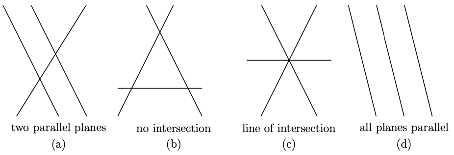
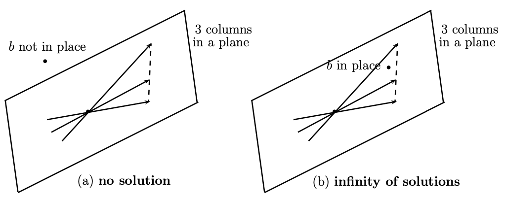

# Linear Equations
{: .page-title}

> *Definition.*{: .def}
> Given a system of equations
>
> $$
  \mathsf{A}\mathbf{x} = \mathbf{d}
  $$
>
> where $\mathsf{A}$ is a $m \times n$ matrix, $\mathbf{x}$ is a $n \times 1$ column vector of unknowns and $\mathbf{d}$ is a $m \times 1$ column vector.

## Geometry of Linear Equations

We can look at the system by rows or by columns which leads to different interpretation.
Using $m = n = 3$ as example, the system of linear equations is

$$
\begin{align*}
A_{11}x + A_{12}y + A_{13}z &= d_1 \\
A_{21}x + A_{22}y + A_{23}z &= d_2 \\
A_{31}x + A_{32}y + A_{33}z &= d_3 \\
\end{align*}
$$

By concentraing on rows, each equation describes a _plane_ in three dimension and the solution is the intersection of them.
The non-singular case is that the three planes intersect at a single point, which represents the unique solution of the system.

For the singular case, there are few possibilities for the planes to "go wrong":

For (a), (b) and (d), they have no solutions and the equations are said to be inconsistent.
For (c), there is a line of solutions.
The extreme case is that the three planes are the same and there is a whole plane of solutions.

On the other hand, by concentrating on columns, we have the vector equation

$$
x \begin{pmatrix} A_{11} \\ A_{21} \\ A_{31} \end{pmatrix}
+ y \begin{pmatrix} A_{12} \\ A_{22} \\ A_{32} \end{pmatrix}
+ z \begin{pmatrix} A_{13} \\ A_{23} \\ A_{33} \end{pmatrix}
= \begin{pmatrix} d_1 \\ d_2 \\ d_3 \end{pmatrix} = \mathbf{d}
$$

which is a linear combination of three vectors and the solution is the set of scalars that makes the linear combination equals to $\mathbf{d}$.
As discussed before, three linear independent vectors span the three dimensional space and therefore any vector $\mathbf{d}$ can be expressed uniquely by some coefficients $(x, y, z)$, which is also the unique solution to the system.

For the system to be singular, the three column vectors have to lie in a plane, i.e. linearly dependent.

If $\mathbf{d}$ is also on the plane, there are infinitely many solutions, otherwise, the system has no solution.

From both views, we can see that if the planes have no point in common, of infinitely many points, then the column vectors lie in the same plane.

## Fundamental Subspaces

These concepts are helpful for studying existence and uniqueness of solutions to a system of linear equations.

> *Definition.*{: .def}
> The **column space** $C(\mathsf{A})$ of a $m \times n$ matrix $\mathsf{A}$ contains all linear combinations of the columns of $\mathsf{A}$.

> *Proposition.*{: .prop}
> Column space a subspace of $\mathbb{R}^m$.
>
> *Proof.*{: .prf}
>
> Suppose $\mathbf{d}$ and $\mathbf{d}'$ lie in the column space, i.e. $\mathsf{A}\mathbf{x} = \mathbf{d}$ and $\mathsf{A}\mathbf{x}' = \mathbf{d}'$ for some $\mathbf{x}$ and $\mathbf{x}'$.
> Then
>
> $$
  \lambda \mathbf{d} + \mu \mathbf{d}' = \mathsf{A}(\lambda \mathbf{x} + \mu \mathbf{x}')
  $$
>
> so the combination of them also lies in the column space.

> *Proposition.*{: .prop}
> The system $\mathsf{A}\mathbf{x} = \mathbf{d}$ is solvable iff the vector $\mathbf{d}$ can be expressed as a combination of the columns of $\mathsf{A}$,
> i.e. $\mathbf{d}$ is in the column space.

> *Definition.*{: .def}
> The **nullspace** $N(\mathsf{A})$ of a matrix $\mathsf{A}$ consists of all vectors $\mathbf{x}$ such that $\mathsf{A}\mathbf{x} = \mathbf{0}$.

> *Proposition.*{: .prop}
> Nullspace a subspace of $\mathbb{R}^n$.
>
> *Proof.*{: .prf}
> Suppose $\mathsf{A}\mathbf{x} = \mathsf{A}\mathbf{x}' = \mathbf{0}$, then
>
> $$
  \mathsf{A}(\lambda\mathbf{x} + \mu\mathbf{x}') = \lambda\mathbf{0} + \mu\mathbf{0} = \mathbf{0}
  $$
>
> so a linear combination of them is also in the nullspace.

> *Definition.*{: .def}
> The **row space** of $\mathsf{A}$ is the column space of $\mathsf{A}^\intercal$, denoted by $C(\mathsf{A}^\intercal)$.

> *Definition.*{: .def}
> The **left nullspace** of $\mathsf{A}$ is the nullspace of $\mathsf{A}^\intercal$, denoted by $N(\mathsf{A}^\intercal)$.

> *Theorem.*{: .thm}
> The dimension of the column space is equal to the dimension of the row space, i.e. row rank is equal to column rank and rank of matrix is well-defined.
>
> *Proof.*{: .prf}
>
> Consider the echelon form $\mathsf{U}$ of a matrix $\mathsf{A}$.
> The row space is clearly unchanged after the elementary operations.
> The column space is changed but position of independent columns are unchanged, hence they have the same dimension.
> As the rows/columns having non-zero pivots are independent, the column rank is equal to row rank.

## Linear Maps View

Consider a linear map $\mathcal{A}: \mathbb{R}^n \to \mathbb{R}^m$, the [rank](linear-maps.md#definition-rank) of $\mathcal{A}$ is defined to be the dimension of the image, i.e.

$$
r(\mathcal{A}) = \dim \mathcal{A}(\mathbb{R}^n)
$$

Let $\Set{\mathbf{e}_j}$ be a standard basis of $\mathbb{R}^n$, then $\Set{\mathcal{A}(\mathbf{e}_j)}$ must span the image.
As the number of linearly independent vectors in $\Set{\mathcal{A}(\mathbf{e}_j)}$ is equal to $r(\mathcal{A})$ and $\mathcal{A}(\mathbf{e}_j)$ are the column vectors of matrix $\mathsf{A}$,
the number of linearly independent columns of $\mathsf{A}$ is equal to $r(\mathcal{A})$.
We then have the following definition.

> *Definition.*{: .def}
> The **column/row rank** of a matrix $\mathsf{A}$ is defined to be the maximum number of linearly independent columns/rows of $\mathsf{A}$, denoted by $\text{rank}\mathsf{A}$.

> *Theorem.*{: .thm}
> The row rank of a matrix is equal to its column rank, and hence the rank of matrix is well-defined.
>
> *Proof.*{: .prf}
>
> Let $r$ be the row rank of the matrix $\mathsf{A}$, so $\mathsf{A}$ has a linearly independent set of $r$ row vectors
>
> $$
  \mathbf{v}_k^\intercal = \begin{pmatrix} v_{k1} & v_{k2} & \cdots & v_{kn} \end{pmatrix} \quad \text{for } k = 1, 2, ..., r
  $$
>
> For the $i$-th row of $\mathsf{A}$, i.e.
>
> $$
  \mathbf{r}_i^\intercal = \begin{pmatrix} A_{i1} & A_{i2} & \cdots & A_{in} \end{pmatrix}
  $$
>
> it can be written as a linear combination of $\Set{\mathbf{v}_k^\intercal}$ so we have
>
> $$
  \mathbf{r}_i^\intercal = \sum_{k=1}^{r} u_{ik} \mathbf{v}_k^\intercal
  $$
>
> for some coefficients $u_{ik}$. In terms of matrix coefficients,
>
> $$
  A_{ij} = \sum_{k=1}^{r} u_{ik} v_{kj}
  $$
>
> Alternatively, this expression can be written as
>
> $$
  \begin{pmatrix}
  A_{1j} \\
  A_{2j} \\
  \vdots \\
  A_{mj} \\
  \end{pmatrix} =
  \sum_{k=1}^{r} v_{kj} \begin{pmatrix}
  u_{1k} \\
  u_{2k} \\
  \vdots \\
  u_{mk} \\
  \end{pmatrix}
  $$
>
> So any column $\mathbf{c}_j$ of $\mathsf{A}$ can be expressed as a linear combination of the $r$ column vectors $\mathbf{u}_k$ (not necessary linearly independent), i.e.
>
> $$
  \mathbf{c}_j = \sum_{k=1}^{r} v_{kj} \mathbf{u}_k
  $$
>
> and hence the column rank must be less than of equal to row rank.
> By applying the same argument to $\mathsf{A}^\intercal$, we conclude row rank and column rank are equal to each other.

> *Corollary.*{: .cor}
> If $\det \mathsf{A} = 0$, the rows/columns are linearly dependent.
>
> *Proof.*{: .prf}
>
> As the rank of a matrix doesn't change under elementary row operations,
> we can use Gaussian elimination to calculate the rank.
> Hence, if $\det \mathsf{A} = 0$, there are some rows/columns of zeros after applying Gaussian elimination and therefore the rows/columns of $\mathsf{A}$ are linearly dependent.
{: #linear-dependent-proof}

> *Proposition.*{: .prop}
> If $\mathsf{A}$ is a square matrix ($m = n$) and $\det \mathsf{A} \not= 0$, then the system of equations has a _unique_ solution, namely
>
> $$
  \mathbf{x} = \mathsf{A}^{-1}\mathbf{d}
  $$

## Homogeneous Linear Equations

> *Proposition.*{: .prop}
> For homogenerous linear equations $\mathsf{A}\mathbf{x} = \mathbf{0}$,
> if $\det \mathsf{A} \not= 0$, then the unique solution is $\mathbf{x} = \mathsf{A}^{-1}\mathbf{0} = \mathbf{0}$.
> Contrapositively, if it has a non-trivial solution $\mathbf{x} \not= \mathbf{0}$, then $\det \mathsf{A} = 0$.

### Geometric Analysis ($\mathbb{R}^3$)

Let $\mathsf{r}_i^\intercal$ be the row matrix with components equal to the elements of the $i$-th row of the matrix $\mathsf{A}$, i.e.

$$
\mathsf{A} = \begin{pmatrix}
\mathsf{r}_1^\intercal \\
\mathsf{r}_2^\intercal \\
\mathsf{r}_3^\intercal \\
\end{pmatrix}
$$

The equations $\mathsf{A}\mathbf{x} = \mathbf{0}$ can be expressed as

$$
\mathbf{r}_i \cdot \mathbf{x} = 0 \quad \text{for } i = 1,2,3
$$

Therefore, each equation represents a plane in $\mathbb{R}^3$ and the solution is the intersection of the 3 planes.
There are 3 possibilities and which of these cases occurs depends on $\text{rank}\mathsf{A}$.

> *Proposition.*{: .prop}
> _[Case 1]_ Three planes intersect only at $O$, with $\det \mathsf{A} \not= 0$, $\text{rank}\mathsf{A} = 3$ and nullity $n(\mathcal{A}) = 0$.
>
> *Proof.*{: .prf}
>
> The three planes must not be coplanar so to have only one intersection, i.e. $[\mathbf{r}_1, \mathbf{r}_2, \mathbf{r}_3] \not= 0$ and $\det \mathsf{A} \not= 0$.
> $\Set{\mathbf{r}_1, \mathbf{r}_2, \mathbf{r}_3}$ are linearly independent vectors that spans $\mathbb{R}^3$, i.e. $\text{rank}\mathsf{A} = 3$.
>
> For the planes of the first two equations, i.e. $\mathbf{r_1} \cdot \mathbf{x} = 0$ and $\mathbf{r_2} \cdot \mathbf{x} = 0$, their intersection must lie on the line
>
> $$
  L: \mathbf{x} = \lambda (\mathbf{r_1} \times \mathbf{r_2})
  $$
>
> The final condition $\mathbf{r_3} \cdot \mathbf{x} = 0$ then implies $\lambda = 0$ as $[\mathbf{r}_1, \mathbf{r}_2, \mathbf{r}_3] \not= 0$.
> Hence, we have $\mathbf{x} = \mathbf{0}$ and the solution space has dimension zero, i.e. $n(\mathcal{A}) = 0$.

> *Proposition.*{: .prop}
> _[Case 2]_ Three planes have a common line through $O$, with $\det \mathsf{A} = 0$, $\text{rank}\mathsf{A} = 2$ and nullity $n(\mathcal{A}) = 1$.
>
> *Proof.*{: .prf}
>
> We need to have $\det \mathsf{A} = 0$, which means $\Set{\mathbf{r}_1, \mathbf{r}_2, \mathbf{r}_3}$ are linearly dependent vectors and $[\mathbf{r}_1, \mathbf{r}_2, \mathbf{r}_3] = 0$.
> Assume wlog that $\mathbf{r}_1$ and $\mathbf{r}_2$ are two linearly independent vectors, i.e. $\text{rank}\mathsf{A} = 2$.
>
> Similarily, the intersection of the first two planes are on the line
>
> $$
  L: \mathbf{x} = \lambda (\mathbf{r_1} \times \mathbf{r_2})
  $$
>
> As $[\mathbf{r}_1, \mathbf{r}_2, \mathbf{r}_3] = 0$, all the points on the line satisfy $\mathbf{r}_3 \cdot \mathbf{x} = 0$.
> Hence, the solution space has dimension one, i.e. $n(\mathcal{A}) = 1$.

> *Proposition.*{: .prop}
> _[Case 3]_ Three planes concide, with $\det \mathsf{A} = 0$, $\text{rank}\mathsf{A} = 1$ and nullity $n(\mathcal{A}) = 2$.
>
> *Proof.*{: .prf}
>
> For $\text{rank}\mathsf{A} = 1$, $\Set{\mathbf{r}_1, \mathbf{r}_2, \mathbf{r}_3}$ are parallel to each other, i.e.
> $\mathbf{r_1} \cdot \mathbf{x} = 0$, $\mathbf{r_2} \cdot \mathbf{x} = 0$ and $\mathbf{r_3} \cdot \mathbf{x} = 0$ implies each others.
>
> Let $\mathbf{a}$ and $\mathbf{b}$ be two linearly independent vectors such that $\mathbf{a} \cdot \mathbf{r_1} = \mathbf{b} \cdot \mathbf{r_1} = 0$, then points on the plane
>
> $$
  \Pi: \mathbf{x} = \lambda \mathbf{a} + \mu \mathbf{b}
  $$
>
> are all solutions.
> hence, the solution space has dimension two, i.e. $n(\mathcal{A}) = 2$.

In all three cases, we have $r(\mathcal{A}) + n(\mathcal{A}) = \dim \mathbb{R}^3 = 3$.

### Algebraic Analysis

Consider a linear map $\mathcal{A}: \mathbb{R}^n \to \mathbb{R}^m$ with assoicated matrix $\mathsf{A}$.
The kernel of $\mathcal{A}$ is given by

$$
\ker \mathcal{A} = \Set{\mathbf{x} \in \mathbb{R}^n : \mathsf{A}\mathbf{x} = \mathbf{0}}
$$

which is a subspace of the domain and has dimension $n(\mathcal{A})$.

> *Proposition.*{: .prop}
> If $n(\mathcal{A}) = 0$, then $\Set{\mathcal{A}(\mathbf{e}_j)} (j = 1, ..., n)$ are linearly independent and $r(\mathcal{A}) = n$.
>
> *Proof.*{: .prf}
>
> Consider
>
> $$
  \sum_{j=1}^n \lambda_j \mathcal{A}(\mathbf{e}_j) = \mathcal{A}\left(\sum_{j=1}^n \lambda_j \mathbf{e}_j\right) = \mathbf{0}
  $$
>
> If $n(\mathcal{A}) = 0$, the only solution to it is
>
> $$
  \sum_{j=1}^n \lambda_j \mathbf{e}_j = \mathbf{0} \implies \lambda_j = 0 \quad \text{for } j = 1, ..., n
  $$
>
> since $\Set{\mathbf{e}_j}$ is a basis therefore linearly independent.
> Hence, $\Set{\mathcal{A}(\mathbf{e}_j)}$ are linearly independent and $r(\mathcal{A}) = n$.

> *Proposition.*{: .prop}
> If $n(\mathcal{A}) > 0$, then $r(\mathcal{A}) = n - n(\mathcal{A})$.
>
> *Proof.*{: .prf}
>
> Let $n_\mathcal{A} = n(\mathcal{A})$ and $\Set{\mathbf{u}\_i} (i = 1, ..., n\_\mathcal{A})$ be the basis of the kernel $\ker \mathcal{A}$.
> Choose $\Set{\mathbf{v}\_j \not \in \ker \mathcal{A}} (j = 1, ..., n - n\_\mathcal{A})$ to extend the basis to form a basis of $\mathbb{R}^n$.
>
> Consider
>
> $$
  \sum_{j=1}^{n - n_\mathcal{A}} \lambda_j \mathcal{A}(\mathbf{v}_j) = \mathcal{A}\left(\sum_{j=1}^{n - n_\mathcal{A}} \lambda_j \mathbf{v}_j\right) = \mathbf{0}
  $$
>
> The solution of it can be expressed as a linear combination of $\Set{\mathbf{u}\_i}$, i.e.
>
> $$
  \sum_{j=1}^{n - n_\mathcal{A}} \lambda_j \mathbf{v}_j = \sum_{i=1}^{n_\mathcal{A}} \mu_i \mathbf{u}_i
  \implies -\sum_{i=1}^{n_\mathcal{A}} \mu_i \mathbf{u}_i + \sum_{j=1}^{n - n_\mathcal{A}} \lambda_j \mathbf{v}_j = \mathbf{0}
  $$
>
> As $\Set{\mathbf{u}\_i} \cup \Set{\mathbf{v}\_j}$ is a basis, $\mu\_i = \lambda\_j = 0$.
> Hence, $\Set{\mathcal{A}(\mathbf{v}_j)}$ are linearly independent and $r(\mathcal{A}) = n - n\_\mathcal{A}$.

Similarily, we have the Rank-Nullity Theorem implied, i.e.

$$
r(\mathcal{A}) + n(\mathcal{A}) = \dim \mathbb{R}^n = \text{dimension of domain}
$$

## Inhomogeneous Linear Equations

Consider the linear equations

$$
\mathsf{A}\mathbf{x} = \mathbf{d}
$$

where $\mathsf{A}$ is a $n \times n$ matrix, $\mathbf{x}$ is a $n \times 1$ column vector of unknowns and $\mathbf{d}$ is a $n \times 1$ column vector.

> *Proposition.*{: .prop}
> If $\det \mathsf{A} \not= 0$ then $n(\mathcal{A}) = 0, r(\mathcal{A}) = n$ and $\text{im} \mathcal{A} = \mathbb{R}^n$.
> As $\mathbf{d} \in \text{im}\mathcal{A}$, there must exist a unique $\mathbf{x} = \mathcal{A}^{-1}\mathbf{d} \in \mathbb{R}^n$ for which $\mathbf{d}$ is the image under $\mathcal{A}$.

> *Theorem.*{: .thm}
> If $\mathbf{d} \in \text{im}\mathcal{A}$ then the general solution to $\mathsf{A}\mathbf{x} = \mathbf{d}$ can be written as
>
> $$
  \mathbf{x} = \mathbf{x}_h + \mathbf{x}_p
  $$
>
> where $\mathbf{x}\_h$ is the general solution of $\mathsf{A}\mathbf{x} = \mathbf{0}$
> and $\mathbf{x}\_p$ is a particular fixed solution of $\mathsf{A}\mathbf{x} = \mathbf{d}$.
>
> *Proof.*{: .prf}
>
> $\mathbf{x} = \mathbf{x}\_h + \mathbf{x}\_p$ is a solution since
>
> $$
  \mathsf{A}(\mathbf{x}_h + \mathbf{x}_p) = \mathsf{A}(\mathbf{x}_h) + \mathsf{A}(\mathbf{x}_p) = \mathbf{0} + \mathbf{d} = \mathbf{d}
  $$
>
> Furthermore, if $n(\mathcal{A}) = 0$, then $\mathbf{x}\_h = \mathbf{0}$ so the unique solution is $\mathbf{x} = \mathcal{A}^{-1}\mathbf{d}$ as stated above.
> If $n(\mathcal{A}) > 0$ and $\Set{\mathbf{u}\_j}$ is the basis of $\ker \mathcal{A}$, then
>
> $$
  \mathbf{x} = \mathbf{x}_p + \sum_{j=1}^{n(\mathcal{A})} \mu_j \mathbf{u}_j
  $$

> *Problem.*{: .pro}
> Analyze for each real value of $t$ the solutions of the lienar equations
>
> $$
  \begin{align*}
  x + y + z &= t \\
  tx + 2z &= 3 \\
  3x + ty + 5z &= 7
  \end{align*}
  $$
>
> *Solution.*{: .sol}
>
> $$
  \begin{vmatrix}
  1 & 1 & 1 \\
  t & 0 & 2 \\
  3 & t & 5 \\
  \end{vmatrix} = (t - 1)(t - 6)
  $$
>
> If $t \not= 1, 6$, $\det \mathsf{A} \not= 0$, there exist a unique solution $\mathsf{A}^{-1}\mathbf{d}$.
>
> If $t = 1$,
>
> $$
  \text{im} \mathcal{A} = \text{span} \left\{ \mathbf{e}_1 = \begin{pmatrix} 1 \\ 1 \\ 3 \end{pmatrix}, \mathbf{e}_2 = \begin{pmatrix} 1 \\ 0 \\ 1 \end{pmatrix} \right\}, r(\mathcal{A}) = 2, n(\mathcal{A}) = 1
  $$
>
> As $\begin{vmatrix} \mathbf{e}\_1 & \mathbf{e}\_2 & \mathbf{d} \end{vmatrix} = 0$, i.e. $\mathbf{d} \in \text{im} \mathcal{A}$, there exist a solution.
>
> We have
>
> $$
  \ker \mathcal{A} = \lambda \begin{pmatrix} -2 \\ 1 \\ 1 \end{pmatrix} \implies \mathbf{x} = \begin{pmatrix} 1 \\ -1 \\ 1 \end{pmatrix} + \lambda \begin{pmatrix} -2 \\ 1 \\ 1 \end{pmatrix}
  $$
>
> is the general solution.
>
> It $t = 6$,
>
> $$
  \text{im} \mathcal{A} = \text{span} \left\{ \mathbf{e}_1 = \begin{pmatrix} 1 \\ 6 \\ 3 \end{pmatrix}, \mathbf{e}_2 = \begin{pmatrix} 1 \\ 0 \\ 6 \end{pmatrix} \right\}, r(\mathcal{A}) = 2, n(\mathcal{A}) = 1
  $$
>
> As $\begin{vmatrix} \mathbf{e}\_1 & \mathbf{e}\_2 & \mathbf{d} \end{vmatrix} = 165 \not= 0$, i.e. $\mathbf{d} \not \in \text{im} \mathcal{A}$, there is no solution.

## References

* Gilbert Strang _Linear Algebra and Its Applications_, 2006 - Chapter 1, 2
* [Stephen J. Cowley _Algebra and Geometry Lectures Notes_, 2006 - Chapter 4](https://www.damtp.cam.ac.uk/user/sjc1/teaching/AandG/notes.pdf)
