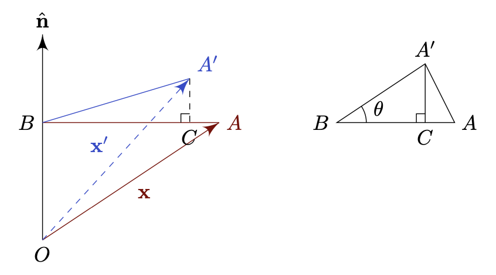
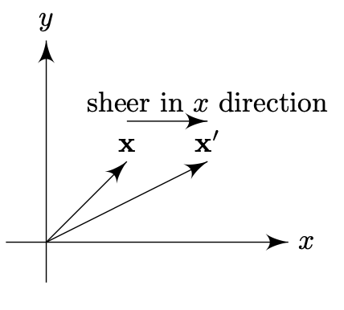

# Linear Maps
{: .page-title}

The crucial property of vectors spaces is that the linear combination of vectors are again a vector.
The defining property of linear maps is that it preserves the linear combination in a natural way, i.e.
image of a linear combination is a linear combination of the images, or $\mathcal{T}(\lambda x + \mu y) = \lambda \mathcal{T}(x) + \mu \mathcal{T}(y)$.

> *Definition.*{: .def}
> Let $V, W$ be vector spaces over a field $\mathbb{F}$.
> The map $\mathcal{T}: V \to W$ is a **linear map** or **linear transformation** if for all $a, b \in V$ and $\lambda, \mu \in \mathbb{F}$,
>
> $$
  \begin{align*}
  \mathcal{T}(a + b) &= \mathcal{T}(a) + \mathcal{T}(b) \\
  \mathcal{T}(\lambda a) &= \lambda \mathcal{T}(a)
  \end{align*}
  $$
>
> or equivalently
>
> $$
  \mathcal{T}(\lambda a + \mu b) = \lambda \mathcal{T}(a) + \mu \mathcal{T}(b)
  $$

> *Lemma.*{: .lem}
> $\mathcal{T}(0_V) = 0_W$.
>
> *Proof.*{: .prf}
>
> When $\lambda = \mu = 0$, we have
>
> $$
  \mathcal{T}(0_V) = \mathcal{T}(0 a + 0 b) = 0 \mathcal{T}(a) + 0 \mathcal{T}(b) = 0_W
  $$

## Image and Rank, Kernel and Nullity

Let $\mathcal{T}: V \to W$ be a linear map.

> *Definition.*{: .def}
> $\text{im}(\mathcal{T}) = \mathcal{T}(V)$ is the **image** of $V$ under $\mathcal{T}$.

> *Theorem.*{: .thm}
> $\mathcal{T}(V)$ is a subspace of $W$.
>
> *Proof.*{: .prf}
>
> $0_W \in \mathcal{T}(V)$ so it is non-empty.
>
> For all $\mathcal{T}(a), \mathcal{T}(b) \in \mathcal{T}(V)$, we have
>
> $$
  \lambda \mathcal{T}(a) + \mu \mathcal{T}(b) = \mathcal{T}(\lambda a + \mu b) \in \mathcal{T}(V)
  $$

> *Definition.*{: .def}
> The **rank** of $\mathcal{T}$ is the dimension of the image, i.e.
>
> $$
  r(\mathcal{T}) = \dim \mathcal{T}(V)
  $$
{: #definition-rank}

> *Definition.*{: .def}
> The **kernel** or **nullspace** of $\mathcal{T}$ is the subset of $V$ that maps to the zero element in $W$, i.e.
>
> $$
  \ker \mathcal{T} = \Set{v \in V \mid \mathcal{T}(v) = 0_W}
  $$

> *Theorem.*{: .thm}
> $\ker \mathcal{T}$ is a subspace of $V$.
>
> $0_V \in \ker \mathcal{T}$ so it is non-empty.
>
> For $a, b \in \ker \mathcal{T}$, we have
>
> $$
  \mathcal{T}(\lambda a + \mu b) = \lambda \mathcal{T}(a) + \mu \mathcal{T}(b) = \lambda 0_W + \mu 0_W = 0_W
  $$
>
> Hence, $\lambda a + \mu b \in \ker \mathcal{T}$.

> *Definition.*{: .def}
> The **nullity** of $\mathcal{T}$ is the dimension of the kernel, i.e.
>
> $$
  n(\mathcal{T}) = \dim \ker \mathcal{T}
  $$

> *Theorem.*{: .thm}
> **[Rank-Nullity Theorem]**
> Let $\mathcal{T}: V \to W$ be a linear map, then
>
> $$
  r(\mathcal{T}) + n(\mathcal{T}) = \dim V
  $$

## Composition of Maps

> *Definition.*{: .def}
> Let $\mathcal{S}: U \to V$ and $\mathcal{T}: V \to W$ be linear maps such that
>
> $$
  u \mapsto v = \mathcal{S}(u) \qquad v \mapsto w = \mathcal{T}(v)
  $$
>
> The **composite map** or **product map** $\mathcal{TS}$ is the map $\mathcal{TS}: U \to W$ such that
>
> $$
  u \mapsto w = \mathcal{T}(\mathcal{S}(u))
  $$

For the map to be well defined, the domain of $\mathcal{T}$ must include the image of $\mathcal{S}$.

## Bases and Matrix Representation

Let $\Set{\mathbf{e_j} \mid j = 1, ..., n}, \Set{\mathbf{f_i} \mid i = 1, ..., m}$ be the bases of vector spaces $V$ and $W$ respectively (not necessarily orthonormal).
Any vector $\mathbf{x} \in V$ can be uniquely written as

$$
\mathbf{x} = \sum_{j=1}^n x_j \mathbf{e}_j
$$

Let $\mathcal{A}: V \to W$, i.e. $\mathbf{x} \mapsto \mathbf{x}' = \mathcal{A}(\mathbf{x})$ be a linear map.
Because of the _linearity_ of the map, we have

$$
\mathbf{x}' = \mathcal{A}\left( \sum_{j=1}^n x_j \mathbf{e}_j \right) = \sum_{j=1}^n x_j \mathcal{A}(\mathbf{e}_j) = \sum_{j=1}^n x_j \mathbf{e}_j'
$$

By expressing $e_j' \in W$ in components form, we have

$$
\mathbf{e}_j' = \sum_{i=1}^m A_{ij} \mathbf{f}_i
$$

and therefore

$$
\mathbf{x}' = \sum_{j=1}^n x_j \left( \sum_{i=1}^m A_{ij} \mathbf{f}_i \right) = \sum_{i=1}^m \left( \sum_{j=1}^n A_{ij} x_j \right) \mathbf{f}_i
$$

We can see that the $i$-th component of the image $\mathbf{x}'$ under $\mathcal{A}$ is

$$
x_i' = A_{ij} x_j
$$

or alternatively in expanded form, we have

$$
\begin{gather}
x_1' = A_{11}x_1 + A_{12}x_2 + \dots + A_{1n}x_n \\
x_2' = A_{21}x_1 + A_{22}x_2 + \dots + A_{2n}x_n \\
\vdots \\
x_m' = A_{m1}x_1 + A_{m2}x_2 + \dots + A_{mn}x_n
\end{gather}
$$

Base on the above, we conclude that linear maps can be represented by matrices, i.e.

> *Proposition.*{: .prop}
> A linear map $\mathcal{A}: V \to W$ can be represented by the matrix
>
> $$
  \mathsf{A} = \begin{pmatrix}
  A_{11} & A_{12} & \dots & A_{1n} \\
  A_{21} & A_{22} & \dots & A_{2n} \\
  \vdots & \vdots & \ddots & \vdots \\
  A_{m1} & A_{m2} & \dots & A_{mn} \\
  \end{pmatrix}
  $$
>
> such that for colume matrices
>
> $$
  \mathsf{x} = (x_1, x_2, ..., x_n) \qquad \mathsf{x}' = (x_1', x_2', ..., x_n')
  $$
>
> we have
>
> $$
  \mathsf{x}' = \mathsf{A}\mathsf{x}
  $$
>
> We can also write
>
> $$
  \mathsf{A} = \begin{pmatrix} \mathbf{e}_1' & \mathbf{e}_2' & ... & \mathbf{e}_n'\end{pmatrix}
  $$
>
> where $\mathbf{e}_j' = \mathcal{A}(\mathbf{e}_j)$ is the column matrix of $\mathbf{e}_j$ with respect to $\Set{\mathbf{f}_i}$ after the transformation.

Recall that for a vector, the component form represents an actual coordinates only after we have specifed the basis.
If we change the components, we get a different vector.
If we change the basis, we get a different representation of the same vector.

The matrix $\mathsf{A}$ above is of the same nature, i.e. the component of the linear map $\mathcal{A}: V \to W$.
It represents an actual "coordinates" of the map only if we have specified the bases, i.e. the bases of $V$ and $W$.
If we change the components, we get a different map.
If we change the bases, we get a different representation of the same map.

In other words, a linear map can have many matrix representations, but once the bases are chosen, we can find a unique matrix $\mathsf{A}$ as the components.

## Examples

The following are some example maps $\mathbb{R}^3 \to \mathbb{R}^3$ with respect to typical orthonormal basis $\Set{\mathbf{e_j} \mid j = 1, 2, 3}$.
To avoid ambiguity, we will use $\Set{\mathbf{f_i}} = \Set{\mathbf{e_j}}$ as the basis of the codomain.

### Rotation

> *Proposition.*{: .prop}
> The matrix for a rotation by an angle $\theta$ about the $x_3$ axis is
>
> $$
  \mathsf{R}_\theta = \begin{pmatrix}
  \cos\theta & -\sin\theta & 0 \\
  \sin\theta & \cos\theta & 0 \\
  0 & 0 & 1 \\
  \end{pmatrix}
  $$
>
> *Proof.*{: .prf}
>
> In order the find the matrix, we can find the image of the basis $\Set{\mathbf{e_j}}$ under the transformation, i.e.
>
> $$
  \begin{align*}
  \mathbf{e_1} \mapsto \mathbf{e_1}' &= \mathbf{f_1} \cos\theta + \mathbf{f_2} \sin\theta \\
  \mathbf{e_2} \mapsto \mathbf{e_2}' &= -\mathbf{f_1} \sin\theta + \mathbf{f_2} \cos\theta \\
  \mathbf{e_3} \mapsto \mathbf{e_3}' &= \mathbf{f_3}
  \end{align*}
  $$

> *Proposition.*{: .prop}
> The matrix for a rotation by an angle $\theta$ about a unit vector $\mathbf{\hat{n}} = (n_1, n_2, n_3)$ is
>
> $$
  \mathsf{R}_{(\mathsf{\hat{n}}, \theta)} = \begin{pmatrix}
  n_1n_1(1 - \cos\theta) + \cos\theta    & n_1n_2(1 - \cos\theta) - n_3\sin\theta & n_1n_3(1 - \cos\theta) + n_2\sin\theta \\
  n_2n_1(1 - \cos\theta) + n_3\sin\theta & n_2n_2(1 - \cos\theta) + \cos\theta    & n_2n_3(1 - \cos\theta) - n_1\sin\theta \\
  n_3n_1(1 - \cos\theta) - n_2\sin\theta & n_3n_2(1 - \cos\theta) + n_1\sin\theta & n_3n_3(1 - \cos\theta) + \cos\theta \\
  \end{pmatrix}
  $$
>
> or
>
> $$
  \mathsf{R}_{ij} = \delta_{ij} \cos \theta + (1 - \cos\theta)n_in_j - \varepsilon_{ijk}n_k\sin\theta
  $$
>
> *Proof.*{: .prf}
>
> 
>
> The image $\mathbf{x}' = \vec{OB} + \vec{BC} + \vec{CA'}$.
>
> We have
>
> $$
  \begin{align*}
  \vec{OB} &= (\mathbf{x} \cdot \mathbf{\hat{n}}) \mathbf{\hat{n}} \\
  \vec{BC} &= \vec{BA} \cos\theta \\
           &= (\vec{BO} + \vec{OA}) \cos\theta \\
           &= -\cos\theta(\mathbf{x} \cdot \mathbf{\hat{n}}) \mathbf{\hat{n}} + \cos\theta \mathbf{x} \\
  \vec{CA'} &= \sin\theta (\hat{n} \times \mathbf{x})
  \end{align*}
  $$
>
> Hence,
>
> $$
  \mathbf{x}' = \cos\theta \mathbf{x} + (1 - \cos\theta)(\mathbf{x} \cdot \mathbf{\hat{n}}) \mathbf{\hat{n}} - \sin\theta (\mathbf{x} \times \mathbf{\hat{n}})
  $$
>
> With the above formula, we can derive the corresponding matrix $\mathsf{R} = \Set{R_{ij}}$ using suffix notation,
>
> $$
  \begin{align*}
  (\mathbf{x}')_i &= x_i \cos\theta + (1 - \cos\theta)(x_jn_j)n_i - \varepsilon_{ijk} x_jn_k \sin\theta \\
  R_{ij}x_j &= (\delta_{ij} \cos\theta + n_in_j(1 - \cos\theta) - \varepsilon_{ijk} n_k \sin\theta) x_j \\
  \end{align*}
  $$
>
> Therefore, we have
>
> $$
  R_{ij} = \delta_{ij} \cos\theta + n_in_j(1 - \cos\theta) - \varepsilon_{ijk} n_k \sin\theta \\
  $$

### Reflection

> *Proposition.*{: .prop}
> The matrix of a reflection $\mathcal{H}_\Pi$ in the plane $\Pi = \Set{\mathbf{x} \in \mathbb{R}^3 \mid \mathbf{x} \cdot \mathbf{n} = 0, \|\mathbf{n}\| = 1}$ is
>
> $$
  \mathsf{H} = \begin{pmatrix}
  1 - 2n_1^2 & -2n_1n_2 & -2n_1n_3 \\
  -2n_2n_1 & 1-2n_2^2 & -2n_2n_3 \\
  -2n_3n_1 & -2n_3n_2 & 1-2n_3^2 \\
  \end{pmatrix}
  $$
>
> or
>
> $$
  \mathsf{H}_{ij} = \delta_{ij} - 2 n_i n_j
  $$
>
> *Proof.*{: .prf}
>
> For a point $P$, let $N$ be the foot of the perpendicular from $P$ to the plane,
> then $\vec{NP} = (\mathbf{x} \cdot \mathbf{n}) \mathbf{n}$.
>
> The image $\vec{OP'} = \vec{OP} - 2 \vec{NP}$ and hence
>
> $$
  \mathbf{x}' = \mathcal{H}_\Pi(\mathbf{x}) = \mathbf{x} - 2 (\mathbf{x} \cdot \mathbf{n}) \mathbf{n}
  $$

### Dilatation

> *Definition.*{: .def}
> **Dilatation** is the effect of stretching or contracting a unit cube to a cuboid by different factors along different axes.
> Hence
>
> $$
  \mathsf{D} = \begin{pmatrix}
  \lambda & 0 & 0 \\
  0 & \mu & 0 \\
  0 & 0 & \nu
  \end{pmatrix}
  $$
>
> If $\lambda = \mu = \nu$, the transformation is called a **pure dilatation**.

### Shear

> *Definition.*{: .def}
> A simple shear is a transformation in the plane (e.g. $x_1x_2$-plane)
> that displaces points in one direction (e.g. $x_1$ direction)
> by an amount proportional to the distance in that plane from an axis (e.g. $x_1$-axis).

For example, $\mathcal{S}_\lambda$ is the transformation such that

$$
\begin{align*}
\mathbf{e_1} \mapsto \mathbf{e_1}' &= \mathbf{f_1} \\
\mathbf{e_2} \mapsto \mathbf{e_2}' &= \mathbf{f_2} + \lambda\mathbf{f_1} \\
\mathbf{e_3} \mapsto \mathbf{e_3}' &= \mathbf{f_3} \\
\end{align*}
$$

which displaces points in $x_1$ direction by $\lambda$ times distance from $x_1$-axis.

Hence, for the above shear transformation,

$$
\mathsf{S}_\lambda = \begin{pmatrix}
1 & \lambda & 0 \\
0 & 1 & 0 \\
0 & 0 & 1 \\
\end{pmatrix}
$$

## References

* [Stephen J. Cowley _Algebra and Geometry Lectures Notes_, 2006 - Chapter 3](https://www.damtp.cam.ac.uk/user/sjc1/teaching/AandG/notes.pdf)
