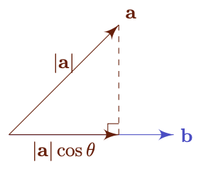

# Vectors
{: .page-title}

The discussion here focuses on vectors in 2D and 3D spaces, i.e. $\mathbb{R}^2$ and $\mathbb{R}^3$.
It begins from defining vectors and various operations of them geometrically.
It then can be extended to algebraic definitions and generalized to the concept of [vector spaces](vector-spaces.md).

> *Definition.*{: .def}
> In $\mathbb{R}^2$ and $\mathbb{R}^3$, a **vector** is a quantity that is specified by a (positive) **magnitude** and a **direction** in space.

A vector $\mathbf{v}$ is represented geometrically as a line segment $\vec{AB}$ with magnitude $\|\mathbf{v}\|$ and with direction from $A$ to $B$.
With a chosen origin $O$, every point $P$ in 2D/3D space has a position vector $\mathbf{x} = \vec{OP}$.

> *Definition.*{: .def}
> A **zero/null vector**, denoted by $\mathbf{0}$, is a vector with zero magnitude, i.e. $\|\mathbf{0}\| = 0$.

> *Definition.*{: .def}
> Given a vector $\mathbf{v} \not = \mathbf{0}$, a **unit vector** that is in the same direction as $\mathbf{v}$ and magnitude equals to $1$, i.e.
>
> $$
  \mathbf{\hat{v}} = {\mathbf{v} \over |\mathbf{v}|}
  $$

## Vector Addition

> *Definition.*{: .def}
> Vectors add according to the Parallelogram Law of Addition, i.e.
>
> $$
  \mathbf{a} + \mathbf{b} = \mathbf{c} \iff \vec{OA} + \vec{OB} = \vec{OC}
  $$
>
> where $OACB$ is a parallelogram.

> *Property.*{: .prop}
> Vector addition is/has
>
> + [_Commutative_]
>
> $$
  \mathbf{a} + \mathbf{b} = \mathbf{b} + \mathbf{a}
  $$
>
> + [_Associative_]
>
> $$
  \mathbf{a} + (\mathbf{b} + \mathbf{c}) = (\mathbf{a} + \mathbf{b}) + c
  $$
>
> + [_Identity_] The _null/zero vector_ $\mathbf{0}$ is the _additive identity_, i.e.
>
> $$
  \mathbf{a} + \mathbf{0} = \mathbf{0} + \mathbf{a} = \mathbf{a}
  $$
>
> + [_Inverse_] The _inverse_ of $\mathbf{a}$, namely $-\mathbf{a}$, is a vector parallel to $\mathbf{a}$ with same magitude,
> i.e. $\|-\mathbf{a}\| = \|\mathbf{a}\|$, but opposite direction, i.e.
>
> $$
  \mathbf{a} + (-\mathbf{a}) = (-\mathbf{a}) + \mathbf{a} = \mathbf{0}
  $$
>
> *Proof.*{: .prf}
>
> As $\vec{OA} = \vec{BC}$ and $\vec{OB} = \vec{AC}$ (opposite sides of the parallelogram), we have
>
> $$
  \vec{OC} = \vec{OA} + \vec{AC} = \vec{OB} + \vec{BC}
  $$
>
> Hence, vector addition is _commutative_.
>
> Other properties are geometrically self-evident.

> *Definition.*{: .def}
> Vector subtraction is the addition of inverse, i.e.
>
> $$
  \mathbf{b} - \mathbf{a} = \mathbf{b} + (-\mathbf{a})
  $$

According to the above, the set of $\mathbb{R}^2$ / $\mathbb{R}^3$ vectors form a abelian group under addition.

## Multiplication by Scalars

> *Definition.*{: .def}
> Let $\mathbf{a}$ be an vector and $\lambda \in \mathbb{R}$, $\lambda\mathbf{a}$ is defined as a vector parallel to $\mathbf{a}$,
> with magnitude $\|\lambda\| \|\mathbf{a}\|$ and same direction as $\mathbf{a}$ when $\lambda > 0$ and opposite direction to $\mathbf{a}$ when $\lambda < 0$.

> *Property.*{: .prop}
> Multiplication by scalars is/has
>
> + [_Distributive over vector addition_]
>
> $$
  \begin{align*}
  (\lambda + \mu)\mathbf{a} &= \lambda\mathbf{a} + \mu\mathbf{a} \\
  \lambda (\mathbf{a} + \mathbf{b}) &= \lambda\mathbf{a} + \lambda\mathbf{b}
  \end{align*}
  $$
>
> + [_Associative_]
>
> $$
  \lambda(\mu\mathbf{a}) = (\lambda\mu)\mathbf{a}
  $$
>
> + [_Identity_] $1 \in \mathbb{R}$ is the multiplicative identity, i.e.
>
> $$
  1\mathbf{a} = \mathbf{a}
  $$

> *Property.*{: .prop}
> $0\mathbf{a} = \mathbf{0}$ and $(-1)\mathbf{a} = -\mathbf{a}$.

## Linear Combination

> *Definition.*{: .def}
> The vector $\mathbf{c} = \lambda \mathbf{a} + \mu \mathbf{b}$ is a **linear combination** of $\mathbf{a}$ and $\mathbf{b}$.

## Scalar Product

> *Definition.*{: .def}
> The **scalar/dot product** of two vectors $\mathbf{a}$ and $\mathbf{b}$ is defined to be the scalar number
>
> $$
  \mathbf{a} \cdot \mathbf{b} = |\mathbf{a}| |\mathbf{b}|\cos\theta
  $$
>
> where $0 \le \theta \le \pi$ is the non-reflex angle between $\mathbf{a}$ and $\mathbf{b}$ once they are placed "tail to tail" or "head to head".

> *Property.*{: .prop}
> Scalar multiplication is _commutative_, i.e.
>
> $$
  \mathbf{a} \cdot \mathbf{b} = \mathbf{b} \cdot \mathbf{a}
  $$

> *Property.*{: .prop}
> A scalar product of a vector with itself is always $\ge 0$, i.e.
>
> $$
  \mathbf{a} \cdot \mathbf{a} = |\mathbf{a}|^2 \ge 0
  $$
>
> with equality holds iff $\mathbf{a} = \mathbf{0}$.

> *Proposition.*{: .prop}
> The "binomial expansion" of vectors is
>
> $$
  (\mathbf{a} - \mathbf{b})^2 = \mathbf{a} \cdot \mathbf{a} + \mathbf{b} \cdot \mathbf{b} - 2(\mathbf{a} \cdot \mathbf{b})
  $$
>
> *Proof.*{: .prf}
>
> Consider a triangle in 2D with $O, A, B$ as the vertices and $\theta = \angle BOA$.
> By Cosine Law, we have
>
> $$
  |BA|^2 = |OA|^2 + |OB|^2 - 2|OA||OB|\cos\theta
  $$
>
> Let $\mathbf{a} = \vec{OA}$ and $\mathbf{b} = \vec{OB}$, we have $\vec{BA} = \mathbf{a} - \mathbf{b}$, we have
>
> $$
  |\mathbf{a} - \mathbf{b}|^2 = |\mathbf{a}|^2 + |\mathbf{b}|^2 - 2|\mathbf{a}||\mathbf{b}|\cos\theta
  $$
>
> Hence, as $\mathbf{v} \cdot \mathbf{v} = \vert v \vert^2$,
>
> $$
  (\mathbf{a} - \mathbf{b})^2 = (\mathbf{a} - \mathbf{b}) \cdot (\mathbf{a} - \mathbf{b}) = \mathbf{a} \cdot \mathbf{a} + \mathbf{b} \cdot \mathbf{b} - 2(\mathbf{a} \cdot \mathbf{b})
  $$

> *Proposition.*{: .lem}
> If $\mathbf{a} \cdot \mathbf{b} = 0$ and $\mathbf{a} \not = \mathbf{0}$ and $\mathbf{b} \not = \mathbf{0}$,
> then $\mathbf{a} \perp \mathbf{b}$ and $\theta = \pi/2$.

### Projection

> *Definition.*{: .def}
> The projection of $\mathbf{a}$ onto $\mathbf{b}$ is the part of $\mathbf{a}$ that is parallel to $\mathbf{b}$,
> denoted by $\mathbf{a}^{\perp}$.

> *Theorem.*{: .thm}
> $\mathbf{a}^{\perp} = (|\mathbf{a}|\cos\theta)\,\mathbf{\hat{b}} = (\mathbf{a} \cdot \mathbf{\hat{b}})\,\mathbf{\hat{b}}$.
>
> *Proof.*{: .prf}
>
> When $0 \le \theta \le \pi/2$, $\|\mathbf{a}^{\perp}\| = \|\mathbf{a}\| \cos \theta$ and $\mathbf{a}^{\perp}$ is in same direction as $\mathbf{b}$, i.e.
>
> $$
  \mathbf{a}^{\perp} = (|\mathbf{a}|\cos\theta)\,\mathbf{\hat{b}}
  $$
>
> When $\pi / 2 < \theta \le \pi$, $\|\mathbf{a}^{\perp}\| = \|\mathbf{a}\| \cos (\pi - \theta)$ and $\mathbf{a}^{\perp}$ is in opposite direction as $\mathbf{b}$, i.e.
>
> $$
  \mathbf{a}^{\perp} = \left(-|\mathbf{a}|\cos(\pi -\theta)\right)\,\mathbf{\hat{b}} = (|\mathbf{b}|\cos\theta)\,\mathbf{\hat{b}}
  $$
>
> Hence,
>
> $$
  \mathbf{a}^{\perp}
  = |\mathbf{a}|{\mathbf{a} \cdot \mathbf{b} \over |\mathbf{a}||\mathbf{b}|}\mathbf{\hat{b}}
  = {\mathbf{a} \cdot \mathbf{b} \over |\mathbf{b}|^2}\mathbf{b}
  = (\mathbf{a} \cdot \mathbf{\hat{b}})\,\mathbf{\hat{b}}
  $$

### Distributive over Addition

> *Lemma.*{: .lem}
> For $\lambda \in \mathbb{R}$,
>
> $$
  \mathbf{a} \cdot (\lambda \mathbf{b}) = (\lambda \mathbf{a}) \cdot \mathbf{b} = \lambda \mathbf{a} \cdot \mathbf{b}
  $$

> *Theorem.*{: .thm}
> Scalar multiplication is _distributive_ over vector addition, i.e.
>
> $$
  \mathbf{a} \cdot (\mathbf{b} + \mathbf{c}) = \mathbf{a} \cdot \mathbf{b} + \mathbf{a} \cdot \mathbf{c}
  $$
>
> *Proof.*{: .prf}
>
> 
>
> According to the above, we can see that $\mathbf{b}^{\perp} + \mathbf{c}^{\perp} = (\mathbf{b} + \mathbf{c})^{\perp}$, i.e.
>
> $$
  {\mathbf{a} \cdot \mathbf{b} \over |\mathbf{a}|^2}\mathbf{a} + {\mathbf{a} \cdot \mathbf{c} \over |\mathbf{a}|^2}\mathbf{a} = {\mathbf{a} \cdot (\mathbf{b} + \mathbf{c}) \over |\mathbf{a}|^2}\mathbf{a} \\
  $$
>
> By multiplying both side by $\vert \mathbf{a} \vert^2$ and taking dot product by $\mathbf{a}$,
>
> $$
  (\mathbf{a} \cdot \mathbf{b} + \mathbf{a} \cdot \mathbf{c})(\mathbf{a} \cdot \mathbf{a}) = [\mathbf{a} \cdot (\mathbf{b} + \mathbf{c})](\mathbf{a} \cdot \mathbf{a}) \\
  $$
>
> Hence,
>
> $$
  \mathbf{a} \cdot \mathbf{b} + \mathbf{a} \cdot \mathbf{c} = \mathbf{a} \cdot (\mathbf{b} + \mathbf{c})
  $$

In general,

$$
\begin{align*}
\mathbf{a} \cdot (\lambda \mathbf{b} + \mu \mathbf{c})
= \mathbf{a} \cdot (\lambda \mathbf{b}) + \mathbf{a} \cdot (\mu \mathbf{c})
= \lambda \mathbf{a} \cdot \mathbf{b} + \mu \mathbf{a} \cdot \mathbf{c}
\end{align*}
$$

In [vector space](vector-spaces.md), this property is called _linearity in the second argument_.
In fact, as scalar multiplication of vectors in real vector spaces is commutative,
we also have linearity in the first argument (which might not be true in other vector spcaes).

### Cauchy-Schwarz Inequality

> *Theorem.*{: .thm}
> **[Cauchy-Schwarz Inequality]**
> For all $\mathbf{a}, \mathbf{b} \in \mathbb{R}^2$,
>
> $$
  | \mathbf{a} \cdot \mathbf{b} | \le | \mathbf{a}| | \mathbf{b}|
  $$
>
> with equality holds when $\mathbf{a} = \mathbf{0}$ or $\mathbf{b} = \mathbf{0}$ or $\mathbf{a} = \lambda\mathbf{b}$.
>
> *Proof.*{: .prf}
>
> By definition,
>
> $$
  |\mathbf{a} \cdot \mathbf{b}| = |\mathbf{a}||\mathbf{b}||\cos \theta| \le |\mathbf{a}||\mathbf{b}|
  $$
>
> as $\vert \cos \theta \vert \le 1$.

Proof that can be generalized to other vector spaces can be found [here](vector-spaces.md#cauchy-schwarz-inequality).

### Triangle Inequality

> *Theorem.*{: .thm}
> **[Triangle Inequality]**
>
> $$
  \vert \mathbf{a} + \mathbf{b} \vert \le \vert \mathbf{a} \vert + \vert \mathbf{b} \vert
  $$

> *Corollary.*{: .cor}
> $\vert \mathbf{a} - \mathbf{b} \vert \ge \vert \vert \mathbf{a} \vert - \vert \mathbf{b} \vert \vert$.

## Vector Product

> *Definition.*{: .def}
> The **vector/cross product** $\mathbf{a} \times \mathbf{b}$ of an ordered pair $\mathbf{a}, \mathbf{b}$ is a vector such that
>
> + The magnitude of $\mathbf{a} \times \mathbf{b}$ is
>
>   $$
    \vert \mathbf{a} \times \mathbf{b} \vert = \vert \mathbf{a} \vert \vert \mathbf{b} \vert \sin \theta
    $$
>
>   with $0 \le \theta \le \pi$ and definition similar to dot product (non-reflex angle after "tail-to-tail" or "head-to-head" placement of the two vectors).
>
> + $\mathbf{a} \times \mathbf{b}$ is _orthongonal_ to both $\mathbf{a}$ and $\mathbf{b}$ (if $\mathbf{a} \times \mathbf{b} \not = \mathbf{0}$)
>
> + $\mathbf{a} \times \mathbf{b}$ has the direction defined by "_right-hand rule_" ($\mathbf{a}$ - index finger, $\mathbf{b}$ - second finger, $\mathbf{a} \times \mathbf{b}$ - thumb)
>
>   

Consider a triangle with vertices $O, A, B$, we have area of $OAB$ equals to ${1 \over 2}\|\mathbf{a}\|\|\mathbf{b}\| \sin \theta = {1 \over 2}\|\mathbf{a} \times \mathbf{b}\|$,
and area of parallelogram $OACB$ equals to $\|\mathbf{a} \times \mathbf{b}\|$, with the direction of $\mathbf{a} \times \mathbf{b}$ orthogonal to the triangle/parallelogram.

The vector product is only defined for $\mathbb{R}^3$ space but not all vector spaces in general.

> *Property.*{: .prop}
> Vector product is _anti-commutative_, i.e.
>
> $$
  \mathbf{a} \times \mathbf{b} = - \mathbf{b} \times \mathbf{a}
  $$

> *Property.*{: .prop}
> Vector product of a vector with itself is a zero vector, i.e.
>
> $$
  \mathbf{a} \times \mathbf{a} = \mathbf{0}
  $$

> *Property.*{: .prop}
> Given $\mathbf{a} \not = \mathbf{0}$ and $\mathbf{b} \not = \mathbf{0}$
>
> $$
  \mathbf{a} \times \mathbf{b} = \mathbf{0} \implies \mathbf{a} = \lambda \mathbf{b}
  $$
>
> i.e. $\mathbf{a}$ and $\mathbf{b}$ are parallel and $\theta = 0$ or $\theta = \pi$.

### Distributive over Addition

> *Lemma.*{: .lem}
> For $\lambda \in \mathbb{R}$,
>
> $$
  \mathbf{a} \times (\lambda\mathbf{b}) = (\lambda \mathbf{a}) \times \mathbf{b} = \lambda ( \mathbf{a} \times \mathbf{b})
  $$

> *Theorem.*{: .thm}
> Vector product is _distributive over vector addition_, i.e.
>
> $$
  \mathbf{a} \times (\mathbf{b} + \mathbf{c}) = \mathbf{a} \times \mathbf{b} + \mathbf{a} \times \mathbf{c}
  $$
>
> *Proof.*{: .prf}
>
> The vector product $\mathbf{\hat{a}} \times \mathbf{b}$ can be constructed by two steps.
> First project $\mathbf{b}$ onto a plane orthogonal to $\mathbf{\hat{a}}$ and then rotate the projection $\mathbf{b'}$ by $\pi/2$ in "anti-clockwise" direction
> (when looking in the opposite direction of $\mathbf{\hat{a}}$) to form $\mathbf{b''}$.
>
> 
>
> We can see that $\|\mathbf{b}''\| = \|\mathbf{b'}\| = \|\mathbf{b}\| \sin \theta$.
> By construction, $\mathbf{b''} = \mathbf{\hat{a}} \times \mathbf{b}$.

In general, similar to dot product,

$$
\mathbf{a} \times (\lambda\mathbf{b} + \mu\mathbf{c}) = \lambda\mathbf{a} \times \mathbf{b} + \mu\mathbf{a} \times \mathbf{c}
$$

## Triple Products

### Scalar Triple Product

The scalar triple product is defined by

$$
[\mathbf{a}, \mathbf{b}, \mathbf{c}] = \mathbf{a} \cdot(\mathbf{b} \times \mathbf{c})
$$

Assume $\mathbf{a}, \mathbf{b}, \mathbf{c}$ have the sense of the right-hand rule,
the volume of a parallelepiped is given by $[\mathbf{a}, \mathbf{b}, \mathbf{c}]$.

Since the order of $\mathbf{a}, \mathbf{b}, \mathbf{c}$ doesn't affect the volume, we have

$$
[\mathbf{a}, \mathbf{b}, \mathbf{c}] = [\mathbf{b}, \mathbf{c}, \mathbf{a}] = [\mathbf{c}, \mathbf{a}, \mathbf{b}] = -[\mathbf{b}, \mathbf{a}, \mathbf{c}] = - [\mathbf{a}, \mathbf{c}, \mathbf{b}] = - [\mathbf{c}, \mathbf{b}, \mathbf{a}]
$$

As $\mathbf{a} \cdot (\mathbf{b} \times \mathbf{c}) = \mathbf{c} \cdot (\mathbf{a} \times \mathbf{b})$ and dot product is commutative, we have

$$
\mathbf{a} \cdot (\mathbf{b} \times \mathbf{c}) = (\mathbf{a} \times \mathbf{b}) \cdot \mathbf{c}
$$

### Vector Triple Product

The vector triple product is defined by

$$
(\mathbf{a} \times \mathbf{b}) \times \mathbf{c} = - \mathbf{c} \times (\mathbf{a} \times \mathbf{b}) = - (\mathbf{b} \times \mathbf{a}) \times \mathbf{c} = \mathbf{c} \times (\mathbf{b} \times \mathbf{a})
$$

We will later see that

$$
\mathbf{a} \times (\mathbf{b} \times \mathbf{c}) = (\mathbf{a} \cdot \mathbf{c}) \mathbf{b} - (\mathbf{a} \cdot \mathbf{b}) \mathbf{c}
$$

## Vector Equations

We use vector manipulation on the equation so to simplify the terms, normally by dotting or crossing the equation with some vectors.

For example,

$$
\mathbf{x} - (\mathbf{x} \times \mathbf{a}) \times \mathbf{b} = \mathbf{c}
$$

After dotting with $\mathbf{b}$ and some substitutions, we will have

$$
\mathbf{x} = {\mathbf{c} + (\mathbf{c} \cdot \mathbf{b})a \over 1 + \mathbf{a} \cdot \mathbf{b}}
$$

This is another technique [here](https://math.stackexchange.com/questions/3879932/how-to-solve-the-vector-equation-mathbfr-mathbfr-times-mathbfd-m).

## References

* [Stephen J. Cowley _Algebra and Geometry Lectures Notes_, 2006 - Chapter 2](https://www.damtp.cam.ac.uk/user/sjc1/teaching/AandG/notes.pdf)
* [https://math.stackexchange.com/questions/1109142/proving-that-the-dot-product-is-distributive](https://math.stackexchange.com/questions/1109142/proving-that-the-dot-product-is-distributive)
